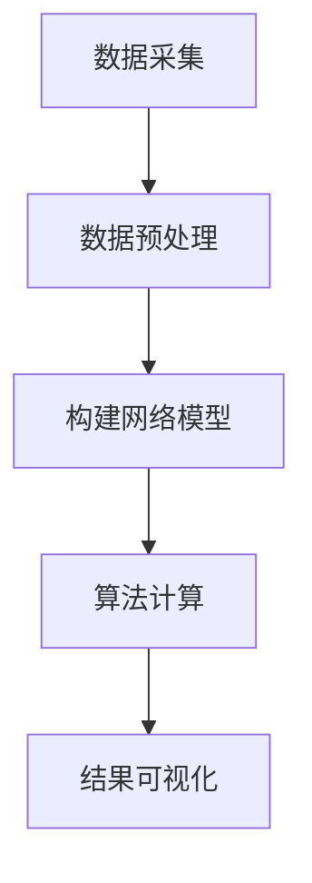
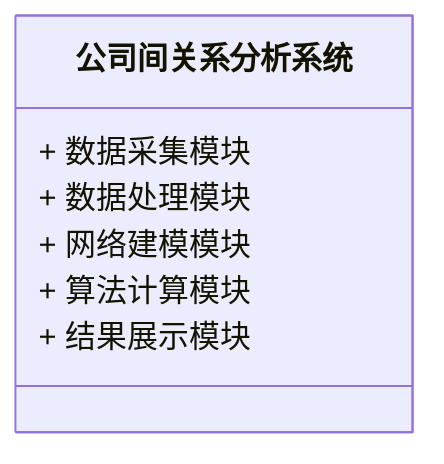
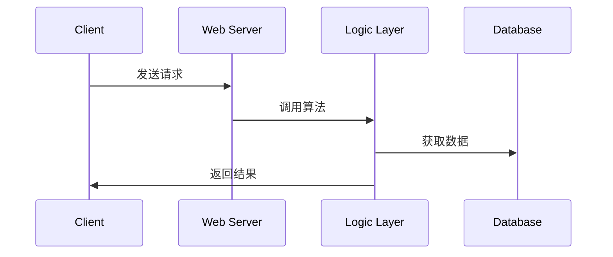

                 


# 利用智能体网络分析公司间的复杂关系

## 关键词：
智能体网络, 公司间关系, 复杂关系分析, 网络分析, 算法原理, 系统架构, 项目实战

## 摘要：
本文探讨了利用智能体网络分析公司间复杂关系的方法，从背景介绍、核心概念、算法原理到系统架构和项目实战，全面解析了如何通过智能体网络模型来理解和分析公司间的复杂互动关系。文章结合实际案例，深入浅出地分析了智能体网络的应用场景、实现方法和实际效果，为读者提供了一套完整的解决方案。

---

## 第一部分：背景介绍

### 第1章：智能体网络与公司关系概述

#### 1.1 问题背景
- 企业的生存和发展离不开与外部环境的交互，公司间的复杂关系（如供应链、合作伙伴、竞争对手等）对企业战略决策至关重要。
- 传统的公司间关系分析方法往往依赖于简单的统计分析或经验判断，难以捕捉动态变化中的深层关联。
- 智能体网络通过建模公司间的互动行为和信息流，提供了一种更全面的分析工具。

#### 1.2 智能体网络的定义与特点
- **智能体（Agent）**：具有自主性、反应性、目标导向和社交能力的实体，可以是公司、部门或个人。
- **智能体网络**：由多个智能体及其交互关系构成的网络结构，反映了智能体间的动态关系和信息流动。
- **特点**：
  - **动态性**：关系随时间变化而调整。
  - **多维性**：涵盖供应链、合作、竞争等多个维度。
  - **复杂性**：节点间的关系强度和类型多样。

#### 1.3 公司间复杂关系的建模
- **多维度分析框架**：包括直接关系（供应链、合作）、间接关系（竞争对手）、潜在关系（市场影响）。
- **智能体网络的优势**：能够捕捉非线性关系和隐性关联，提供更深入的洞察。

#### 1.4 本章小结
- 智能体网络为公司间关系分析提供了新的视角和工具。
- 下文将详细探讨智能体网络的核心原理和实现方法。

---

## 第二部分：核心概念与联系

### 第2章：智能体网络的核心原理

#### 2.1 智能体网络的构建原理
- **交互机制**：智能体间的互动基于共同的目标或利益，形成复杂的关系网络。
- **网络演化**：随着时间推移，关系强度和类型动态变化，构建动态网络模型。

#### 2.2 智能体网络的属性特征对比
| 特性       | 描述                                                                 |
|------------|----------------------------------------------------------------------|
| 节点类型    | 公司、部门、个人                                                     |
| 关系类型    | 供应链、合作、竞争、潜在影响                                       |
| 关系强度    | 强（直接合作）、中（间接影响）、弱（潜在竞争）                     |
| 动态性      | 网络结构随时间变化调整                                             |

#### 2.3 智能体网络的ER实体关系图
```mermaid
er
actor: 智能体网络分析系统
goal: 分析公司间复杂关系
subtasks: 数据采集、关系建模、网络分析、结果可视化
```

#### 2.4 本章小结
- 智能体网络通过构建动态、多维的关系网络，为公司间关系分析提供了新的工具。
- 下文将详细讲解算法原理和系统架构设计。

---

## 第三部分：算法原理

### 第3章：智能体网络的算法实现

#### 3.1 基于图论的算法
- **K-means聚类**：用于将公司分为不同群组，识别潜在的合作机会。
- **PageRank算法**：用于评估公司在网络中的影响力，识别关键节点。

#### 3.2 网络分析算法
- **关系强度计算**：
  - 使用余弦相似度计算公司间的相似性：
    $$sim(i,j) = \frac{\sum_{k=1}^{n} w_{ik} \cdot w_{jk}}{\sqrt{\sum_{k=1}^{n} w_{ik}^2} \cdot \sqrt{\sum_{k=1}^{n} w_{jk}^2}}$$
  - 其中，$w_{ik}$ 表示公司在维度 $k$ 上的权重。

#### 3.3 算法实现步骤


#### 3.4 代码实现
```python
import networkx as nx
import numpy as np

# 数据预处理
companies = ['A', 'B', 'C', 'D']
weights = {'A': {'B': 0.8, 'C': 0.5}, 'B': {'A': 0.8, 'D': 0.3}, ...}

# 构建网络模型
G = nx.Graph()
G.add_nodes_from(companies)
for i in companies:
    for j in companies:
        if i != j and j in weights[i]:
            G.add_edge(i, j, weight=weights[i][j])

# 计算PageRank
pr = nx.pagerank(G)
print(pr)
```

---

## 第四部分：系统架构与设计

### 第4章：系统分析与架构设计

#### 4.1 项目背景
- **目标**：构建一个智能体网络分析系统，帮助企业管理公司间关系。
- **核心需求**：实时分析、动态更新、可视化展示。

#### 4.2 系统功能设计


#### 4.3 系统架构设计


#### 4.4 接口设计与交互流程


---

## 第五部分：项目实战

### 第5章：项目实战与案例分析

#### 5.1 环境安装
- **工具**：Python、NetworkX、Matplotlib。
- **安装命令**：
  ```bash
  pip install networkx matplotlib
  ```

#### 5.2 数据收集与预处理
- **数据来源**：公司间的交易记录、供应链数据、合作记录。
- **数据清洗**：去除无效数据，标准化处理。

#### 5.3 模型实现与结果分析
```python
# 可视化网络结构
import matplotlib.pyplot as plt

plt.figure(figsize=(10, 10))
nx.draw(G, pos=nx.spring_layout(G), node_size=1000, font_size=12)
plt.show()
```

#### 5.4 案例分析
- **案例背景**：分析某行业的供应链关系。
- **结果展示**：通过网络图识别关键供应商和潜在风险点。

#### 5.5 项目小结
- 成功构建了智能体网络分析系统。
- 通过实际案例验证了系统的有效性和实用性。

---

## 第六部分：案例分析与最佳实践

### 第6章：案例分析与最佳实践

#### 6.1 案例分析
- **案例背景**：某行业的竞争与合作网络分析。
- **分析结果**：识别出关键竞争者和潜在合作伙伴。

#### 6.2 经验总结
- **数据质量**：高质量数据是准确分析的基础。
- **算法选择**：根据实际需求选择合适的算法。
- **可视化工具**：选择合适的工具展示分析结果。

#### 6.3 注意事项
- 数据隐私保护。
- 算法的可扩展性。
- 系统的实时性需求。

#### 6.4 未来研究方向
- **动态网络分析**：实时更新网络结构。
- **多模态数据融合**：结合文本、图像等多种数据源。
- **预测模型**：基于历史数据预测未来关系变化。

---

## 总结

本文系统地探讨了利用智能体网络分析公司间复杂关系的方法，从理论到实践，全面解析了智能体网络的应用场景和实现方法。通过实际案例和代码实现，展示了如何将智能体网络应用于现实中的公司关系分析。未来，随着技术的发展，智能体网络将在更多领域发挥重要作用。

---

## 作者信息

作者：AI天才研究院/AI Genius Institute & 禅与计算机程序设计艺术 /Zen And The Art of Computer Programming

--- 

感谢您的阅读，希望本文对您理解智能体网络在公司间复杂关系分析中的应用有所帮助！

