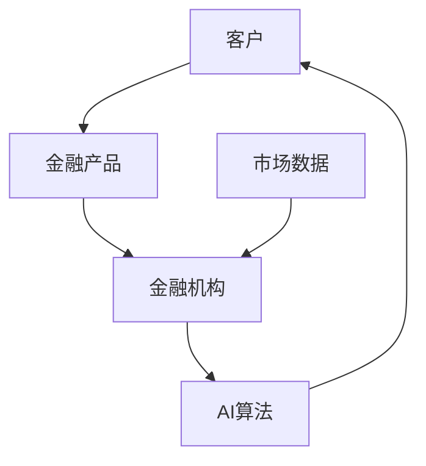
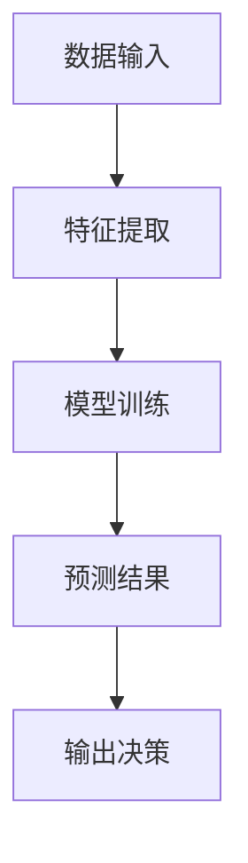
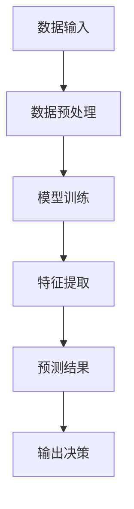
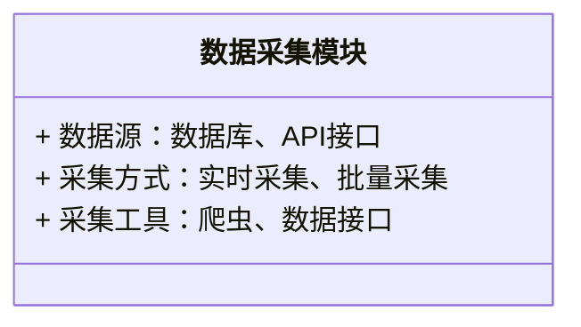
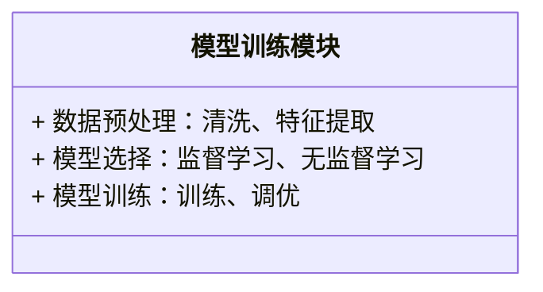
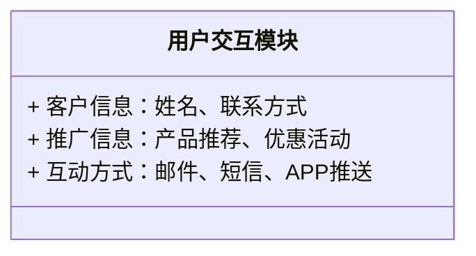
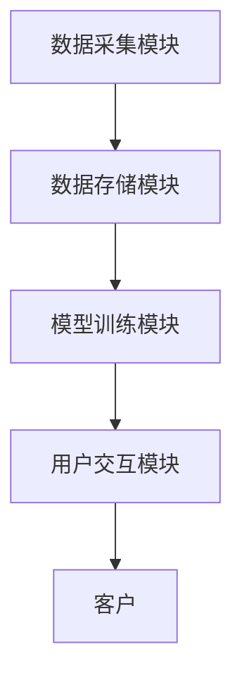

                 


# 制定有效的金融AI产品市场推广策略

> **关键词**：金融AI、市场推广、AI算法、数据分析、系统架构、用户行为分析

> **摘要**：  
本文旨在探讨如何制定有效的金融AI产品市场推广策略。文章首先介绍了金融AI的核心概念及其在市场推广中的重要性，接着分析了常见的AI算法及其在金融领域的应用，详细讲解了系统架构设计和用户行为分析的方法。通过实际案例分析，展示了如何将AI技术应用于市场推广策略的制定，并提出了最佳实践建议。文章最后总结了制定有效策略的关键点，并展望了未来的发展方向。

---

# 第一部分: 制定有效的金融AI产品市场推广策略概述

## 第1章: 金融AI与市场推广概述

### 1.1 金融AI的定义与现状

#### 1.1.1 金融AI的核心概念  
金融AI（Artificial Intelligence in Finance）是指利用人工智能技术（如机器学习、深度学习、自然语言处理等）来解决金融领域的复杂问题，包括金融数据分析、风险评估、投资决策、客户行为预测等。金融AI的核心在于通过数据驱动的方式，帮助金融机构提高效率、降低成本、优化决策。

#### 1.1.2 金融AI的现状与发展  
近年来，随着大数据和AI技术的快速发展，金融AI的应用范围不断扩大。目前，金融AI已在以下几个方面得到广泛应用：  
1. **金融数据分析**：利用AI技术处理海量金融数据，提取有用信息。  
2. **风险评估与控制**：通过AI算法预测市场风险、信用风险等。  
3. **智能投资顾问**：基于AI的量化投资策略帮助投资者做出决策。  
4. **客户行为分析**：通过AI技术分析客户行为，提供个性化服务。  

#### 1.1.3 金融AI与市场推广的结合  
市场推广是金融机构吸引客户、推广产品的重要手段。金融AI可以通过以下方式提升市场推广的效果：  
1. **精准营销**：通过AI分析客户数据，识别潜在客户，制定个性化营销策略。  
2. **市场预测**：利用AI预测市场趋势，优化推广时机和推广方式。  
3. **客户互动**：通过智能客服、聊天机器人等AI工具与客户互动，提升客户体验。  

---

### 1.2 市场推广策略的基本原理

#### 1.2.1 市场推广的核心要素  
市场推广策略的制定需要考虑以下几个核心要素：  
1. **目标客户**：明确目标客户群体的需求、偏好和行为特征。  
2. **产品定位**：确定产品的市场定位，突出产品的核心竞争力。  
3. **推广渠道**：选择合适的推广渠道（如线上、线下渠道），确保信息的有效传播。  
4. **推广内容**：制定吸引客户的推广内容，包括广告文案、优惠活动等。  
5. **预算分配**：合理分配推广预算，确保资源的高效利用。  

#### 1.2.2 金融AI在市场推广中的作用  
金融AI可以为市场推广提供以下支持：  
1. **数据驱动的决策**：通过分析客户数据，帮助制定精准的推广策略。  
2. **个性化推荐**：利用AI技术为客户提供个性化的金融产品推荐。  
3. **实时反馈**：通过AI实时监控市场反馈，快速调整推广策略。  

#### 1.2.3 制定有效策略的关键点  
制定有效的市场推广策略需要关注以下几点：  
1. **数据质量**：确保数据的准确性和完整性，为AI分析提供可靠的基础。  
2. **模型优化**：不断优化AI模型，提升推广策略的精准度。  
3. **客户体验**：在推广过程中注重客户体验，避免过度打扰客户。  

---

## 第2章: 金融AI的核心概念与联系

### 2.1 金融AI的核心原理

#### 2.1.1 数据驱动的金融分析  
金融AI的核心在于数据分析。通过收集和处理大量金融数据（如市场数据、交易数据、客户数据等），AI算法可以提取有价值的信息，帮助金融机构做出决策。例如，利用时间序列分析预测股票价格走势。

#### 2.1.2 AI算法在金融预测中的应用  
AI算法在金融预测中的应用主要体现在以下几个方面：  
1. **机器学习**：用于分类、回归、聚类等任务，帮助识别市场模式。  
2. **深度学习**：用于处理非结构化数据（如文本、图像），提取隐藏的特征。  
3. **自然语言处理**：用于分析新闻、社交媒体等文本数据，预测市场情绪。  

#### 2.1.3 金融AI的实体关系图  
以下是金融AI的核心实体关系图：  


### 2.2 金融AI与市场推广的关系

#### 2.2.1 数据分析与用户行为研究  
通过分析客户数据，AI可以帮助金融机构理解客户行为，制定精准的推广策略。例如，通过分析客户的交易记录，识别客户的消费习惯，制定个性化的产品推荐。

#### 2.2.2 AI驱动的市场洞察  
AI可以实时监控市场动态，帮助金融机构快速响应市场变化。例如，通过分析社交媒体上的客户反馈，及时调整推广策略。

#### 2.2.3 金融AI在推广策略中的应用  
金融AI可以通过以下方式提升推广策略的效果：  
1. **精准营销**：利用AI分析客户数据，制定个性化营销策略。  
2. **实时反馈**：通过AI实时监控市场反馈，快速调整推广策略。  
3. **客户互动**：通过智能客服与客户互动，提升客户体验。  

### 2.3 核心概念的对比分析

#### 2.3.1 AI算法对比表格  
以下是一些常见AI算法的对比表格：  

| 算法类型      | 主要特点                     | 适用场景                     |
|---------------|------------------------------|------------------------------|
| 机器学习      | 基于特征学习，数据驱动       | 分类、回归、聚类             |
| 深度学习      | 多层神经网络，提取深层特征   | 图像识别、自然语言处理       |
| 自然语言处理  | 处理文本数据，提取语义信息   | 情感分析、文本分类           |

#### 2.3.2 金融AI与传统金融分析的对比  
以下是金融AI与传统金融分析的对比：  

| 对比维度      | 金融AI                            | 传统金融分析                |
|---------------|-----------------------------------|-----------------------------|
| 数据需求      | 高，需要大量结构化和非结构化数据 | 较低，主要依赖结构化数据      |
| 分析速度      | 快，可以实时分析               | 较慢，依赖人工分析            |
| 精准度        | 高，基于复杂算法               | 较低，依赖经验判断            |

---

## 第3章: 金融AI算法原理

### 3.1 常见AI算法及其在金融中的应用

#### 3.1.1 机器学习算法  
机器学习算法在金融中的应用主要体现在以下几个方面：  
1. **监督学习**：用于分类和回归任务，例如股票价格预测。  
2. **无监督学习**：用于聚类分析，例如客户群体划分。  
3. **强化学习**：用于策略优化，例如智能投资顾问。  

#### 3.1.2 深度学习算法  
深度学习算法在金融中的应用主要体现在以下几个方面：  
1. **图像识别**：用于识别金融图表中的模式。  
2. **自然语言处理**：用于分析新闻、社交媒体中的市场情绪。  

#### 3.1.3 自然语言处理算法  
自然语言处理算法在金融中的应用主要体现在以下几个方面：  
1. **情感分析**：用于分析客户对金融产品的评价。  
2. **文本分类**：用于分类金融新闻，预测市场走势。  

### 3.2 算法流程图

#### 3.2.1 机器学习算法流程图  
以下是机器学习算法的流程图：  


#### 3.2.2 深度学习算法流程图  
以下是深度学习算法的流程图：  


### 3.3 算法数学

#### 3.3.1 机器学习算法的数学模型  
以下是线性回归的数学模型：  
$$ y = \beta_0 + \beta_1 x + \epsilon $$  
其中，$y$ 是目标变量，$x$ 是自变量，$\beta_0$ 和 $\beta_1$ 是回归系数，$\epsilon$ 是误差项。

#### 3.3.2 深度学习算法的数学模型  
以下是多层感知机（MLP）的数学模型：  
$$ y = f(W_2 f(W_1 x + b_1) + b_2) $$  
其中，$W_1$ 和 $W_2$ 是权重矩阵，$b_1$ 和 $b_2$ 是偏置项，$f$ 是激活函数。

---

## 第4章: 系统分析与架构设计方案

### 4.1 项目介绍

#### 4.1.1 项目背景  
本项目旨在通过AI技术优化金融产品的市场推广策略。通过分析客户数据，制定个性化营销策略，提升客户满意度和市场占有率。

#### 4.1.2 项目目标  
1. 提高市场推广的精准度和效率。  
2. 降低市场推广的成本。  
3. 提升客户体验，增强客户忠诚度。  

### 4.2 系统功能设计

#### 4.2.1 数据采集模块  
数据采集模块负责收集客户数据，包括客户的基本信息、交易记录、行为数据等。以下是数据采集模块的类图：  


#### 4.2.2 模型训练模块  
模型训练模块负责训练AI模型，生成客户画像和市场预测结果。以下是模型训练模块的类图：  


#### 4.2.3 用户交互模块  
用户交互模块负责与客户互动，提供个性化的推广信息。以下是用户交互模块的类图：  


### 4.3 系统架构设计

#### 4.3.1 系统架构图  
以下是系统的整体架构图：  


---

## 第5章: 项目实战

### 5.1 环境安装

#### 5.1.1 安装Python  
在终端或命令行中输入以下命令安装Python：  
```bash
sudo apt-get install python3
```

#### 5.1.2 安装依赖库  
安装以下依赖库：  
```bash
pip install numpy
pip install pandas
pip install scikit-learn
```

### 5.2 核心实现

#### 5.2.1 数据预处理  
以下是数据预处理的代码示例：  
```python
import pandas as pd
import numpy as np

# 读取数据
data = pd.read_csv('data.csv')

# 清洗数据
data = data.dropna()
data = data.drop_duplicates()

# 特征提取
features = data[['age', 'income', 'credit_score']]
labels = data['target']
```

#### 5.2.2 模型训练  
以下是模型训练的代码示例：  
```python
from sklearn.model

