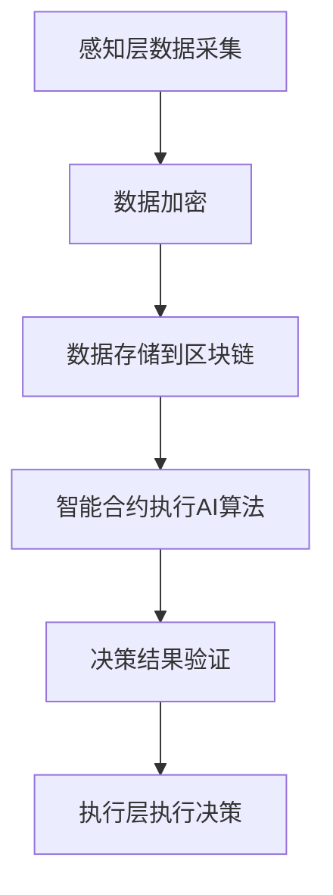

                 


# 区块链+AI：去中心化的可信AI Agent系统

> 关键词：区块链，人工智能，去中心化，可信计算，AI Agent，分布式系统

> 摘要：本文探讨了区块链与人工智能的结合，特别是如何构建去中心化的可信AI Agent系统。通过分析区块链的去中心化特性和AI的智能决策能力，提出了一种新型的系统架构，旨在解决传统AI系统中的信任和隐私问题，同时利用区块链技术实现数据的安全共享和可信计算。

---

## 第1章：区块链与AI的概述

### 1.1 区块链的基本概念与特点

区块链是一种分布式账本技术，通过去中心化的方式记录数据，并通过加密算法保证数据的完整性和不可篡改性。区块链的核心特点包括：

- **去中心化**：数据由多个节点共同维护，不存在单点故障。
- **不可篡改**：数据一旦写入区块链，难以被修改或删除。
- **可追溯**：区块链上的每一条数据都带有时间戳，可以追溯其来源和历史。

### 1.2 AI的基本概念与特点

人工智能（AI）是一种模拟人类智能的技术，通过算法和数据处理实现自主决策、学习和推理。AI的核心特点包括：

- **数据驱动**：AI系统依赖大量数据进行训练和推理。
- **自适应**：AI能够根据环境变化调整自身的行为和决策。
- **自主决策**：AI可以在没有人类干预的情况下做出决策。

### 1.3 区块链与AI的结合：背景与意义

随着AI技术的快速发展，AI系统的可信性和安全性问题日益突出。传统的AI系统依赖于中心化的数据源和计算资源，容易受到攻击和滥用。而区块链的去中心化特性为解决这些问题提供了新的思路。

通过结合区块链和AI，我们可以构建一个去中心化的可信AI Agent系统，实现数据的安全共享、算法的透明执行和决策的可信性。

---

## 第2章：可信计算与安全隐私

### 2.1 可信计算的基本概念

可信计算是指通过技术手段确保系统、数据和操作的完整性、机密性和可用性。可信计算的核心目标是防止数据被篡改、泄露或滥用。

### 2.2 区块链在可信计算中的作用

区块链通过分布式账本和加密算法，为可信计算提供了以下支持：

- **数据完整性**：区块链上的数据一旦写入，无法被修改，确保数据的真实性和完整性。
- **数据隐私**：通过零知识证明等技术，区块链可以在不泄露数据的情况下验证数据的真实性。
- **可追溯性**：区块链上的每条数据都带有时间戳和来源信息，便于追溯数据的流动和使用。

### 2.3 AI Agent的可信性挑战

AI Agent的可信性问题主要体现在以下方面：

- **决策透明性**：AI Agent的决策过程通常基于复杂的算法，缺乏透明性，难以被信任。
- **隐私保护**：AI Agent需要处理大量敏感数据，如何保护这些数据的隐私是一个挑战。
- **可信交互**：多个AI Agent之间的交互需要确保数据的安全和可信性。

通过结合区块链技术，可以解决这些问题，实现去中心化的可信AI Agent系统。

---

## 第3章：AI Agent系统的设计与实现

### 3.1 AI Agent的基本架构

AI Agent由感知层、决策层和执行层组成：

- **感知层**：负责收集环境中的数据，如传感器数据、用户输入等。
- **决策层**：基于感知层提供的数据，通过算法进行决策。
- **执行层**：根据决策层的指令执行具体的操作。

### 3.2 区块链在AI Agent系统中的应用

区块链在AI Agent系统中的应用主要体现在以下几个方面：

- **数据共享**：通过区块链实现数据的可信共享，确保数据的安全性和完整性。
- **算法执行**：通过智能合约在区块链上执行AI算法，确保算法的透明性和可信性。
- **决策验证**：通过区块链记录AI Agent的决策过程，确保决策的可追溯性和可信性。

---

## 第4章：去中心化AI Agent系统的算法原理

### 4.1 算法原理概述

去中心化AI Agent系统的算法原理包括以下几个步骤：

1. **数据采集**：通过感知层采集环境中的数据。
2. **数据加密**：对采集的数据进行加密，确保数据的安全性。
3. **数据存储**：将加密后的数据存储在区块链上。
4. **数据处理**：通过智能合约在区块链上执行AI算法，处理数据并生成决策。
5. **结果验证**：通过区块链验证决策的正确性和可信性。

### 4.2 算法流程图

以下是去中心化AI Agent系统的算法流程图：



---

## 第5章：项目实战

### 5.1 环境安装

以下是项目实战所需的环境和工具：

- **区块链平台**：建议使用以太坊（Ethereum）或Fabric。
- **AI框架**：建议使用TensorFlow或PyTorch。
- **开发工具**：建议使用VS Code或PyCharm。

### 5.2 核心代码实现

以下是AI Agent系统的核心代码实现：

```python
import hashlib
from web3 import Web3

# 数据加密函数
def encrypt_data(data):
    return hashlib.sha256(data.encode()).hexdigest()

# 智能合约地址和ABI
contract_address = "0x..."
contract_abi = [...]

# 初始化区块链连接
web3 = Web3(Web3.HTTPProvider("http://127.0.0.1:8545"))

# 调用智能合约函数
def call_contract_function(function_name, *args):
    contract = web3.eth.contract(contract_address, abi=contract_abi)
    tx_hash = contract.functions[function_name)(*args).transact()
    return tx_hash
```

### 5.3 案例分析

以下是一个具体的案例分析：

假设我们有一个去中心化的医疗AI诊断系统，AI Agent需要处理患者的医疗数据。通过区块链技术，患者的医疗数据可以被加密并存储在区块链上，AI算法在区块链上执行，确保数据的安全性和算法的透明性。

---

## 第6章：总结与展望

### 6.1 总结

本文探讨了区块链与AI的结合，特别是如何构建去中心化的可信AI Agent系统。通过分析区块链的去中心化特性和AI的智能决策能力，提出了一种新型的系统架构，旨在解决传统AI系统中的信任和隐私问题。

### 6.2 展望

未来，随着区块链和AI技术的进一步发展，去中心化的可信AI Agent系统将在更多领域得到应用，如金融、医疗、教育等。通过不断优化算法和系统架构，我们可以实现更加智能、安全和可信的AI系统。

---

## 附录

### 附录A：扩展阅读

以下是推荐的扩展阅读资料：

- 区块链技术入门与实战
- 人工智能算法解析与实现
- 分布式系统设计与实践

### 附录B：工具推荐

以下是推荐的工具和平台：

- 区块链开发工具：以太坊、Fabric、Tezos
- AI开发框架：TensorFlow、PyTorch、Keras
- 开发环境：VS Code、PyCharm、IntelliJ IDEA

---

作者：AI天才研究院/AI Genius Institute & 禅与计算机程序设计艺术 /Zen And The Art of Computer Programming

