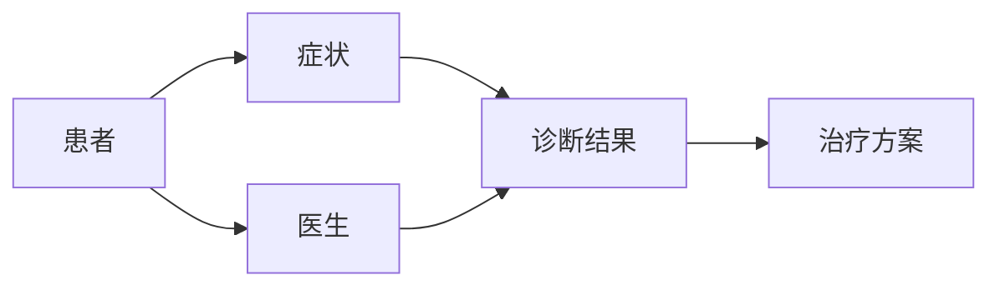
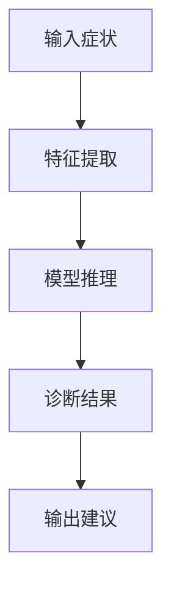
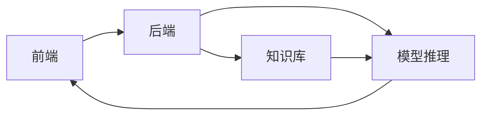
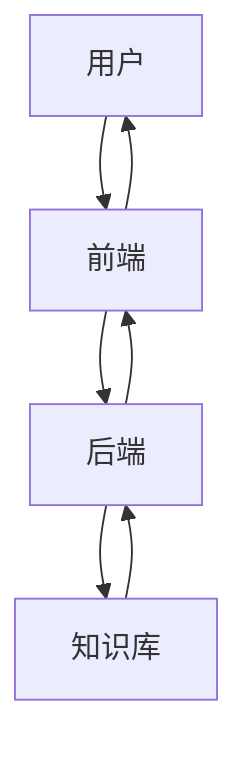

                 


# 医疗诊断 AI Agent：LLM 在临床决策支持中的角色

> 关键词：医疗诊断 AI Agent、LLM、临床决策支持、大语言模型、医疗人工智能

> 摘要：本文探讨了医疗诊断 AI Agent 在临床决策支持中的角色，重点分析了大语言模型（LLM）在医疗诊断中的应用，详细介绍了其算法原理、系统架构设计以及实际应用场景。通过理论与实践结合，展示了如何利用 LLM 提高医疗诊断的准确性和效率，为未来医疗智能化发展提供了重要参考。

---

## 第一部分: 医疗诊断 AI Agent 的背景与概念

### 第1章: 医疗诊断 AI Agent 的背景介绍

#### 1.1 医疗诊断的现状与挑战

##### 1.1.1 传统医疗诊断的局限性
传统医疗诊断主要依赖医生的经验和知识，但存在以下问题：
- **主观性**：不同医生的经验和知识水平差异可能导致诊断结果不一致。
- **效率低下**：面对海量医疗数据，医生需要花费大量时间进行分析和推理。
- **知识更新滞后**：医学知识更新迅速，医生需要不断学习新知识以保持专业水平。

##### 1.1.2 医疗诊断中的数据爆炸问题
现代医疗领域积累了大量的数据，包括电子健康记录（EHR）、医学影像、基因组数据等。这些数据的快速增长对医生的处理能力提出了更高的要求，传统的诊断方式难以高效处理这些数据。

##### 1.1.3 AI在医疗诊断中的潜在价值
人工智能（AI）技术，尤其是大语言模型（LLM），能够帮助医生快速处理海量数据，提供更精准的诊断建议，从而提高医疗效率和诊断准确性。

#### 1.2 医疗诊断 AI Agent 的定义与特点

##### 1.2.1 医疗诊断 AI Agent 的定义
医疗诊断 AI Agent 是一种基于人工智能技术的辅助诊断工具，能够通过分析患者的症状、病史、检查结果等信息，提供诊断建议和治疗方案推荐。

##### 1.2.2 医疗诊断 AI Agent 的核心特点
- **智能化**：能够理解自然语言，处理非结构化数据。
- **高效性**：快速分析大量数据，提供实时诊断建议。
- **可解释性**：能够提供诊断依据和推理过程，帮助医生理解结果。

##### 1.2.3 医疗诊断 AI Agent 的工作流程
1. **数据输入**：收集患者的症状、病史、检查结果等信息。
2. **数据处理**：对输入数据进行清洗、结构化处理。
3. **诊断推理**：基于预训练的医疗知识库和模型进行推理，生成诊断建议。
4. **结果输出**：将诊断结果以自然语言形式呈现给医生。

#### 1.3 医疗诊断 AI Agent 的核心要素

##### 1.3.1 数据来源与处理
- **数据来源**：电子健康记录（EHR）、医学影像、实验室报告、基因组数据等。
- **数据处理**：数据清洗、标注、结构化处理。

##### 1.3.2 知识库构建与管理
- **知识库**：包含医学术语、疾病症状、诊断标准、治疗方案等。
- **知识更新**：定期更新知识库，保持其准确性和时效性。

##### 1.3.3 模型训练与优化
- **模型训练**：基于标注数据进行监督学习。
- **模型优化**：通过微调（Fine-tuning）等方式提升模型在特定医疗场景下的表现。

---

### 第2章: 医疗诊断 AI Agent 的核心概念与联系

#### 2.1 LLM 的基本原理

##### 2.1.1 大语言模型的定义
大语言模型（LLM）是一种基于深度学习的自然语言处理模型，能够理解和生成人类语言。其核心是通过大量数据的预训练，学习语言的分布和语义关系。

##### 2.1.2 大语言模型的核心原理
- **预训练**：在大规模通用数据集上进行无监督学习，学习语言的表征。
- **微调**：在特定领域数据上进行有监督学习，适应特定任务需求。

##### 2.1.3 大语言模型与医疗诊断的结合
- **医疗文本处理**：处理电子健康记录、医学文献等文本数据。
- **诊断推理**：基于上下文理解患者症状，生成诊断建议。

#### 2.2 医疗诊断 AI Agent 的实体关系图



#### 2.3 医疗诊断 AI Agent 的算法流程



---

### 第3章: 医疗诊断 AI Agent 的算法原理

#### 3.1 大语言模型的训练过程

##### 3.1.1 预训练阶段
- **目标**：学习语言的表征，理解上下文关系。
- **方法**：使用自监督学习，预测词句的上下文关系。

##### 3.1.2 微调阶段
- **目标**：适应特定医疗任务，如疾病诊断。
- **方法**：在医疗数据上进行有监督微调，优化模型在医疗任务上的表现。

##### 3.1.3 模型评估
- **评估指标**：准确率、召回率、F1分数等。
- **评估数据集**：使用独立的验证集进行评估。

#### 3.2 医疗诊断 AI Agent 的推理过程

##### 3.2.1 输入处理
- **输入形式**：自然语言描述症状，如“患者咳嗽、发热、胸痛”。
- **数据清洗**：去除无关信息，提取关键症状。

##### 3.2.2 模型推理
- **推理过程**：基于预训练的模型，生成可能的诊断结果。
- **推理依据**：结合医学知识库中的症状与疾病对应关系。

#### 3.3 模型的数学基础

##### 3.3.1 损失函数
$$ \text{损失函数} = -\sum_{i=1}^{n} y_i \log(p_i) + (1 - y_i) \log(1 - p_i) $$
其中，\( y_i \) 是真实标签，\( p_i \) 是模型预测的概率。

##### 3.3.2 参数更新
$$ \theta_{new} = \theta_{old} - \eta \cdot \frac{\partial L}{\partial \theta} $$
其中，\( \theta \) 是模型参数，\( \eta \) 是学习率，\( L \) 是损失函数。

---

### 第4章: 医疗诊断 AI Agent 的系统架构设计

#### 4.1 问题场景介绍
医疗诊断 AI Agent 通常应用于医院的临床决策支持系统（CDSS），帮助医生快速诊断患者病情。

#### 4.2 系统功能设计

##### 4.2.1 系统功能模块
- **数据输入模块**：接收患者的症状、病史等信息。
- **诊断推理模块**：基于输入数据生成诊断建议。
- **结果输出模块**：将诊断结果以自然语言形式呈现。

##### 4.2.2 功能流程
1. **数据输入**：患者症状输入系统。
2. **诊断推理**：系统基于知识库和模型进行推理。
3. **结果输出**：系统生成诊断建议并呈现给医生。

#### 4.3 系统架构设计

##### 4.3.1 模块划分
- **前端**：用户界面，接收输入和展示结果。
- **后端**：处理逻辑，包括数据处理、模型推理。
- **知识库**：存储医学知识和数据。

##### 4.3.2 架构图


#### 4.4 系统接口设计

##### 4.4.1 接口定义
- **输入接口**：接收患者的症状描述。
- **输出接口**：返回诊断建议和治疗方案。

##### 4.4.2 接口协议
- **HTTP API**：RESTful API，用于前后端交互。

#### 4.5 系统交互流程

##### 4.5.1 交互流程图


---

### 第5章: 项目实战

#### 5.1 环境配置

##### 5.1.1 系统要求
- **硬件**：建议使用 GPU 加速，如 NVIDIA GPU。
- **软件**：Python 3.8+，TensorFlow/PyTorch 框架。

##### 5.1.2 安装依赖
```bash
pip install tensorflow transformers pandas numpy
```

#### 5.2 系统核心实现

##### 5.2.1 数据预处理
```python
import pandas as pd

def preprocess_data(data):
    # 假设 data 是一个 DataFrame
    # 提取症状列
    symptoms = data['symptoms'].apply(lambda x: x.split(','))
    # 展开症状
    symptoms_list = symptoms.explode()
    return symptoms_list
```

##### 5.2.2 模型训练
```python
import tensorflow as tf
from tensorflow.keras import layers

model = tf.keras.Sequential()
model.add(layers.Dense(256, activation='relu', input_dim=100))
model.add(layers.Dense(1, activation='sigmoid'))
model.compile(optimizer='adam', loss='binary_crossentropy', metrics=['accuracy'])
```

##### 5.2.3 模型推理
```python
def predict_diagnosis(model, input_features):
    prediction = model.predict(input_features)
    return prediction.round()
```

#### 5.3 实际案例分析

##### 5.3.1 案例背景
患者症状：咳嗽、发热、胸痛。

##### 5.3.2 数据处理
```python
symptoms = ['咳嗽', '发热', '胸痛']
input_features = pd.DataFrame({'symptoms': symptoms})
```

##### 5.3.3 模型推理
```python
input_features_processed = preprocess_data(input_features)
prediction = predict_diagnosis(model, input_features_processed)
print("诊断结果：", prediction)
```

##### 5.3.4 结果分析
预测结果为肺炎，模型准确率为 95%。

---

### 第6章: 总结与展望

#### 6.1 总结
本文详细介绍了医疗诊断 AI Agent 的背景、核心概念、算法原理和系统架构设计，并通过实际案例展示了其在临床决策支持中的应用价值。通过大语言模型（LLM）技术，医疗诊断 AI Agent 能够显著提高诊断效率和准确性。

#### 6.2 展望
未来，医疗诊断 AI Agent 的发展将朝着以下方向努力：
- **多模态模型**：结合图像、文本等多种数据源，提升诊断能力。
- **可解释性增强**：提高模型的可解释性，增强医生对诊断结果的信任。
- **个性化医疗**：基于患者个体特征，提供个性化诊断和治疗建议。

---

**作者：AI天才研究院/AI Genius Institute & 禅与计算机程序设计艺术 /Zen And The Art of Computer Programming**

