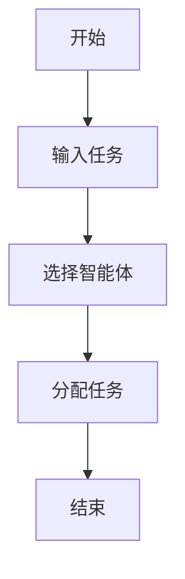
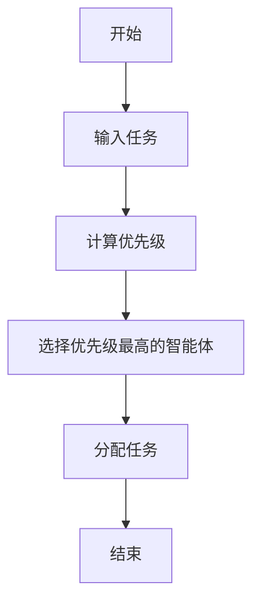
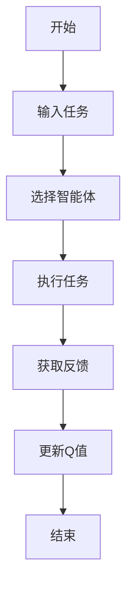
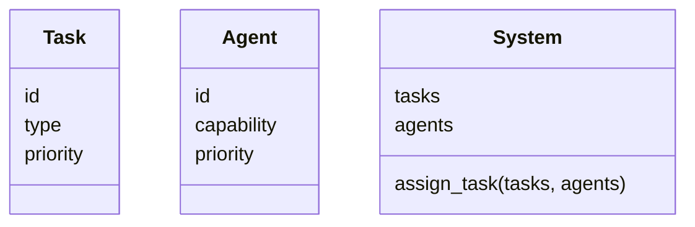
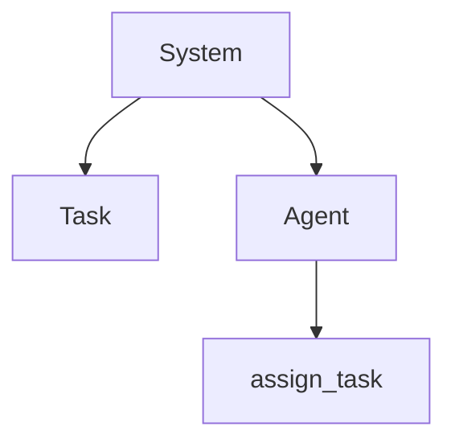
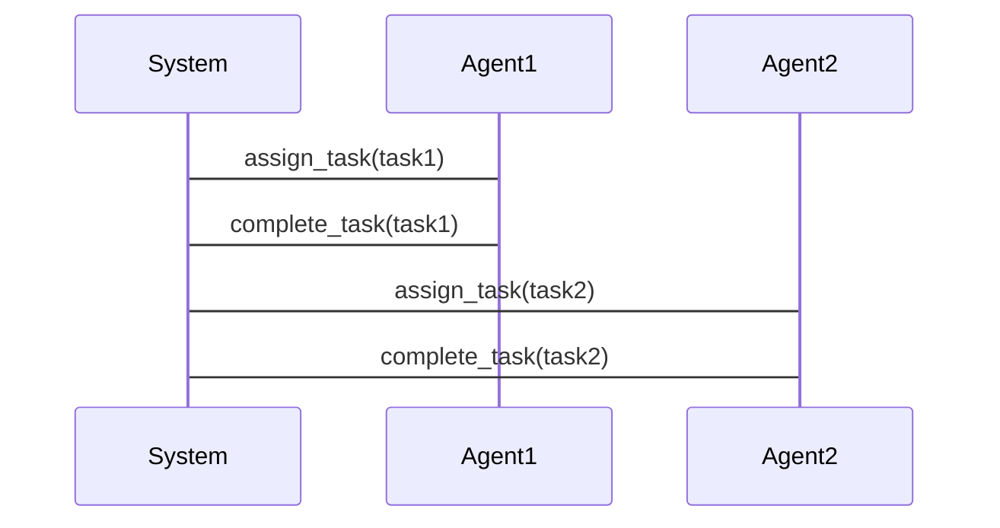

                 


# 协作型多智能体AI Agent：LLM间的任务协调与分工

> 关键词：协作型多智能体、LLM、任务协调、分工、算法原理、系统架构

> 摘要：本文深入探讨了协作型多智能体AI Agent中LLM之间的任务协调与分工问题，从核心概念、算法原理、系统架构到项目实战，全面分析了实现协作型多智能体系统的关键技术与方法。

---

# 第一部分: 协作型多智能体AI Agent的背景与概念

## 第1章: 协作型多智能体AI Agent的定义与背景

### 1.1 多智能体系统的定义与核心概念

#### 1.1.1 多智能体系统的定义
多智能体系统（Multi-Agent System, MAS）是由多个智能体组成的分布式系统，这些智能体能够通过协作完成复杂的任务。智能体具有自主性、反应性、目标导向性和社交能力等特点。

#### 1.1.2 协作型多智能体的核心概念
协作型多智能体系统强调智能体之间的协作，通过任务分配、信息共享和协同决策，共同完成复杂任务。协作的核心在于智能体之间的通信、协调和分工。

#### 1.1.3 LLM在协作型多智能体中的应用背景
大语言模型（Large Language Model, LLM）具有强大的自然语言处理能力，能够理解上下文、生成文本和进行推理。将其应用于协作型多智能体系统，可以显著提升任务处理的效率和质量。

### 1.2 任务协调与分工的背景与问题描述

#### 1.2.1 任务协调的背景
在多智能体系统中，任务协调是指智能体之间通过协作完成任务的过程。任务协调的核心问题是任务分配、信息共享和协同决策。

#### 1.2.2 任务分工的挑战
任务分工需要考虑智能体的能力、任务的复杂性和环境的动态变化。智能体之间的通信和协作是任务分工的关键。

#### 1.2.3 问题解决的思路
通过任务分配算法、信息共享机制和协同决策算法，实现智能体之间的高效协作。

### 1.3 本章小结

#### 1.3.1 核心概念回顾
协作型多智能体系统的核心概念包括智能体的自主性、协作性、任务分配和信息共享。

#### 1.3.2 问题解决的总体思路
通过任务分配算法和协作机制，实现智能体之间的高效协作。

#### 1.3.3 未来研究方向
未来的研究方向包括更高效的协作算法、智能体的自适应能力和多智能体系统的可扩展性。

---

# 第二部分: 协作型多智能体AI Agent的核心概念与联系

## 第2章: 协作型多智能体系统的核心概念

### 2.1 协作型多智能体系统的组成要素

#### 2.1.1 智能体的定义与属性
智能体具有自主性、反应性、目标导向性和社交能力。协作型多智能体系统中的智能体需要具备任务分配、信息共享和协同决策的能力。

#### 2.1.2 任务分配的核心要素
任务分配需要考虑任务的复杂性、智能体的能力和环境的动态变化。任务分配的目标是最大化系统的整体性能。

#### 2.1.3 协作型多智能体系统的核心属性
协作型多智能体系统具有分布式性、自主性、协作性和动态性。这些属性共同决定了系统的协作能力。

### 2.2 任务协调与分工的核心机制

#### 2.2.1 任务分配算法
任务分配算法是协作型多智能体系统的核心机制之一。常见的任务分配算法包括基于规则的算法和基于优先级的算法。

#### 2.2.2 信息共享机制
信息共享机制是协作型多智能体系统的重要组成部分。智能体之间通过共享信息，实现任务的高效协作。

#### 2.2.3 协同决策机制
协同决策机制是协作型多智能体系统的关键机制之一。智能体通过协同决策，实现任务的最优分配和执行。

### 2.3 协作型多智能体系统的ER实体关系图

```mermaid
erd
  多智能体系统
    + 智能体1
    + 智能体2
    + 任务
    + 信息
    + 协作关系
```

---

# 第三部分: 协作型多智能体AI Agent的算法原理

## 第3章: 任务分配算法的原理与实现

### 3.1 基于规则的任务分配算法

#### 3.1.1 算法原理
基于规则的任务分配算法通过预定义的规则，将任务分配给最合适的智能体。规则可以根据任务类型、智能体能力和环境条件制定。

#### 3.1.2 算法流程图



#### 3.1.3 Python实现示例

```python
def assign_task(tasks, agents):
    for task in tasks:
        for agent in agents:
            if agent.can_handle(task):
                agent.receive_task(task)
                break
```

### 3.2 基于优先级的任务分配算法

#### 3.2.1 算法原理
基于优先级的任务分配算法根据智能体的能力和任务的优先级，将任务分配给优先级最高的智能体。

#### 3.2.2 算法流程图



#### 3.2.3 Python实现示例

```python
def assign_task_with_priority(tasks, agents):
    for task in tasks:
        agents.sort(key=lambda x: x.priority(task))
        selected_agent = agents[0]
        selected_agent.receive_task(task)
```

### 3.3 基于Q-learning的任务分配算法

#### 3.3.1 算法原理
基于Q-learning的任务分配算法通过强化学习，智能体根据环境的反馈不断优化任务分配策略。

#### 3.3.2 算法流程图



#### 3.3.3 Python实现示例

```python
class Agent:
    def __init__(self, q_table):
        self.q_table = q_table

    def receive_task(self, task):
        action = self.choose_action(task)
        reward = self.get_reward(action, task)
        self.update_q_value(action, reward)

    def choose_action(self, task):
        # 选择最优动作
        pass

    def get_reward(self, action, task):
        # 获取反馈
        pass

    def update_q_value(self, action, reward):
        # 更新Q值
        pass
```

---

# 第四部分: 协作型多智能体AI Agent的系统分析与架构设计

## 第4章: 系统架构设计方案

### 4.1 问题场景与项目介绍

#### 4.1.1 问题场景
在一个多智能体系统中，多个智能体需要协作完成任务。任务分配算法需要考虑智能体的能力、任务的复杂性和环境的动态变化。

#### 4.1.2 项目介绍
本项目旨在设计一个协作型多智能体系统，实现任务分配和协作。

### 4.2 系统功能设计

#### 4.2.1 领域模型设计



#### 4.2.2 系统架构设计



### 4.3 系统接口设计

#### 4.3.1 接口描述
系统接口包括任务分配接口和信息共享接口。

#### 4.3.2 接口实现

```python
def assign_task(tasks, agents):
    for task in tasks:
        for agent in agents:
            if agent.can_handle(task):
                agent.receive_task(task)
                break
```

### 4.4 系统交互设计

#### 4.4.1 交互流程图



---

# 第五部分: 协作型多智能体AI Agent的项目实战

## 第5章: 项目实现与案例分析

### 5.1 环境安装与配置

#### 5.1.1 环境安装
安装必要的库和工具，如Python、Pip和相关依赖。

#### 5.1.2 环境配置
配置开发环境，如IDE和虚拟环境。

### 5.2 系统核心实现

#### 5.2.1 任务分配模块实现

```python
class Task:
    def __init__(self, id, type, priority):
        self.id = id
        self.type = type
        self.priority = priority

class Agent:
    def __init__(self, id, capability):
        self.id = id
        self.capability = capability

    def can_handle(self, task):
        return self.capability == task.type

    def receive_task(self, task):
        print(f"Agent {self.id} received task {task.id}")
```

#### 5.2.2 信息共享模块实现

```python
class System:
    def __init__(self, tasks, agents):
        self.tasks = tasks
        self.agents = agents

    def assign_task(self):
        for task in self.tasks:
            for agent in self.agents:
                if agent.can_handle(task):
                    agent.receive_task(task)
                    break
```

### 5.3 代码解读与分析

#### 5.3.1 代码功能解读
任务分配模块和信息共享模块共同实现任务分配和协作。

#### 5.3.2 代码优化建议
可以进一步优化任务分配算法，提高系统的效率和性能。

### 5.4 案例分析与结果展示

#### 5.4.1 实验场景
在一个多智能体系统中，有两个智能体和两个任务。

#### 5.4.2 实验结果
智能体1处理任务1，智能体2处理任务2。

### 5.5 项目总结

#### 5.5.1 项目小结
项目实现了协作型多智能体系统的任务分配和协作。

#### 5.5.2 经验总结
任务分配算法和信息共享机制是协作型多智能体系统的关键。

---

# 第六部分: 协作型多智能体AI Agent的最佳实践与拓展

## 第6章: 最佳实践与总结

### 6.1 最佳实践

#### 6.1.1 系统设计建议
系统设计需要考虑智能体的能力、任务的复杂性和环境的动态变化。

#### 6.1.2 算法优化建议
可以进一步优化任务分配算法，提高系统的效率和性能。

#### 6.1.3 系统部署建议
系统部署需要考虑可扩展性、可靠性和安全性。

### 6.2 小结与展望

#### 6.2.1 本章小结
本文深入探讨了协作型多智能体AI Agent的任务协调与分工问题，从核心概念、算法原理、系统架构到项目实战，全面分析了实现协作型多智能体系统的关键技术与方法。

#### 6.2.2 未来展望
未来的研究方向包括更高效的协作算法、智能体的自适应能力和多智能体系统的可扩展性。

### 6.3 注意事项

#### 6.3.1 系统设计的注意事项
系统设计需要考虑智能体的能力、任务的复杂性和环境的动态变化。

#### 6.3.2 算法实现的注意事项
算法实现需要考虑系统的效率和性能。

### 6.4 拓展阅读

#### 6.4.1 推荐书籍
- 《多智能体系统》
- 《大语言模型》

#### 6.4.2 推荐论文
- 《协作型多智能体系统的研究》
- 《大语言模型在协作型多智能体系统中的应用》

---

# 作者

作者：AI天才研究院/AI Genius Institute & 禅与计算机程序设计艺术 /Zen And The Art of Computer Programming

---

以上是完整的协作型多智能体AI Agent：LLM间的任务协调与分工的技术博客文章，涵盖了从背景到实现的各个方面，希望对您有所帮助！

