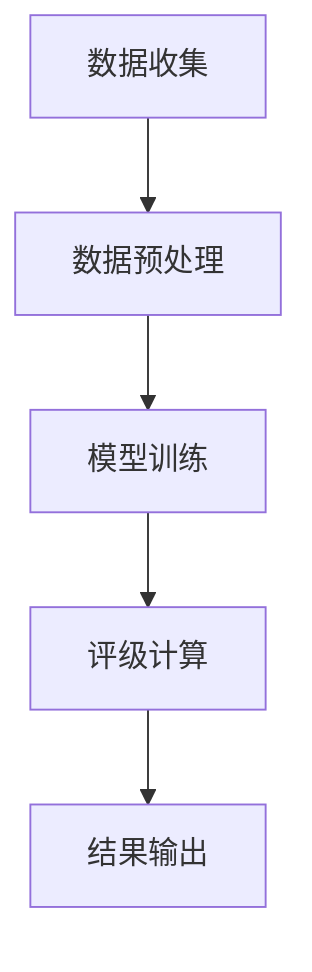
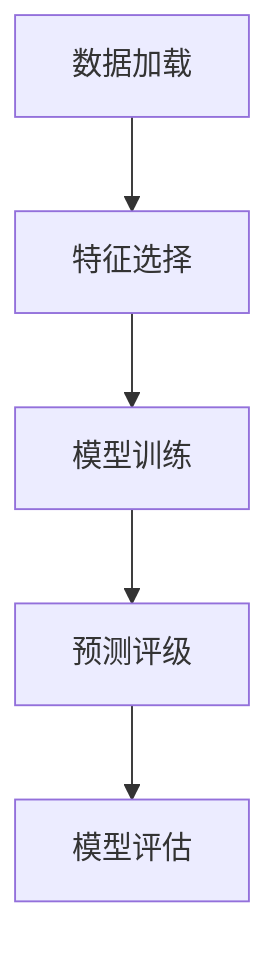
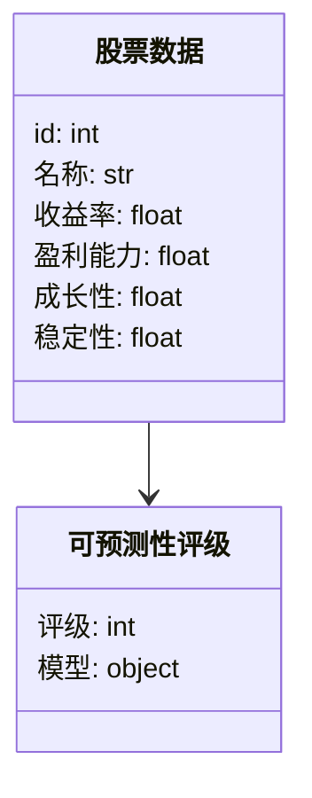
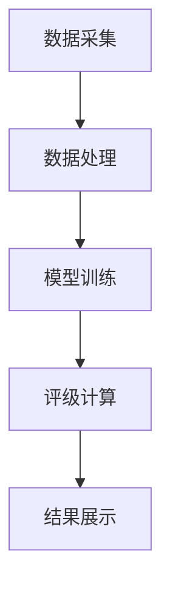

                 


# 可预测性评级在彼得林奇选股中的作用

> 关键词：可预测性评级，彼得林奇选股，股票预测，投资策略，量化分析

> 摘要：本文深入探讨了可预测性评级在彼得林奇选股策略中的应用。通过分析可预测性评级的定义、原理及其与彼得林奇选股理念的结合，展示了如何利用量化方法优化选股过程。文章详细讲解了可预测性评级的算法原理、系统架构以及实际项目中的应用，帮助投资者更好地理解和应用这一策略。

---

## 第1章: 可预测性评级的基本概念

### 1.1 可预测性评级的定义与作用

#### 1.1.1 什么是可预测性评级
可预测性评级是一种用于评估股票未来表现的指标，它基于历史数据和统计模型，预测股票价格的波动性和收益潜力。通过分析股票的历史表现，投资者可以对其未来走势做出更准确的判断。

#### 1.1.2 可预测性评级在投资中的作用
可预测性评级在投资中起到了关键作用，它帮助投资者识别那些未来表现较为稳定的股票，从而降低投资风险并提高收益。通过量化分析，投资者可以更科学地做出决策，避免仅依赖主观判断带来的偏差。

#### 1.1.3 可预测性评级的量化标准
可预测性评级通常以分数形式表示，分数越高表示股票未来表现的可预测性越强。常见的评级系统包括五级评分制（如A、B、C、D、E），每个等级代表不同的预测能力和风险水平。

---

### 1.2 彼得·林奇选股理念的核心

#### 1.2.1 彼得·林奇的选股方法概述
彼得·林奇以其独特的选股方法闻名，他注重基本面分析，关注公司的盈利能力、成长性和财务健康状况。他倾向于选择那些具有稳定增长潜力的公司，并长期持有。

#### 1.2.2 彼得·林奇选股中的基本面分析
基本面分析是彼得·林奇选股的核心，他通过分析公司的财务报表、行业地位、管理团队等因素，评估公司的内在价值。他认为，选择具有强大基本面的公司是实现长期收益的关键。

#### 1.2.3 彼得·林奇选股中的成长性评估
除了基本面分析，彼得·林奇还关注公司的成长性。他倾向于选择那些在行业内具有竞争优势，并且能够持续增长的公司。这种成长性评估帮助他在长期投资中获得更高的收益。

---

### 1.3 可预测性评级与彼得·林奇选股的结合

#### 1.3.1 可预测性评级在选股中的应用
可预测性评级为彼得·林奇的选股策略提供了额外的维度。通过分析股票的可预测性，投资者可以更好地预测股票的未来表现，从而优化投资组合的选择。

#### 1.3.2 彼得·林奇选股中的可预测性评级意义
将可预测性评级融入彼得·林奇的选股策略中，可以帮助投资者更准确地评估股票的未来表现，从而在基本面分析的基础上，进一步优化选股决策。

#### 1.3.3 可预测性评级对投资决策的影响
可预测性评级通过量化分析，为投资决策提供了科学依据。它帮助投资者在选择股票时，不仅关注公司的基本面，还考虑其未来的可预测性，从而实现更高效的投资组合管理。

---

## 第2章: 可预测性评级的核心概念与模型

### 2.1 可预测性评级的属性与特征

#### 2.1.1 可预测性评级的属性分析
可预测性评级具有多个属性，包括历史波动性、成长性、稳定性等。这些属性共同决定了股票的可预测性。

#### 2.1.2 可预测性评级的特征对比
通过对比不同评级的特征，投资者可以更好地理解其差异。例如，高评级的股票通常具有较低的波动性和较高的成长性。

#### 2.1.3 可预测性评级的评价指标
常用的评价指标包括波动率、收益增长率、市盈率等。这些指标共同构成了可预测性评级的评价体系。

---

### 2.2 可预测性评级与彼得·林奇选股的关系

#### 2.2.1 可预测性评级在彼得·林奇选股中的位置
可预测性评级是彼得·林奇选股策略中的一个重要补充，它帮助投资者在基本面分析的基础上，进一步筛选出那些未来表现更可预测的股票。

#### 2.2.2 可预测性评级与彼得·林奇选股目标的匹配
彼得·林奇的目标是选择具有长期增长潜力的公司，而可预测性评级则通过量化分析，帮助他找到那些未来表现稳定的股票。

#### 2.2.3 可预测性评级对彼得·林奇选股策略的优化
通过引入可预测性评级，彼得·林奇的选股策略更加科学化和系统化。投资者可以根据评级结果，优化投资组合，降低风险。

---

### 2.3 可预测性评级的数学模型与公式

#### 2.3.1 可预测性评级的数学模型
可预测性评级模型通常基于多元回归分析，考虑多个因素的影响。例如，股票的未来收益可以表示为：

$$
R = \beta_0 + \beta_1X_1 + \beta_2X_2 + \cdots + \beta_nX_n + \epsilon
$$

其中，$R$ 是股票的未来收益，$X_i$ 是各个影响因素，$\beta_i$ 是回归系数，$\epsilon$ 是误差项。

#### 2.3.2 可预测性评级的核心公式
通过上述模型，我们可以计算出股票的可预测性评级。例如，假设我们有三个因素：盈利能力（$X_1$）、成长性（$X_2$）和稳定性（$X_3$），则评级公式可以表示为：

$$
Rating = \alpha_0 + \alpha_1X_1 + \alpha_2X_2 + \alpha_3X_3
$$

其中，$\alpha_i$ 是权重系数，决定了每个因素的重要性。

---

## 第3章: 彼得·林奇选股中的可预测性评级算法原理

### 3.1 可预测性评级算法的原理

#### 3.1.1 算法的基本原理
可预测性评级算法基于统计学和机器学习，通过分析历史数据，预测股票的未来表现。它通常采用多元回归分析或时间序列模型，如ARIMA。

#### 3.1.2 算法的核心步骤
1. 数据收集：收集股票的历史价格、财务数据等。
2. 数据预处理：清洗数据，处理缺失值和异常值。
3. 模型训练：使用回归分析或时间序列模型训练模型。
4. 评级计算：根据模型输出结果，计算股票的可预测性评级。

---

### 3.2 可预测性评级算法的流程图



---

### 3.3 可预测性评级算法的实现

#### 3.3.1 Python代码实现

```python
import pandas as pd
import numpy as np
from sklearn.linear_model import LinearRegression
from sklearn.metrics import mean_squared_error

# 数据加载
data = pd.read_csv('stock_data.csv')

# 数据预处理
# 假设我们使用盈利能力、成长性和稳定性作为特征
features = ['profitability', 'growth', 'stability']
target = 'rating'

X = data[features]
y = data[target]

# 模型训练
model = LinearRegression()
model.fit(X, y)

# 模型预测
predicted_ratings = model.predict(X)

# 模型评估
mse = mean_squared_error(y, predicted_ratings)
print(f"均方误差：{mse}")
```

#### 3.3.2 算法流程图



---

### 3.4 可预测性评级算法的数学模型

#### 3.4.1 线性回归模型

$$
y = \beta_0 + \beta_1x_1 + \beta_2x_2 + \cdots + \beta_nx_n + \epsilon
$$

其中，$y$ 是目标变量（股票评级），$x_i$ 是特征变量，$\beta_i$ 是回归系数，$\epsilon$ 是误差项。

---

## 第4章: 系统分析与架构设计方案

### 4.1 系统功能设计

#### 4.1.1 功能模块
1. 数据采集模块：负责收集股票数据。
2. 数据处理模块：对数据进行清洗和预处理。
3. 模型训练模块：使用机器学习算法训练模型。
4. 评级计算模块：根据模型输出计算股票评级。
5. 结果展示模块：将评级结果以可视化方式展示。

#### 4.1.2 领域模型



---

### 4.2 系统架构设计

#### 4.2.1 系统架构图



---

## 第5章: 项目实战

### 5.1 环境安装与配置

#### 5.1.1 安装Python和相关库
```bash
pip install pandas numpy scikit-learn
```

#### 5.1.2 数据来源
使用历史股票数据，可以从Yahoo Finance等平台获取。

---

### 5.2 核心代码实现

#### 5.2.1 数据预处理
```python
import pandas as pd
import numpy as np
from sklearn.linear_model import LinearRegression
from sklearn.metrics import mean_squared_error

# 数据加载
data = pd.read_csv('stock_data.csv')

# 数据预处理
# 假设我们使用盈利能力、成长性和稳定性作为特征
features = ['profitability', 'growth', 'stability']
target = 'rating'

X = data[features]
y = data[target]

# 模型训练
model = LinearRegression()
model.fit(X, y)

# 模型预测
predicted_ratings = model.predict(X)

# 模型评估
mse = mean_squared_error(y, predicted_ratings)
print(f"均方误差：{mse}")
```

---

### 5.3 实际案例分析

#### 5.3.1 数据分析
假设我们选择了苹果公司（AAPL）和谷歌公司（GOOGL）的股票数据，进行可预测性评级分析。

#### 5.3.2 模型应用
使用上述代码，训练模型并预测评级。

#### 5.3.3 结果解读
根据模型输出的评级，选择评级较高的股票进行投资。

---

## 第6章: 总结与展望

### 6.1 全文总结
可预测性评级为彼得·林奇的选股策略提供了科学的量化分析方法。通过结合基本面分析和可预测性评级，投资者可以更准确地评估股票的未来表现，优化投资组合。

### 6.2 未来展望
未来，可以进一步研究可预测性评级与其他量化方法的结合，如机器学习和大数据分析，以提升预测的准确性。同时，探索可预测性评级在其他投资策略中的应用，也是值得深入研究的方向。

---

## 作者：AI天才研究院/AI Genius Institute & 禅与计算机程序设计艺术 /Zen And The Art of Computer Programming

---

这篇文章详细探讨了可预测性评级在彼得·林奇选股中的作用，通过理论分析和实际案例，展示了如何利用量化方法优化选股策略。希望对投资者和相关领域的研究者有所帮助。

