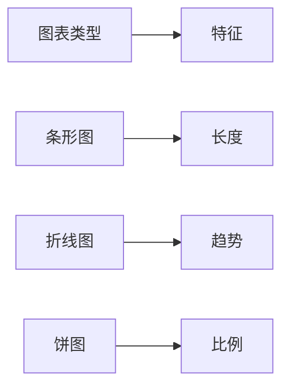
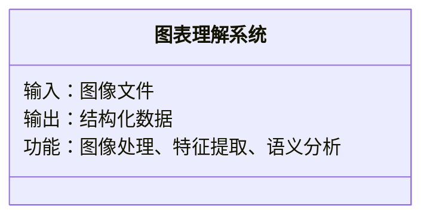
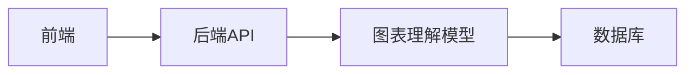

                 


# 图表理解技术：增强AI Agent的数据分析能力

## 关键词：
图表理解，AI Agent，数据分析，图像处理，深度学习

## 摘要：
图表理解技术是人工智能领域的重要分支，通过解析图表数据来增强AI Agent的数据分析能力。本文从图表理解技术的背景、核心概念、算法原理、系统设计、项目实战等多个维度进行详细分析，帮助读者全面理解图表理解技术的实现与应用。

---

## 第一部分: 图表理解技术概述

## 第1章: 图表理解技术的背景与概念

### 1.1 图表理解技术的背景
#### 1.1.1 数据可视化的历史与发展
数据可视化是人类理解数据的重要手段，从早期的手工绘制图表到现代的计算机生成图表，数据可视化技术经历了巨大的发展。随着人工智能技术的进步，如何自动理解图表内容成为新的研究方向。

#### 1.1.2 图表理解技术的定义与目标
图表理解技术是指通过计算机视觉和自然语言处理等技术，对图表中的数据、结构和语义进行解析和理解。其目标是将图表数据转化为可计算的结构化信息，以便AI Agent进行进一步的分析和决策。

#### 1.1.3 图表理解技术的应用场景
图表理解技术广泛应用于金融分析、医疗诊断、商业智能等领域。例如，在金融领域，AI Agent可以通过理解财务报表中的图表数据，辅助投资决策。

### 1.2 图表理解技术的核心问题
#### 1.2.1 图表数据的复杂性
图表数据通常包含文本、图形、颜色等多种信息，数据结构复杂，难以直接解析。

#### 1.2.2 图表类型与结构的多样性
从简单的柱状图、饼图到复杂的网络图、树状图，图表类型多样，每种图表的结构和解析方法都有所不同。

#### 1.2.3 图表语义的理解与提取
图表不仅仅是数据的展示，还包含丰富的语义信息。例如，折线图可以表示趋势，柱状图可以表示对比关系。如何准确提取这些语义信息是图表理解的核心挑战。

### 1.3 图表理解技术的边界与外延
#### 1.3.1 图表理解的边界
图表理解的边界包括图像识别和自然语言处理的边界，以及数据可视化和数据挖掘的边界。例如，图表理解不包括对纯文本数据的处理。

#### 1.3.2 图表理解与相关领域的区别
图表理解与图像识别、自然语言处理等领域的区别在于其专注于图表这一特定的数据可视化形式。

#### 1.3.3 图表理解的外延与扩展
图表理解的外延包括对动态图表的理解、对交互式图表的理解等。

---

## 第2章: 图表理解技术的核心概念与联系

### 2.1 图表理解的核心原理
#### 2.1.1 图像处理与模式识别
图表理解技术依赖于图像处理和模式识别技术，例如OCR技术可以提取图表中的文字信息，图像分割技术可以识别图表中的元素。

#### 2.1.2 图表数据结构与语义分析
图表数据通常以层次化的方式组织，例如柱状图包含标题、轴标签、数据点等元素。语义分析需要理解这些元素之间的关系。

#### 2.1.3 图表生成与重建技术
图表生成技术是图表理解的逆过程，通过生成图表来验证理解的准确性。

### 2.2 图表类型与特征对比
#### 2.2.1 常见图表类型及其特征
- 柱状图：用于展示数据的对比关系，通常包含标题、轴标签和数据点。
- 折线图：用于展示数据的趋势，通常包含标题、时间轴和数据点。
- 饼图：用于展示数据的比例关系，通常包含标题、数据标签和饼图扇区。

#### 2.2.2 图表特征的分类与对比
图表特征可以分为视觉特征和语义特征。视觉特征包括颜色、形状、大小等，语义特征包括数据类型、数据关系等。

#### 2.2.3 图表分类的ER实体关系图


### 2.3 图表理解的核心算法与技术
#### 2.3.1 基于CNN的图像识别
使用卷积神经网络（CNN）对图表中的元素进行识别和分类。例如，可以使用ResNet、VGG等模型对图表中的文字、图形元素进行识别。

#### 2.3.2 基于RNN的序列建模
使用循环神经网络（RNN）对图表中的序列信息进行建模。例如，可以使用LSTM对时间序列数据进行建模。

#### 2.3.3 图表语义理解
通过自然语言处理技术（如BERT）对图表标题、标签等文本信息进行语义理解。

---

## 第3章: 图表理解的算法原理与数学模型

### 3.1 图表理解的算法原理
#### 3.1.1 图像处理与特征提取
图像处理包括图像分割、图像增强等步骤。特征提取可以通过CNN模型实现。

#### 3.1.2 图表元素识别与分类
使用目标检测算法（如YOLO、Faster R-CNN）对图表中的元素进行识别和分类。

#### 3.1.3 图表语义理解与推理
通过自然语言处理技术对图表标题、标签等文本信息进行语义理解，并结合图像信息进行推理。

### 3.2 图表理解的数学模型
#### 3.2.1 基于CNN的图像识别模型
CNN模型通常包括卷积层、池化层和全连接层。例如：
$$ \text{CNN结构：输入} \rightarrow \text{卷积层} \rightarrow \text{池化层} \rightarrow \text{全连接层} \rightarrow \text{输出} $$

#### 3.2.2 基于RNN的序列建模
RNN模型通常包括输入层、隐藏层和输出层。例如：
$$ \text{RNN结构：输入序列} \rightarrow \text{隐藏层} \rightarrow \text{输出} $$

#### 3.2.3 图表生成的数学模型
图表生成可以通过GAN（生成对抗网络）实现。生成器和判别器的对抗训练过程可以生成逼真的图表数据。

---

## 第4章: 图表理解的系统设计与实现

### 4.1 系统功能设计
#### 4.1.1 领域模型设计


#### 4.1.2 系统架构设计


#### 4.1.3 系统接口设计
- 前端接口：接收图表图像文件，返回结构化数据。
- 后端接口：调用图表理解模型进行处理，并返回结果。

#### 4.1.4 系统交互设计
```mermaid
sequenceDiagram
    participant 用户
    participant 前端
    participant 后端
    participant 图表理解模型
    用户 -> 前端：上传图表图像
    前端 -> 后端：请求处理
    后端 -> 图表理解模型：进行图像处理
    图表理解模型 -> 后端：返回结构化数据
    后端 -> 前端：返回结果
    前端 -> 用户：展示结果
```

### 4.2 项目实战
#### 4.2.1 环境安装
需要安装Python、深度学习框架（如TensorFlow、PyTorch）以及图表处理库（如Matplotlib、Plotly）。

#### 4.2.2 核心代码实现
```python
import tensorflow as tf
from tensorflow.keras import layers

# 定义CNN模型
def build_model(input_shape):
    model = tf.keras.Sequential()
    model.add(layers.Conv2D(32, (3,3), activation='relu', input_shape=input_shape))
    model.add(layers.MaxPooling2D((2,2)))
    model.add(layers.Conv2D(64, (3,3), activation='relu'))
    model.add(layers.MaxPooling2D((2,2)))
    model.add(layers.Flatten())
    model.add(layers.Dense(128, activation='relu'))
    model.add(layers.Dense(10, activation='softmax'))
    return model

# 训练模型
model = build_model((64,64,3))
model.compile(optimizer='adam', loss='sparse_categorical_crossentropy', metrics=['accuracy'])
model.fit(x_train, y_train, epochs=10, batch_size=32)
```

#### 4.2.3 案例分析与解读
以股票趋势分析为例，使用折线图进行数据可视化，并通过模型预测未来趋势。

#### 4.2.4 项目小结
通过实际项目，我们可以看到图表理解技术在数据分析中的重要性，以及AI Agent在实际应用中的潜力。

---

## 第5章: 图表理解技术的最佳实践与注意事项

### 5.1 最佳实践
#### 5.1.1 数据预处理
对图表数据进行标准化、归一化处理，确保模型输入一致。

#### 5.1.2 模型调优
通过调整超参数（如学习率、批量大小）和优化模型结构，提高模型性能。

#### 5.1.3 结果验证
使用验证集和测试集对模型进行验证，确保模型具有良好的泛化能力。

### 5.2 小结
图表理解技术是增强AI Agent数据分析能力的关键技术，通过图像处理、深度学习和自然语言处理的结合，可以实现对图表数据的高效理解。

### 5.3 注意事项
- 数据质量：图表数据的质量直接影响模型的性能。
- 模型选择：根据具体任务选择合适的模型和算法。
- 语义理解：图表语义的理解需要结合上下文信息。

### 5.4 拓展阅读
推荐阅读《深度学习》、《自然语言处理实战》等书籍，深入理解相关技术。

---

## 作者：AI天才研究院/AI Genius Institute & 禅与计算机程序设计艺术 /Zen And The Art of Computer Programming

