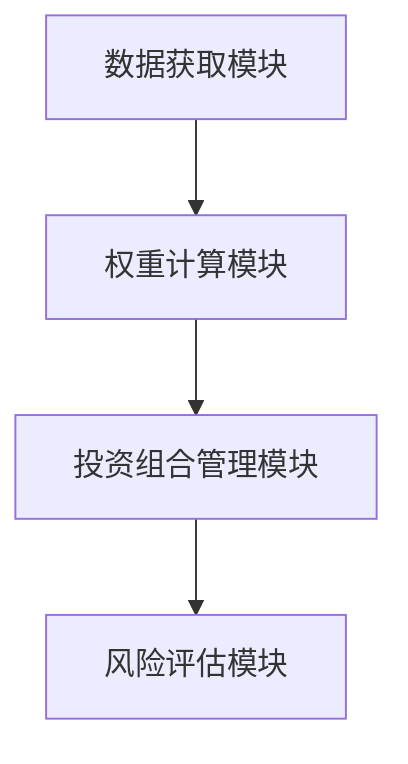

                 


# 均等权重投资：彼得林奇的资金分配方法

## 关键词：均等权重投资，彼得林奇，投资策略，资金分配，投资组合，风险管理

## 摘要：  
均等权重投资是一种将投资组合中的每只股票分配相同权重的投资方法，旨在通过分散投资降低风险并实现长期收益。本文从彼得林奇的投资理念出发，详细阐述均等权重投资的核心概念、数学模型、系统架构及实际应用，帮助投资者理解和掌握这一高效的资金分配方法。

---

## 第一部分：均等权重投资的背景与概述

### 第1章：均等权重投资的起源与背景

#### 1.1 均等权重投资的定义与特点

均等权重投资是一种投资策略，其核心理念是将投资组合中的每只股票分配相同的权重，即每只股票的投资金额相等。这种方法与传统的按市值加权的投资方式不同，它通过强制性分散投资来降低风险。

- **定义**：均等权重投资是指将投资组合中的每只股票分配相同的权重，即每只股票的投资金额相等。
- **特点**：
  - 分散性：通过等量分配，降低单一股票对投资组合的影响。
  - 简单性：计算和管理相对简单，适合个人投资者和机构投资者。
  - 长期性：适合长期持有，减少短期市场波动的影响。

#### 1.2 彼得林奇的投资理念

彼得·林奇是美国著名的投资经理，以其长期投资和分散投资的理念闻名。他的投资策略强调买入并持有优质股票，避免频繁交易。均等权重投资与彼得林奇的理念高度契合，因为这种方法通过分散投资降低风险，同时保持对市场的长期敞口。

- **彼得林奇的核心理念**：
  - 长期投资：通过持有优质股票实现财富增值。
  - 分散投资：避免过度集中于某一只股票或行业。
  - 价值投资：寻找具有长期增长潜力的公司。

#### 1.3 均等权重投资的适用场景

均等权重投资适用于多种市场环境和投资目标，尤其适合以下场景：

- **市场波动较大时**：通过分散投资降低短期波动的影响。
- **长期投资**：适合那些希望长期持有股票的投资者。
- **中小投资者**：适合资金规模较小的个人投资者，帮助他们实现分散投资。

---

## 第二部分：均等权重投资的核心概念与原理

### 第2章：均等权重投资的核心概念

#### 2.1 均等权重投资的数学模型

均等权重投资的数学模型简单直观，但其背后的原理却能帮助投资者更好地理解这种方法的优势。

- **权重计算公式**：
  $$ w_i = \frac{1}{n} $$
  其中，\( w_i \) 表示第 \( i \) 只股票的权重，\( n \) 表示股票数量。

- **投资组合收益计算公式**：
  $$ R = \sum_{i=1}^{n} w_i \times R_i $$
  其中，\( R \) 表示投资组合的收益，\( R_i \) 表示第 \( i \) 只股票的收益。

#### 2.2 均等权重投资的属性特征对比

通过对比其他投资策略，我们可以更好地理解均等权重投资的优势和局限性。

| 投资策略 | 投资方式 | 风险分散 | 交易成本 |
|----------|----------|----------|----------|
| 均等权重投资 | 分散投资 | 高 | 低 |
| 非均等权重投资 | 集中投资 | 低 | 中 |
| 市值加权投资 | 动态调整 | 中 | 中 |

---

## 第三部分：均等权重投资的算法原理与系统架构

### 第3章：均等权重投资的算法原理

#### 3.1 均等权重投资的计算流程

均等权重投资的计算流程分为以下几个步骤：

1. **确定投资组合中的股票数量 \( n \)**。
2. **计算每只股票的权重 \( w_i = \frac{1}{n} \)**。
3. **根据权重分配投资金额**。
4. **定期调整投资组合以维持均等权重**。

#### 3.2 均等权重投资的数学模型

均等权重投资的数学模型可以用以下公式表示：

$$ w_i = \frac{1}{n} $$

其中，\( w_i \) 表示第 \( i \) 只股票的权重，\( n \) 表示股票数量。

#### 3.3 均等权重投资的系统架构

均等权重投资的系统架构可以分为以下几个模块：

1. **数据获取模块**：获取投资组合中每只股票的实时数据。
2. **权重计算模块**：计算每只股票的均等权重。
3. **投资组合管理模块**：根据权重分配投资金额并进行调整。
4. **风险评估模块**：评估投资组合的整体风险。

---

## 第四部分：均等权重投资的系统分析与架构设计方案

### 第4章：均等权重投资的系统架构设计

#### 4.1 问题场景介绍

假设我们有一个包含 \( n \) 只股票的投资组合，我们需要通过均等权重投资来实现风险分散和收益最大化。

#### 4.2 系统功能设计

1. **数据获取**：从数据源获取每只股票的价格和收益数据。
2. **权重计算**：计算每只股票的均等权重。
3. **投资组合管理**：根据权重分配投资金额并进行调整。
4. **风险评估**：评估投资组合的整体风险。

#### 4.3 系统架构设计

以下是均等权重投资的系统架构设计：



---

## 第五部分：均等权重投资的项目实战

### 第5章：均等权重投资的实战分析

#### 5.1 环境安装

在进行均等权重投资的实战分析之前，需要安装以下环境：

1. **Python**：用于数据处理和计算。
2. **Pandas**：用于数据框操作。
3. **NumPy**：用于数值计算。
4. **Matplotlib**：用于数据可视化。

#### 5.2 核心实现源代码

以下是均等权重投资的核心实现源代码：

```python
import pandas as pd
import numpy as np

def equal_weight_portfolio(returns):
    n = len(returns.columns)
    weights = pd.Series([1/n] * n, index=returns.columns)
    return weights
```

#### 5.3 代码应用解读与分析

1. **数据获取**：从数据源获取每只股票的收益数据。
2. **权重计算**：使用 `equal_weight_portfolio` 函数计算每只股票的均等权重。
3. **投资组合收益计算**：根据权重计算投资组合的总体收益。

#### 5.4 实际案例分析

假设我们有一个包含3只股票的投资组合，每只股票的收益分别为10%、15%和5%。根据均等权重投资的计算公式，每只股票的权重为1/3。投资组合的总体收益为：

$$ R = \frac{1}{3} \times 10\% + \frac{1}{3} \times 15\% + \frac{1}{3} \times 5\% = 10\% $$

---

## 第六部分：均等权重投资的最佳实践与注意事项

### 第6章：均等权重投资的注意事项

#### 6.1 投资组合的再平衡

为了保持均等权重投资的有效性，需要定期对投资组合进行再平衡。

#### 6.2 市场环境的影响

均等权重投资在不同的市场环境中表现不同，需要根据市场情况调整策略。

#### 6.3 风险管理

尽管均等权重投资通过分散投资降低了风险，但仍需注意整体投资组合的风险。

---

## 结语

均等权重投资是一种简单而有效的资金分配方法，通过分散投资降低风险并实现长期收益。彼得林奇的投资理念与均等权重投资高度契合，为投资者提供了一种长期稳定的资金分配策略。

---

## 作者

作者：AI天才研究院/AI Genius Institute  
联系方式：[联系作者](#)  
邮箱：[作者邮箱](#)

