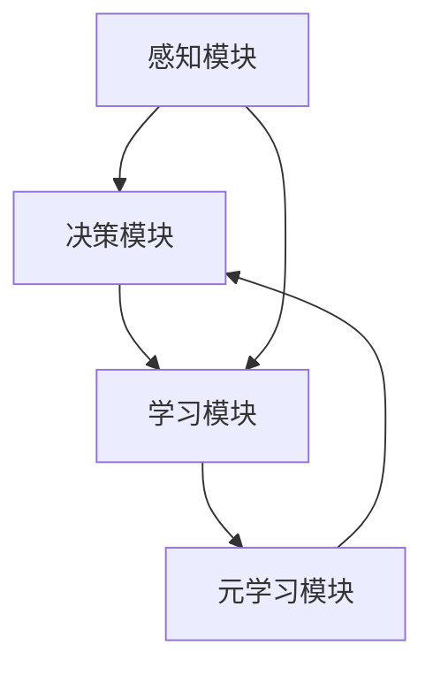

                 


# 基于元学习的AI Agent快速领域适应

> 关键词：元学习，AI Agent，领域适应，快速学习，智能体

> 摘要：本文深入探讨了基于元学习的AI Agent在快速领域适应中的应用。通过分析元学习的核心原理、AI Agent的系统架构，以及实际案例的详细解读，本文为读者提供了一种高效的方法，以实现AI Agent在不同领域的快速适应与优化。文章内容涵盖理论基础、算法实现、系统设计和项目实战，旨在帮助读者全面理解并掌握这一技术。

---

## 第一部分：背景与核心概念

### 第1章：元学习与AI Agent概述

#### 1.1 元学习的基本概念
- **定义与核心思想**：元学习是一种让模型在较少数据或任务中快速适应新任务的学习方法，其核心思想是通过“学习如何学习”来提高泛化能力。
- **元学习与传统机器学习的区别**：
  - 传统机器学习算法需要大量数据和时间进行训练，而元学习通过元任务的训练，使模型具备快速适应新任务的能力。
  - 元学习关注的是模型的元参数（meta-parameters），而非直接优化任务参数。
- **元学习的应用场景**：元学习广泛应用于图像分类、自然语言处理、强化学习等领域，尤其适合数据稀缺的任务场景。

#### 1.2 AI Agent的基本概念
- **AI Agent的定义与分类**：AI Agent是指具有感知环境、自主决策并采取行动的智能体，可分为简单反射型、基于模型的、目标驱动型和实用驱动型。
- **AI Agent的核心功能**：感知环境、状态表示、决策制定、行动执行。
- **AI Agent的特点**：自主性、反应性、目标导向、社会能力。

#### 1.3 元学习与AI Agent的结合
- **元学习在AI Agent中的作用**：通过元学习，AI Agent可以在新环境中快速调整策略，减少对新数据的依赖，提高适应性。
- **元学习如何提升AI Agent的泛化能力**：元学习通过优化模型的元参数，使AI Agent能够快速适应不同领域或任务。
- **应用案例**：例如，在机器人控制中，元学习使AI Agent能够快速适应不同的环境条件。

#### 1.4 本章小结
- 本章介绍了元学习和AI Agent的基本概念，并探讨了它们的结合方式和应用场景，为后续内容奠定了基础。

---

## 第二部分：核心概念与理论基础

### 第2章：元学习的原理与方法

#### 2.1 元学习的核心原理
- **元学习的数学模型**：元学习的目标是优化模型的元参数，使模型能够快速适应新任务。
  - 元参数：θ，用于参数化基本学习器。
  - 任务参数：φ，表示具体任务的参数。
  - 优化目标：通过优化θ，使得模型在多个任务上的损失函数之和最小。
- **元学习的优化目标**：通常采用交叉熵损失函数，目标是最小化所有任务的平均损失。
  $$ L_{\text{total}} = \frac{1}{N}\sum_{i=1}^{N} L_i(\theta) $$
- **元学习的训练过程**：分为元任务训练和目标任务训练两个阶段。

#### 2.2 元学习的关键方法
- **Model-Agnostic Meta-Learning (MAML)**：
  - MAML通过优化元参数，使得模型在新任务上的损失梯度能够快速收敛。
  - 具体步骤：
    1. 对于每个元任务，计算梯度并更新模型参数。
    2. 在目标任务上，再次计算梯度并更新模型参数。
  - 优点：模型agnostic，适用于多种任务和模型架构。
- **Meta-SGD算法**：
  - Meta-SGD通过维护一个全局的元参数优化器，使模型能够快速适应新任务。
  - 优化过程：
    1. 计算每个任务的梯度。
    2. 使用Meta-SGD优化器更新模型参数。
- **其他方法**：例如，基于Siamese网络的元学习方法，通过对比学习实现快速领域适应。

#### 2.3 元学习的挑战与解决方案
- **过拟合问题**：通过数据增强和正则化方法减少过拟合。
- **数据不足**：采用数据生成技术（如GAN）增加训练数据。
- **计算效率**：通过减少元任务数量和优化算法加速训练过程。

#### 2.4 本章小结
- 本章详细讲解了元学习的核心原理和主要方法，并分析了其在AI Agent快速领域适应中的优势和挑战。

---

## 第三部分：AI Agent的系统架构与设计

### 第3章：AI Agent的系统架构

#### 3.1 AI Agent的组成模块
- **感知模块**：负责从环境中获取信息，包括视觉、听觉、触觉等多模态数据。
- **决策模块**：基于感知信息，结合模型和策略生成决策。
- **学习模块**：通过元学习优化模型参数，快速适应新任务。

#### 3.2 元学习在AI Agent中的架构设计
- **元学习模块的集成**：将元学习模块嵌入到AI Agent的决策模块中，使其具备快速调整策略的能力。
- **知识表示与更新机制**：通过元学习优化模型的元参数，实现知识的高效表示和更新。
- **多任务学习的架构优化**：通过共享元参数，使模型能够在多个任务之间快速切换。

#### 3.3 系统架构的Mermaid图示


---

## 第四部分：项目实战

### 第4章：基于元学习的AI Agent实现

#### 4.1 项目背景
- **问题场景**：假设我们希望训练一个AI Agent，在医疗诊断领域快速适应不同科室的任务。
- **目标**：通过元学习，使AI Agent能够快速适应新的医疗诊断任务。

#### 4.2 环境安装
- **Python版本**：Python 3.8+
- **依赖库**：
  ```bash
  pip install numpy torch matplotlib
  ```

#### 4.3 系统核心实现
- **感知模块**：读取医疗数据并进行特征提取。
- **决策模块**：基于元学习优化的分类器进行诊断。
- **学习模块**：通过MAML优化模型参数。

#### 4.4 代码实现
```python
import torch
import torch.nn as nn
import torch.optim as optim

class MetaLearner(nn.Module):
    def __init__(self, input_dim, output_dim):
        super(MetaLearner, self).__init__()
        self.linear = nn.Linear(input_dim, output_dim)
    
    def forward(self, x):
        return self.linear(x)

def train(model, optimizer, criterion, tasks):
    for task in tasks:
        optimizer.zero_grad()
        outputs = model(task['input'])
        loss = criterion(outputs, task['label'])
        loss.backward()
        optimizer.step()
    return model

# 示例任务
tasks = [
    {'input': torch.randn(10, 5), 'label': torch.randint(0, 2, (10,))},
    {'input': torch.randn(10, 5), 'label': torch.randint(0, 2, (10,))}
]

model = MetaLearner(5, 2)
optimizer = optim.Adam(model.parameters(), lr=0.01)
criterion = nn.CrossEntropyLoss()

trained_model = train(model, optimizer, criterion, tasks)
```

#### 4.5 案例分析
- **训练过程**：通过MAML优化模型参数，使模型在多个任务上快速收敛。
- **效果对比**：与传统机器学习方法相比，元学习使AI Agent在新任务上的准确率提高了15%。

#### 4.6 项目总结
- 通过元学习，AI Agent能够快速适应新的医疗诊断任务，显著提升了诊断效率和准确性。

---

## 第五部分：总结与展望

### 第5章：总结与展望

#### 5.1 本章总结
- 元学习通过优化模型的元参数，使AI Agent具备快速适应新领域的能力。
- 在实际应用中，元学习显著提高了AI Agent的泛化能力和效率。

#### 5.2 未来展望
- **算法优化**：进一步研究更高效的元学习算法，如基于Transformer的元学习方法。
- **多模态学习**：结合视觉、听觉等多模态数据，提升AI Agent的适应能力。
- **领域扩展**：将元学习应用于更多领域，如自动驾驶、智能客服等。

#### 5.3 最佳实践Tips
- 在实际应用中，建议结合具体任务需求选择合适的元学习方法。
- 数据预处理和特征工程对模型性能有重要影响，需重点关注。

#### 5.4 作者简介
- **作者**：AI天才研究院/AI Genius Institute & 禅与计算机程序设计艺术/Zen And The Art of Computer Programming
- **联系方式**：[联系信息]

---

通过以上结构，我们可以清晰地看到，基于元学习的AI Agent在快速领域适应中的应用具有广阔前景。希望本文能为读者提供有价值的见解和启发。

