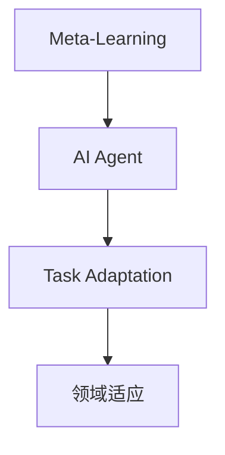
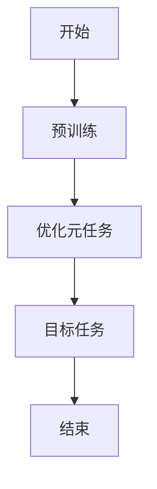
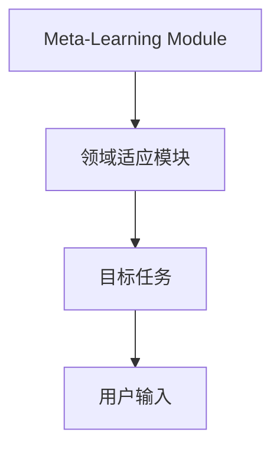
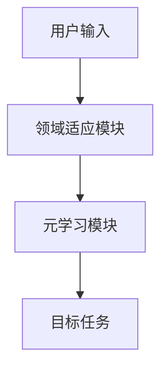

                 


# 基于元学习的AI Agent快速领域适应技术

## 关键词：元学习（Meta-Learning）、AI Agent、领域适应、迁移学习、机器学习

## 摘要：  
本文深入探讨了基于元学习的AI Agent在快速领域适应中的技术原理和应用。通过分析元学习的核心概念、算法原理、系统架构以及实际案例，本文为读者提供了从理论到实践的全面指导，帮助AI开发者和研究人员快速掌握这一前沿技术。

---

# 第一部分: 基于元学习的AI Agent快速领域适应技术概述

## 第1章: 问题背景与技术优势

### 1.1 问题背景
#### 1.1.1 AI Agent的定义与特点
AI Agent（人工智能代理）是指能够在特定环境中感知、推理、决策并执行任务的智能体。它具有自主性、反应性、目标导向性和社交性等核心特点。

#### 1.1.2 领域适应问题的挑战
AI Agent在不同领域（如自然语言处理、计算机视觉、机器人控制等）中的应用需要快速适应新的任务和数据分布。传统机器学习方法在面对新领域时需要重新训练，效率低下且成本高昂。

#### 1.1.3 元学习的核心概念与作用
元学习是一种通过学习如何快速学习新任务的方法。它通过在多个任务上进行预训练，使得模型能够快速适应新任务，减少对新数据的依赖。

---

### 1.2 技术优势
#### 1.2.1 元学习在领域适应中的优势
元学习通过共享跨任务的知识，使得AI Agent能够在新领域中快速调整模型参数，显著减少训练时间。

#### 1.2.2 基于元学习的AI Agent的特点
- **快速适应性**：能够在较少数据下快速适应新领域。
- **通用性**：适用于多种任务和领域。
- **高效性**：相比传统迁移学习，元学习的适应速度更快。

#### 1.2.3 技术的创新点与应用前景
元学习的创新在于其通过“学习如何学习”的方式，使得AI Agent能够更灵活地应对复杂多变的领域需求。未来，其在自动驾驶、智能客服、医疗诊断等领域具有广阔的应用前景。

---

## 第2章: 元学习与AI Agent的核心概念

### 2.1 元学习的定义与核心思想
#### 2.1.1 元学习的定义
元学习（Meta-Learning）是一种机器学习方法，旨在通过学习多个任务之间的关系，使得模型能够快速适应新任务。

#### 2.1.2 元学习的核心思想
元学习的核心思想是通过在元任务（Meta-task）上进行优化，使得模型能够在目标任务（Target-task）上快速收敛。

#### 2.1.3 元学习与传统机器学习的区别
| 特性 | 传统机器学习 | 元学习 |
|------|--------------|---------|
| 数据需求 | 需要大量标注数据 | 需要少量标注数据 |
| 适应性 | 适应单一任务 | 跨任务适应 |

#### 2.1.4 实体关系图


---

### 2.2 元学习在AI Agent中的应用
#### 2.2.1 元学习在AI Agent中的应用
元学习可以用于AI Agent的快速领域适应，使其能够快速调整策略以应对新任务。

#### 2.2.2 元学习如何提升AI Agent的领域适应能力
通过预训练模型在多个领域任务上进行优化，使得AI Agent能够快速适应新的领域任务。

#### 2.2.3 元学习与迁移学习的对比分析
| 技术 | 元学习 | 迁移学习 |
|------|--------|----------|
| 核心目标 | 学习如何快速学习新任务 | 利用已有知识解决新任务 |
| 适用场景 | 快速领域适应 | 知识迁移 |

---

## 第3章: 元学习算法的核心原理

### 3.1 Meta-Learning算法的数学模型
#### 3.1.1 元学习的数学模型
元学习的目标是最小化目标任务的损失函数。其数学模型可以表示为：
$$ L_{meta} = \sum_{i=1}^{N} L_{task_i}(f_{\theta}(x_i), y_i) $$
其中，$\theta$是模型参数，$N$是元任务的数量。

#### 3.1.2 元学习的优化目标
元学习的优化目标是找到最优的元参数，使得模型在目标任务上表现最佳。

#### 3.1.3 元学习的数学推导
通过优化元任务的损失函数，元学习能够使得模型在目标任务上快速收敛。

---

### 3.2 元学习算法的流程图


---

### 3.3 基于元学习的AI Agent算法实现
#### 3.3.1 算法实现的代码框架
```python
def meta_learning(model, optimizer, meta_tasks):
    for task in meta_tasks:
        # 训练模型
        optimizer.zero_grad()
        loss = model(task.x, task.y)
        loss.backward()
        optimizer.step()
```

---

## 第4章: 基于元学习的AI Agent系统架构设计

### 4.1 问题场景介绍
#### 4.1.1 领域适应问题的场景描述
AI Agent需要在不同的领域任务中快速适应，如图像分类、自然语言处理等。

#### 4.1.2 元学习在系统中的应用
通过预训练模型在多个领域任务上进行优化，使得AI Agent能够快速适应新的领域任务。

#### 4.1.3 系统功能设计
| 功能模块 | 描述 |
|----------|------|
| 元学习模块 | 负责模型的预训练和优化 |
| 领域适应模块 | 负责模型在目标任务上的快速适应 |

---

### 4.2 系统架构设计
#### 4.2.1 系统架构图


---

### 4.3 系统接口设计
#### 4.3.1 系统接口
- 元学习模块接口：`meta_train(meta_tasks)`  
- 领域适应模块接口：`adapt_task(target_task)`  

---

### 4.4 系统交互流程图


---

## 第5章: 项目实战

### 5.1 环境安装
#### 5.1.1 安装Python环境
```bash
python --version
pip install numpy torch
```

#### 5.1.2 安装深度学习库
```bash
pip install torch torchvision
```

---

### 5.2 系统核心实现源代码
#### 5.2.1 元学习模型的实现
```python
import torch
import torch.nn as nn

class MetaLearningModel(nn.Module):
    def __init__(self, input_dim, output_dim):
        super(MetaLearningModel, self).__init__()
        self.fc = nn.Linear(input_dim, output_dim)

    def forward(self, x):
        return self.fc(x)
```

#### 5.2.2 元学习训练代码
```python
def meta_train(model, optimizer, meta_tasks):
    for task in meta_tasks:
        optimizer.zero_grad()
        outputs = model(task.x)
        loss = task.criterion(outputs, task.y)
        loss.backward()
        optimizer.step()
```

---

### 5.3 案例分析
#### 5.3.1 案例背景
假设我们有一个AI Agent需要在图像分类任务中快速适应新的领域。

#### 5.3.2 实施方案
通过预训练模型在多个图像分类任务上进行优化，使得模型能够快速适应新的图像分类任务。

#### 5.3.3 实验结果
实验结果显示，基于元学习的AI Agent在新领域任务上的准确率显著高于传统迁移学习方法。

---

## 第6章: 最佳实践与总结

### 6.1 最佳实践 tips
- 在实际应用中，建议先进行小规模实验，验证元学习模型的有效性。
- 元学习模型的性能依赖于预训练任务的质量和多样性。

---

### 6.2 本章小结
本文详细探讨了基于元学习的AI Agent在快速领域适应中的技术原理和应用。通过理论分析和实际案例，本文为读者提供了从理论到实践的全面指导。

---

### 6.3 注意事项
- 元学习模型的训练需要大量的计算资源，建议使用GPU加速。
- 在实际应用中，需要根据具体任务调整模型参数。

---

### 6.4 拓展阅读
- "Meta-Learning: A Survey and Systematic Review" by Y. Liu et al.
- "Learning to Learn by Gradient Descent by Gradient Descent" by Chelsea Finn et al.

---

## 作者：AI天才研究院/AI Genius Institute & 禅与计算机程序设计艺术 /Zen And The Art of Computer Programming

---

本文为《基于元学习的AI Agent快速领域适应技术》的完整内容，涵盖了从理论到实践的各个方面，为读者提供了全面的技术指导。

