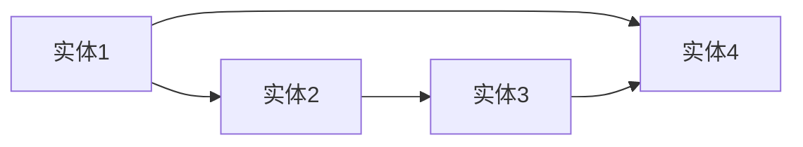
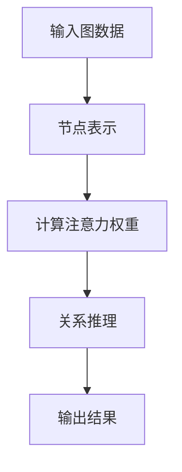
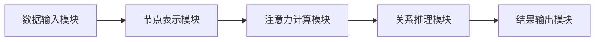
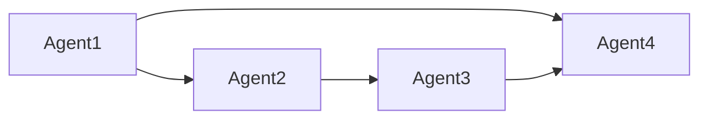

                 


# 基于图注意力网络的AI Agent关系推理

> 关键词：图注意力网络、AI Agent、关系推理、深度学习、图神经网络

> 摘要：本文将详细探讨如何利用图注意力网络（GAT）来实现AI Agent之间的关系推理。通过分析图注意力网络的核心原理、算法实现及其在关系推理中的应用，结合实际项目案例，深入讲解如何构建高效的AI Agent关系推理系统。文章内容涵盖从理论基础到实践应用的各个方面，旨在为读者提供一份全面的技术指南。

---

## 第一部分: 基于图注意力网络的AI Agent关系推理背景介绍

### 第1章: 问题背景与描述

#### 1.1 问题背景

AI Agent（智能体）在现代人工智能系统中扮演着越来越重要的角色。AI Agent能够通过感知环境、推理关系、做出决策并执行动作，从而实现复杂任务的自动处理。然而，AI Agent之间的关系推理仍然是一个具有挑战性的任务，尤其是在处理复杂动态环境和大规模数据时。

传统的基于规则的关系推理方法存在以下问题：
- 规则的制定复杂且难以覆盖所有可能的场景。
- 难以处理动态变化的环境和实时数据。
- 无法高效处理大规模数据，尤其是在多智能体交互的场景中。

图注意力网络（Graph Attention Network, GAT）作为一种结合了图结构数据和注意力机制的深度学习模型，能够有效地捕捉数据中的全局依赖关系，非常适合用于AI Agent之间的关系推理。

#### 1.2 问题描述

AI Agent关系推理的目标是通过分析多个AI Agent之间的交互行为、意图和状态，推断出它们之间的关系。例如，在多智能体协作任务中，AI Agent需要理解彼此的动作和意图，以便更好地协同工作。

图注意力网络在AI Agent关系推理中的应用可以分为以下几个方面：
1. **行为建模**：通过图结构数据表示AI Agent的行为和动作。
2. **意图推理**：利用注意力机制捕捉AI Agent之间的意图关联。
3. **关系建模**：构建AI Agent之间的关系图，推理出它们之间的关系类型（如协作、竞争等）。

#### 1.3 问题解决与边界

通过引入图注意力网络，可以有效解决以下问题：
- 处理大规模图结构数据，捕捉全局依赖关系。
- 自动学习AI Agent之间的关系，减少人工规则的依赖。
- 实现实时推理，适应动态变化的环境。

问题的边界包括：
- 限定于基于图结构数据的关系推理。
- 主要针对AI Agent之间的协作关系，暂不考虑复杂的对抗关系。
- 适用于静态和动态图结构数据的推理。

#### 1.4 概念结构与核心要素

AI Agent关系推理的核心要素包括：
- **实体**：AI Agent、环境、动作、意图等。
- **关系**：实体之间的关联，如协作、竞争、依赖等。
- **图结构**：将实体及其关系表示为图结构数据。
- **注意力机制**：用于捕捉实体之间的全局依赖关系。

---

## 第二部分: 图注意力网络与关系推理的核心概念

### 第2章: 核心概念与联系

#### 2.1 图注意力网络的原理

图注意力网络通过在图结构数据上引入注意力机制，能够有效地捕捉节点之间的全局依赖关系。其核心步骤包括：
1. **节点表示**：将图中的节点映射到低维向量空间。
2. **注意力计算**：通过注意力机制计算节点之间的关联权重。
3. **关系推理**：基于注意力权重，推断节点之间的关系。

图注意力网络的数学模型如下：

$$
\text{softmax}(\frac{q^T K}{\sqrt{d}})
$$

其中，$q$ 是查询向量，$K$ 是键向量，$d$ 是向量维度。

#### 2.2 关系推理的基本原理

关系推理的目标是通过分析图结构数据，推断出节点之间的关系类型。其核心步骤包括：
1. **特征提取**：从图中提取节点的特征向量。
2. **关系建模**：通过注意力机制建模节点之间的关系。
3. **关系分类**：基于节点的特征和关系权重，分类节点之间的关系类型。

#### 2.3 图注意力网络与关系推理的对比分析

以下是图注意力网络与传统关系推理方法的对比分析：

| 对比维度 | 图注意力网络 | 传统关系推理 |
|----------|--------------|--------------|
| 数据类型  | 图结构数据    | 结构化数据    |
| 处理能力  | 能捕捉全局依赖关系 | 依赖人工规则 | 
| 灵活性    | 高            | 低            |
| 计算效率  | 中等          | 低            |

#### 2.4 ER实体关系图架构

ER实体关系图是一种用于表示实体及其关系的图结构模型。以下是ER实体关系图的Mermaid流程图：



---

## 第三部分: 图注意力网络的算法原理

### 第3章: 图注意力网络的算法流程

#### 3.1 图注意力网络的算法步骤

以下是图注意力网络的算法流程：



#### 3.2 图注意力网络的Python实现

以下是图注意力网络的核心代码实现：

```python
import torch
import torch.nn as nn
import torch.nn.functional as F

class GATLayer(nn.Module):
    def __init__(self, in_features, out_features):
        super(GATLayer, self).__init__()
        self.w_q = nn.Linear(in_features, out_features)
        self.w_k = nn.Linear(in_features, out_features)
        self.w_v = nn.Linear(in_features, out_features)
    
    def forward(self, x, adj):
        q = self.w_q(x)
        k = self.w_k(x)
        v = self.w_v(x)
        
        attention = F.softmax((q @ k.T) / torch.sqrt(torch.tensor(x.shape[1], dtype=torch.float)), dim=-1)
        output = (attention @ v)
        return output

class GAT(nn.Module):
    def __init__(self, input_dim, hidden_dim, output_dim):
        super(GAT, self).__init__()
        self.gat_layer = GATLayer(input_dim, hidden_dim)
        self.fc = nn.Linear(hidden_dim, output_dim)
    
    def forward(self, x, adj):
        output = self.gat_layer(x, adj)
        output = self.fc(output)
        return output
```

#### 3.3 图注意力网络的数学模型

图注意力网络的数学模型如下：

$$
\text{softmax}(\frac{q^T K}{\sqrt{d}}) @ V
$$

其中，$q$ 是查询向量，$K$ 是键向量，$V$ 是值向量，$d$ 是向量维度。

---

## 第四部分: 系统分析与架构设计

### 第4章: 系统功能设计

#### 4.1 问题场景介绍

本项目旨在构建一个基于图注意力网络的AI Agent关系推理系统，用于分析多个AI Agent之间的交互行为和意图，推断它们之间的关系类型。

#### 4.2 系统功能设计

以下是系统的功能模块设计：

- **数据输入模块**：接收图结构数据。
- **节点表示模块**：将节点映射到低维向量空间。
- **注意力计算模块**：计算节点之间的注意力权重。
- **关系推理模块**：基于注意力权重，推断节点之间的关系类型。
- **结果输出模块**：输出推理结果。

#### 4.3 系统架构设计

以下是系统的架构设计：



---

## 第五部分: 项目实战

### 第5章: 项目实战

#### 5.1 环境安装

以下是项目所需的环境依赖：

- Python 3.6+
- PyTorch 1.8+
- Mermaid图生成工具

#### 5.2 系统核心实现

以下是项目的实现代码：

```python
import torch
import torch.nn as nn
import torch.nn.functional as F

class GATLayer(nn.Module):
    def __init__(self, in_features, out_features):
        super(GATLayer, self).__init__()
        self.w_q = nn.Linear(in_features, out_features)
        self.w_k = nn.Linear(in_features, out_features)
        self.w_v = nn.Linear(in_features, out_features)
    
    def forward(self, x, adj):
        q = self.w_q(x)
        k = self.w_k(x)
        v = self.w_v(x)
        
        attention = F.softmax((q @ k.T) / torch.sqrt(torch.tensor(x.shape[1], dtype=torch.float)), dim=-1)
        output = (attention @ v)
        return output

class GAT(nn.Module):
    def __init__(self, input_dim, hidden_dim, output_dim):
        super(GAT, self).__init__()
        self.gat_layer = GATLayer(input_dim, hidden_dim)
        self.fc = nn.Linear(hidden_dim, output_dim)
    
    def forward(self, x, adj):
        output = self.gat_layer(x, adj)
        output = self.fc(output)
        return output

# 示例代码
x = torch.randn(4, 3)
adj = torch.randn(4, 4)
model = GAT(3, 64, 1)
output = model(x, adj)
print(output)
```

#### 5.3 实际案例分析

以下是一个实际案例分析：

假设我们有四个AI Agent，它们在社交网络中的关系如下：



通过图注意力网络，我们可以推断出Agent1与Agent2之间的关系，Agent2与Agent3之间的关系，以及Agent1与Agent4之间的关系。

---

## 第六部分: 最佳实践与小结

### 第6章: 最佳实践

#### 6.1 小结

本文详细探讨了基于图注意力网络的AI Agent关系推理的理论与实践。通过分析图注意力网络的核心原理、算法实现及其在关系推理中的应用，结合实际项目案例，为读者提供了一份全面的技术指南。

#### 6.2 注意事项

- 在实际应用中，需要注意数据的预处理和特征提取。
- 需要根据具体场景调整模型的超参数。
- 注意模型的可解释性问题。

#### 6.3 拓展阅读

- 《Graph Attention Networks》
- 《Attention Is All You Need》
- 《Graph Neural Networks: A Review of the State of the Art》

---

**作者：AI天才研究院 & 禅与计算机程序设计艺术**

