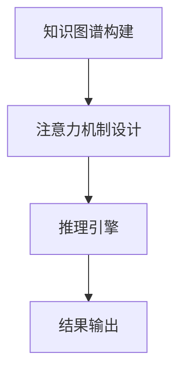
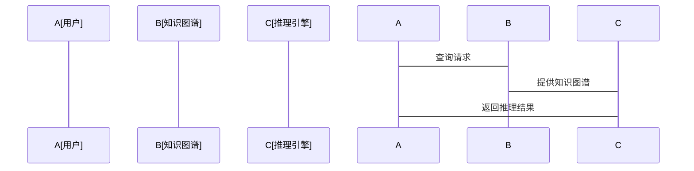

                 


# 基于图注意力网络的AI Agent知识推理

> 关键词：图注意力网络，AI Agent，知识推理，图神经网络，注意力机制

> 摘要：本文详细探讨了基于图注意力网络的AI Agent知识推理技术，从问题背景、核心概念、算法原理到系统设计和项目实战，全面解析了这一前沿技术的实现细节和应用场景。通过本文，读者将能够深入了解图注意力网络在AI Agent知识推理中的作用，掌握其算法原理和系统设计方法，并通过实际案例掌握其实现技巧。

---

# 第1章: 问题背景与核心概念

## 1.1 问题背景

### 1.1.1 知识推理的定义与重要性
知识推理是人工智能领域的核心任务之一，旨在通过已有知识库中的信息，推断出新的知识或答案。传统的知识推理方法通常基于规则或逻辑推理，但其效率和准确性在复杂场景下受到限制。

### 1.1.2 图注意力网络的提出背景
随着图神经网络的发展，图注意力网络（Graph Attention Network, GAT）作为一种结合了图结构和注意力机制的模型，能够有效处理图数据中的全局依赖关系，成为知识推理领域的重要工具。

### 1.1.3 AI Agent在知识推理中的作用
AI Agent作为智能体，需要在动态环境中实时处理信息并做出决策。知识推理能力是AI Agent的核心能力之一，能够帮助其更好地理解复杂场景并做出合理决策。

---

## 1.2 核心概念与问题描述

### 1.2.1 图注意力网络的核心概念
图注意力网络是一种基于图结构的深度学习模型，通过注意力机制捕捉图中节点之间的全局依赖关系，从而提高模型的表达能力。

### 1.2.2 AI Agent的知识推理需求
AI Agent需要在动态知识图谱中进行实时推理，解决复杂问题并做出决策。传统的基于规则的推理方法效率低下，难以应对大规模数据和复杂场景。

### 1.2.3 问题的边界与外延
本文关注基于图注意力网络的AI Agent知识推理问题，重点研究如何通过图注意力机制提升知识推理的效率和准确性。

---

## 1.3 核心概念的结构与组成

### 1.3.1 图注意力网络的组成要素
图注意力网络由图结构、注意力机制和节点表示更新模块组成。其核心思想是通过注意力权重计算节点之间的关系，并基于这些关系更新节点表示。

### 1.3.2 AI Agent的知识推理模型
AI Agent的知识推理模型通常包括知识图谱构建、注意力机制设计和推理过程优化三个部分。

### 1.3.3 核心概念的关联关系
通过图注意力网络，AI Agent能够从知识图谱中提取关键信息，从而实现高效的知识推理。

---

## 1.4 本章小结
本章从问题背景出发，详细介绍了图注意力网络和AI Agent知识推理的核心概念，为后续内容奠定了基础。

---

# 第2章: 图注意力网络与AI Agent的核心原理

## 2.1 图注意力网络的原理

### 2.1.1 图注意力网络的基本结构
图注意力网络由图结构、注意力权重计算模块和节点表示更新模块组成。其基本流程如下：

1. 输入图结构数据（节点和边）。
2. 计算节点之间的注意力权重。
3. 基于注意力权重更新节点表示。

### 2.1.2 注意力机制在图中的应用
注意力机制通过计算节点之间的权重，捕捉图中重要的全局依赖关系。其核心公式为：
$$
\alpha_{ij} = \text{softmax}(e^{(i,j)})
$$

其中，$\alpha_{ij}$表示节点$i$和$j$之间的注意力权重。

### 2.1.3 图注意力网络的数学模型
图注意力网络的节点表示更新公式为：
$$
h_i^{(new)} = \sum_{j} \alpha_{ij} h_j
$$

---

## 2.2 AI Agent的知识推理机制

### 2.2.1 知识图谱的构建与表示
知识图谱通过实体和关系构建，节点表示通常采用嵌入向量。

### 2.2.2 基于图注意力网络的知识推理
AI Agent通过图注意力网络在知识图谱中进行推理，获取所需答案或决策。

### 2.2.3 AI Agent的推理过程
推理过程包括知识图谱构建、注意力权重计算和结果输出三个阶段。

---

## 2.3 核心概念的对比分析

### 2.3.1 图注意力网络与传统注意力机制的对比
图注意力网络结合了图结构，能够捕捉全局依赖关系，而传统注意力机制仅关注局部信息。

### 2.3.2 AI Agent与传统知识推理方法的对比
AI Agent能够实时推理并做出决策，而传统方法效率低下且缺乏动态性。

### 2.3.3 核心概念的特征对比表格
下表对比了图注意力网络和传统注意力机制的核心特征：

| 特征         | 图注意力网络 | 传统注意力机制 |
|--------------|--------------|----------------|
| 数据类型      | 图结构数据    | 序列数据        |
| 全局依赖      | 支持          | 部分支持        |
| 表达能力      | 更强          | 较弱            |

---

## 2.4 本章小结
本章详细介绍了图注意力网络和AI Agent知识推理的核心原理，并通过对比分析明确了其优势。

---

# 第3章: 图注意力网络的算法原理

## 3.1 图注意力网络的算法流程

### 3.1.1 图结构的输入处理
输入包括节点特征和边信息，通常以邻接矩阵形式表示。

### 3.1.2 注意力权重的计算
通过注意力机制计算节点之间的权重，公式如下：
$$
\alpha_{ij} = \text{softmax}(e^{(i,j)})
$$

### 3.1.3 节点表示的更新与聚合
基于注意力权重更新节点表示：
$$
h_i^{(new)} = \sum_{j} \alpha_{ij} h_j
$$

---

## 3.2 图注意力网络的数学模型

### 3.2.1 模型结构
图注意力网络由以下模块组成：
1. 输入层：处理原始数据。
2. 注意力层：计算注意力权重。
3. 更新层：基于注意力权重更新节点表示。

### 3.2.2 损失函数
通常采用交叉熵损失函数：
$$
\mathcal{L} = -\sum_{i} y_i \log p(y_i)
$$

---

## 3.3 图注意力网络的实现步骤

### 3.3.1 环境安装
安装必要的库：
```bash
pip install torch
pip install numpy
pip install matplotlib
```

### 3.3.2 代码实现
以下是图注意力网络的核心代码：
```python
import torch
import torch.nn as nn
import torch.nn.functional as F

class GATLayer(nn.Module):
    def __init__(self, in_dim, out_dim):
        super(GATLayer, self).__init__()
        self.W = nn.Parameter(torch.randn(in_dim, out_dim))
        self.a = nn.Parameter(torch.randn(1, out_dim))
    
    def forward(self, x, adj):
        h = F.relu(x @ self.W)
        attention = F.softmax(h @ self.a, dim=1)
        output = torch.bmm(attention, h.unsqueeze(2)).squeeze(2)
        return output

class GAT(nn.Module):
    def __init__(self, input_dim, hidden_dim, output_dim):
        super(GAT, self).__init__()
        self.layer1 = GATLayer(input_dim, hidden_dim)
        self.layer2 = GATLayer(hidden_dim, output_dim)
    
    def forward(self, x, adj):
        h1 = self.layer1(x, adj)
        output = self.layer2(h1, adj)
        return output
```

### 3.3.3 案例分析
以药物相互作用预测为例，输入为药物-疾病关系图，输出为预测结果。

---

## 3.4 本章小结
本章详细介绍了图注意力网络的算法原理，并通过代码实现和案例分析展示了其实现过程。

---

# 第4章: 基于图注意力网络的AI Agent系统设计

## 4.1 系统架构设计

### 4.1.1 系统功能模块
AI Agent系统包括知识图谱构建、注意力机制设计和推理引擎三个模块。

### 4.1.2 系统架构图


### 4.1.3 接口设计
系统主要接口包括：
1. 输入接口：接收知识图谱数据。
2. 输出接口：返回推理结果。

---

## 4.2 交互流程设计

### 4.2.1 交互流程图


### 4.2.2 交互流程说明
用户发起查询请求，系统通过知识图谱构建和推理引擎输出结果。

---

## 4.3 本章小结
本章详细描述了基于图注意力网络的AI Agent系统设计，并通过架构图和交互流程图展示了其实现过程。

---

# 第5章: 项目实战与优化

## 5.1 环境安装与配置

### 5.1.1 安装依赖
```bash
pip install torch
pip install numpy
pip install matplotlib
pip install networkx
```

---

## 5.2 系统实现

### 5.2.1 知识图谱构建
使用NetworkX构建知识图谱：
```python
import networkx as nx
G = nx.Graph()
G.add_nodes_from(["Drug1", "Drug2", "Disease1"])
G.add_edges_from([("Drug1", "Disease1"), ("Drug2", "Disease1")])
```

### 5.2.2 图注意力网络实现
基于PyTorch实现图注意力网络：
```python
class GAT(nn.Module):
    def __init__(self, input_dim, hidden_dim, output_dim):
        super(GAT, self).__init__()
        self.layer1 = GATLayer(input_dim, hidden_dim)
        self.layer2 = GATLayer(hidden_dim, output_dim)
    
    def forward(self, x, adj):
        h1 = self.layer1(x, adj)
        output = self.layer2(h1, adj)
        return output
```

### 5.2.3 模型训练
定义损失函数并进行训练：
```python
criterion = nn.CrossEntropyLoss()
optimizer = torch.optim.Adam(model.parameters(), lr=0.001)
for epoch in range(num_epochs):
    outputs = model(x, adj)
    loss = criterion(outputs, labels)
    optimizer.zero_grad()
    loss.backward()
    optimizer.step()
```

---

## 5.3 案例分析与优化

### 5.3.1 案例分析
以药物相互作用预测为例，训练模型并进行推理。

### 5.3.2 模型优化
通过调整注意力机制和优化网络结构提升模型性能。

---

## 5.4 本章小结
本章通过项目实战展示了基于图注意力网络的AI Agent知识推理技术的实现过程，并通过优化提升模型性能。

---

# 第6章: 总结与展望

## 6.1 总结
本文详细探讨了基于图注意力网络的AI Agent知识推理技术，从算法原理到系统设计再到项目实战，全面解析了这一技术的核心内容。

## 6.2 未来展望
未来的研究方向包括：
1. 提升模型的可解释性。
2. 优化计算效率。
3. 拓展更多应用场景。

---

# 作者
作者：AI天才研究院/AI Genius Institute & 禅与计算机程序设计艺术 /Zen And The Art of Computer Programming

