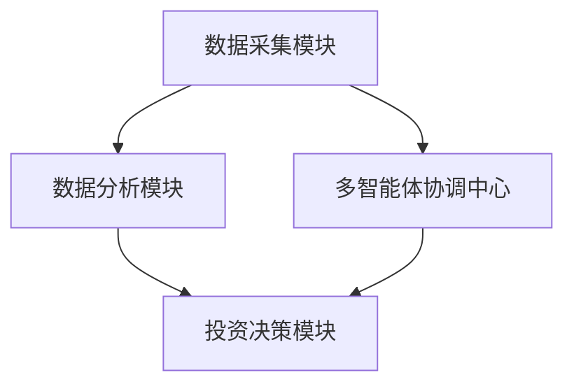
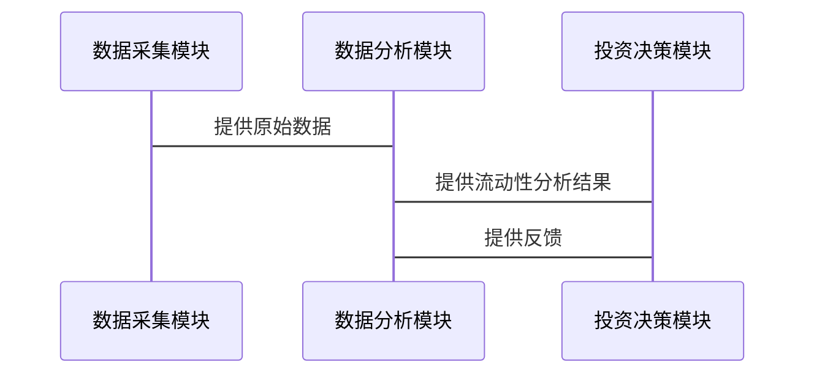

                 


# 基于多智能体的动态市场流动性分析在价值投资中的应用

> 关键词：多智能体系统，动态市场流动性，价值投资，算法原理，系统架构

> 摘要：本文探讨了基于多智能体的动态市场流动性分析在价值投资中的应用。通过分析多智能体系统的原理、动态流动性分析的方法，以及两者的结合在价值投资中的实际应用，本文旨在为投资者提供一种新的视角和工具来理解和优化投资决策。本文从背景介绍、核心概念、算法原理、数学模型、系统架构到项目实战，全面系统地阐述了这一主题。

---

## 第1章: 金融市场的流动性挑战与多智能体解决方案

### 1.1 问题背景

#### 1.1.1 多智能体系统的定义与特点
- **多智能体系统**：由多个智能体组成的分布式系统，每个智能体能够感知环境、自主决策并协作完成复杂任务。
- **特点**：去中心化、协作性、适应性、实时性。

#### 1.1.2 动态市场流动性分析的必要性
- **流动性**：市场中资产的买卖难度，影响资产价格和交易成本。
- **动态性**：市场环境不断变化，传统的静态分析方法难以应对实时波动。
- **必要性**：实时分析流动性变化，帮助投资者捕捉市场机会和规避风险。

#### 1.1.3 价值投资中的流动性挑战
- **价值投资**：基于资产的内在价值进行长期投资。
- **流动性挑战**：高流动性资产价格波动大，低流动性资产变现难，如何平衡流动性与价值成为关键。

### 1.2 核心概念与问题描述

#### 1.2.1 多智能体系统在金融市场中的应用
- **数据采集**：智能体实时采集市场数据。
- **协同分析**：多个智能体协作完成复杂分析任务。
- **动态决策**：基于实时数据快速调整策略。

#### 1.2.2 动态市场流动性分析的定义与目标
- **定义**：实时分析市场流动性变化，预测未来流动性趋势。
- **目标**：为投资者提供流动性风险评估和交易机会。

#### 1.2.3 价值投资中的流动性与价格关系
- **流动性对价格的影响**：高流动性资产价格波动小，低流动性资产价格波动大。
- **价值投资的策略调整**：根据流动性变化优化资产配置。

---

## 第2章: 多智能体系统与动态流动性分析的核心原理

### 2.1 多智能体系统的原理

#### 2.1.1 多智能体系统的组成与功能
- **智能体**：独立决策的个体，能够感知环境、处理信息、做出决策。
- **通信机制**：智能体之间的信息传递和协作。
- **任务分配**：根据市场变化动态分配任务。

#### 2.1.2 多智能体系统的通信机制
- **直接通信**：智能体之间直接传递信息。
- **间接通信**：通过共享数据库或中间件传递信息。

#### 2.1.3 多智能体系统的协调与决策
- **协调算法**：基于博弈论的协调方法。
- **决策模型**：基于市场数据的决策模型。

### 2.2 动态市场流动性分析的原理

#### 2.2.1 市场流动性的影响因素
- **市场深度**：市场参与者数量和交易量。
- **市场波动性**：资产价格波动对流动性的影响。
- **市场参与者行为**：投资者情绪和交易策略。

#### 2.2.2 动态流动性分析的模型与方法
- **时间序列分析**：ARIMA模型、GARCH模型。
- **机器学习方法**：LSTM神经网络、随机森林。

#### 2.2.3 动态流动性分析的实时性与准确性
- **实时性**：分析必须快速响应市场变化。
- **准确性**：模型需要准确预测流动性变化。

---

## 第3章: 多智能体系统与动态流动性分析的算法原理

### 3.1 多智能体系统的协调算法

#### 3.1.1 基于博弈论的多智能体协调
- **博弈论模型**：纳什均衡、囚徒困境。
- **协调机制**：基于博弈论的决策优化。

#### 3.1.2 分布式协调算法
- **分布式协调**：基于局部信息的协调方法。
- **算法实现**：基于消息传递的协调算法。

#### 3.1.3 聚合算法与一致性算法
- **聚合算法**：将多个智能体的决策聚合为一个结果。
- **一致性算法**：确保智能体之间的决策一致性。

### 3.2 动态流动性预测的算法

#### 3.2.1 时间序列分析方法
- **ARIMA模型**：自回归积分滑动模型。
- **GARCH模型**：广义自回归条件异方差模型。

#### 3.2.2 机器学习预测模型
- **LSTM网络**：长短期记忆网络，适合时间序列预测。
- **随机森林**：基于树的集成方法，适合特征工程。

#### 3.2.3 基于多智能体的动态预测
- **多智能体协作预测**：多个智能体协同完成预测任务。
- **预测结果优化**：通过多智能体协作优化预测结果。

---

## 第4章: 动态市场流动性分析的数学模型与公式

### 4.1 市场流动性影响因素的数学模型

#### 4.1.1 市场深度与流动性的关系
- **市场深度模型**：$D = \sum_{i=1}^{n} p_i q_i$，其中$p_i$为价格，$q_i$为数量。
- **流动性影响模型**：$L = kD$，其中$k$为流动性常数。

#### 4.1.2 市场波动性与流动性的关系
- **波动性模型**：$\sigma^2 = \sum_{i=1}^{n} (r_i - \mu)^2 p_i$，其中$r_i$为收益，$\mu$为均值，$p_i$为权重。
- **流动性与波动性关系模型**：$L = \frac{1}{\sigma}$。

#### 4.1.3 市场参与者行为的数学建模
- **投资者行为模型**：基于效用函数的决策模型。
- **交易行为模型**：基于订单流的交易模型。

### 4.2 动态流动性预测的数学公式

#### 4.2.1 时间序列预测模型
- **ARIMA模型**：$y_t = \phi y_{t-1} + \theta \epsilon_{t-1} + \epsilon_t$。
- **GARCH模型**：$\sigma_t^2 = \alpha \epsilon_{t-1}^2 + \beta \sigma_{t-1}^2$。

#### 4.2.2 机器学习模型的数学表达
- **LSTM网络**：通过门控机制捕捉时间依赖性。
- **随机森林**：基于决策树的集成模型。

#### 4.2.3 多智能体预测模型的数学推导
- **多智能体预测模型**：$P(y) = \sum_{i=1}^{n} w_i P_i(y)$，其中$w_i$为权重，$P_i(y)$为第$i$个智能体的预测。

---

## 第5章: 系统分析与架构设计

### 5.1 项目背景与目标

#### 5.1.1 项目背景
- **市场流动性分析需求**：实时分析市场流动性变化。
- **多智能体技术的应用**：利用多智能体技术提升分析效率和准确性。

#### 5.1.2 项目目标
- **目标1**：构建多智能体系统，实时分析市场流动性。
- **目标2**：将分析结果应用于价值投资决策。

### 5.2 系统功能设计

#### 5.2.1 数据采集模块
- **功能**：实时采集市场数据。
- **输入**：市场数据接口。
- **输出**：原始数据流。

#### 5.2.2 数据分析模块
- **功能**：分析市场流动性。
- **输入**：原始数据流。
- **输出**：流动性分析结果。

#### 5.2.3 投资决策模块
- **功能**：基于流动性分析结果做出投资决策。
- **输入**：流动性分析结果。
- **输出**：投资策略。

### 5.3 系统架构设计

#### 5.3.1 系统架构图


#### 5.3.2 系统接口设计
- **接口1**：数据采集模块接口。
- **接口2**：数据分析模块接口。
- **接口3**：投资决策模块接口。

#### 5.3.3 系统交互流程


---

## 第6章: 项目实战与案例分析

### 6.1 环境安装与配置

#### 6.1.1 环境需求
- **操作系统**：Linux或Windows。
- **编程语言**：Python 3.8及以上。
- **库依赖**：numpy、pandas、keras、tensorflow。

#### 6.1.2 安装步骤
```bash
pip install numpy pandas keras tensorflow
```

### 6.2 核心代码实现

#### 6.2.1 数据采集模块
```python
import pandas as pd
import requests

def fetch_market_data(symbol):
    url = f"https://api.example.com/{symbol}"
    response = requests.get(url)
    data = response.json()
    return pd.DataFrame(data)
```

#### 6.2.2 数据分析模块
```python
from keras.models import Sequential
from keras.layers import LSTM, Dense

model = Sequential()
model.add(LSTM(50, input_shape=(1, 1)))
model.add(Dense(1))
model.compile(optimizer='adam', loss='mean_squared_error')
model.fit(X_train, y_train, epochs=100, batch_size=32)
```

#### 6.2.3 投资决策模块
```python
def make_investment_decision(liquidity_analysis):
    if liquidity_analysis['high']:
        return '买入'
    elif liquidity_analysis['low']:
        return '卖出'
    else:
        return '持有'
```

### 6.3 实际案例分析

#### 6.3.1 案例背景
- **资产选择**：某股票的历史数据。
- **流动性分析**：实时分析股票流动性。
- **投资决策**：基于流动性分析结果做出买入、卖出或持有决策。

#### 6.3.2 案例分析
```python
# 数据采集
data = fetch_market_data('股票代码')

# 数据分析
analysis = model.predict(data)

# 投资决策
decision = make_investment_decision(analysis)
```

### 6.4 项目小结

#### 6.4.1 项目总结
- **成功之处**：实现了多智能体系统的实时流动性分析。
- **不足之处**：模型精度有待提高，实际应用中需要考虑更多因素。

#### 6.4.2 项目展望
- **未来改进方向**：引入更复杂的模型，如Transformer。
- **扩展应用**：应用于更多金融资产。

---

## 第7章: 总结与展望

### 7.1 总结

#### 7.1.1 核心观点回顾
- 多智能体系统在金融市场中的重要性。
- 动态流动性分析的必要性。
- 两者的结合在价值投资中的应用。

#### 7.1.2 主要结论
- 多智能体系统能够有效提升市场流动性分析的效率和准确性。
- 动态流动性分析为价值投资提供了新的视角和工具。

### 7.2 展望

#### 7.2.1 研究局限性
- 模型的复杂性和计算成本。
- 数据质量和实时性问题。

#### 7.2.2 未来研究方向
- 更复杂的多智能体协作算法。
- 结合其他金融数据源的分析。
- 更先进的机器学习模型的应用。

---

## 作者信息

作者：AI天才研究院/AI Genius Institute & 禅与计算机程序设计艺术 /Zen And The Art of Computer Programming

