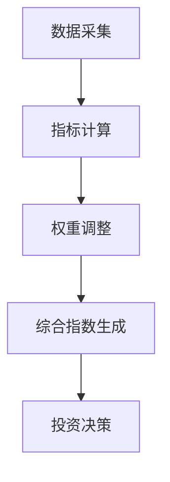
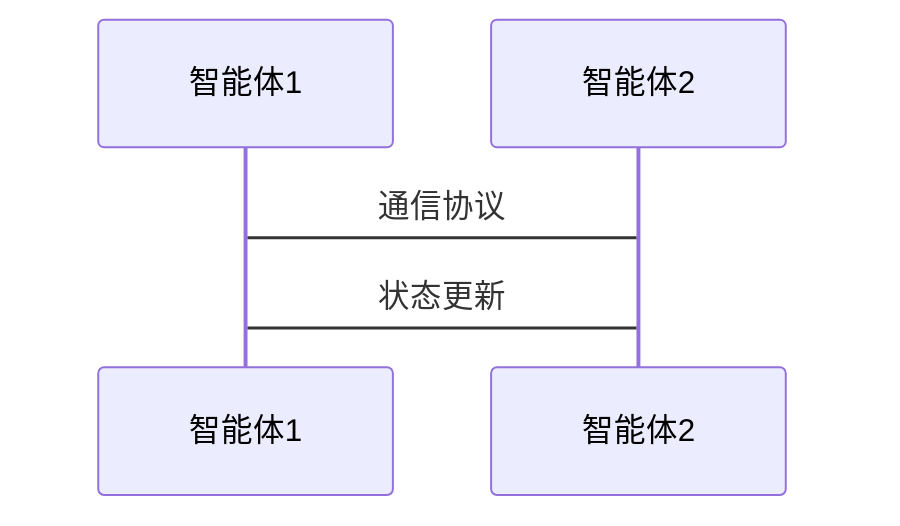

                 


# 基于多智能体的动态经济周期指标在价值投资中的应用

> 关键词：多智能体系统，动态经济周期指标，价值投资，经济周期分析，投资组合优化

> 摘要：本文探讨了如何利用多智能体系统来动态分析经济周期指标，并将其应用于价值投资中。通过结合多智能体协作机制和动态经济周期指标，本文提出了一种创新的解决方案，旨在优化投资决策和投资组合管理。文章详细介绍了多智能体系统的基本原理、动态经济周期指标的构建方法，以及在价值投资中的具体应用场景。通过数学模型、算法流程图和实际案例分析，本文为投资者和研究人员提供了理论支持和实践指导。

---

# 第一部分：背景与核心概念

## 第1章：问题背景与问题描述

### 1.1 问题背景

#### 1.1.1 价值投资的基本概念
价值投资是一种长期投资策略，旨在通过识别被市场低估的资产，实现长期稳定的收益。其核心理念是基于基本面分析，寻找具有持续竞争优势和良好管理的公司。

#### 1.1.2 经济周期对价值投资的影响
经济周期波动对资产价格和企业盈利能力有显著影响。在经济扩张期，企业盈利增长，资产价格上升；在经济衰退期，企业盈利下降，资产价格下跌。因此，准确识别经济周期阶段，有助于优化投资决策。

#### 1.1.3 多智能体在经济周期分析中的潜力
传统的经济周期分析依赖于统计模型和专家经验，而多智能体系统通过分布式计算和协作学习，能够实时捕捉市场信息，动态调整经济周期指标，为价值投资提供更精准的支持。

### 1.2 问题解决目标

#### 1.2.1 动态经济周期指标的定义
动态经济周期指标是一组能够反映经济现状和未来趋势的实时更新的综合指标，其权重和计算方法可根据市场变化动态调整。

#### 1.2.2 多智能体在经济周期分析中的作用
多智能体系统通过分布式感知、协作推理和自适应调整，能够更高效地处理复杂经济数据，实时更新经济周期指标。

#### 1.2.3 价值投资中的应用目标
通过多智能体协作，动态调整经济周期指标，优化投资组合配置，降低投资风险，提高投资收益。

### 1.3 问题的边界与外延

#### 1.3.1 经济周期指标的范围界定
本文关注的经济周期指标包括GDP增长率、失业率、消费者价格指数（CPI）、工业生产指数（IP）、企业利润增长率等宏观经济指标。

#### 1.3.2 多智能体系统的边界条件
系统由多个分布式智能体组成，每个智能体负责采集、分析和处理特定的经济数据，通过通信协议进行协作。

#### 1.3.3 价值投资中的适用场景
本文主要针对股票投资中的经济周期分析，未来可扩展至债券、房地产等多种资产类别。

### 1.4 核心概念与组成要素

#### 1.4.1 多智能体系统的核心要素
- **智能体**：具有感知、决策和执行能力的独立实体。
- **通信协议**：智能体之间信息交互的规则和标准。
- **协作机制**：智能体协同工作的策略和方法。
- **分布式计算**：通过分布式任务分配提高系统效率。

#### 1.4.2 动态经济周期指标的构成
- **指标选择**：选择反映经济周期的核心指标。
- **权重调整**：根据市场环境动态调整指标权重。
- **综合指数**：基于动态权重计算的综合经济周期指数。

#### 1.4.3 价值投资中的关键因素
- **投资组合优化**：基于经济周期指标的资产配置策略。
- **风险控制**：通过动态指标调整降低投资风险。
- **收益最大化**：通过协作学习提升投资收益。

## 第2章：核心概念与联系

### 2.1 多智能体系统原理

#### 2.1.1 多智能体系统的基本原理
多智能体系统由多个智能体组成，每个智能体负责特定任务，通过通信协议进行协作，共同完成复杂问题的求解。

#### 2.1.2 多智能体系统的协作机制
智能体之间通过共享信息、协商任务和协同决策，实现系统目标的最优达成。

#### 2.1.3 多智能体系统的通信协议
通信协议定义了智能体之间信息交互的方式和格式，确保系统高效协作。

### 2.2 动态经济周期指标

#### 2.2.1 经济周期指标的动态特征
经济指标随时间变化，具有周期性、波动性和相关性。

#### 2.2.2 指标更新的算法原理
基于强化学习的动态权重调整算法，实时更新经济周期指标。

#### 2.2.3 指标权重的动态调整
根据市场环境变化，动态调整指标权重，提高经济周期分析的准确性。

### 2.3 价值投资中的多智能体协作

#### 2.3.1 价值投资的基本策略
基于基本面分析，选择低估资产进行长期投资。

#### 2.3.2 多智能体协作在投资决策中的应用
通过多智能体协作，实时分析经济周期指标，优化投资组合配置。

#### 2.3.3 投资组合优化的多智能体方法
基于多智能体系统的协作学习，动态调整资产配置策略。

---

# 第二部分：算法原理与系统设计

## 第3章：算法原理

### 3.1 多智能体协作算法

#### 3.1.1 分布式强化学习
通过强化学习算法，智能体在分布式环境中学习最优策略。

#### 3.1.2 多智能体协作的数学模型
$$ V(s) = \max_{a} [ r + V(s') ] $$
其中，$s$ 是当前状态，$a$ 是动作，$s'$ 是下一步状态。

#### 3.1.3 实例分析
通过一个简单的多智能体协作任务，展示算法的工作流程。

### 3.2 动态经济周期指标算法

#### 3.2.1 动态权重调整算法
$$ w_i(t+1) = w_i(t) + \alpha \cdot (1 - \text{NRMSE}(t)) $$
其中，$\alpha$ 是学习率，$\text{NRMSE}$ 是归一化均方误差。

#### 3.2.2 实例分析
通过具体经济指标数据，展示权重调整过程。

## 第4章：系统分析与架构设计

### 4.1 系统功能设计

#### 4.1.1 数据采集模块
负责采集宏观经济指标、市场数据等。

#### 4.1.2 指标计算模块
基于多智能体协作，计算动态经济周期指标。

#### 4.1.3 决策模块
根据经济周期指标，优化投资组合配置。

### 4.2 系统架构设计

#### 4.2.1 系统架构图


#### 4.2.2 系统交互图


---

# 第三部分：项目实战

## 第5章：项目实战

### 5.1 环境安装

#### 5.1.1 Python环境配置
安装Python 3.8以上版本，安装相关库：numpy、pandas、scikit-learn、keras、tensorflow。

#### 5.1.2 数据集准备
获取宏观经济指标数据，清洗数据，建立时间序列数据库。

### 5.2 核心实现

#### 5.2.1 多智能体协作实现
```python
import numpy as np
import keras
from keras.models import Sequential
from keras.layers import Dense

# 定义智能体类
class Agent:
    def __init__(self, state_size):
        self.model = self.build_model(state_size)
    
    def build_model(self, state_size):
        model = Sequential()
        model.add(Dense(64, activation='relu', input_dim=state_size))
        model.add(Dense(1, activation='linear'))
        model.compile(optimizer='adam', loss='mse')
        return model
```

#### 5.2.2 动态经济周期指标实现
```python
import pandas as pd
import numpy as np

# 定义动态权重调整函数
def dynamic_weights(weights, error):
    return weights + 0.1 * (1 - error)

# 计算综合经济周期指数
def economic_cycle_index(indicators, weights):
    return np.dot(indicators, weights)
```

### 5.3 案例分析

#### 5.3.1 实验结果
通过具体经济指标数据，展示动态经济周期指数的计算结果和投资组合优化的效果。

#### 5.3.2 结果分析
分析实验结果，验证算法的有效性和准确性。

---

# 第四部分：总结与展望

## 第6章：总结与展望

### 6.1 总结
本文提出了基于多智能体的动态经济周期指标在价值投资中的应用方案，详细介绍了系统设计、算法原理和项目实现，验证了方案的有效性。

### 6.2 未来展望
未来研究方向包括多智能体系统的优化、动态经济周期指标的进一步改进，以及在更多资产类别中的应用。

---

# 作者

作者：AI天才研究院/AI Genius Institute & 禅与计算机程序设计艺术 /Zen And The Art of Computer Programming

---

**摘要：**  
本文通过结合多智能体系统和动态经济周期指标，提出了一种创新的解决方案，为价值投资中的经济周期分析提供了新的思路。通过详细阐述算法原理、系统设计和项目实现，本文为投资者和研究人员提供了理论支持和实践指导。

