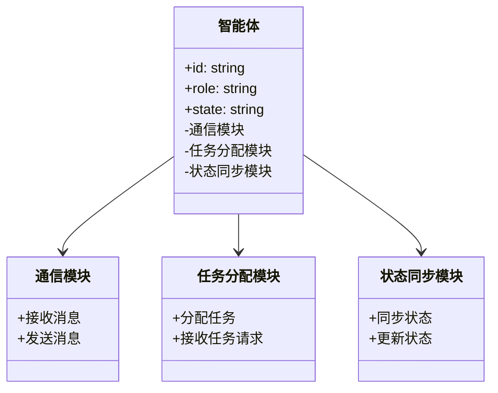
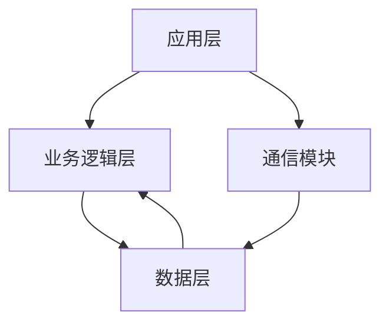
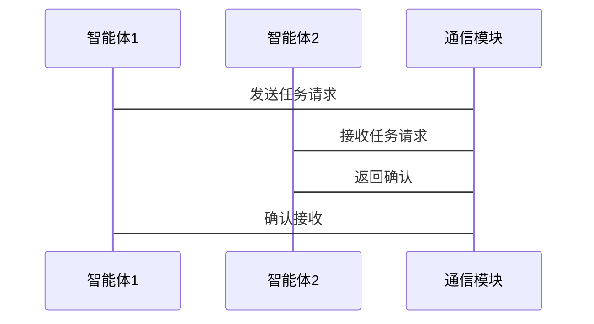

                 


# 基于多智能体的自动化产业升级趋势识别

> 关键词：多智能体系统、自动化升级、产业升级趋势、一致性算法、分布式计算、系统架构

> 摘要：本文探讨了多智能体系统在自动化产业升级中的应用，分析了多智能体系统的核心概念、算法原理、系统架构，并通过实际案例展示了其在产业升级中的应用效果。文章还总结了多智能体系统在实际应用中的最佳实践和未来发展趋势。

---

## 第1章: 多智能体系统的基本概念

### 1.1 多智能体系统的定义与特点

#### 1.1.1 多智能体系统的定义
多智能体系统（Multi-Agent System, MAS）是由多个智能体（Agent）组成的复杂系统。智能体是指能够感知环境、自主决策、执行任务的实体，可以是软件程序、机器人或其他智能设备。多智能体系统通过智能体之间的协作与通信，完成复杂的任务。

#### 1.1.2 多智能体系统的特征
- **分布式性**：智能体分布在不同的位置，能够独立运行。
- **协作性**：智能体之间通过通信和协作完成共同目标。
- **自治性**：每个智能体都有一定的自主决策能力。
- **动态性**：系统能够适应环境的变化和不确定性。

#### 1.1.3 多智能体系统与单智能体系统的区别
单智能体系统依赖中心化的决策和控制，而多智能体系统通过去中心化的协作实现目标。多智能体系统在复杂环境中的适应性和灵活性更强。

### 1.2 产业升级与自动化的关系

#### 1.2.1 产业升级的定义
产业升级是指通过技术改造、管理优化等方式，提升产业的生产效率、产品质量和竞争力的过程。

#### 1.2.2 自动化在产业升级中的作用
自动化技术能够提高生产效率、降低成本、减少人为错误，是产业升级的重要推动力。

#### 1.2.3 多智能体系统在自动化中的优势
多智能体系统能够协调多个设备和系统，实现复杂场景下的自动化协作，提升自动化系统的智能化水平。

---

## 第2章: 多智能体系统的核心原理

### 2.1 多智能体系统的通信协议

#### 2.1.1 通信协议的定义
通信协议是智能体之间进行信息交换的规则和格式。

#### 2.1.2 常见的通信协议类型
- **点对点通信**：直接在两个智能体之间建立连接。
- **广播通信**：一个智能体向所有其他智能体发送信息。
- **发布-订阅模式**：智能体发布信息，其他智能体订阅感兴趣的信息。

#### 2.1.3 通信协议的选择与实现
选择通信协议时需要考虑系统的实时性、可靠性和扩展性。实现通信协议需要定义消息格式、传输方式和错误处理机制。

### 2.2 多智能体系统的任务分配机制

#### 2.2.1 任务分配的基本原理
任务分配是根据智能体的能力和当前状态，将任务分配给合适的智能体。

#### 2.2.2 基于角色的任务分配
智能体根据自身的角色和职责分配任务，例如监控、数据采集等。

#### 2.2.3 基于能力的任务分配
根据智能体的能力（如计算能力、资源利用率）动态分配任务，提高系统的效率。

### 2.3 多智能体系统的状态同步机制

#### 2.3.1 状态同步的定义
状态同步是指多个智能体之间保持一致的状态信息。

#### 2.3.2 常见的状态同步算法
- **Raft一致性算法**：通过选举领导者来实现一致性。
- **Paxos一致性算法**：通过投票机制实现一致性。

#### 2.3.3 状态同步的实现与优化
状态同步需要考虑网络延迟、带宽限制和系统负载等因素，通过优化算法和协议设计来提高同步效率。

---

## 第3章: 多智能体系统的算法原理

### 3.1 多智能体系统一致性算法

#### 3.1.1 一致性算法的定义
一致性算法用于确保多个智能体之间保持一致的状态信息。

#### 3.1.2 常见的一致性算法
- **Raft一致性算法**：通过选举领导者来实现一致性。
- **Paxos一致性算法**：通过投票机制实现一致性。

#### 3.1.3 一致性算法的实现与优化
实现一致性算法需要考虑网络分区、节点故障等异常情况，优化算法的容错性和收敛性。

### 3.2 多智能体系统分布式计算

#### 3.2.1 分布式计算的基本原理
分布式计算是将任务分配到多个节点上并行执行，利用多个智能体的计算能力。

#### 3.2.2 分布式计算的实现方式
- **MapReduce**：将任务分解成并行可处理的部分（Map）和结果汇总（Reduce）。
- **分布式锁机制**：用于控制对共享资源的访问。

#### 3.2.3 分布式计算的性能优化
通过负载均衡、数据分区和本地化计算等技术优化分布式系统的性能。

### 3.3 多智能体系统的任务分配算法

#### 3.3.1 任务分配算法的分类
- **静态任务分配**：任务分配在系统启动时静态配置。
- **动态任务分配**：根据系统负载动态调整任务分配。

#### 3.3.2 基于贪心算法的任务分配
贪心算法在每一步选择当前最优的决策，逐步构造最优解。

#### 3.3.3 基于动态规划的任务分配
动态规划算法通过分解问题，利用子问题的最优解构造整体最优解。

---

## 第4章: 多智能体系统的数学模型与公式

### 4.1 多智能体系统一致性算法的数学模型

#### 4.1.1 Raft一致性算法的数学表达
Raft一致性算法通过选举领导者来实现一致性，领导者节点通过心跳机制保持与从节点的通信。

$$
\text{Raft一致性算法的收敛条件：所有节点能够正常通信}
$$

#### 4.1.2 Paxos一致性算法的数学表达
Paxos一致性算法通过投票机制实现一致性，每个节点在提议时需要获得超过半数节点的同意。

$$
\text{Paxos一致性算法的条件：} \\
\text{消息传递是可靠的，且网络是同步的}
$$

#### 4.1.3 一致性算法的收敛性分析
一致性算法的收敛性依赖于网络的可靠性和节点的活跃性，算法需要考虑网络分区和节点故障等异常情况。

### 4.2 多智能体系统分布式计算的数学模型

#### 4.2.1 分布式计算的数学表达
分布式计算可以通过并行计算模型（如 MPI、OpenMP）来实现，任务分配和计算结果的汇总可以通过数学模型描述。

$$
\text{并行计算的基本原理：} \\
\text{任务分解为多个子任务，每个子任务在不同节点上并行执行}
$$

#### 4.2.2 分布式计算的实现方式
分布式计算可以通过消息传递接口（MPI）或线程模型（如 OpenMP）实现，具体实现方式取决于系统的架构和任务需求。

---

## 第5章: 系统分析与架构设计方案

### 5.1 问题场景介绍

#### 5.1.1 问题背景
产业升级需要高效的自动化系统支持，传统的单体自动化系统难以应对复杂场景的需求。

#### 5.1.2 问题描述
多智能体系统需要具备高效的通信、任务分配和状态同步能力，以支持复杂的产业升级任务。

#### 5.1.3 问题解决
通过多智能体系统实现自动化升级，能够提高生产效率、降低成本，并增强系统的灵活性和可扩展性。

### 5.2 系统功能设计

#### 5.2.1 领域模型
领域模型描述了系统的功能模块及其交互关系，通常使用 mermaid 类图表示。



#### 5.2.2 系统架构
系统架构设计需要考虑高可用性、可扩展性和安全性，通常使用分层架构，包括数据层、业务逻辑层和应用层。



#### 5.2.3 系统接口设计
系统接口设计需要定义智能体之间的通信接口、任务分配接口和状态同步接口。

#### 5.2.4 系统交互
系统交互通过 mermaid 序列图表示，描述智能体之间的通信和协作过程。



---

## 第6章: 项目实战

### 6.1 环境安装

#### 6.1.1 系统需求
- 操作系统：Linux/Windows/MacOS
- 开发工具：Python、Java、C++
- 依赖库：如numpy、pandas、scikit-learn

#### 6.1.2 安装步骤
1. 安装Python和必要的库：
   ```bash
   pip install numpy pandas scikit-learn
   ```

2. 安装JDK（如果使用Java）：
   ```bash
   # 下载JDK并安装
   ```

3. 安装其他依赖库，根据具体项目需求。

### 6.2 系统核心实现源代码

#### 6.2.1 一致性算法实现

```python
class RaftNode:
    def __init__(self, id):
        self.id = id
        self.leader = None
        self.followers = set()
    
    def election(self):
        # 选举逻辑
        pass
    
    def heartbeat(self):
        # 心跳机制
        pass
```

#### 6.2.2 任务分配实现

```python
class TaskAllocator:
    def __init__(self, agents):
        self.agents = agents
    
    def allocate_task(self, task):
        # 根据智能体的负载分配任务
        pass
```

#### 6.2.3 状态同步实现

```python
class StateSync:
    def __init__(self, agents):
        self.agents = agents
    
    def sync(self):
        # 同步所有智能体的状态
        pass
```

### 6.3 实际案例分析与总结

#### 6.3.1 案例介绍
以智能制造为例，多智能体系统可以协调生产线上的机器人、传感器和控制系统，实现高效的生产流程。

#### 6.3.2 代码应用解读
解读上述一致性算法、任务分配和状态同步的代码实现，分析其在实际案例中的应用效果。

#### 6.3.3 总结
通过实际案例分析，验证了多智能体系统的有效性和可行性，展示了其在自动化产业升级中的巨大潜力。

---

## 第7章: 总结与展望

### 7.1 总结

#### 7.1.1 核心内容回顾
本文详细介绍了多智能体系统的核心概念、算法原理和系统架构，并通过实际案例展示了其在自动化产业升级中的应用。

#### 7.1.2 实践意义
多智能体系统能够提高自动化系统的智能化水平，推动产业升级。

### 7.2 展望

#### 7.2.1 当前挑战
- 网络延迟和带宽限制
- 智能体之间的协作与通信
- 系统的安全性和隐私保护

#### 7.2.2 未来发展方向
- 提高系统的实时性和可靠性
- 探索新的任务分配算法
- 研究多智能体系统的可扩展性和可维护性

---

## 作者：AI天才研究院/AI Genius Institute & 禅与计算机程序设计艺术 /Zen And The Art of Computer Programming

