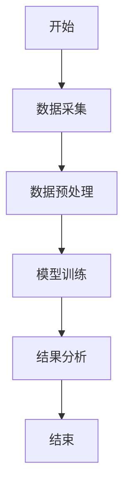
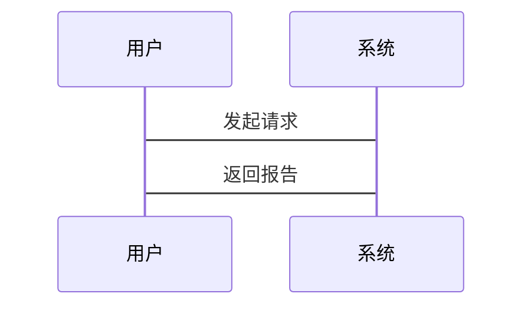

                 


```markdown
# 基于多智能体的自动化产业周期分析

> 关键词：多智能体系统，产业周期分析，协同算法，系统架构设计，自动化分析

> 摘要：本文探讨了基于多智能体的自动化产业周期分析方法，从多智能体系统的基本概念到产业周期分析的背景与意义，再到协同算法的实现和系统架构设计，最后通过项目实战验证了方法的有效性。文章详细分析了多智能体系统在产业周期分析中的应用，展示了其在数据采集、特征提取、模型训练、系统架构设计和项目实现等环节的优势。

---

## 第1章: 多智能体系统与产业周期分析概述

### 1.1 多智能体系统的基本概念

#### 1.1.1 多智能体系统的定义与特点
多智能体系统（Multi-Agent System，MAS）是由多个智能体组成的分布式系统，这些智能体通过协同工作完成特定任务。其特点包括：分布式性、自主性、反应性、社会性、协作性和动态性。

#### 1.1.2 多智能体系统的核心组件
- **智能体**：能够感知环境并采取行动的实体。
- **通信机制**：智能体之间交换信息的方式，如消息传递。
- **协同算法**：智能体协作完成任务的算法，如分布式计算和协商机制。
- **任务分配**：智能体根据自身能力和环境状态分配任务。

#### 1.1.3 多智能体系统在产业周期分析中的应用场景
- 数据采集与处理：智能体负责从不同来源收集产业数据。
- 特征提取：通过协同算法提取影响产业周期的关键特征。
- 预测与决策：基于模型预测产业周期变化并制定决策。

### 1.2 产业周期分析的背景与意义

#### 1.2.1 产业周期的基本概念
产业周期是指产业在经济发展过程中经历的扩张和收缩的周期性变化，通常包括复苏、繁荣、衰退和萧条四个阶段。

#### 1.2.2 产业周期分析的重要性
- 为企业制定战略提供依据。
- 帮助政府制定宏观调控政策。
- 为投资者提供投资决策参考。

#### 1.2.3 自动化产业周期分析的必要性
- 提高分析效率：多智能体系统能够快速处理大量数据。
- 增强分析精度：通过协同算法优化预测模型。
- 实现实时监控：动态调整分析结果以适应市场变化。

### 1.3 多智能体在产业周期分析中的作用

#### 1.3.1 多智能体系统的协同优势
- **分布式计算**：多个智能体同时处理不同数据源，提高计算效率。
- **信息共享**：通过通信机制共享信息，增强分析的全面性。
- **任务分工**：智能体根据自身能力分配任务，提高整体效率。

#### 1.3.2 多智能体在数据采集与处理中的应用
- 数据采集：智能体从不同来源（如数据库、API、爬虫）收集产业数据。
- 数据清洗：智能体协同处理数据中的噪声和异常值。
- 数据预处理：对数据进行标准化和特征提取，为模型训练做好准备。

#### 1.3.3 多智能体在决策支持中的作用
- 预测模型：基于协同算法建立时间序列模型，预测产业周期变化。
- 决策支持：智能体根据预测结果提供决策建议，如投资建议或风险预警。

---

## 第2章: 多智能体系统的核心概念与联系

### 2.1 多智能体系统的实体关系分析

#### 2.1.1 实体关系图（ER图）分析
```mermaid
erDiagram
    customer[客户] {
        id : integer
        name : string
        email : string
    }
    order[订单] {
        id : integer
        order_date : date
        total : float
    }
    customer --> order : 下单
```

#### 2.1.2 实体之间的关系描述
- **客户**：智能体的用户，提供输入数据或请求分析结果。
- **订单**：智能体处理的业务请求，记录数据来源和处理结果。

### 2.2 多智能体系统的通信机制

#### 2.2.1 智能体之间的通信方式
- **同步通信**：智能体之间实时交换信息，如消息队列。
- **异步通信**：智能体在需要时检索信息，如数据库存储。

#### 2.2.2 通信协议的选择与设计
- **HTTP/HTTPS**：适用于分布式系统中智能体之间的通信。
- **WebSocket**：适用于实时通信，如实时数据更新。

### 2.3 多智能体系统的协同算法

#### 2.3.1 协同算法的原理
协同算法通过智能体之间的协商和合作，实现任务分配和结果共享。

#### 2.3.2 协同算法的实现步骤
1. **任务分解**：将整体任务分解为子任务。
2. **任务分配**：智能体根据能力和资源分配子任务。
3. **协同执行**：智能体协同完成子任务，并通过通信机制共享中间结果。
4. **结果整合**：整合各智能体的子结果，形成最终的分析报告。

---

## 第3章: 基于多智能体的产业周期分析算法原理

### 3.1 数据采集与预处理

#### 3.1.1 数据来源与采集方式
- 数据库：结构化数据，如产业产值、企业利润等。
- 网页爬取：非结构化数据，如新闻、评论等。
- API接口：实时数据，如股票价格、市场指数等。

#### 3.1.2 数据清洗与预处理方法
- **去重**：删除重复数据。
- **填充缺失值**：使用均值、中位数或插值法填补缺失值。
- **标准化**：将数据归一化处理，便于模型训练。

### 3.2 产业周期分析的数学模型

#### 3.2.1 产业周期分析的数学公式
$$ y_t = \alpha y_{t-1} + \beta x_t + \epsilon_t $$

其中，$y_t$ 表示当前状态，$y_{t-1}$ 表示上一状态，$x_t$ 表示外部影响，$\epsilon_t$ 表示随机误差。

#### 3.2.2 模型的建立与验证
- **训练集**：用于模型训练。
- **验证集**：用于模型调参。
- **测试集**：用于模型评估。

### 3.3 多智能体协同算法的实现

#### 3.3.1 算法流程图


#### 3.3.2 算法的实现步骤与代码示例
```python
def collect_data():
    # 数据采集逻辑
    pass

def preprocess_data(data):
    # 数据清洗与预处理
    pass

def train_model(data):
    # 模型训练
    pass

def analyze_results(model, data):
    # 结果分析
    pass

if __name__ == "__main__":
    data = collect_data()
    processed_data = preprocess_data(data)
    model = train_model(processed_data)
    analyze_results(model, processed_data)
```

---

## 第4章: 系统分析与架构设计方案

### 4.1 系统功能设计

#### 4.1.1 系统功能模块划分
- 数据采集模块：负责数据的采集与存储。
- 数据处理模块：负责数据的清洗与预处理。
- 模型训练模块：负责训练预测模型。
- 结果分析模块：负责分析预测结果并生成报告。

#### 4.1.2 功能模块的交互流程
1. 数据采集模块将数据传递给数据处理模块。
2. 数据处理模块对数据进行清洗和预处理后，传递给模型训练模块。
3. 模型训练模块训练完成后，将模型传递给结果分析模块。
4. 结果分析模块生成报告并返回给用户。

### 4.2 系统架构设计

#### 4.2.1 系统架构图


#### 4.2.2 模块之间的接口设计
- 数据采集模块与数据处理模块通过队列进行通信。
- 数据处理模块与模型训练模块通过文件共享进行通信。
- 模型训练模块与结果分析模块通过数据库进行通信。

### 4.3 系统交互设计

#### 4.3.1 系统交互流程图


---

## 第5章: 项目实战——基于多智能体的产业周期分析系统实现

### 5.1 环境搭建与工具安装

#### 5.1.1 开发环境的选择
- 操作系统：Linux 或 Windows。
- 开发工具：PyCharm、VS Code。
- 依赖管理工具：pip、virtualenv。

#### 5.1.2 开发工具的安装与配置
```bash
pip install numpy pandas scikit-learn requests
```

### 5.2 核心代码实现

#### 5.2.1 数据采集模块
```python
import requests
from bs4 import BeautifulSoup

def collect_data():
    url = "https://example.com/data"
    response = requests.get(url)
    soup = BeautifulSoup(response.text, 'html.parser')
    data = []
    # 提取数据
    return data
```

#### 5.2.2 数据处理模块
```python
import numpy as np
import pandas as pd

def preprocess_data(data):
    df = pd.DataFrame(data)
    df.drop_duplicates(inplace=True)
    df.fillna(df.mean(), inplace=True)
    return df
```

#### 5.2.3 模型训练模块
```python
from sklearn.linear_model import LinearRegression

def train_model(data):
    X = data.iloc[:, :-1]
    y = data.iloc[:, -1]
    model = LinearRegression()
    model.fit(X, y)
    return model
```

#### 5.2.4 结果分析模块
```python
def analyze_results(model, data):
    predictions = model.predict(data)
    report = {}
    report['accuracy'] = model.score(data, predictions)
    return report
```

### 5.3 案例分析与详细解读

#### 5.3.1 实际案例分析
假设我们有一个制造业数据集，包括产值、利润、员工数量等指标。通过多智能体系统的协同分析，我们预测出未来三个季度的产值变化趋势。

#### 5.3.2 详细解读
- 数据采集：从多个数据库和API获取数据。
- 数据处理：清洗和预处理数据，确保数据质量。
- 模型训练：使用线性回归模型预测产值变化。
- 结果分析：生成报告，提供投资建议和风险预警。

---

## 第6章: 总结与展望

### 6.1 本章总结
本文详细介绍了基于多智能体的自动化产业周期分析方法，从理论到实践，展示了其在数据采集、特征提取、模型训练和结果分析中的应用。通过项目实战验证了方法的有效性。

### 6.2 项目意义
- 提高产业周期分析的效率和精度。
- 实现产业周期分析的自动化和智能化。
- 为决策者提供科学依据。

### 6.3 未来展望
- **算法优化**：引入更先进的机器学习算法，如深度学习和强化学习。
- **系统扩展**：支持更多数据源和更复杂的分析任务。
- **实时监控**：实现实时数据分析和动态预测。

---

## 附录

### 附录A: 工具安装指南
```bash
pip install numpy pandas scikit-learn requests
```

### 附录B: 数据集信息
- 数据来源：制造业产值、利润、员工数量等。
- 数据格式：CSV、JSON。

### 附录C: 参考文献
1. Russell, S. J., & Norvig, P. (2010). Artificial Intelligence: A Modern Approach.
2. Bishop, C. M. (2006). Pattern Recognition and Machine Learning.

---

## 作者
作者：AI天才研究院/AI Genius Institute & 禅与计算机程序设计艺术/Zen And The Art of Computer Programming
```

