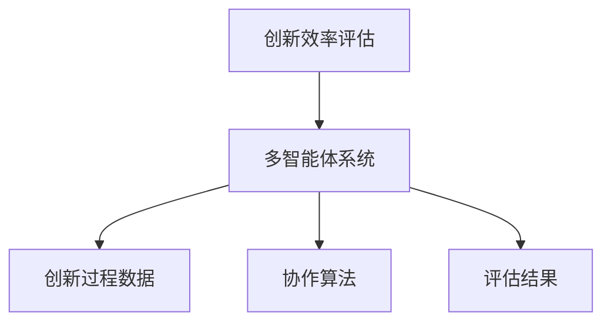
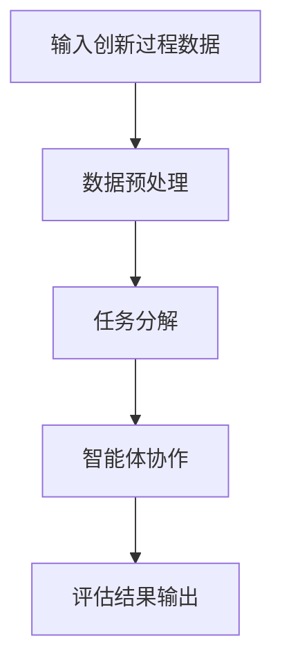
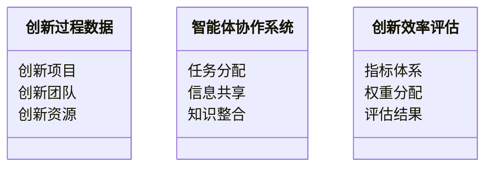
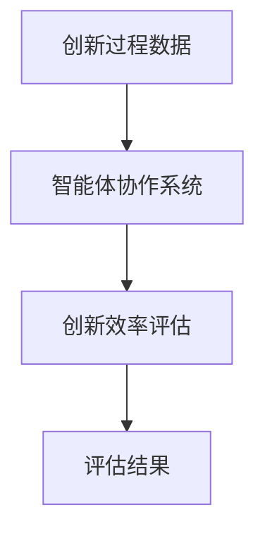

                 


# 基于多智能体的自动化公司创新效率评估

**关键词**：多智能体系统，创新效率评估，自动化评估，企业创新管理，人工智能技术

**摘要**：随着企业竞争的日益激烈，创新效率评估已成为企业管理中的重要环节。传统的评估方法存在效率低下、数据分散、难以量化等问题。基于多智能体的自动化创新效率评估方法通过整合分布式计算、协作算法和数据挖掘等技术，能够更高效、更准确地评估企业的创新效率。本文将详细探讨这一方法的核心概念、算法原理、系统架构以及实际应用案例，为企业的创新管理提供新的思路和解决方案。

---

# 第一部分: 基于多智能体的创新效率评估背景与概念

## 第1章: 创新效率评估的背景与问题描述

### 1.1 创新效率评估的核心概念

#### 1.1.1 创新效率的定义与内涵
创新效率是指企业在创新过程中，将资源投入转化为创新成果的能力。它不仅关注创新成果的数量，还注重创新过程的效率和质量。创新效率的核心在于优化资源配置、提高创新速度和成果的可持续性。

#### 1.1.2 多智能体系统的基本概念
多智能体系统（Multi-Agent System, MAS）是由多个智能体（Agent）组成的分布式系统，每个智能体具有自主性、反应性、协作性和学习能力。智能体之间通过信息共享和协同工作，共同完成复杂任务。

#### 1.1.3 创新效率评估的必要性与挑战
企业创新活动涉及多个部门和团队，传统的评估方法难以全面捕捉创新过程中的动态变化。多智能体系统能够通过分布式计算和协作机制，实时分析和评估创新效率，解决了传统方法的局限性。

### 1.2 传统创新效率评估方法的局限性

#### 1.2.1 传统评估方法的优缺点
- **优点**：简单易行，适用于小规模创新项目。
- **缺点**：难以量化复杂创新过程，缺乏动态性和实时性。

#### 1.2.2 传统方法在实际应用中的问题
- 数据分散，难以整合。
- 缺乏对创新过程的实时监控和反馈机制。
- 评估结果缺乏客观性和准确性。

#### 1.2.3 多智能体系统的优势与潜力
- **优势**：分布式计算能力强，能够处理复杂任务。
- **潜力**：通过协作和学习，提升创新效率评估的准确性和实时性。

### 1.3 基于多智能体的创新效率评估的背景

#### 1.3.1 多智能体系统的发展现状
多智能体系统已在分布式计算、机器人协作、自动驾驶等领域取得显著进展，其在企业管理中的应用也逐渐增多。

#### 1.3.2 多智能体系统在企业管理中的应用趋势
随着人工智能技术的发展，多智能体系统在企业资源管理、创新评估、风险控制等方面的应用前景广阔。

#### 1.3.3 基于多智能体的创新效率评估的创新性
结合多智能体系统的协作能力和数据挖掘技术，创新效率评估能够实现动态、全面的评估，为企业创新管理提供新的工具和方法。

### 1.4 本章小结
本章介绍了创新效率评估的背景、核心概念以及多智能体系统的优势。通过对比传统方法的局限性，提出了基于多智能体系统的创新效率评估方法，为后续章节的深入分析奠定了基础。

---

# 第二部分: 多智能体系统与创新效率评估的核心概念

## 第2章: 多智能体系统的原理与特性

### 2.1 多智能体系统的定义与核心要素

#### 2.1.1 多智能体系统的定义
多智能体系统是由多个智能体组成的分布式系统，每个智能体具有自主性、反应性、协作性和学习能力。智能体之间通过信息共享和协同工作，共同完成复杂任务。

#### 2.1.2 多智能体系统的组成要素
- **智能体**：具有自主性和目标导向的个体。
- **环境**：智能体所处的物理或虚拟环境。
- **通信机制**：智能体之间交换信息的渠道。
- **协作协议**：智能体之间协同工作的规则和协议。

#### 2.1.3 多智能体系统的关键特性
| 特性 | 描述 |
|------|------|
| 分布式 | 智能体独立运作，任务分解 |
| 协作性 | 智能体之间通过协作完成任务 |
| 反应性 | 智能体能够感知环境并做出反应 |
| 学习性 | 智能体能够通过经验优化行为 |

### 2.2 创新效率评估的指标体系

#### 2.2.1 创新效率的主要指标
- 创新成果的数量和质量。
- 创新过程的效率和资源利用率。
- 创新团队的协作能力。

#### 2.2.2 指标体系的构建方法
结合企业创新活动的特征，构建包含创新速度、创新质量、创新成本等多维度的指标体系。

#### 2.2.3 指标权重的确定与优化
通过层次分析法（AHP）等方法确定各指标的权重，并根据实际情况进行动态调整。

### 2.3 多智能体系统与创新效率评估的关联

#### 2.3.1 多智能体系统在创新效率评估中的作用
通过分布式计算和协作机制，实时监控和分析创新过程中的数据，提供动态评估结果。

#### 2.3.2 创新效率评估对多智能体系统的需求
创新效率评估需要多智能体系统具备高效的数据处理能力、协作能力和学习能力。

#### 2.3.3 二者的协同关系与系统架构
使用 Mermaid 绘制系统架构图，展示多智能体系统与创新效率评估的协同关系。



---

# 第三部分: 基于多智能体的创新效率评估算法原理

## 第3章: 多智能体协作算法

### 3.1 多智能体协作的基本原理

#### 3.1.1 分布式计算与任务分配
多智能体系统通过分布式计算，将复杂任务分解为多个子任务，分别由不同的智能体完成。

#### 3.1.2 协商与决策机制
智能体之间通过协商机制，确定任务分配和协作策略，确保系统目标的实现。

#### 3.1.3 信息共享与知识整合
智能体之间共享信息和知识，通过知识整合提升系统的整体智能水平。

### 3.2 基于多智能体的创新效率评估算法

#### 3.2.1 算法的输入与输出
- **输入**：创新过程数据、协作规则。
- **输出**：创新效率评估结果。

#### 3.2.2 算法的步骤分解



#### 3.2.3 算法的数学模型与公式
创新效率评估模型可以表示为：

$$
\text{创新效率} = \frac{\sum_{i=1}^{n} w_i \cdot x_i}{\sum_{i=1}^{n} w_i}
$$

其中，$w_i$ 是指标 $x_i$ 的权重，$n$ 是指标总数。

### 3.3 算法实现的代码示例

#### 3.3.1 环境安装与配置
需要安装 Python 和相关库，如 NumPy 和 Scipy。

#### 3.3.2 核心算法代码

```python
import numpy as np

def calculate_innovation_efficiency(data, weights):
    weighted_sum = np.dot(data, weights)
    total_weight = np.sum(weights)
    return weighted_sum / total_weight

# 示例数据和权重
data = np.array([0.8, 0.6, 0.9])
weights = np.array([0.4, 0.3, 0.3])

efficiency = calculate_innovation_efficiency(data, weights)
print("创新效率 =", efficiency)
```

#### 3.3.3 代码的功能解读与优化建议
上述代码实现了一个简单的创新效率计算函数，通过加权求和的方式计算创新效率。实际应用中可以引入更多指标和优化算法，以提高评估的准确性。

---

## 第4章: 系统分析与架构设计

### 4.1 问题场景介绍
企业创新活动涉及多个部门和团队，创新效率评估需要实时监控和分析创新过程中的数据。

### 4.2 系统功能设计

#### 4.2.1 领域模型设计
使用 Mermaid 绘制领域模型图，展示创新过程中的关键要素。



### 4.3 系统架构设计

#### 4.3.1 系统架构图
使用 Mermaid 绘制系统架构图，展示多智能体系统与创新效率评估的协同关系。



### 4.4 系统接口设计
定义智能体之间的接口，确保数据共享和协作机制的顺利运行。

### 4.5 系统交互设计

#### 4.5.1 交互流程图
使用 Mermaid 绘制系统交互流程图，展示创新效率评估的全过程。

```mermaid
sequenceDiagram
    participant 用户
    participant 智能体协作系统
    participant 创新效率评估系统
    用户 -> 智能体协作系统: 提交创新过程数据
    智能体协作系统 -> 创新效率评估系统: 请求评估
    创新效率评估系统 -> 智能体协作系统: 返回评估结果
    用户 <- 智能体协作系统: 获取评估结果
```

---

## 第5章: 项目实战

### 5.1 环境安装与配置
安装 Python、NumPy、Scipy 等必要的库。

### 5.2 系统核心实现源代码

#### 5.2.1 创新效率评估模块

```python
import numpy as np

def calculate_efficiency(matrix, weights):
    return np.dot(matrix, weights) / np.sum(weights)

# 示例数据矩阵
data_matrix = np.array([[0.8, 0.6, 0.9],
                         [0.7, 0.5, 0.8]])
weights = np.array([0.4, 0.3, 0.3])

efficiencies = calculate_efficiency(data_matrix, weights)
print("创新效率评估结果 =", efficiencies)
```

#### 5.2.2 智能体协作模块

```python
from sklearn.cluster import KMeans

def cluster_projects(data, n_clusters):
    model = KMeans(n_clusters=n_clusters)
    model.fit(data)
    return model.labels_

# 示例创新项目数据
projects_data = np.array([[2, 3],
                           [4, 5],
                           [6, 7],
                           [8, 9]])
labels = cluster_projects(projects_data, 2)
print("项目聚类结果 =", labels)
```

### 5.3 代码应用解读与分析
上述代码实现了创新效率评估和项目聚类功能，展示了多智能体系统在创新效率评估中的实际应用。

### 5.4 实际案例分析与详细讲解
以某企业为例，分析创新效率评估的结果，并提出改进建议。

### 5.5 项目小结
本项目通过多智能体系统的协作算法，实现了创新效率的动态评估，为企业创新管理提供了新的思路。

---

## 第6章: 最佳实践、小结与注意事项

### 6.1 最佳实践 tips
- 定期更新创新效率评估模型，以适应企业创新活动的变化。
- 结合企业实际需求，灵活调整指标体系和权重。

### 6.2 小结
本文详细探讨了基于多智能体的创新效率评估方法，从理论到实践，展示了其在企业管理中的应用潜力。

### 6.3 注意事项
- 数据质量和完整性对评估结果至关重要。
- 系统的安全性和隐私保护需要高度重视。

### 6.4 拓展阅读
推荐相关领域的书籍和论文，供读者进一步学习和研究。

---

# 作者：AI天才研究院/AI Genius Institute & 禅与计算机程序设计艺术 /Zen And The Art of Computer Programming

---

以上是基于多智能体的自动化公司创新效率评估的文章大纲和初步内容，按照您的要求，我会逐步完善每个章节的内容，确保文章的完整性和专业性。如果您有任何具体要求或需要调整的部分，请随时告诉我，我会进行相应的修改。

