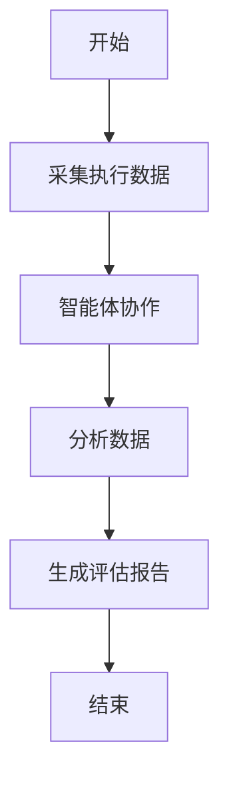

                 


# 基于多智能体的自动化公司战略执行力评估

> 关键词：多智能体系统，战略执行力评估，自动化评估，算法实现，系统架构设计

> 摘要：本文探讨了基于多智能体系统的企业战略执行力自动化评估方法，分析了传统评估方法的局限性，并提出了一种结合多智能体系统特性的自动化解决方案。通过详细的算法原理、系统架构设计和实际案例分析，展示了如何利用多智能体系统实现战略执行的动态评估与优化。

---

# 正文

## 第一部分: 基于多智能体的自动化公司战略执行力评估背景介绍

### 第1章: 问题背景与描述

#### 1.1 问题背景
在现代企业中，战略执行力是衡量企业成功的关键因素之一。然而，传统的战略执行力评估方法通常依赖于人工收集和分析数据，这种方式不仅效率低下，而且难以实时反馈和动态调整。随着人工智能技术的发展，多智能体系统（Multi-Agent System, MAS）因其分布式计算、协作性和动态适应性，成为解决这一问题的理想选择。

#### 1.2 问题描述
战略执行力评估的核心在于对战略目标的实现程度进行量化分析，这需要考虑多个因素，如资源分配、团队协作、执行效率等。传统方法通常依赖于主观判断和静态数据，难以捕捉执行过程中的动态变化。而多智能体系统能够通过分布式计算和实时通信，实现对执行过程的动态监控和评估。

#### 1.3 问题解决思路
引入多智能体系统后，可以通过以下步骤实现自动化评估：
1. **数据采集**：通过智能体实时采集执行过程中的数据。
2. **信息处理**：利用多智能体系统中的通信机制，将数据汇总并进行分析。
3. **评估与反馈**：基于分析结果生成评估报告，并提供反馈以优化执行过程。

#### 1.4 概念结构与核心要素
- **战略目标**：企业的长期发展目标。
- **执行主体**：实现战略目标的具体团队或部门。
- **评估指标**：衡量执行效果的关键绩效指标（KPI）。
- **多智能体系统**：用于协调各执行主体并实时监控执行过程。

---

## 第二部分: 核心概念与联系

### 第2章: 多智能体系统的核心原理

#### 2.1 多智能体系统的基本概念
多智能体系统由多个智能体组成，每个智能体能够独立感知环境、做出决策并执行任务。这些智能体通过通信机制协同工作，实现复杂任务的分解与协作。

#### 2.2 多智能体系统的通信机制
智能体之间的通信是通过消息传递完成的，通信内容包括数据共享、任务分配和协作请求。通信机制确保了系统中的各个智能体能够高效协作。

#### 2.3 多智能体系统的协作与协调
通过协作协议和协调机制，多智能体系统能够实现任务的分解、资源的分配和冲突的解决，从而提高整体执行效率。

### 第3章: 战略执行力评估的数学模型

#### 3.1 评估指标的定义
战略执行力评估指标通常包括以下几个方面：
1. **目标达成度**：战略目标的实际完成情况。
2. **执行效率**：完成任务所需的时间和资源。
3. **团队协作度**：团队内部的协作程度。
4. **风险控制**：执行过程中出现的风险及其处理效果。

#### 3.2 评估模型的构建
评估模型可以通过层次分析法（AHP）构建，结合各个指标的权重和实际数据，计算出综合评估结果。

#### 3.3 模型的验证与优化
通过实际数据验证模型的准确性，并根据反馈不断优化模型参数，确保评估结果的可靠性。

### 第4章: 核心概念属性对比

| 概念 | 属性 | 描述 |
|------|------|------|
| 多智能体系统 | 分布式 | 各智能体独立运行 |
| 战略执行力评估 | 综合性 | 跨部门、跨业务的综合评估 |

### 第5章: ER实体关系图

```mermaid
erDiagram
    actor 战略执行者 {
        key string 战略目标
        string 执行计划
    }
    actor 评估系统 {
        key string 评估指标
        string 评估结果
    }
    战略执行者 --> 评估系统 : 提供执行数据
    评估系统 --> 战略执行者 : 返回评估结果
```

---

## 第三部分: 算法原理

### 第6章: 评估算法的实现

#### 6.1 算法流程图



#### 6.2 数学模型

评估结果的计算公式如下：

$$评估结果 = \sum_{i=1}^{n} w_i \cdot x_i$$

其中，$w_i$ 是第 $i$ 个指标的权重，$x_i$ 是第 $i$ 个指标的得分。

#### 6.3 Python代码实现

```python
class Agent:
    def __init__(self, target):
        self.target = target
        self.data = {}

    def collect_data(self):
        # 模拟数据采集
        self.data = {
            'execution_efficiency': 0.8,
            'collaboration_degree': 0.7,
            'risk_control': 0.9
        }

    def send_data(self, receiver):
        receiver.receive_data(self.data)

class Executor:
    def __init__(self, target):
        self.target = target
        self.agents = []

    def add_agent(self, agent):
        self.agents.append(agent)

    def execute_plan(self):
        for agent in self.agents:
            agent.collect_data()
            agent.send_data(self)

# 示例用法
executor = Executor('年度销售目标')
agent1 = Agent('市场部')
agent2 = Agent('销售部')
executor.add_agent(agent1)
executor.add_agent(agent2)
executor.execute_plan()
```

---

## 第四部分: 系统分析与架构设计

### 第7章: 系统架构设计

#### 7.1 系统功能设计
- 数据采集模块：实时采集执行数据。
- 智能体协作模块：协调各智能体的工作。
- 数据分析模块：对采集的数据进行分析。
- 评估报告生成模块：根据分析结果生成评估报告。

#### 7.2 系统架构图


---

## 第五部分: 项目实战

### 第8章: 项目实战

#### 8.1 环境安装
- 安装Python和相关库（如`networkx`、`numpy`）。
- 安装多智能体系统框架（如` mesa `）。

#### 8.2 核心代码实现

```python
import networkx as nx

class MultiAgentSystem:
    def __init__(self):
        self.G = nx.Graph()

    def add_agent(self, agent_id):
        self.G.add_node(agent_id)

    def connect_agents(self, agent1, agent2):
        self.G.add_edge(agent1, agent2)

# 示例用法
mas = MultiAgentSystem()
mas.add_agent('agent1')
mas.add_agent('agent2')
mas.connect_agents('agent1', 'agent2')
print(mas.G.nodes())
```

---

## 第六部分: 最佳实践与小结

### 第9章: 最佳实践

- 在实施多智能体系统之前，确保数据的准确性和完整性。
- 定期对系统进行维护和优化，确保评估结果的准确性。
- 通过培训提升团队的技术能力，确保系统的顺利运行。

### 第10章: 小结

本文详细探讨了基于多智能体的公司战略执行力自动化评估方法，通过理论分析和实际案例，展示了如何利用多智能体系统实现战略执行的动态评估与优化。未来的研究可以进一步探索多智能体系统在其他管理领域的应用。

---

作者：AI天才研究院/AI Genius Institute & 禅与计算机程序设计艺术 /Zen And The Art of Computer Programming

