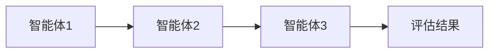
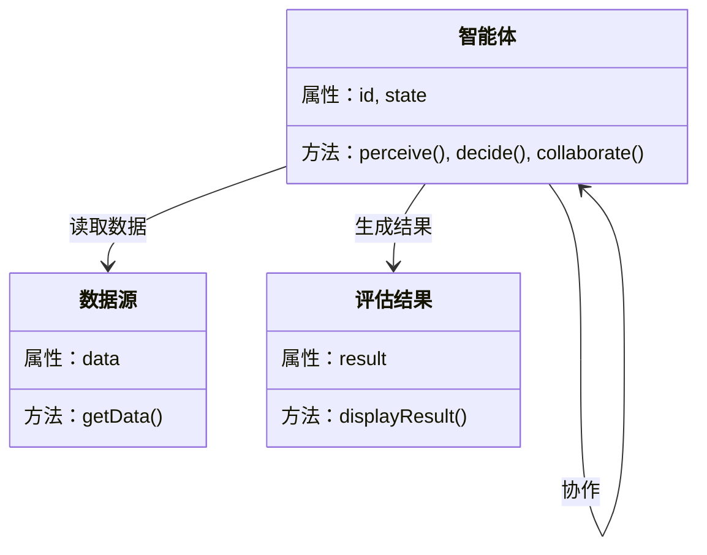
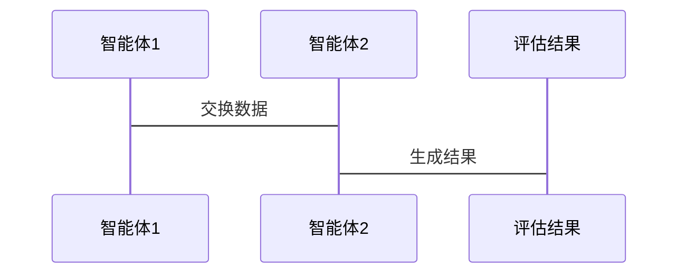

                 


# 基于多智能体的自动化公司文化评估

> 关键词：多智能体系统，公司文化评估，自动化评估，人工智能，系统架构

> 摘要：随着企业规模的不断扩大和市场竞争的加剧，公司文化评估的重要性日益凸显。传统的公司文化评估方法依赖于人工分析和主观判断，效率低下且难以量化。本文提出了一种基于多智能体的自动化公司文化评估方法，利用多智能体系统的优势，实现对公司文化的全面、动态和自动化的评估。通过构建数学模型和算法，本文详细阐述了如何利用多智能体系统的核心原理进行文化评估，为企业的文化和管理决策提供了新的思路和方法。

---

# 第一部分：背景与挑战

## 第1章：公司文化评估的背景与挑战

### 1.1 公司文化评估的重要性

公司文化是企业在长期发展过程中形成的价值观、行为准则和企业氛围的总和。它不仅影响员工的工作态度和效率，还决定了企业的凝聚力和发展潜力。传统的公司文化评估方法通常依赖于问卷调查、访谈和员工反馈，这种方式不仅耗时耗力，而且难以量化和动态跟踪。随着企业规模的扩大和市场竞争的加剧，企业需要一种更高效、更精确的方法来进行文化评估。

### 1.2 多智能体系统的基本概念

多智能体系统（Multi-Agent System, MAS）是由多个智能体组成的分布式系统，每个智能体都是一个能够感知环境、自主决策并进行协作的实体。多智能体系统具有分散性、协作性和动态性等特点，适用于复杂问题的解决。在公司文化评估中，可以将员工、部门和公司视为不同的智能体，通过智能体之间的协作和交互来实现对公司文化的全面评估。

### 1.3 自动化公司文化评估的背景

随着数字化转型的推进，企业需要更高效的方式来评估和优化公司文化。传统的评估方法难以满足企业对实时反馈和动态调整的需求。自动化公司文化评估通过多智能体系统的应用，可以实现对公司文化的实时监控和量化分析，为企业管理者提供数据支持。

### 1.4 本章小结

本章介绍了公司文化评估的重要性，阐述了多智能体系统的基本概念，以及自动化公司文化评估的背景和必要性。通过多智能体系统的应用，企业可以更高效、更精确地进行文化评估。

---

## 第2章：公司文化评估的核心概念与联系

### 2.1 多智能体系统的原理

多智能体系统的原理包括智能体的感知、决策和协作。在公司文化评估中，每个智能体可以代表一个员工或部门，通过智能体之间的交互和协作，实现对公司文化的全面评估。智能体可以根据收集到的数据进行分析，并与其他智能体共享信息，从而形成一个动态的评估结果。

### 2.2 多智能体系统的属性特征对比

多智能体系统的属性特征可以通过对比其他系统来更好地理解。以下是多智能体系统与其他系统的主要区别：

| 属性 | 多智能体系统 | 集中式系统 |
|------|--------------|-------------|
| 分散性 | 高           | 低          |
| 协作性 | 高           | 低          |
| 动态性 | 高           | 中          |

### 2.3 ER实体关系图

在公司文化评估中，实体关系图可以帮助我们更好地理解系统中的各个实体及其关系。以下是公司文化评估的ER实体关系图：

```mermaid
erDiagram
    company : 公司
    employee : 员工
    culture_assessment : 文化评估结果
    company --> culture_assessment : 生成
    employee --> culture_assessment : 影响
```

### 2.4 本章小结

本章详细介绍了多智能体系统的原理，通过属性特征对比和ER实体关系图，帮助读者更好地理解多智能体系统在公司文化评估中的应用。

---

## 第3章：多智能体系统与公司文化评估的数学模型

### 3.1 公司文化评估的数学模型

公司文化评估的数学模型可以通过图论中的模型来表示。公司文化可以看作是一个复杂的关系网络，员工、部门和公司之间的关系可以通过图的边来表示。以下是公司文化评估的数学模型：

$$ w_i = \frac{sum_{j=1}^{n} a_{ij}}{sum_{i=1}^{m} a_{ij}} $$

其中，\( w_i \) 表示第 \( i \) 个指标的权重，\( a_{ij} \) 表示第 \( i \) 个指标在第 \( j \) 个智能体中的值。

### 3.2 算法原理

多智能体系统的协作算法可以通过以下步骤实现：

1. **初始化**：每个智能体初始化其状态和目标。
2. **感知**：智能体通过传感器或数据源获取相关信息。
3. **决策**：智能体根据获取的信息进行分析和决策。
4. **协作**：智能体之间通过通信模块共享信息并进行协作。
5. **执行**：智能体根据决策结果执行操作。
6. **反馈**：系统根据执行结果提供反馈，调整智能体的行为。

以下是协作算法的流程图：



### 3.3 数学公式与模型

公司文化评估的指标权重计算公式如下：

$$ w_i = \frac{sum_{j=1}^{n} a_{ij}}{sum_{i=1}^{m} a_{ij}} $$

其中，\( a_{ij} \) 表示第 \( i \) 个指标在第 \( j \) 个智能体中的值，\( m \) 表示智能体的数量，\( n \) 表示指标的数量。

---

## 第4章：系统分析与架构设计

### 4.1 系统功能设计

公司文化评估系统的主要功能包括：

1. **数据采集**：通过问卷调查、员工行为分析等方式采集数据。
2. **智能体协作**：智能体之间协作完成数据的分析和评估。
3. **评估结果展示**：将评估结果以可视化的方式展示给企业管理者。

以下是系统功能设计的类图：



### 4.2 系统架构设计

公司文化评估系统的架构设计包括以下几个部分：

1. **数据采集层**：负责采集员工行为数据和反馈信息。
2. **智能体协作层**：实现智能体之间的协作和数据共享。
3. **评估结果层**：生成评估结果并进行可视化展示。

以下是系统架构设计的架构图：


### 4.3 系统接口设计

系统接口设计包括以下几个部分：

1. **智能体接口**：定义智能体之间的通信接口。
2. **数据源接口**：定义数据采集接口。
3. **评估结果接口**：定义评估结果展示接口。

### 4.4 系统交互设计

以下是系统交互的序列图：



### 4.5 本章小结

本章详细介绍了公司文化评估系统的功能设计、架构设计、接口设计和交互设计，为系统的实现提供了理论基础。

---

## 第5章：项目实战

### 5.1 环境安装

以下是项目实战所需的环境安装步骤：

1. **安装Python**：下载并安装Python 3.8或更高版本。
2. **安装依赖库**：安装所需的依赖库，如NumPy、Pandas和Matplotlib。

```bash
pip install numpy pandas matplotlib
```

### 5.2 系统核心实现

以下是公司文化评估系统的Python实现代码：

```python
import numpy as np
import pandas as pd
import matplotlib.pyplot as plt

class Agent:
    def __init__(self, id):
        self.id = id
        self.state = None

    def perceive(self, data):
        self.state = data

    def decide(self):
        return self.state

    def collaborate(self, agents):
        states = [agent.decide() for agent in agents]
        return states

# 初始化智能体
agents = [Agent(i) for i in range(5)]

# 数据源
data = np.random.rand(5, 5)
for agent in agents:
    agent.perceive(data[agent.id])

# 智能体协作
states = agents[0].collaborate(agents)

# 生成评估结果
result = np.mean(states)
print("评估结果:", result)

# 可视化展示
plt.plot(result)
plt.show()
```

### 5.3 代码应用解读与分析

上述代码实现了五个智能体的协作过程，每个智能体感知数据后进行决策，并与其他智能体协作生成评估结果。评估结果通过可视化的方式展示出来。

### 5.4 实际案例分析

以一个公司为例，假设公司有五个部门，每个部门对应一个智能体。通过上述代码，可以实现对公司文化的动态评估。评估结果可以帮助企业管理者识别问题部门并采取相应的改进措施。

### 5.5 本章小结

本章通过实际案例分析和代码实现，展示了如何利用多智能体系统进行公司文化评估。

---

## 第6章：总结

### 6.1 最佳实践 tips

- 在实际应用中，建议根据企业的具体需求调整智能体的数量和功能。
- 数据采集的准确性对评估结果有重要影响，需确保数据的完整性和真实性。

### 6.2 小结

本文详细介绍了基于多智能体的自动化公司文化评估方法，从背景与挑战、核心概念与联系、算法原理、系统分析与架构设计，到项目实战，全面阐述了该方法的实现过程和应用价值。

### 6.3 注意事项

- 在实际应用中，需注意保护员工的隐私和数据安全。
- 系统的实时性和动态性是实现自动化评估的关键，需确保系统的稳定性和高效性。

### 6.4 拓展阅读

- 多智能体系统的进一步优化和应用。
- 其他基于人工智能的企业文化评估方法。

---

# 作者

作者：AI天才研究院/AI Genius Institute & 禅与计算机程序设计艺术 /Zen And The Art of Computer Programming

