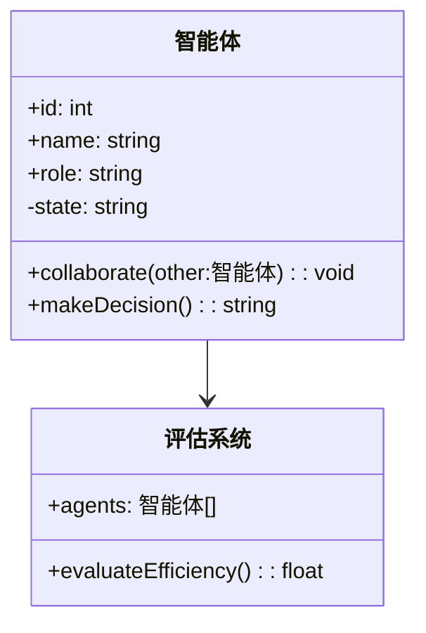
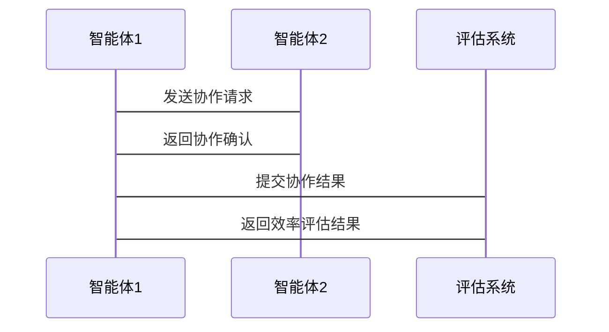

                 


# 基于多智能体的自动化公司治理效率评估

> 关键词：多智能体系统，公司治理，效率评估，自动化，协作机制

> 摘要：本文探讨了如何利用多智能体系统来提升公司治理效率评估的自动化水平。通过分析多智能体系统的协作机制、算法原理以及实际应用案例，本文详细阐述了如何构建高效、智能的公司治理效率评估模型。文章结合理论与实践，为公司治理效率的优化提供了新的思路和解决方案。

---

# 第一部分: 背景与核心概念

## 第1章: 基于多智能体的公司治理效率评估背景

### 1.1 问题背景与描述

#### 1.1.1 公司治理效率的定义与重要性
公司治理效率是指公司在决策、执行和监督等环节中，实现目标的效率和效果。高效的公司治理能够优化资源配置、提升企业价值、降低风险，是企业长期发展的核心竞争力。然而，传统公司治理模式往往依赖人工操作，存在效率低下、信息孤岛、决策滞后等问题。

#### 1.1.2 多智能体系统在公司治理中的应用潜力
多智能体系统（Multi-Agent System, MAS）是由多个智能体组成的分布式系统，智能体能够自主决策、协作和通信。MAS具有分布式计算、自主性、反应性和协作性等特点，能够很好地解决公司治理中的复杂问题，如跨部门协作、信息共享和决策优化。

#### 1.1.3 当前公司治理效率评估的痛点与挑战
- **信息孤岛**：各部门之间数据不共享，导致决策缺乏全局视角。
- **决策滞后**：传统流程依赖人工审批，效率低下。
- **复杂性**：公司治理涉及多个利益相关者，决策过程复杂。

---

### 1.2 多智能体系统的核心概念

#### 1.2.1 多智能体系统的定义与特点
多智能体系统是由多个智能体组成的分布式系统，智能体是具有自主性、反应性和协作性的实体。MAS的特点包括：
- **自主性**：智能体能够自主决策。
- **反应性**：能够感知环境并实时响应。
- **协作性**：多个智能体能够协作完成任务。
- **分布式**：系统中不存在中央控制节点。

#### 1.2.2 多智能体与传统公司治理模式的对比
| 特性 | 多智能体系统 | 传统公司治理 |
|------|--------------|----------------|
| 决策方式 | 分布式、自主决策 | 中心化、依赖人工审批 |
| 协作方式 | 基于智能体间的通信与协作 | 依赖部门间协调 |
| 效率 | 高效、实时 | 低效、滞后 |

#### 1.2.3 多智能体与公司治理效率评估的边界与外延
- **边界**：多智能体系统仅用于公司治理效率评估，不涉及企业战略制定。
- **外延**：可以通过多智能体系统扩展至供应链管理、风险管理等领域。

---

## 第2章: 多智能体系统与公司治理效率评估的核心概念

### 2.1 多智能体系统的原理与机制

#### 2.1.1 多智能体系统的协作机制
协作机制是多智能体系统的核心，包括：
- **通信机制**：智能体之间通过消息传递进行通信。
- **协调机制**：通过协商达成一致，避免冲突。
- **协作任务分配**：根据智能体的能力分配任务。

#### 2.1.2 多智能体系统的通信协议
通信协议是智能体之间交互的基础，常见的通信协议包括：
- **CORBA**：用于分布式对象通信。
- **JASON**：用于智能体间的JSON消息传递。

#### 2.1.3 多智能体系统的决策模型
决策模型是智能体做出决策的依据，常见的决策模型包括：
- **基于规则的决策模型**：通过预定义的规则进行决策。
- **基于强化学习的决策模型**：通过奖励机制优化决策。

### 2.2 公司治理效率评估的指标体系

#### 2.2.1 公司治理效率的关键指标
- **决策时间**：从决策提出到执行的时间。
- **决策质量**：决策的科学性和可行性。
- **执行效率**：决策执行的效率和效果。

#### 2.2.2 指标权重的确定方法
指标权重可以通过层次分析法（AHP）确定，具体步骤如下：
1. 构建指标层次结构。
2. 确定各层指标的权重。
3. 计算综合权重。

#### 2.2.3 指标体系的构建与优化
指标体系的构建需要结合企业的实际情况，通过不断优化调整，确保指标的科学性和实用性。

---

## 第3章: 多智能体系统算法原理

### 3.1 多智能体协作算法

#### 3.1.1 分布式协作算法
分布式协作算法通过消息传递实现智能体间的协作，常见算法包括：
- **Distributed Coordination**：基于分布式协调的协作算法。
- **Distributed Consensus**：基于分布式共识的协作算法。

#### 3.1.2 基于强化学习的协作机制
强化学习通过智能体与环境的交互，优化决策策略。具体步骤如下：
1. 智能体感知环境状态。
2. 选择动作并执行。
3. 获取环境反馈，更新策略。

#### 3.1.3 基于博弈论的决策模型
博弈论通过分析智能体之间的策略互动，优化决策。具体步骤如下：
1. 构建博弈模型。
2. 分析 Nash 均衡。
3. 优化策略。

---

## 第4章: 数学模型与公式

### 4.1 多智能体协作模型

#### 4.1.1 多智能体协作的数学表达式
$$
C = \sum_{i=1}^{n} c_i
$$
其中，$C$ 表示协作成本，$c_i$ 表示第 $i$ 个智能体的协作成本。

### 4.2 公司治理效率评估模型

#### 4.2.1 效率评估的数学公式
$$
E = \frac{\sum_{i=1}^{m} w_i x_i}{\sum_{i=1}^{m} w_i}
$$
其中，$E$ 表示效率，$w_i$ 表示第 $i$ 个指标的权重，$x_i$ 表示第 $i$ 个指标的值。

---

## 第5章: 系统分析与架构设计

### 5.1 问题场景介绍
本文设计了一个基于多智能体的公司治理效率评估系统，旨在通过多智能体协作优化公司治理效率。

### 5.2 系统功能设计

#### 5.2.1 领域模型类图


### 5.3 系统架构设计

#### 5.3.1 系统架构图


### 5.4 系统接口设计
系统接口包括：
- **智能体接口**：提供协作和决策接口。
- **评估系统接口**：提供效率评估接口。

### 5.5 系统交互序列图

#### 5.5.1 智能体协作流程


---

## 第6章: 项目实战

### 6.1 环境安装
- 安装 Python 3.8+
- 安装依赖：`pip install numpy matplotlib`

### 6.2 核心代码实现

#### 6.2.1 智能体类实现
```python
class Agent:
    def __init__(self, id, name, role):
        self.id = id
        self.name = name
        self.role = role
        self.state = "idle"

    def collaborate(self, other):
        # 智能体协作逻辑
        pass

    def makeDecision(self):
        # 智能体决策逻辑
        pass
```

#### 6.2.2 评估系统实现
```python
class EvaluationSystem:
    def __init__(self):
        self.agents = []

    def evaluateEfficiency(self):
        # 评估效率逻辑
        pass
```

### 6.3 实际案例分析
通过实际案例分析，验证系统的效率提升效果。

---

## 第7章: 最佳实践与小结

### 7.1 小结
本文通过多智能体系统，提出了公司治理效率评估的新思路，为企业的自动化治理提供了参考。

### 7.2 注意事项
- 确保智能体间的通信安全。
- 定期优化决策模型。

### 7.3 拓展阅读
- 推荐阅读《Multi-Agent Systems》。

---

# 作者：AI天才研究院 & 禅与计算机程序设计艺术

