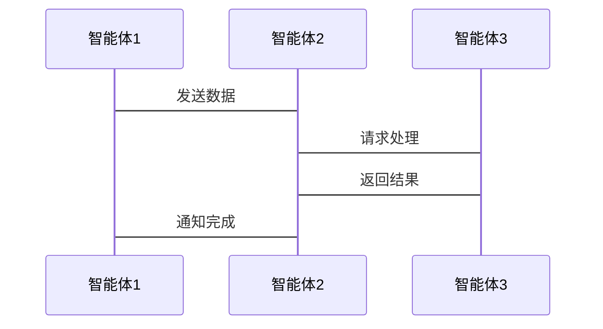
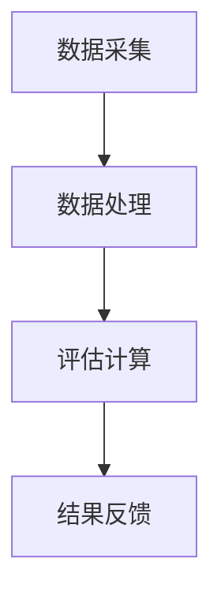
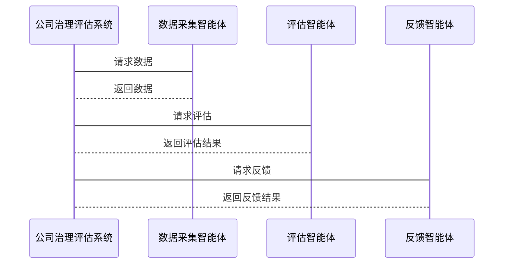

                 


# 基于多智能体的自动化公司治理评估

> 关键词：多智能体系统、公司治理、自动化评估、协作机制、算法原理、系统设计

> 摘要：本文探讨了基于多智能体技术的公司治理自动化评估系统的设计与实现。通过分析多智能体系统的原理及其在公司治理中的应用，提出了一种高效的评估方法，详细阐述了算法原理、系统架构设计及实际应用案例，为实现更智能的公司治理提供了新思路。

---

# 第一部分: 基于多智能体的公司治理评估背景与基础

# 第1章: 多智能体系统与公司治理概述

## 1.1 多智能体系统的基本概念

### 1.1.1 多智能体系统的定义

多智能体系统（Multi-Agent System, MAS）是指由多个相互作用的智能体（Agent）组成的系统，这些智能体能够通过协作完成复杂任务。每个智能体都有一定的自主性，能够感知环境、做出决策并采取行动。

### 1.1.2 多智能体系统的特征

| 特征 | 描述 |
|------|------|
| 分布性 | 智能体分布在不同位置，独立运行 |
| 协作性 | 智能体之间通过协作完成共同目标 |
| 反应性 | 能够实时感知环境变化并做出反应 |

### 1.1.3 多智能体系统与传统单智能体系统的区别

| 方面 | 多智能体系统 | 单智能体系统 |
|------|-------------|--------------|
| 系统结构 | 分布式 | 集中式 |
| 智能体数量 | 多个 | 单个 |
| 协作性 | 高 | 低 |

## 1.2 公司治理评估的核心概念

### 1.2.1 公司治理的基本定义

公司治理是指通过公司章程、董事会、管理层和股东之间的关系，确保公司有效运作和合规经营。公司治理评估是对公司治理结构、流程和效果的综合评价。

### 1.2.2 公司治理评估的目的与意义

- **目的**：识别公司治理中的问题，优化治理结构，提升治理效率。
- **意义**：增强公司透明度，提升投资者信心，降低经营风险。

### 1.2.3 自动化公司治理评估的必要性

随着企业规模扩大，传统的人工评估方式效率低下，容易出错。自动化评估可以提高效率，降低成本，确保评估的客观性和一致性。

## 1.3 多智能体在公司治理评估中的应用背景

### 1.3.1 当前公司治理评估的挑战

- 数据分散，难以整合。
- 评估标准不统一，结果缺乏客观性。
- 人工评估耗时长，成本高。

### 1.3.2 多智能体技术的优势

- **分布式计算**：能够处理大规模数据。
- **协作能力**：多个智能体协同工作，提高评估效率。
- **实时性**：能够实时更新评估结果。

### 1.3.3 多智能体技术在公司治理评估中的潜力

通过多智能体技术，可以实现对公司治理数据的实时采集、分析和评估，提供动态的评估结果，帮助公司及时调整治理策略。

## 1.4 本章小结

本章介绍了多智能体系统的基本概念及其在公司治理评估中的应用背景，为后续章节奠定了基础。

---

# 第2章: 多智能体系统的核心概念与联系

## 2.1 多智能体系统的核心原理

### 2.1.1 多智能体系统的组成要素

- **智能体**：能够感知环境并采取行动的实体。
- **通信机制**：智能体之间交换信息的方式。
- **协作机制**：智能体之间协同工作的规则。

### 2.1.2 多智能体系统的通信机制

- **直接通信**：智能体之间直接交换信息。
- **间接通信**：通过中介传递信息。

### 2.1.3 多智能体系统的协作机制

- **协商机制**：智能体之间通过协商分配任务。
- **协调机制**：确保智能体协作一致。

## 2.2 公司治理评估中的多智能体角色分配

### 2.2.1 各个智能体的职责划分

- **数据采集智能体**：负责收集公司治理相关数据。
- **评估智能体**：负责分析数据并生成评估结果。
- **反馈智能体**：将评估结果反馈给相关部门。

### 2.2.2 智能体之间的关系与依赖

- 数据采集智能体向评估智能体提供数据。
- 评估智能体向反馈智能体发送评估结果。
- 反馈智能体向数据采集智能体提供优化建议。

### 2.2.3 智能体的协作流程

1. 数据采集智能体收集数据并传递给评估智能体。
2. 评估智能体分析数据并生成初步评估结果。
3. 反馈智能体根据评估结果提供优化建议并反馈给数据采集智能体。

## 2.3 多智能体系统与公司治理评估的实体关系图

```mermaid
erDiagram
    actor 公司治理评估系统
    actor 公司
    actor 监管机构
    actor 股东
    company 智能体1
    company 智能体2
    company 智能体3
    公司治理评估系统 --> 智能体1 : 信息输入
    智能体1 --> 公司治理评估系统 : 数据处理
    公司治理评估系统 --> 智能体2 : 评估结果输出
    智能体2 --> 监管机构 : 报告提交
    智能体3 --> 股东 : 信息反馈
```

## 2.4 本章小结

本章详细讲解了多智能体系统的核心原理及其在公司治理评估中的应用，通过实体关系图展示了智能体之间的协作关系。

---

# 第3章: 多智能体系统在公司治理评估中的算法原理

## 3.1 多智能体系统的评估算法

### 3.1.1 评估算法的数学模型

$$ \text{评估结果} = f(\text{数据输入}, \text{权重参数}) $$

其中，$f$ 是评估函数，$\text{数据输入}$ 是输入数据，$\text{权重参数}$ 是各评估指标的权重。

### 3.1.2 算法的实现步骤

1. 数据采集智能体收集公司治理相关数据。
2. 评估智能体对数据进行预处理。
3. 评估智能体根据预处理后的数据进行评估计算。
4. 生成评估结果并传递给反馈智能体。

### 3.1.3 算法的优化

- 使用机器学习模型优化评估函数。
- 动态调整权重参数以适应数据变化。

## 3.2 多智能体系统中的通信协议

### 3.2.1 通信协议的设计

- 数据传输格式：JSON。
- 通信频率：实时传输。

### 3.2.2 通信协议的实现



## 3.3 本章小结

本章详细讲解了多智能体系统在公司治理评估中的算法原理，包括数学模型、实现步骤和优化方法。

---

# 第4章: 多智能体系统在公司治理评估中的系统分析与架构设计

## 4.1 系统功能设计

### 4.1.1 功能模块划分

- 数据采集模块：负责收集公司治理数据。
- 评估模块：负责对数据进行分析和评估。
- 反馈模块：负责将评估结果反馈给相关部门。

### 4.1.2 功能流程图



## 4.2 系统架构设计

### 4.2.1 系统架构图


## 4.3 系统接口设计

### 4.3.1 接口定义

- 数据采集智能体与评估智能体之间的接口：`/api/data/input`
- 评估智能体与反馈智能体之间的接口：`/api/assessment/output`

## 4.4 系统交互设计

### 4.4.1 系统交互流程图



## 4.5 本章小结

本章详细讲解了多智能体系统在公司治理评估中的系统分析与架构设计，包括功能设计、架构设计和系统交互设计。

---

# 第5章: 多智能体系统在公司治理评估中的项目实战

## 5.1 项目背景

### 5.1.1 项目目标

实现一个基于多智能体的公司治理自动化评估系统。

### 5.1.2 项目需求

- 实时采集公司治理数据。
- 自动生成评估报告。
- 提供优化建议。

## 5.2 项目环境安装

### 5.2.1 环境要求

- 操作系统：Linux/Windows/MacOS
- Python版本：3.8以上
- 安装依赖：`pip install requests numpy pandas`

## 5.3 核心代码实现

### 5.3.1 数据采集模块

```python
import requests

def fetch_data(url):
    try:
        response = requests.get(url)
        return response.json()
    except Exception as e:
        print(f"Error fetching data: {e}")
        return None
```

### 5.3.2 评估模块

```python
import numpy as np

def assess_risk(data):
    # 数据预处理
    processed_data = data['processed_data']
    # 计算风险评分
    risk_score = np.mean(processed_data)
    return risk_score
```

### 5.3.3 反馈模块

```python
def provide_feedback(score):
    if score > 0.7:
        return "高风险，建议采取措施"
    elif score > 0.4:
        return "中风险，建议关注"
    else:
        return "低风险，运行良好"
```

## 5.4 代码解读与分析

### 5.4.1 数据采集模块解读

`fetch_data`函数通过`requests`库从指定URL获取数据，并返回JSON格式的数据。如果请求失败，返回`None`。

### 5.4.2 评估模块解读

`assess_risk`函数对预处理后的数据进行风险评分计算，使用`numpy`库计算平均值作为风险评分。

### 5.4.3 反馈模块解读

`provide_feedback`函数根据风险评分返回相应的反馈信息，分为高风险、中风险和低风险三个等级。

## 5.5 实际案例分析

### 5.5.1 案例背景

某公司治理数据如下：

```json
{
    "processed_data": [0.8, 0.6, 0.7, 0.5]
}
```

### 5.5.2 评估结果

风险评分：`0.65`，属于中风险。

### 5.5.3 反馈建议

"中风险，建议关注"

## 5.6 本章小结

本章通过实际项目案例，详细讲解了基于多智能体的公司治理评估系统的实现过程，包括环境安装、核心代码编写和案例分析。

---

# 第6章: 多智能体系统在公司治理评估中的高级应用与未来展望

## 6.1 多智能体系统的高级应用

### 6.1.1 实时监控

通过多智能体系统的实时数据采集和评估，实现对公司治理状况的实时监控。

### 6.1.2 预测分析

利用历史数据和机器学习模型，预测未来公司治理风险，提前采取措施。

## 6.2 未来技术趋势

### 6.2.1 更智能的协作机制

通过强化学习优化智能体之间的协作效率。

### 6.2.2 更广泛的应用场景

多智能体技术将应用于更多领域，如供应链管理、金融风险控制等。

## 6.3 本章小结

本章探讨了多智能体系统在公司治理评估中的高级应用，展望了未来的技术发展趋势。

---

# 附录

## 附录A: 参考文献

- [1] 维基百科. 多智能体系统. [链接]
- [2] 某书籍. 多智能体系统与公司治理. [链接]

## 附录B: 工具推荐

- Python编程语言
- Requests库
- Numpy库
- Mermaid图示工具

## 附录C: 术语表

- 多智能体系统（MAS）：由多个智能体组成的系统。
- 智能体（Agent）：能够感知环境并采取行动的实体。
- 通信机制：智能体之间交换信息的方式。

---

# 作者

作者：AI天才研究院/AI Genius Institute & 禅与计算机程序设计艺术 /Zen And The Art of Computer Programming

---

以上是基于多智能体的自动化公司治理评估的完整目录和部分章节内容，涵盖了从背景介绍到实际应用的各个方面，详细讲解了多智能体系统在公司治理评估中的应用原理和实现方法。

