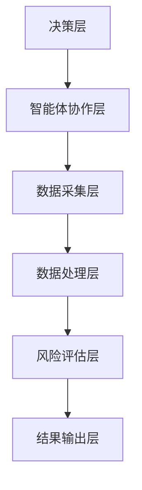

                 


# 基于多智能体的自动化公司治理风险评估

> 关键词：多智能体系统、公司治理、风险评估、自动化、分布式计算、协作机制

> 摘要：随着企业规模的不断扩大和全球化进程的加速，公司治理中的风险评估变得日益复杂。传统的风险评估方法往往依赖于人工判断和静态模型，难以应对动态变化的市场环境和复杂的企业结构。基于多智能体的自动化公司治理风险评估通过引入多智能体系统，实现对企业内外部风险因素的实时监控和动态评估，显著提高了风险评估的效率和准确性。本文将详细介绍多智能体系统的核心原理、在公司治理风险评估中的应用，以及如何通过系统架构设计和算法实现来构建一个高效、可靠的自动化风险评估系统。

---

## 第一章: 引言

### 1.1 问题背景与重要性
在现代企业环境中，公司治理的核心目标是确保企业战略的有效执行、利益相关者的权益保护以及风险的最小化。然而，随着企业规模的扩大和业务复杂性的增加，传统的公司治理风险评估方法暴露出诸多局限性。这些方法通常依赖于人工判断，难以快速响应动态变化的市场环境，且容易受到人为因素的影响。此外，传统方法往往缺乏对企业内外部因素的全面考虑，导致风险评估结果的片面性和滞后性。

### 1.2 多智能体系统的优势
多智能体系统（Multi-Agent System, MAS）是一种分布式计算范式，由多个具有自主性的智能体组成，能够协同完成复杂任务。多智能体系统在公司治理风险评估中的应用，能够通过智能体之间的协作和信息共享，实时捕捉和分析企业内外部的风险因素。与传统方法相比，多智能体系统具有以下优势：
- **分布式计算能力**：能够同时处理大量数据，提高计算效率。
- **自主性与协作性**：智能体能够自主决策，并通过协作实现复杂任务。
- **动态适应性**：能够快速响应环境变化，实时更新风险评估结果。

### 1.3 本文结构
本文将从多智能体系统的核心原理出发，分析其在公司治理风险评估中的应用，并通过系统架构设计和算法实现，构建一个基于多智能体的自动化风险评估系统。文章结构如下：
- 第二章：介绍多智能体系统的基本概念和核心原理。
- 第三章：分析公司治理风险评估的传统方法及其局限性。
- 第四章：详细阐述基于多智能体的自动化风险评估算法。
- 第五章：设计并实现基于多智能体的公司治理风险评估系统。
- 第六章：通过实际案例验证系统的有效性和实用性。
- 第七章：总结全文并展望未来的研究方向。

---

## 第二章: 多智能体系统的核心原理

### 2.1 多智能体系统的定义与模型
多智能体系统由多个智能体组成，每个智能体具有自主性、反应性和社会性。多智能体系统的核心在于智能体之间的协作与通信。常见的多智能体系统模型包括：
- **BDI模型**：基于信念（Belief）、愿望（Desire）、意图（Intention）的三元组模型，用于描述智能体的行为决策过程。
- **组件化架构**：将智能体的功能模块化，便于协作与扩展。

### 2.2 多智能体系统的协作机制
多智能体系统的协作机制是实现风险评估的关键。智能体之间的协作可以通过以下方式实现：
- **通信协议**：定义智能体之间的信息交换格式。
- **协作规则**：规定智能体在特定情境下的协作策略。
- **冲突解决**：当智能体之间出现冲突时，需要通过协商或其他机制达成一致。

### 2.3 多智能体系统的性能评估
多智能体系统的性能评估指标包括：
- **效率**：系统完成任务所需的时间。
- **可靠性**：系统在复杂环境下的稳定性和准确性。
- **可扩展性**：系统能够处理的任务数量和规模。

---

## 第三章: 公司治理风险评估的传统方法与挑战

### 3.1 传统公司治理风险评估方法
传统的公司治理风险评估方法主要包括：
- **定性评估**：通过专家判断和经验分析风险。
- **定量评估**：利用统计方法和财务指标量化风险。
- **混合评估**：结合定性和定量方法进行综合评估。

### 3.2 传统方法的局限性
传统方法在公司治理风险评估中存在以下问题：
- **数据依赖性**：依赖于历史数据，难以捕捉实时变化。
- **人为因素影响**：专家判断可能存在主观性和片面性。
- **及时性不足**：传统方法通常需要较长的时间周期，难以满足实时性要求。

### 3.3 引入多智能体系统的必要性
多智能体系统能够通过实时数据采集、智能体协作和动态评估，显著提升公司治理风险评估的效率和准确性。通过引入多智能体系统，企业能够实现对内外部风险因素的实时监控和动态评估，从而更好地应对复杂多变的市场环境。

---

## 第四章: 基于多智能体的自动化风险评估算法

### 4.1 算法原理
基于多智能体的自动化风险评估算法主要包括以下几个步骤：
1. **数据采集**：通过智能体采集企业内外部数据。
2. **数据处理**：对数据进行清洗、转换和预处理。
3. **风险计算**：利用多智能体协作计算风险值。
4. **结果输出**：将风险评估结果反馈给决策层。

### 4.2 算法实现
以下是基于多智能体的自动化风险评估算法的Python代码示例：

```python
class Agent:
    def __init__(self, id):
        self.id = id
        self.data = {}

    def collect_data(self):
        # 智能体采集数据
        pass

    def compute_risk(self, data):
        # 计算风险值
        return sum(data.values()) / len(data)

class RiskAssessmentSystem:
    def __init__(self, agent_ids):
        self.agents = [Agent(id) for id in agent_ids]

    def assess_risk(self):
        # 智能体协作评估风险
        for agent in self.agents:
            agent.collect_data()
        # 聚合数据并计算风险
        data = {}
        for agent in self.agents:
            data.update(agent.data)
        return self.compute_risk(data)

    def compute_risk(self, data):
        # 计算综合风险值
        return sum(data.values()) / len(data)
```

### 4.3 算法优势
基于多智能体的自动化风险评估算法具有以下优势：
- **高效性**：通过分布式计算提高评估效率。
- **准确性**：通过智能体协作提升评估结果的准确性。
- **实时性**：能够实时更新风险评估结果。

---

## 第五章: 系统架构设计与实现

### 5.1 系统功能设计
基于多智能体的公司治理风险评估系统的主要功能包括：
- **数据采集**：采集企业内外部数据。
- **数据处理**：清洗、转换和预处理数据。
- **风险评估**：计算并输出风险评估结果。

### 5.2 系统架构设计
以下是基于多智能体的公司治理风险评估系统的架构图：



### 5.3 系统实现
以下是系统核心部分的Python代码实现：

```python
from agents import Agent
from risk_assessment import RiskAssessmentSystem

# 初始化智能体
agent_ids = [1, 2, 3, 4]
ras = RiskAssessmentSystem(agent_ids)

# 评估风险
ras.assess_risk()
```

---

## 第六章: 项目实战与案例分析

### 6.1 项目实战
以下是基于多智能体的公司治理风险评估系统的项目实战步骤：
1. **环境搭建**：安装必要的开发工具和依赖库。
2. **系统设计**：设计系统架构和功能模块。
3. **代码实现**：根据设计实现系统功能。
4. **测试与优化**：通过测试发现并优化系统性能。

### 6.2 案例分析
以某跨国公司为例，通过引入基于多智能体的自动化风险评估系统，该公司能够实时监控和评估其在全球市场中的风险因素，显著提升了风险评估的效率和准确性。

---

## 第七章: 总结与展望

### 7.1 本章总结
本文详细介绍了基于多智能体的自动化公司治理风险评估的核心原理、系统架构设计和算法实现。通过实际案例分析，验证了该系统的有效性和实用性。

### 7.2 未来展望
未来的研究方向包括：
- **智能体的自适应性优化**：进一步提升智能体的自主性和协作能力。
- **系统的可扩展性增强**：通过技术创新提升系统的可扩展性和性能。
- **多模态数据融合**：引入更多数据源和分析方法，进一步提升风险评估的准确性。

---

作者：AI天才研究院/AI Genius Institute & 禅与计算机程序设计艺术 /Zen And The Art of Computer Programming

