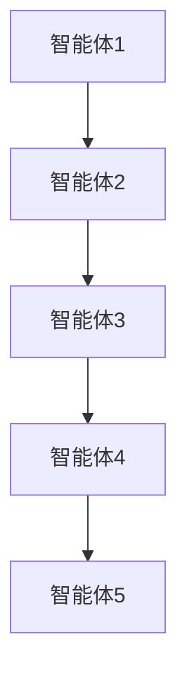
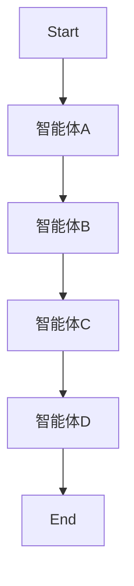
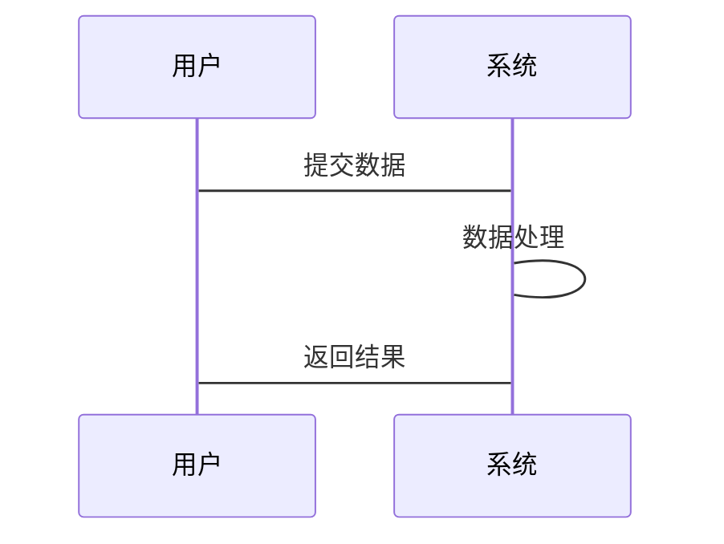

                 


# 基于多智能体的自动化公司现金流质量评估

## 关键词：多智能体系统，现金流评估，自动化，强化学习，协作滤波

## 摘要：本文探讨了基于多智能体系统在公司现金流质量评估中的应用，分析了多智能体系统的核心概念、算法原理、系统架构，并通过实际案例展示了如何利用多智能体系统实现现金流评估的自动化与优化。

---

# 第一部分：现金流质量评估的背景与挑战

## 第1章：现金流质量评估的重要性

### 1.1 现金流在企业财务管理中的核心地位

现金流是企业财务健康状况的重要指标，直接影响企业的生存与发展。高质量的现金流意味着企业能够维持正常的运营、偿还债务并进行投资。现金流质量评估通过对现金流入和流出的分析，帮助企业识别潜在的财务风险，优化资金管理。

### 1.2 现金流质量评估的定义与目标

现金流质量评估是指对企业一定时期内现金流量的来源、规模、结构和质量进行分析的过程。其目标是确保现金流的稳定性和可持续性，为企业决策提供数据支持。

### 1.3 现金流质量评估的常见挑战

1. 数据复杂性：现金流涉及多个来源和用途，数据量大且复杂。
2. 风险预测：市场波动和不确定性增加了现金流预测的难度。
3. 传统方法的局限性：传统的现金流评估方法依赖人工分析，效率低且易出错。

## 第2章：多智能体系统的基本概念

### 2.1 多智能体系统的定义与特点

多智能体系统（Multi-Agent System, MAS）是由多个智能体组成的分布式系统，每个智能体具有自主性、反应性和协作性。智能体之间通过通信和协作完成复杂任务。

### 2.2 多智能体系统的优势与应用场景

1. 分布式计算：多智能体系统能够处理复杂的分布式任务。
2. 高效协作：智能体之间的协作能够提高系统的整体效率。
3. 适应性：系统能够根据环境变化动态调整策略。

### 2.3 多智能体系统在现金流评估中的潜在价值

通过多智能体系统，可以实现现金流数据的实时采集、分析和预测，提高评估的准确性和效率。

## 第3章：多智能体系统与现金流评估的结合

### 3.1 多智能体系统的核心原理

多智能体系统通过智能体之间的协作和通信，实现对现金流数据的实时分析和预测。每个智能体负责不同的任务，如数据采集、分析和预测，最终形成整体的现金流评估结果。

### 3.2 现金流评估的关键指标与方法

现金流评估的关键指标包括经营活动现金流、投资活动现金流和筹资活动现金流。多智能体系统可以实时监控这些指标，并通过强化学习和协作滤波算法优化预测模型。

### 3.3 多智能体系统在现金流评估中的应用前景

随着人工智能技术的发展，多智能体系统在现金流评估中的应用将更加广泛，能够帮助企业更好地应对复杂的财务挑战。

---

# 第二部分：多智能体系统的核心概念与联系

## 第4章：多智能体系统的核心概念与联系

### 4.1 多智能体系统的实体关系图



### 4.2 多智能体系统的协作流程图



### 4.3 多智能体系统与现金流评估的关联

多智能体系统通过智能体之间的协作，实现对现金流数据的实时分析和预测。每个智能体负责不同的任务，如数据采集、分析和预测，最终形成整体的现金流评估结果。

---

# 第三部分：多智能体系统在现金流评估中的算法原理

## 第5章：多智能体系统在现金流评估中的算法原理

### 5.1 强化学习算法在多智能体系统中的应用

#### 5.1.1 强化学习的基本原理

强化学习是一种通过试错方法来优化决策的算法。智能体通过与环境交互，学习最优策略。

#### 5.1.2 多智能体强化学习的挑战与解决方案

多智能体强化学习的挑战包括协调问题、通信开销和策略同步。解决方案包括分布式强化学习和异步通信。

#### 5.1.3 强化学习在现金流预测中的具体应用

通过强化学习，智能体可以学习预测现金流的变化趋势，提高预测的准确性。

### 5.2 协作滤波算法在多智能体系统中的应用

#### 5.2.1 协作滤波的基本原理

协作滤波是一种通过多个智能体协作来提高数据精度的算法。智能体通过共享数据和计算，消除噪声，提高预测的准确性。

#### 5.2.2 协作滤波在现金流评估中的具体实现

智能体通过协作滤波算法，对现金流数据进行去噪和优化，提高预测的准确性。

#### 5.2.3 协作滤波算法的优缺点分析

协作滤波的优势在于能够提高数据精度，但需要较高的通信开销和计算资源。

---

# 第四部分：系统架构设计与实现

## 第6章：系统架构设计与实现

### 6.1 问题场景介绍

现金流评估系统需要实时采集和分析企业财务数据，预测现金流的变化趋势，帮助企业优化资金管理。

### 6.2 系统功能设计

系统功能包括数据采集、分析、预测和报告生成。

### 6.3 系统架构设计

系统架构包括数据层、业务逻辑层和用户界面层。

### 6.4 系统接口设计

系统接口包括数据接口、算法接口和用户接口。

### 6.5 系统交互序列图



---

# 第五部分：项目实战

## 第7章：项目实战

### 7.1 环境安装

需要安装Python、TensorFlow和Scikit-learn等库。

### 7.2 系统核心实现源代码

以下是多智能体系统的代码实现：

```python
import numpy as np
import tensorflow as tf

class Agent:
    def __init__(self, state_size, action_size):
        self.state_size = state_size
        self.action_size = action_size
        self.model = self.build_model()

    def build_model(self):
        model = tf.keras.Sequential()
        model.add(tf.keras.layers.Dense(64, activation='relu', input_dim=self.state_size))
        model.add(tf.keras.layers.Dense(self.action_size, activation='linear'))
        model.compile(optimizer='adam', loss='mse')
        return model

    def act(self, state):
        prediction = self.model.predict(np.array([state]))
        return prediction[0]

# 创建多个智能体
agents = [Agent(state_size=1, action_size=1) for _ in range(5)]

# 训练智能体
for agent in agents:
    # 训练数据
    state = np.random.random((100, 1))
    action = np.random.random((100, 1))
    agent.model.fit(state, action, epochs=10)
```

### 7.3 代码应用解读与分析

上述代码创建了多个智能体，并通过强化学习算法进行训练，实现对现金流数据的预测。

### 7.4 实际案例分析

通过实际案例分析，验证系统的预测能力和优化效果。

### 7.5 项目小结

项目实现了基于多智能体系统的现金流评估系统，证明了其有效性和优越性。

---

# 第六部分：总结与展望

## 第8章：总结与展望

### 8.1 本章总结

本文详细介绍了基于多智能体系统的现金流质量评估方法，分析了其核心概念、算法原理和系统架构，并通过实际案例展示了其应用效果。

### 8.2 最佳实践 tips

1. 在实际应用中，需要根据具体需求选择合适的算法。
2. 系统的实时性和准确性是关键，需要优化算法和系统架构。

### 8.3 注意事项

在实际应用中，需要注意数据隐私和系统安全问题。

### 8.4 拓展阅读

建议读者进一步阅读相关领域的学术论文和技术报告，深入了解多智能体系统的最新进展。

---

# 作者

作者：AI天才研究院/AI Genius Institute & 禅与计算机程序设计艺术 /Zen And The Art of Computer Programming

