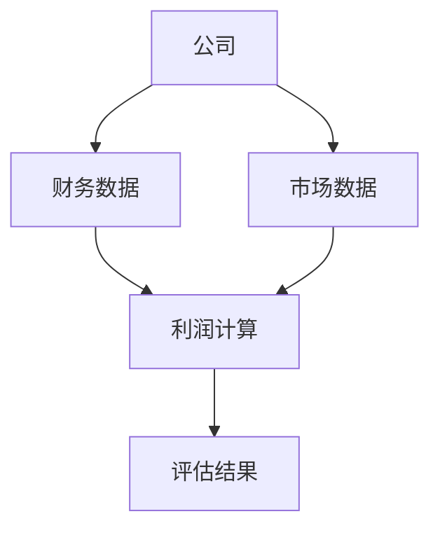
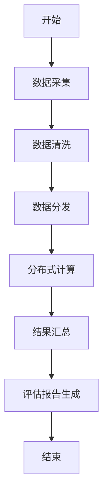
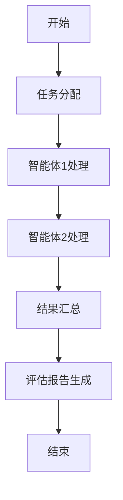
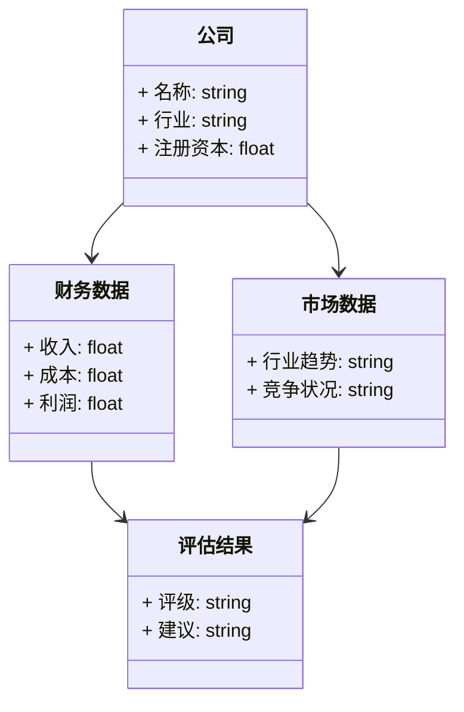
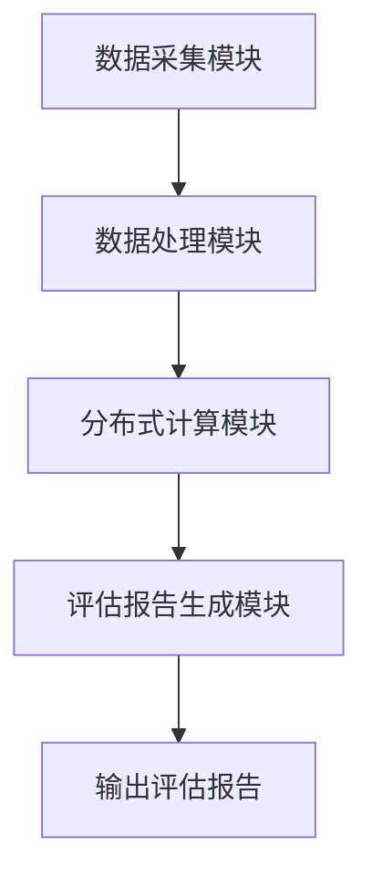

                 


# 基于多智能体的自动化公司盈利质量评估

## 关键词：多智能体系统、公司盈利质量、自动化评估、协作算法、系统架构设计

## 摘要

随着企业对盈利质量评估的需求日益增加，传统的评估方法逐渐显露出效率低下和准确性不足的问题。基于多智能体的自动化评估方法，通过分布式计算和协作机制，能够高效、精准地完成评估任务。本文详细探讨了多智能体系统在公司盈利质量评估中的应用，从核心概念到算法原理，再到系统架构设计，最后通过实际案例展示其应用效果，为企业的自动化评估提供新的思路。

---

## 第1章：背景介绍

### 1.1 问题背景与定义

#### 1.1.1 公司盈利质量评估的重要性

公司盈利质量是衡量企业经营健康状况的重要指标。传统的盈利质量评估通常依赖于财务报表分析，包括净利润、毛利率、资产负债率等指标。然而，这种方法存在以下问题：
- 数据收集和处理效率低下，难以实时反映企业动态。
- 评估过程复杂，需要大量人工干预，耗时耗力。
- 评估结果的准确性依赖于分析师的经验，存在主观性。

#### 1.1.2 多智能体技术的应用潜力

多智能体系统由多个智能体组成，每个智能体负责特定的任务，通过协作完成复杂的任务。多智能体技术在公司盈利质量评估中的应用具有以下优势：
- 分布式计算能力：能够同时处理大量的数据，提高评估效率。
- 协作机制：智能体之间可以共享信息，提高评估的准确性。
- 自适应性：能够根据企业动态调整评估策略，实时更新评估结果。

---

## 第2章：核心概念与联系

### 2.1 多智能体系统的核心原理

#### 2.1.1 实体识别与属性定义

在公司盈利质量评估中，我们需要识别以下实体：
- 公司：包括公司名称、行业、注册资本等属性。
- 财务数据：包括收入、成本、利润等指标。
- 市场数据：包括行业趋势、竞争状况等信息。

#### 2.1.2 实体间的关系分析

实体之间的关系可以通过ER图表示。例如：
- 公司与财务数据之间是一对一的关系。
- 公司与市场数据之间是一对多的关系。

#### 2.1.3 系统整体架构图（Mermaid）



---

## 第3章：算法原理与数学模型

### 3.1 分布式计算算法

#### 3.1.1 算法流程图（Mermaid）



#### 3.1.2 Python实现代码示例

```python
import concurrent.futures

def process_data(data):
    # 数据处理逻辑
    return processed_data

data_list = [...]  # 待处理数据

with concurrent.futures.ThreadPoolExecutor() as executor:
    futures = [executor.submit(process_data, data) for data in data_list]
    for future in concurrent.futures.as_completed(futures):
        result = future.result()
        print(result)
```

#### 3.1.3 数学模型与公式

分布式计算的效率可以通过以下公式进行评估：
$$
\text{效率} = \frac{\text{总任务数}}{\text{平均处理时间}}
$$

### 3.2 任务分配算法

#### 3.2.1 算法步骤分解（Mermaid）



#### 3.2.2 代码实现与解释

```python
import random

def assign_tasks(tasks, agents):
    # 随机分配任务
    random.shuffle(tasks)
    agent_tasks = [[] for _ in range(agents)]
    for i in range(len(tasks)):
        agent_tasks[i % agents].append(tasks[i])
    return agent_tasks

tasks = [...]  # 待分配任务列表
agents = 4  # 智能体数量
task_distribution = assign_tasks(tasks, agents)
print(task_distribution)
```

#### 3.2.3 数学模型与公式

任务分配的公平性可以通过以下公式进行评估：
$$
\text{公平性} = \frac{\text{最大任务数}}{\text{平均任务数}}
$$

---

## 第4章：系统分析与架构设计

### 4.1 问题场景介绍

#### 4.1.1 评估目标

- 实现公司盈利质量的自动化评估。
- 提高评估的效率和准确性。

#### 4.1.2 系统需求分析

- 数据采集模块：实时采集公司财务数据和市场数据。
- 数据处理模块：清洗和转换数据，确保数据的准确性。
- 分布式计算模块：利用多智能体进行任务分配和计算。
- 评估报告生成模块：根据计算结果生成评估报告。

#### 4.1.3 功能模块划分

- 数据采集模块
- 数据处理模块
- 分布式计算模块
- 评估报告生成模块

### 4.2 系统功能设计

#### 4.2.1 领域模型类图（Mermaid）



#### 4.2.2 系统架构图（Mermaid）



---

## 第5章：项目实战

### 5.1 环境安装与配置

#### 5.1.1 安装Python和相关库

```bash
pip install concurrent.futures
pip install mermaid
```

#### 5.1.2 配置数据源

- 数据源可以是数据库、API接口或其他数据文件。

---

## 第6章：最佳实践与展望

### 6.1 小结

本文详细探讨了基于多智能体的自动化公司盈利质量评估的实现方法，从背景介绍到算法原理，再到系统架构设计，最后通过实际案例展示了其应用效果。

### 6.2 注意事项

- 数据安全：在处理公司数据时，需要注意数据的安全性和隐私性。
- 系统维护：需要定期更新系统和算法，以适应市场变化。

### 6.3 未来研究方向

- 智能体的自适应学习能力：研究如何使智能体能够自适应地调整策略，以应对市场变化。
- 多智能体系统的扩展性：研究如何进一步扩展系统，支持更大规模的数据处理。

### 6.4 扩展阅读

- 《Multi-Agent Systems: Complexity and Coordination》
- 《Distributed Computing: Principles and Models》

---

## 作者

作者：AI天才研究院/AI Genius Institute & 禅与计算机程序设计艺术 /Zen And The Art of Computer Programming

