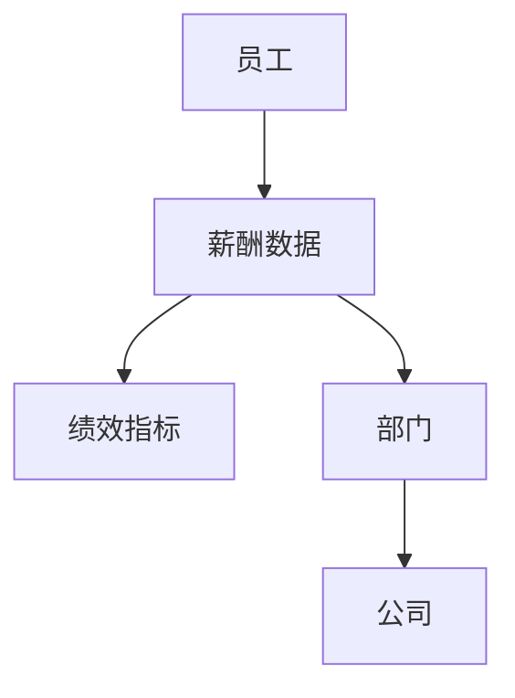
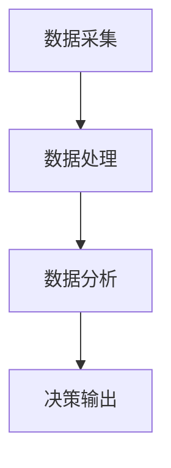
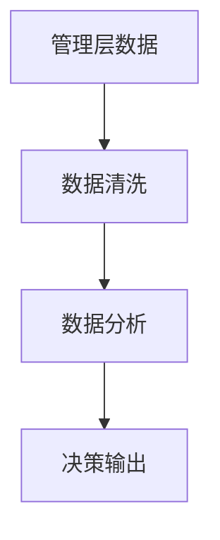
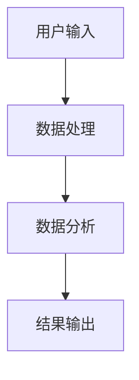

                 


# 基于多智能体的自动化公司管理层薪酬分析

## 关键词：多智能体系统，薪酬分析，分布式计算，协作机制，机器学习

## 摘要：本文介绍了一种基于多智能体的自动化公司管理层薪酬分析系统，详细阐述了系统的背景、核心原理、数学模型、系统架构设计和实际应用。通过多智能体协作，系统能够高效、准确地进行薪酬数据分析，为企业提供科学的决策支持。

---

# 第1章：背景介绍

## 1.1 问题背景

### 1.1.1 公司管理层薪酬分析的重要性
公司管理层的薪酬设计直接影响企业的激励机制和员工绩效。合理的薪酬结构能够提升员工的工作积极性，而不公平或不合理的薪酬可能导致员工不满甚至流失。传统的薪酬分析依赖人工处理，存在效率低、易出错的问题。

### 1.1.2 传统薪酬分析的局限性
传统薪酬分析通常依赖人工数据录入和统计，耗时且容易出错。此外，数据来源分散、格式不统一，增加了处理难度。人工分析还可能受到主观因素的影响，导致结果不准确。

### 1.1.3 多智能体技术的应用潜力
多智能体系统通过分布式的计算和协作，能够高效处理大规模数据，提供实时分析结果。将多智能体技术应用于薪酬分析，可以实现数据的自动采集、分析和反馈，显著提高分析效率和准确性。

## 1.2 问题描述

### 1.2.1 薪酬分析的核心问题
薪酬分析的核心问题包括数据的准确性、分析的深度以及结果的可操作性。如何高效采集、处理和分析薪酬数据，是薪酬分析的关键挑战。

### 1.2.2 多智能体系统的优势
多智能体系统能够分布处理数据，减少单点故障，提高系统的可靠性和容错能力。多个智能体协作完成任务，能够提高分析效率和准确性。

### 1.2.3 系统边界与外延
系统边界包括薪酬数据的采集、处理、分析和输出。外延则包括与企业其他系统的集成，如HR系统、财务系统等。

## 1.3 核心概念与联系

### 1.3.1 多智能体系统的定义与特点
多智能体系统由多个智能体组成，每个智能体负责特定的任务，通过通信协作完成整体目标。其特点包括分布性、协作性、自主性和动态性。

### 1.3.2 实体关系图（ER图）
以下是公司管理层薪酬分析系统的ER图：


---

# 第2章：多智能体系统的核心原理

## 2.1 多智能体系统的基本原理

### 2.1.1 分布式计算与协作机制
多智能体系统通过分布式计算，将任务分解为多个子任务，由不同的智能体完成。协作机制确保智能体之间能够有效沟通和协调。

### 2.1.2 智能体之间的通信协议
智能体之间的通信需要遵循特定的协议，例如使用JSON格式传递数据，或通过消息队列进行异步通信。

### 2.1.3 多智能体系统的数学模型
多智能体系统的优化问题可以表示为：
$$ \text{Maximize } \sum_{i=1}^{n} f_i(x_i) $$
其中，$x_i$表示第$i$个智能体的决策变量，$f_i$是其目标函数。

## 2.2 薪酬分析中的多智能体协作

### 2.2.1 数据采集与处理智能体
数据采集智能体负责从数据库、HR系统等来源获取薪酬数据，并进行清洗和预处理。

### 2.2.2 数据分析与决策智能体
数据分析智能体利用统计方法或机器学习算法，对薪酬数据进行建模分析，生成初步结论。

### 2.2.3 结果输出与反馈智能体
结果输出智能体将分析结果转化为可视化报告或改进建议，并根据反馈调整分析模型。

## 2.3 算法原理与流程图

### 2.3.1 分布式计算流程
以下是分布式计算的流程图：


### 2.3.2 协作机制算法
协作机制算法可以采用分布式优化算法，例如：
$$ x^{(k+1)} = x^{(k)} + \alpha (b^{(k)} - x^{(k)}) $$
其中，$\alpha$是学习率，$b^{(k)}$是目标值。

---

# 第3章：数学模型与公式

## 3.1 薪酬分析的数学模型

### 3.1.1 薪酬数据的表示
薪酬数据可以表示为：
$$ \text{Salary} = \sum_{i=1}^{n} w_i \cdot x_i $$
其中，$w_i$是权重，$x_i$是指标值。

### 3.1.2 多智能体协作的优化模型
优化模型可以表示为：
$$ \text{Maximize } \sum_{j=1}^{m} a_j \cdot y_j $$
其中，$a_j$是权重，$y_j$是决策变量。

## 3.2 算法原理的数学推导

### 3.2.1 分布式优化算法
分布式优化算法的数学推导如下：
$$ \frac{dx}{dt} = -\alpha (x - x_d) $$
其中，$x$是当前值，$x_d$是目标值，$\alpha$是收敛速率。

### 3.2.2 协作机制的数学表达
协作机制可以表示为：
$$ x_i^{(k+1)} = x_i^{(k)} + \sum_{j=1}^{n} w_{ij} (x_j^{(k)} - x_i^{(k)}) $$
其中，$w_{ij}$是智能体$j$对智能体$i$的权重。

---

# 第4章：系统分析与架构设计

## 4.1 系统功能设计

### 4.1.1 数据采集模块
数据采集模块负责从数据库、API等来源获取薪酬数据，并进行初步清洗。

### 4.1.2 数据分析模块
数据分析模块使用统计分析或机器学习算法，对薪酬数据进行建模和预测。

### 4.1.3 决策输出模块
决策输出模块将分析结果转化为可视化报告或改进建议，并输出给管理层。

## 4.2 系统架构设计

### 4.2.1 分层架构
系统采用分层架构，包括数据层、业务逻辑层和表现层。数据层负责数据的存储和管理，业务逻辑层负责分析和处理，表现层负责结果的展示。

### 4.2.2 系统架构图
以下是系统架构图：


## 4.3 系统接口设计

### 4.3.1 数据接口
数据接口负责与数据源的交互，例如数据库连接、API调用等。

### 4.3.2 分析接口
分析接口负责接收数据并进行分析，返回结果。

### 4.3.3 输出接口
输出接口负责将分析结果呈现给用户，例如生成报告、可视化图表等。

## 4.4 系统交互流程图

### 4.4.1 交互流程图
以下是系统交互流程图：


---

# 第5章：项目实战

## 5.1 环境安装

### 5.1.1 安装Python
安装Python 3.8及以上版本，确保环境兼容。

### 5.1.2 安装依赖库
安装Pandas、NumPy、Matplotlib等数据分析库：
```bash
pip install pandas numpy matplotlib
```

## 5.2 核心代码实现

### 5.2.1 数据采集与处理
```python
import pandas as pd

def collect_data():
    # 从数据库采集数据
    data = pd.read_sql("SELECT * FROM salary_data", connection)
    return data

def preprocess_data(data):
    # 数据清洗
    data.dropna(inplace=True)
    return data
```

### 5.2.2 数据分析与决策
```python
from sklearn import linear_model

def analyze_data(data):
    # 线性回归分析
    model = linear_model.LinearRegression()
    model.fit(data[['experience', 'performance']], data['salary'])
    return model.coef_
```

### 5.2.3 结果输出
```python
def output_result(result):
    # 可视化结果
    plt.scatter(data['experience'], data['salary'])
    plt.plot(data['experience'], result)
    plt.show()
```

## 5.3 代码解读与分析

### 5.3.1 数据采集模块
数据采集模块从数据库中读取薪酬数据，并进行清洗，确保数据的完整性和准确性。

### 5.3.2 数据分析模块
数据分析模块使用线性回归模型，分析薪酬与经验和绩效之间的关系，生成回归系数。

### 5.3.3 结果输出模块
结果输出模块将分析结果可视化，帮助管理层直观理解薪酬结构。

## 5.4 案例分析

### 5.4.1 数据来源与处理
假设我们从公司数据库中获取了以下数据：
| 员工编号 | 工资 | 奖金 | 绩效 |
|----------|------|------|------|
| 1        | 5000 | 1000 | 80   |
| 2        | 6000 | 1500 | 90   |
| 3        | 5500 | 1200 | 85   |

### 5.4.2 数据分析与结果
通过线性回归分析，我们得到：
$$ \text{工资} = 3000 + 500 \times \text{绩效} $$

### 5.4.3 结果解读
绩效越高，工资越高，说明公司薪酬结构合理，激励机制有效。

---

# 小结

本文详细介绍了基于多智能体的自动化公司管理层薪酬分析系统。通过多智能体协作，系统能够高效、准确地进行薪酬数据分析，为企业提供科学的决策支持。我们通过实际案例展示了系统的应用效果，验证了系统的可行性和有效性。

# 注意事项

在实际应用中，需要注意数据隐私和安全问题，确保薪酬数据的保密性。此外，系统的可扩展性和灵活性也很重要，以适应不同公司的需求。

# 拓展阅读

- 多智能体系统在其他领域的应用
- 更高级的机器学习算法在薪酬分析中的应用
- 分布式系统的优化与性能调优

---

# 作者：AI天才研究院/AI Genius Institute & 禅与计算机程序设计艺术 /Zen And The Art of Computer Programming

