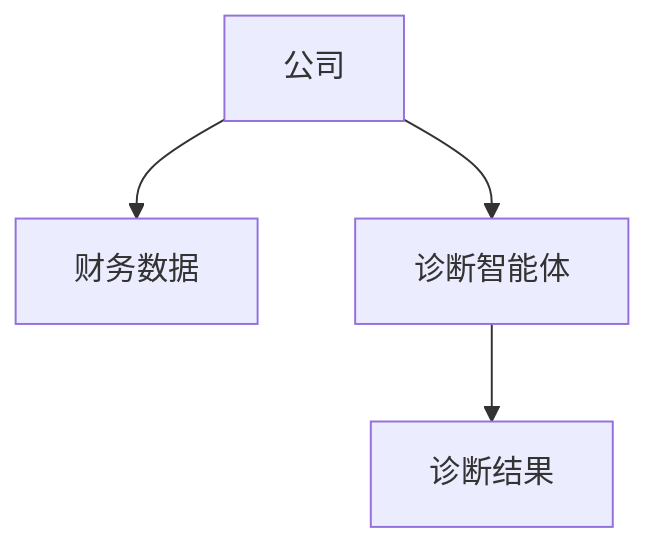
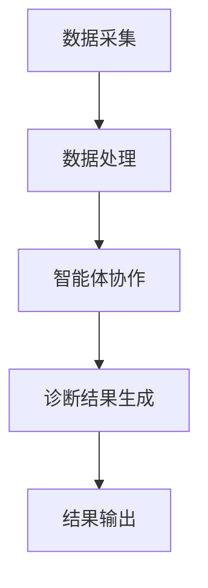
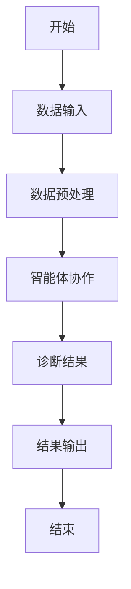

                 


# 基于多智能体的自动化公司财务健康诊断系统

> 关键词：多智能体系统，财务健康诊断，自动化诊断，分布式智能，系统架构设计

> 摘要：本文详细介绍了基于多智能体的自动化公司财务健康诊断系统的设计与实现。通过分析财务诊断的核心问题，提出了一种多智能体协作的解决方案，并探讨了系统的架构设计、算法实现以及实际应用场景。文章内容涵盖了背景介绍、核心概念、算法原理、系统架构、项目实战等多个方面，旨在为读者提供一个全面的技术视角。

---

## 第一部分: 背景介绍

### 第1章: 问题背景与描述

#### 1.1 问题背景
##### 1.1.1 传统财务诊断的局限性
传统的财务诊断方法通常依赖人工分析，存在效率低、主观性强、难以实时反馈等问题。企业财务数据复杂且动态变化快，传统方法难以满足现代企业的高效诊断需求。

##### 1.1.2 自动化诊断的需求
随着企业规模的扩大和业务的复杂化，对财务健康诊断的自动化需求日益迫切。自动化诊断可以提高效率、降低成本，并能够实时监控企业的财务状况。

##### 1.1.3 多智能体技术的应用潜力
多智能体系统通过分布式智能和协作机制，能够高效处理复杂问题。将其应用于财务诊断，可以实现多维度数据的协同分析和实时反馈。

#### 1.2 问题描述
##### 1.2.1 财务健康诊断的核心目标
财务健康诊断的核心目标是通过分析企业的财务数据，评估其财务健康状况，并提供改进建议。

##### 1.2.2 系统需要解决的关键问题
- 数据采集与处理的实时性
- 多维度数据的协同分析
- 系统的可扩展性和灵活性

##### 1.2.3 现有解决方案的不足
现有解决方案通常基于单体系统，难以应对复杂多变的财务数据和实时诊断需求。

### 第2章: 问题解决与边界

#### 2.1 多智能体系统的核心优势
##### 2.1.1 分布式智能的特点
多智能体系统通过分布式的智能体协作，能够更高效地处理复杂问题。

##### 2.1.2 多智能体在财务诊断中的应用
多智能体可以分别负责不同的财务指标分析，协同完成整体诊断。

##### 2.1.3 系统的边界与外延
系统的边界包括数据输入、处理和输出，外延则涉及与企业其他系统的集成。

#### 2.2 系统核心要素组成
##### 2.2.1 多智能体的组成结构
系统由多个智能体组成，每个智能体负责特定的财务指标分析。

##### 2.2.2 财务数据的采集与处理
数据采集包括财务报表、交易记录等，数据处理包括清洗、转换和分析。

##### 2.2.3 系统的输入输出定义
输入：企业财务数据；输出：财务健康诊断结果。

---

## 第二部分: 核心概念与联系

### 第3章: 核心概念原理

#### 3.1 多智能体系统原理
##### 3.1.1 多智能体的基本概念
多智能体是由多个智能体组成的系统，每个智能体具有自主性、反应性和协作性。

##### 3.1.2 多智能体的通信机制
智能体之间通过消息传递进行通信，实现数据共享和协同决策。

##### 3.1.3 多智能体的协作方式
协作方式包括任务分配、协调和冲突解决，确保系统高效运行。

#### 3.2 财务健康诊断原理
##### 3.2.1 财务健康诊断的定义
财务健康诊断是对企业财务状况的全面评估，包括流动性、偿债能力、运营能力和盈利能力等方面。

##### 3.2.2 财务指标的选取与分析
常用的财务指标包括流动比率、速动比率、资产负债率、净利率等。

##### 3.2.3 财务诊断的数学模型
$$\text{流动比率} = \frac{\text{流动资产}}{\text{流动负债}}$$
$$\text{净利率} = \frac{\text{净利润}}{\text{营业收入}}$$

### 第4章: 核心概念属性对比

#### 4.1 多智能体与传统单体系统对比
##### 4.1.1 功能对比
- 多智能体：分布式处理，任务分配灵活
- 单体系统：集中处理，任务单一

##### 4.1.2 性能对比
- 多智能体：扩展性强，适应复杂场景
- 单体系统：性能受限，难以扩展

##### 4.1.3 优缺点对比
| 特性         | 多智能体                  | 单体系统                  |
|--------------|--------------------------|--------------------------|
| 优点         | 高效协作，灵活性高        | 结构简单，易于维护        |
| 缺点         | 系统复杂，维护成本高      | 扩展性差，效率受限        |

#### 4.2 财务诊断系统对比
##### 4.2.1 传统诊断 vs 自动化诊断
- 传统诊断：人工分析，效率低
- 自动化诊断：自动处理，效率高

##### 4.2.2 单点诊断 vs 分布式诊断
- 单点诊断：依赖单一系统，可靠性差
- 分布式诊断：多智能体协作，可靠性高

##### 4.2.3 精度与效率对比
| 系统类型     | 精度                     | 效率                     |
|--------------|--------------------------|--------------------------|
| 传统诊断     | 中等                     | 低                      |
| 自动化诊断    | 高                      | 高                      |

### 第5章: 实体关系与架构设计

#### 5.1 ER实体关系图


#### 5.2 系统架构流程图


---

## 第三部分: 算法原理讲解

### 第6章: 算法原理与流程

#### 6.1 算法流程图


#### 6.2 算法实现代码
```python
class MultiAgentSystem:
    def __init__(self, agents):
        self.agents = agents

    def process_data(self, data):
        for agent in self.agents:
            agent.receive_data(data)

    def get_diagnosis(self):
        results = []
        for agent in self.agents:
            results.append(agent.diagnose())
        return results

# 示例智能体
class FinancialAgent:
    def __init__(self, name):
        self.name = name
        self.data = None

    def receive_data(self, data):
        self.data = data

    def diagnose(self):
        # 示例诊断逻辑
        if self.data['流动比率'] > 2:
            return '健康'
        else:
            return '不健康'
```

#### 6.3 算法的数学模型
$$\text{诊断结果} = f(\text{流动比率}, \text{速动比率}, \text{资产负债率}, \text{净利率})$$

---

## 结语

通过本文的详细介绍，我们深入探讨了基于多智能体的自动化公司财务健康诊断系统的设计与实现。从背景介绍到算法实现，从系统架构到项目实战，我们展示了如何利用多智能体技术提升财务诊断的效率和准确性。未来，随着技术的不断发展，多智能体系统在财务诊断中的应用潜力将更加广阔。

---

作者：AI天才研究院 & 禅与计算机程序设计艺术

