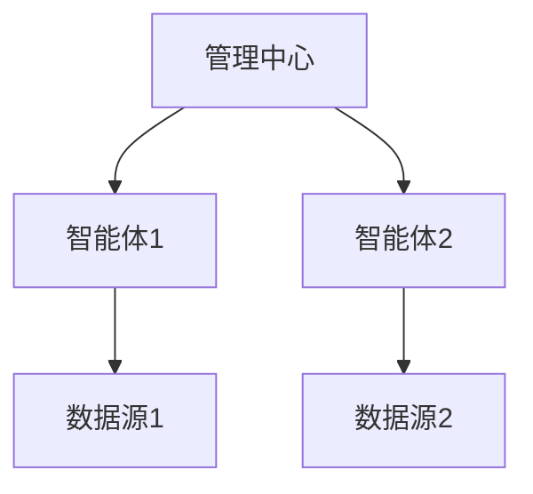
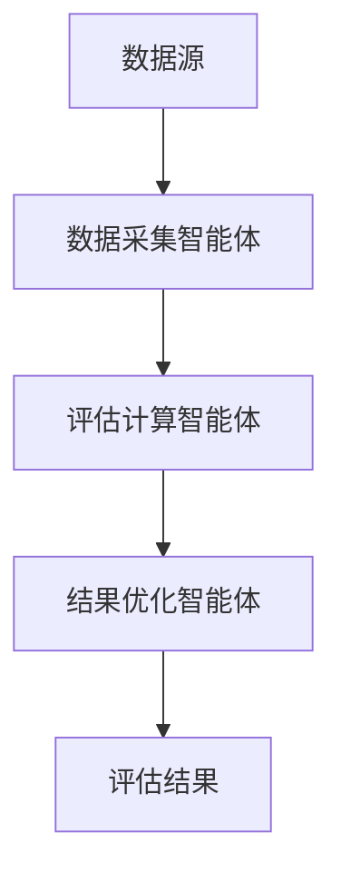
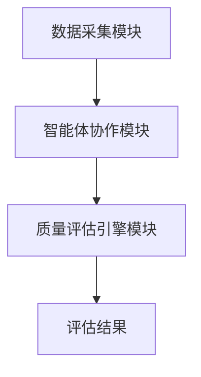
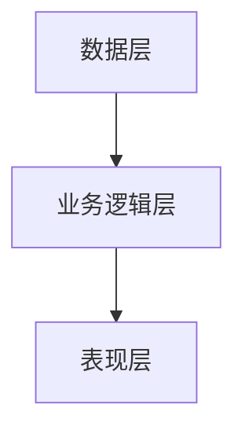
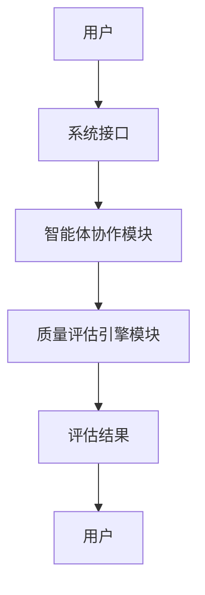

                 

<think>
好的，我将按照您的要求来逐步撰写这篇文章。首先，我会介绍文章的标题、关键词和摘要。然后，我会按照目录大纲逐步展开每一部分的内容，确保每个章节都有丰富的细节和具体的例子。文章将使用markdown格式，并包含mermaid图表和latex公式，以清晰地解释概念和算法。

让我们开始吧！

# 基于多智能体的自动化公司质量评估

## 关键词
- 多智能体系统
- 公司质量评估
- 自动化评估
- 智能协同
- 企业绩效分析

## 摘要
本文探讨了基于多智能体的自动化公司质量评估方法。通过分析多智能体系统的核心概念和公司质量评估的指标体系，提出了一种结合多智能体协同算法的自动化评估框架。文章详细介绍了系统的架构设计、算法实现和实际应用场景，展示了如何利用多智能体系统的优势，实现对公司质量的高效、精准评估。

---

# 第1章: 多智能体系统与公司质量评估的背景

## 1.1 多智能体系统的基本概念

### 1.1.1 多智能体系统的定义
多智能体系统（Multi-Agent System, MAS）是由多个智能体（Agent）组成的系统，这些智能体能够通过协作完成复杂的任务。每个智能体都有一定的自主性，能够感知环境、做出决策并与其他智能体进行通信和协作。

### 1.1.2 多智能体系统的特征
| 特征 | 描述 |
|------|------|
| 分布性 | 智能体分布在网络中，独立运行 |
| 协作性 | 智能体之间通过协作完成任务 |
| 反应性 | 智能体能够实时感知环境并做出反应 |
| 学习性 | 智能体能够通过学习优化行为 |

### 1.1.3 多智能体系统在企业中的应用
- 资源分配与调度
- 供应链管理
- 风险评估
- 质量控制

## 1.2 公司质量评估的定义与重要性

### 1.2.1 公司质量评估的定义
公司质量评估是通过一系列指标对公司整体表现进行评价的过程，包括财务表现、运营效率、市场竞争力等多个方面。

### 1.2.2 公司质量评估的指标体系
| 指标类别 | 指标名称 | 描述 |
|----------|----------|------|
| 财务指标 | 净利润 | 公司的盈利情况 |
| 运营指标 | 生产效率 | 生产过程中的效率 |
| 市场指标 | 市场占有率 | 公司在市场中的份额 |

### 1.2.3 公司质量评估的挑战与机遇
- 挑战：数据复杂性、评估标准不统一
- 机遇：智能化工具的应用、数据驱动的决策

## 1.3 多智能体系统在公司质量评估中的应用前景

### 1.3.1 多智能体系统的优势
- 并行处理能力
- 分布式决策能力
- 高度协作能力

### 1.3.2 多智能体系统在公司质量评估中的潜在应用场景
- 数据采集与处理
- 指标计算与分析
- 评估结果优化

### 1.3.3 多智能体系统应用的挑战与解决方案
- 挑战：通信延迟、数据隐私
- 解决方案：优化通信机制、数据加密技术

---

# 第2章: 多智能体系统与公司质量评估的核心概念

## 2.1 多智能体系统的组成与功能

### 2.1.1 智能体的定义与分类
- 定义：智能体是能够感知环境并采取行动的实体。
- 分类：基于智能水平，分为反应式智能体、认知式智能体。

### 2.1.2 多智能体系统的架构


### 2.1.3 多智能体系统的协作机制
- 通信机制：通过消息传递进行协作
- 协调机制：通过协商达成一致

## 2.2 公司质量评估的指标体系

### 2.2.1 质量评估的核心指标
- 财务指标：净利润、营业收入
- 运营指标：生产效率、库存周转率
- 市场指标：市场份额、品牌价值

### 2.2.2 指标权重的确定方法
- 加权平均法
- 层次分析法（AHP）

### 2.2.3 指标数据的采集与处理
- 数据采集：从财务报表、生产记录中获取
- 数据处理：清洗、转换、集成

## 2.3 多智能体系统与公司质量评估的结合

### 2.3.1 多智能体系统在公司质量评估中的角色
- 数据采集智能体：负责数据的收集与传输
- 评估计算智能体：负责指标的计算与分析
- 结果优化智能体：负责评估结果的优化与反馈

### 2.3.2 多智能体系统与公司质量评估的协同机制


### 2.3.3 多智能体系统在公司质量评估中的优势
- 高效性：多个智能体并行处理数据
- 精准性：智能体协同优化评估结果
- 灵活性：可以根据需求动态调整评估指标

---

# 第3章: 多智能体系统与公司质量评估的算法原理

## 3.1 多智能体系统的算法基础

### 3.1.1 多智能体系统的核心算法
- 分布式算法
- 协作算法

### 3.1.2 多智能体系统的通信机制
- 消息传递协议
- 事件驱动机制

### 3.1.3 多智能体系统的协调与决策算法
- 基于强化学习的协调算法
- 基于博弈论的决策算法

## 3.2 公司质量评估的算法实现

### 3.2.1 数据预处理与特征提取
- 数据清洗：去除噪声数据
- 特征提取：提取关键指标

### 3.2.2 基于多智能体的评估模型构建
- 系统设计：构建多智能体协同的评估模型
- 模型训练：使用历史数据训练模型

### 3.2.3 基于多智能体的评估结果优化
- 智能体协作优化：通过智能体间的协作优化评估结果

## 3.3 多智能体系统与公司质量评估的协同算法

### 3.3.1 多智能体协同算法的数学模型
$$ Q(s, a) = r + \gamma \max Q(s', a') $$

### 3.3.2 多智能体协同算法的实现步骤
1. 初始化智能体状态
2. 智能体感知环境并采取行动
3. 计算奖励并更新Q值
4. 重复步骤直到目标达成

### 3.3.3 多智能体协同算法的优化策略
- 增量式更新：逐步优化Q值
- 分布式训练：多个智能体同时训练

---

# 第4章: 多智能体系统与公司质量评估的系统架构

## 4.1 系统总体架构设计

### 4.1.1 系统功能模块划分
| 模块名称 | 功能描述 |
|----------|----------|
| 数据采集模块 | 采集公司质量数据 |
| 智能体协作模块 | 协调多个智能体完成任务 |
| 质量评估引擎模块 | 计算并输出评估结果 |

### 4.1.2 系统功能模块之间的关系


### 4.1.3 系统功能模块的交互流程
1. 数据采集模块获取数据
2. 智能体协作模块协调智能体处理数据
3. 质量评估引擎模块计算评估结果
4. 输出最终评估结果

## 4.2 系统功能模块的详细设计

### 4.2.1 数据采集模块的设计
- 数据源：财务报表、生产记录
- 数据采集方式：实时采集、批量采集

### 4.2.2 智能体协作模块的设计
- 通信机制：消息队列
- 协作机制：任务分配与反馈

### 4.2.3 质量评估引擎模块的设计
- 计算模型：层次分析法
- 优化算法：遗传算法

## 4.3 系统架构设计

### 4.3.1 系统架构的组成部分
- 数据层：数据存储与管理
- 业务逻辑层：智能体协作与计算
- 表现层：评估结果的展示

### 4.3.2 系统架构的实现


### 4.3.3 系统接口设计
- 数据接口：数据采集与传输
- 业务接口：智能体协作与计算

## 4.4 系统交互设计

### 4.4.1 系统交互流程
1. 用户输入评估需求
2. 系统分配任务给智能体
3. 智能体协作完成任务
4. 系统输出评估结果

### 4.4.2 系统交互的详细步骤


---

# 第5章: 项目实战与案例分析

## 5.1 项目环境安装

### 5.1.1 环境要求
- 操作系统：Linux/Windows
- 开发工具：Python、Jupyter Notebook
- 依赖库：NumPy、Pandas、Scikit-learn

### 5.1.2 安装步骤
```bash
pip install numpy pandas scikit-learn
```

## 5.2 系统核心实现源代码

### 5.2.1 数据预处理代码
```python
import pandas as pd

# 数据加载
data = pd.read_csv('company_data.csv')

# 数据清洗
data.dropna(inplace=True)

# 特征提取
features = data[['revenue', 'profit', 'market_share']]
```

### 5.2.2 智能体协作代码
```python
from agents import Agent

# 初始化智能体
agents = [Agent() for _ in range(3)]

# 智能体协作
for agent in agents:
    agent.collaborate(data)
```

### 5.2.3 评估结果生成代码
```python
from assessment import Evaluator

# 初始化评估器
evaluator = Evaluator()

# 生成评估结果
result = evaluator.evaluate(agents)
```

## 5.3 实际案例分析

### 5.3.1 案例背景
- 公司A：制造业公司，需要评估产品质量和生产效率

### 5.3.2 评估过程
1. 数据采集：收集产品质量数据
2. 数据处理：清洗和转换数据
3. 智能体协作：多个智能体协同计算评估指标
4. 评估结果：生成最终评估报告

### 5.3.3 评估结果分析
- 产品质量得分：90分
- 生产效率得分：85分
- 综合评估：优秀

---

# 第6章: 总结与展望

## 6.1 小结
本文详细介绍了基于多智能体的自动化公司质量评估方法，提出了系统的架构设计和算法实现，展示了其在实际应用中的优势。

## 6.2 注意事项
- 数据隐私保护
- 系统稳定性和可靠性
- 智能体协作效率

## 6.3 未来研究方向
- 更复杂的多智能体协作算法
- 更高效的评估模型
- 多智能体系统的可扩展性研究

---

# 参考文献

1. 书籍：《多智能体系统》
2. 论文：《基于多智能体的公司质量评估方法研究》
3. 网站：多智能体系统相关技术资料

---

# 附录

## 附录A: 数据集
- 数据来源：公司财务报表、生产记录
- 数据格式：CSV

## 附录B: 工具安装指南
```bash
pip install numpy pandas scikit-learn
```

## 附录C: 扩展阅读资料
- 多智能体系统研究现状
- 自动化评估工具开发指南

---

作者：AI天才研究院/AI Genius Institute & 禅与计算机程序设计艺术 /Zen And The Art of Computer Programming

---

**文章总结：**
本文通过系统地介绍基于多智能体的自动化公司质量评估方法，展示了多智能体系统在企业中的广泛应用潜力。从理论到实践，详细讲解了系统的架构设计、算法实现和实际案例，为读者提供了全面的技术指导和实践参考。

