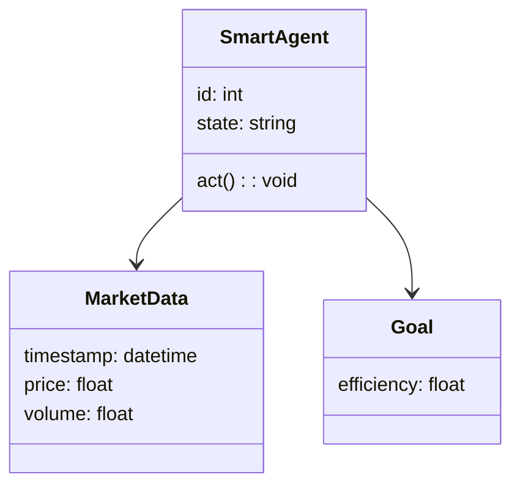
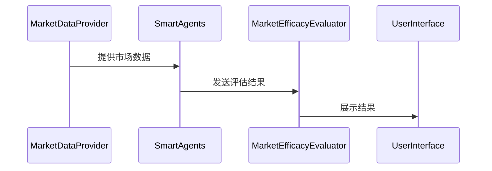

                 


# 基于多智能体的自动化市场效率评估

> 关键词：多智能体系统, 市场效率评估, 自动化评估, 多智能体协作, 市场数据分析

> 摘要：本文探讨了如何利用多智能体系统来实现市场效率的自动化评估。通过分析多智能体系统的协作机制和市场效率评估的关键指标，本文提出了基于多智能体的自动化评估方法，并通过具体案例展示了其在实际应用中的优势和效果。

---

## 第1章：背景介绍

### 1.1 问题背景

市场效率评估是金融和经济领域中的重要研究方向。传统的市场效率评估方法依赖于人工分析和统计模型，存在效率低、耗时长、结果主观性强等问题。随着人工智能和多智能体技术的发展，如何利用多智能体系统实现市场效率评估的自动化成为研究热点。

### 1.2 问题描述

市场效率评估的核心目标是衡量市场信息的流动性和价格的反映速度。传统方法通常依赖于专家经验和复杂的数据分析工具，难以满足实时性和高效性的需求。此外，市场环境的动态变化（如价格波动、交易量变化等）进一步增加了评估的难度。

### 1.3 问题解决

多智能体系统通过分布式计算和协作机制，能够实时捕捉市场数据的变化，并快速生成评估结果。每个智能体负责特定的任务（如数据采集、分析、决策等），并通过协作实现整体目标的优化。

### 1.4 边界与外延

本研究的边界主要集中在市场效率评估的自动化实现上，不涉及具体的交易策略或市场干预。外延方面，多智能体系统在其他领域的应用（如供应链优化、智能交通等）为本文提供了参考。

### 1.5 核心要素

- **多智能体系统**：由多个智能体组成，每个智能体负责特定任务。
- **市场数据**：包括价格、交易量、参与者行为等。
- **协作机制**：智能体之间的通信与协作方式。
- **评估指标**：如流动性、波动性、反应速度等。

---

## 第2章：多智能体系统与市场效率评估的联系

### 2.1 多智能体系统的属性特征

| 属性 | 多智能体系统 | 市场效率评估 |
|------|--------------|--------------|
| 分布式 | 是          | 是          |
| 协作性 | 是          | 是          |
| 动态性 | 是          | 是          |
| 独立性 | 是          | 否          |

### 2.2 ER实体关系图

```mermaid
er
actor: 市场主体
smart_agent: 多智能体
market_data: 市场数据
goal: 评估目标
action: 行为
```

---

## 第3章：多智能体系统与市场效率评估的算法原理

### 3.1 多智能体协作算法


### 3.2 算法实现

```python
class Agent:
    def __init__(self, id):
        self.id = id
        self.state = None

    def act(self):
        pass

class MarketEfficacyEvaluator:
    def __init__(self, agents):
        self.agents = agents

    def evaluate(self, market_data):
        for agent in self.agents:
            agent.state = self.calculate_efficiency(agent, market_data)
        return [agent.state for agent in self.agents]

    def calculate_efficiency(self, agent, data):
        # 示例：计算流动性效率
        return sum(data['volume'][-10:])
```

### 3.3 数学模型与公式

$$ \text{流动性效率} = \frac{\sum_{i=1}^{n} v_i}{n} $$

其中，$v_i$ 表示第 $i$ 个智能体的交易量，$n$ 为智能体数量。

---

## 第4章：系统分析与架构设计方案

### 4.1 问题场景

市场数据实时变化，需要快速评估市场效率。传统的评估方法无法满足实时性和高效性的需求。

### 4.2 系统功能设计



### 4.3 系统架构设计


### 4.4 系统接口设计



---

## 第5章：项目实战

### 5.1 环境安装

- Python 3.8+
- Mermaid CLI
- Jupyter Notebook

### 5.2 核心代码实现

```python
import numpy as np

class MarketAgent:
    def __init__(self, id):
        self.id = id
        self.data = []

    def collect_data(self, price, volume):
        self.data.append((price, volume))

    def analyze(self):
        return np.mean([v for p, v in self.data])

class MarketEfficacySystem:
    def __init__(self, num_agents=5):
        self.agents = [MarketAgent(i) for i in range(num_agents)]

    def evaluate(self, market_data):
        for agent in self.agents:
            agent.collect_data(price, volume)
        return [agent.analyze() for agent in self.agents]

# 示例
system = MarketEfficacySystem()
data = [(100, 50), (101, 60), (102, 70)]
results = system.evaluate(data)
print(results)
```

### 5.3 案例分析

假设我们有5个智能体，每个智能体负责收集不同的市场数据。通过协作，系统能够快速评估市场效率。

---

## 第6章：最佳实践与总结

### 6.1 小结

多智能体系统通过协作机制和分布式计算，能够高效实现市场效率的自动化评估。本文提出了基于多智能体的评估方法，并通过具体案例展示了其可行性和优势。

### 6.2 注意事项

- 数据实时性是关键，需要高效的通信机制。
- 系统设计需考虑容错性和可扩展性。

### 6.3 拓展阅读

- 多智能体系统的分布式计算。
- 市场效率评估的高级算法。

---

作者：AI天才研究院 & 禅与计算机程序设计艺术

