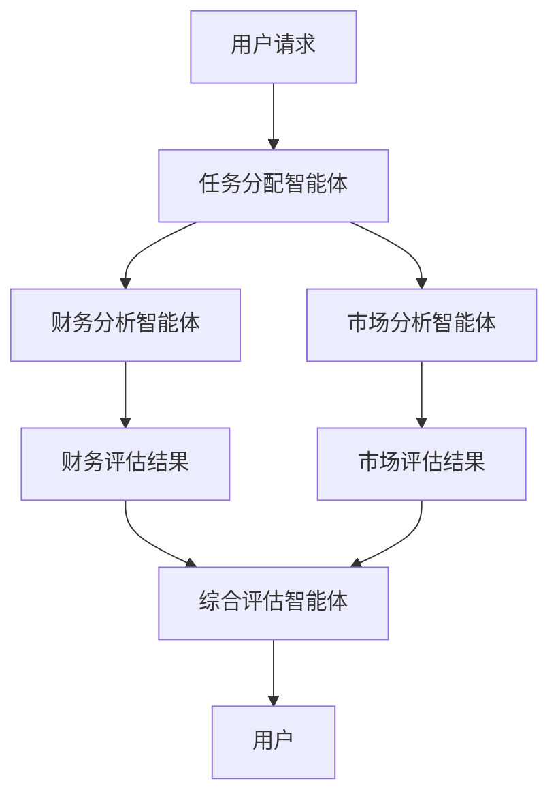
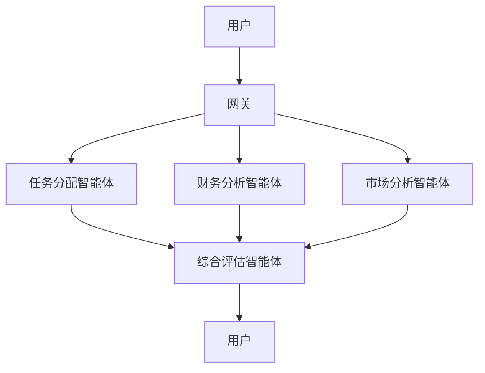
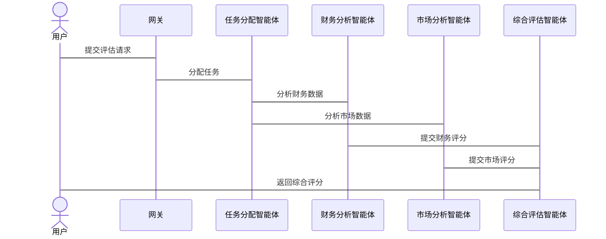

                 


```markdown
# 基于多智能体的自动化并购机会分析

> 关键词：多智能体系统, 自动化并购分析, 并购机会, 算法原理, 系统架构, 项目实战

> 摘要：本文探讨了如何利用多智能体系统来实现自动化并购机会分析。首先介绍了多智能体系统的基本概念和并购分析的核心原理，然后详细阐述了多智能体系统在并购机会分析中的算法原理和系统架构设计，最后通过具体案例展示了项目的实际应用。本文旨在为读者提供一个全面的视角，帮助其理解多智能体系统在并购机会分析中的潜力和应用。

---

## 第1章: 多智能体系统与并购分析概述

### 1.1 多智能体系统的基本概念
多智能体系统（Multi-Agent System, MAS）是指由多个智能体（Agent）组成的系统，这些智能体能够通过协作完成复杂的任务。与传统的单智能体系统相比，多智能体系统具有分布式计算、自主性、反应性和协作性等特性。智能体之间通过通信和协作，能够共同完成比单个智能体更复杂的任务。

### 1.2 并购分析的基本概念
并购分析是企业在寻找潜在并购目标时，对目标企业进行详细评估的过程。评估内容包括财务状况、市场竞争力、管理团队等多个方面。传统的并购分析依赖于人工判断，存在效率低、主观性强等问题。

### 1.3 多智能体系统与并购分析的结合
多智能体系统在并购分析中的应用，主要是通过多个智能体协作，分别从不同的维度对目标企业进行评估，从而提高分析的全面性和准确性。例如，一个智能体可以负责财务数据分析，另一个负责市场竞争力评估，多个智能体协同工作，最终生成综合评估报告。

## 第2章: 多智能体系统的核心概念与联系

### 2.1 多智能体系统的原理
多智能体系统的协作机制是其核心，主要包括通信协议、任务分配和同步机制。通信协议决定了智能体之间如何交换信息，任务分配决定了如何将任务分配给不同的智能体，而同步机制则确保了各个智能体之间的协调一致。

### 2.2 并购分析的核心概念
并购分析的核心是评估目标企业的价值和风险。评估指标包括财务指标（如ROE、净利润率）、市场指标（如市场份额）、管理指标（如管理团队稳定性）等。

### 2.3 多智能体系统与并购分析的实体关系图
```mermaid
er
actor: 用户
goal: 自动化并购机会分析
system: 多智能体系统
actor --> system: 请求分析
system --> actor: 返回结果
```

## 第3章: 多智能体系统在并购机会分析中的算法原理

### 3.1 多智能体协作算法
多智能体协作算法的核心是任务分配和同步。任务分配算法可以根据智能体的能力和当前负载进行动态分配，而同步机制则通过时间戳或版本号来确保数据的一致性。

### 3.2 并购机会评估算法
并购机会评估算法基于多智能体的协同，分别从财务、市场、管理等多个维度对目标企业进行评估。每个智能体负责一个维度的评估，并将结果汇总到主智能体，最终生成综合评估报告。

### 3.3 算法流程图


### 3.4 算法数学模型
综合评估智能体的评估公式如下：
$$
\text{综合评分} = \alpha \times \text{财务评分} + \beta \times \text{市场评分} + \gamma \times \text{管理评分}
$$
其中，$\alpha + \beta + \gamma = 1$，权重可以根据具体情况进行调整。

## 第4章: 系统分析与架构设计

### 4.1 问题场景介绍
企业在进行并购时，需要对多个目标企业进行评估。传统的评估方法效率低下，且容易受到人为因素的影响。通过多智能体系统，可以实现自动化评估，提高效率和准确性。

### 4.2 系统功能设计
系统功能包括：
1. 用户请求处理
2. 任务分配
3. 多维度评估
4. 结果汇总与输出

### 4.3 系统架构设计


### 4.4 接口设计
系统提供如下接口：
1. 提交评估请求
2. 获取评估结果
3. 设置评估权重

### 4.5 交互流程图


## 第5章: 项目实战

### 5.1 环境安装
需要安装以下工具：
- Python 3.8+
- Mermaid CLI
- Python的数学库（如NumPy、Pandas）

### 5.2 核心代码实现
```python
class Agent:
    def __init__(self, id):
        self.id = id
        self.load = 0

    def process_task(self, task):
        pass

class TaskAllocator:
    def __init__(self, agents):
        self.agents = agents

    def allocate_task(self, task):
        # 简单的负载均衡算法
        agent = min(self.agents, key=lambda x: x.load)
        agent.load += 1
        return agent
```

### 5.3 代码解读
上述代码定义了一个基本的多智能体系统，其中`Agent`类表示一个智能体，`TaskAllocator`类负责任务分配。任务分配采用负载均衡算法，确保任务均匀分配给各个智能体。

### 5.4 案例分析
假设我们要评估两个目标企业，分别从财务和市场两个维度进行分析。我们创建两个智能体，一个负责财务分析，另一个负责市场分析。任务分配智能体将任务分配给相应的智能体，最终由综合评估智能体生成综合评分。

### 5.5 项目小结
通过该项目，我们实现了基于多智能体系统的自动化并购机会分析。通过任务分配和协作，提高了评估的效率和准确性。

## 第6章: 总结与展望

### 6.1 本章小结
本文详细探讨了基于多智能体系统的自动化并购机会分析，从理论到实践，全面介绍了系统的实现过程。

### 6.2 最佳实践 tips
- 在实际应用中，可以根据具体需求调整任务分配算法和评估模型。
- 定期更新评估模型，以适应市场变化。

### 6.3 注意事项
- 确保智能体之间的通信安全，防止数据泄露。
- 定期维护系统，确保各智能体的高效协作。

### 6.4 拓展阅读
- 多智能体系统的分布式计算
- 机器学习在并购分析中的应用

---

## 作者信息

作者：AI天才研究院/AI Genius Institute & 禅与计算机程序设计艺术 /Zen And The Art of Computer Programming
```

