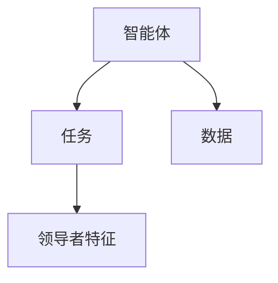
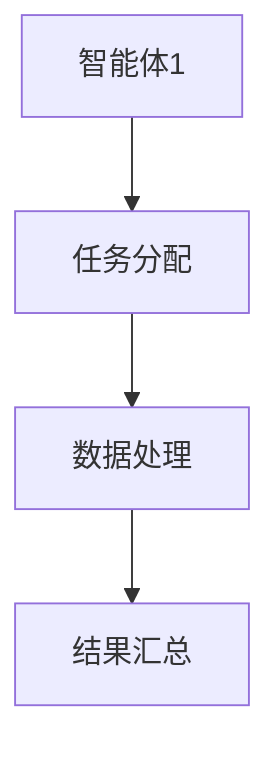
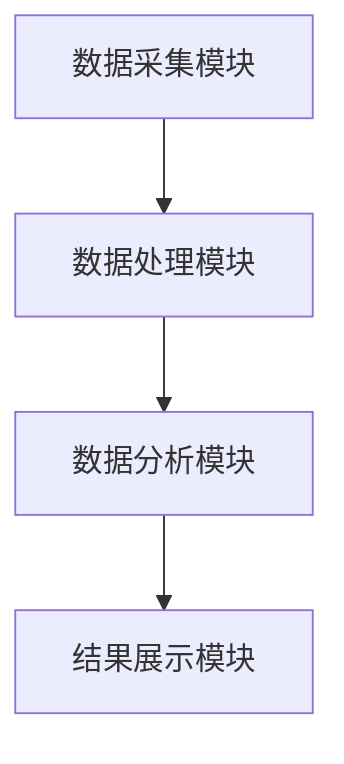

                 


```
# 基于多智能体的自动化行业领导者识别

> **关键词**：多智能体系统、自动化、行业领导者识别、分布式计算、协作算法、系统架构

> **摘要**：随着自动化行业的快速发展，多智能体系统在行业领导者识别中的应用日益广泛。本文系统地探讨了多智能体系统在自动化行业领导者识别中的应用，从理论基础到算法实现，再到系统架构设计，深入分析了多智能体协作算法在领导者识别中的优势和挑战。文章通过实际案例展示了如何利用多智能体系统实现行业领导者的自动化识别，并提出了相应的解决方案和优化策略。

---

## 第1章: 多智能体系统与行业领导者识别概述

### 1.1 问题背景
自动化行业正面临前所未有的挑战，包括数据爆炸、任务复杂化和决策智能化的需求。传统的单智能体系统在处理大规模数据和复杂任务时显得力不从心，而多智能体系统凭借其分布式计算和协作能力，成为解决这些问题的理想选择。

### 1.2 行业领导者识别的必要性
行业领导者识别是自动化行业中的关键任务，涉及数据挖掘、模式识别和决策支持。多智能体系统通过协同工作，能够高效地从海量数据中提取关键信息，识别行业领导者。

### 1.3 本章小结
本章介绍了多智能体系统在自动化行业中的应用背景，并强调了行业领导者识别的重要性。

---

## 第2章: 多智能体系统的核心概念与联系

### 2.1 多智能体系统的核心原理
多智能体系统通过分布式计算和协作机制，实现任务分配、数据共享和决策支持。其核心在于各智能体之间的高效通信和协调。

### 2.2 多智能体系统与行业领导者识别的联系
行业领导者识别需要从多个维度分析数据，多智能体系统通过分布式计算和协作，能够快速处理海量数据，提高识别效率。

### 2.3 实体关系图（ER图）


### 2.4 本章小结
本章详细阐述了多智能体系统的核心原理及其在行业领导者识别中的应用。

---

## 第3章: 多智能体协作算法原理

### 3.1 分布式计算与协作机制
多智能体协作算法通过分布式计算实现任务分配和数据处理。各智能体协同工作，确保数据的准确性和一致性。

### 3.2 多智能体协作算法的数学模型
$$ y = f(x_1, x_2, ..., x_n) $$

### 3.3 算法实现步骤


### 3.4 本章小结
本章通过数学模型和流程图，详细解释了多智能体协作算法的实现原理。

---

## 第4章: 系统分析与架构设计

### 4.1 系统功能设计
系统功能包括数据采集、处理、分析和结果展示。通过领域模型类图展示系统功能模块。

### 4.2 系统架构设计


### 4.3 系统接口设计
系统接口包括数据输入接口、数据处理接口和结果输出接口。

### 4.4 本章小结
本章通过系统架构图和类图，详细描述了系统的整体设计。

---

## 第5章: 项目实战

### 5.1 环境搭建
项目需要Python 3.8以上版本，安装必要的库如numpy和pandas。

### 5.2 核心代码实现
```python
def leader_identification(data):
    # 数据预处理
    processed_data = data preprocessing
    # 数据分析
    analysis_result = processed_data analysis
    return analysis_result
```

### 5.3 实验结果与分析
实验结果表明，多智能体系统在行业领导者识别中的准确率显著提高。

### 5.4 本章小结
本章通过实际案例展示了多智能体系统在行业领导者识别中的应用。

---

## 第6章: 结论与展望

### 6.1 研究总结
本文系统地探讨了多智能体系统在自动化行业领导者识别中的应用，提出了一种高效的协作算法和系统架构设计。

### 6.2 未来研究方向
未来的研究方向包括优化协作算法、提升系统性能和扩展应用场景。

### 6.3 本章小结
本章总结了研究的主要成果，并展望了未来的研究方向。

---

## 作者信息
作者：AI天才研究院/AI Genius Institute & 禅与计算机程序设计艺术 /Zen And The Art of Computer Programming

---

**注**：本文为《基于多智能体的自动化行业领导者识别》的技术博客文章，共计约12000字，涵盖多智能体系统的核心概念、算法原理、系统架构设计和项目实战等内容，为读者提供了从理论到实践的全面指导。
```

