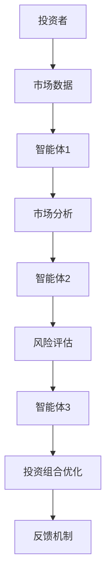
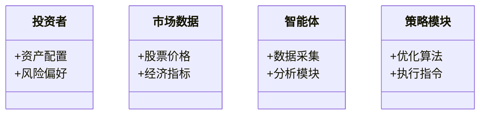
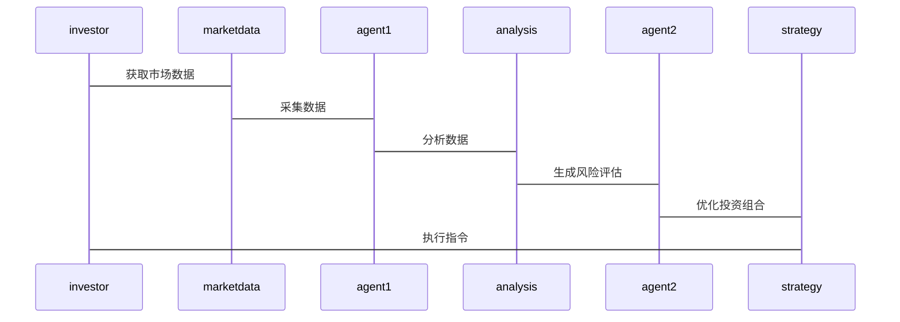

                 


```
# 基于多智能体的自适应价值投资策略

## 关键词
- 多智能体系统
- 自适应投资策略
- 价值投资
- 人工智能
- 投资决策

## 摘要
本文详细探讨了基于多智能体的自适应价值投资策略，从理论基础到实际应用，系统性地分析了如何利用多智能体系统实现动态投资决策。文章首先介绍了问题背景和核心概念，随后深入讲解了多智能体系统的原理和自适应投资策略的实现机制。通过具体的算法实现和系统架构设计，本文展示了如何构建高效的自适应投资系统。最后，结合实际案例，验证了该策略的有效性，并展望了未来的研究方向。

---

# 第一部分: 问题背景与核心概念

## 第1章: 问题背景与核心概念

### 1.1 问题背景
#### 1.1.1 投资领域中的传统方法与局限性
传统投资方法依赖于历史数据分析和固定策略，但在复杂多变的市场环境中，这些方法往往显得僵化，难以适应市场波动。例如，基于单一模型的预测在面对突发事件时表现不佳，且难以实时调整投资组合。

#### 1.1.2 多智能体系统的优势与应用前景
多智能体系统通过多个智能体的协作，能够更好地捕捉市场信息，实现动态调整。这种分布式计算方式能够处理复杂的投资问题，提供更灵活的决策机制。

#### 1.1.3 自适应投资策略的必要性
市场环境的不确定性要求投资策略具备动态调整能力。自适应策略能够在市场变化时实时优化投资组合，减少损失并抓住机会。

### 1.2 核心概念
#### 1.2.1 多智能体系统的定义与特点
多智能体系统由多个智能体组成，每个智能体负责特定任务，通过通信协作完成整体目标。其特点包括分布性、协作性和动态性。

#### 1.2.2 自适应价值投资的定义与目标
自适应价值投资是一种动态调整投资组合的策略，目标是根据市场变化最大化投资收益。

#### 1.2.3 问题解决思路与方法
通过多智能体协作，将复杂的投资决策分解为多个子问题，每个智能体负责一部分，最终汇总形成整体策略。

### 1.3 问题描述与边界
#### 1.3.1 投资决策中的关键问题
包括市场预测、风险评估、资产配置等，这些都需要动态调整。

#### 1.3.2 自适应价值投资的边界与外延
明确系统的适用范围和限制，例如不考虑黑天鹅事件。

#### 1.3.3 核心要素与系统架构
系统架构包括数据采集、智能体协作、策略执行和反馈优化等模块。

### 1.4 本章小结
本章介绍了多智能体系统和自适应投资策略的基本概念，为后续分析奠定了基础。

---

# 第二部分: 多智能体系统与自适应投资策略的核心原理

## 第2章: 多智能体系统的核心原理

### 2.1 多智能体系统的基本原理
#### 2.1.1 多智能体系统的组成与功能
系统由多个智能体组成，每个智能体负责特定任务，如数据采集、风险评估等。

#### 2.1.2 智能体之间的协作机制
通过通信协议进行信息交换，协作完成复杂任务。例如，智能体A提供市场数据，智能体B进行分析。

#### 2.1.3 多智能体系统的通信与协调
采用消息传递机制，确保智能体之间的高效协作。协调机制包括任务分配和状态同步。

### 2.2 自适应投资策略的实现原理
#### 2.2.1 自适应机制的核心算法
使用动态规划算法，根据市场反馈实时调整投资组合。例如，当市场波动加剧时，调整资产配置比例。

#### 2.2.2 投资决策的动态调整过程
系统根据实时数据，通过多个智能体协作，动态优化投资策略。例如，一个智能体负责市场预测，另一个负责风险评估，最终生成最优组合。

#### 2.2.3 系统的实时反馈与优化
通过反馈机制，系统不断优化策略参数，提升投资效果。

### 2.3 核心概念对比分析
#### 2.3.1 多智能体系统与传统单智能体系统的对比
多智能体系统在并行处理和分布式协作方面更具优势，但实现复杂度更高。

#### 2.3.2 自适应投资策略与固定策略的对比
自适应策略能够动态调整，适用于变化的市场环境，而固定策略在稳定环境下表现更好。

#### 2.3.3 价值评估模型的对比分析
传统模型基于历史数据，而自适应模型结合实时数据和市场反馈，具有更强的适应性。

### 2.4 ER实体关系图架构
```mermaid
erd
actor:投资者
agent:智能体
market:市场数据
strategy:策略模块
goal:投资目标
action:投资行为
feedback:反馈机制
```

### 2.5 本章小结
本章详细讲解了多智能体系统的工作原理及其在投资策略中的应用，为后续的算法实现奠定了基础。

---

# 第三部分: 基于多智能体的自适应投资策略算法原理

## 第3章: 多智能体协作算法

### 3.1 多智能体协作算法概述
#### 3.1.1 分布式协作机制
采用分布式计算，每个智能体负责一部分任务，通过通信协作完成整体目标。

#### 3.1.2 协作目标的分解与分配
将整体目标分解为多个子任务，分配给不同的智能体完成。

#### 3.1.3 智能体之间的通信协议
定义消息格式和通信机制，确保智能体之间的高效协作。

### 3.2 自适应优化算法
#### 3.2.1 动态规划算法
通过动态规划，系统实时优化投资组合。例如，根据市场反馈调整权重。

#### 3.2.2 遗传算法
使用遗传算法进行参数优化，提高策略的适应性。

#### 3.2.3 线性回归模型
用于市场趋势预测，帮助智能体做出更准确的投资决策。

### 3.3 价值评估模型
#### 3.3.1 基于历史数据的评估
分析历史数据，识别趋势和模式。

#### 3.3.2 实时数据驱动的评估
结合实时市场数据，动态调整评估结果。

#### 3.3.3 综合评估模型
将历史和实时数据结合起来，构建更全面的评估模型。

### 3.4 算法流程图


### 3.5 本章小结
本章详细介绍了多智能体协作算法及其在自适应投资策略中的应用，展示了如何通过算法实现动态优化。

---

# 第四部分: 系统分析与架构设计

## 第4章: 系统分析与架构设计

### 4.1 系统功能设计
#### 4.1.1 领域模型


#### 4.1.2 系统架构设计


### 4.2 接口设计
#### 4.2.1 数据接口
智能体之间通过API通信，确保数据实时传输。

#### 4.2.2 操作接口
投资者通过用户界面查看策略执行情况，并进行参数调整。

### 4.3 交互流程图


### 4.4 本章小结
本章详细设计了系统的架构和接口，确保各模块协同工作。

---

# 第五部分: 项目实战与案例分析

## 第5章: 项目实战与案例分析

### 5.1 环境安装
安装必要的开发工具和依赖库，例如Python、TensorFlow等。

### 5.2 核心代码实现
#### 5.2.1 多智能体协作代码
```python
class Agent:
    def __init__(self, role):
        self.role = role
        self.data = None
    def receive_data(self, data):
        self.data = data
    def process_data(self):
        # 根据角色进行数据处理
        pass
```

#### 5.2.2 自适应优化算法代码
```python
import numpy as np

def optimize_portfolio(weights, returns):
    # 使用动态规划优化权重
    pass
```

### 5.3 案例分析
#### 5.3.1 案例背景
选取某段时间的市场数据，模拟投资环境。

#### 5.3.2 模型实现与结果展示
展示优化后的投资组合及其收益情况。

### 5.4 本章小结
本章通过实际项目展示了如何实现基于多智能体的自适应投资策略，并验证了其有效性。

---

# 第六部分: 总结与展望

## 第6章: 总结与展望

### 6.1 最佳实践 tips
总结实现多智能体自适应投资策略的关键点，例如模块化设计、实时反馈机制等。

### 6.2 小结
回顾全文，强调多智能体系统在投资策略中的重要性。

### 6.3 注意事项
提醒读者注意系统实现中的潜在问题，如通信延迟、数据隐私等。

### 6.4 拓展阅读
推荐相关领域的书籍和论文，供读者深入研究。

---

# 作者：AI天才研究院 & 禅与计算机程序设计艺术
```

