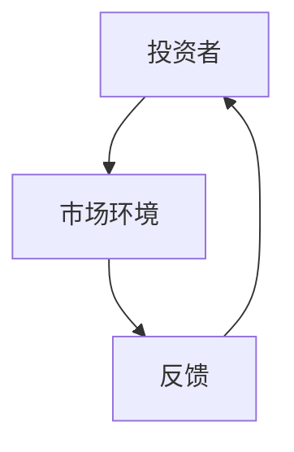
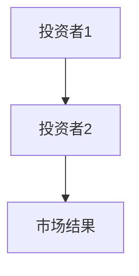
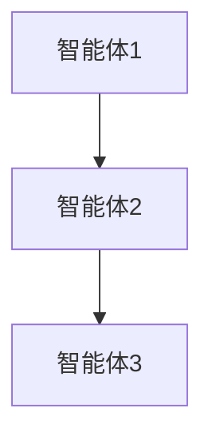
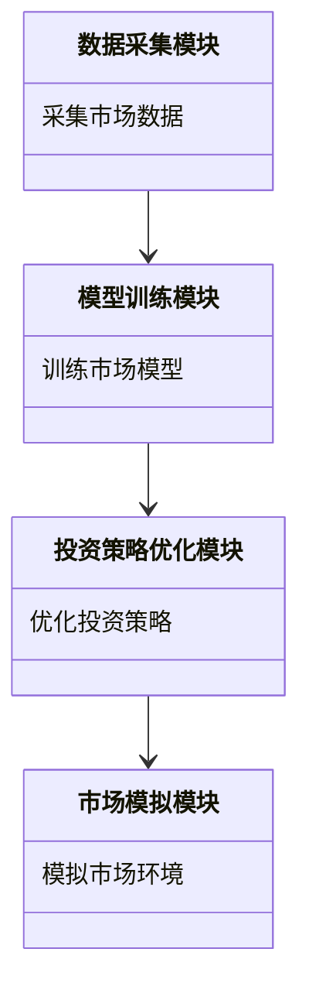
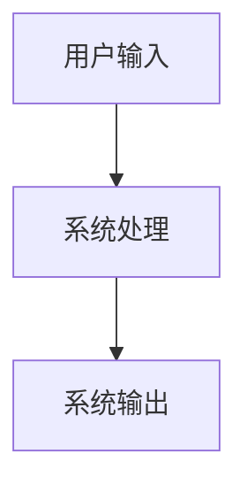

                 


# 基于多智能体的自适应市场假说在价值投资中的应用

## 关键词：多智能体系统，自适应市场假说，价值投资，算法原理，系统架构设计

## 摘要：本文探讨了基于多智能体的自适应市场假说在价值投资中的应用，分析了多智能体系统的算法原理和数学模型，并结合系统架构设计和项目实战，展示了自适应市场假说如何提升投资决策的科学性和准确性。

---

# 第一部分: 多智能体系统与自适应市场假说

## 第1章: 多智能体系统的基本概念

### 1.1 多智能体系统的定义与特征

多智能体系统（Multi-Agent System, MAS）是由多个智能体（Agent）组成的系统，这些智能体能够感知环境、自主决策并进行协作或竞争。以下是多智能体系统的核心特征：

1. **自主性**：每个智能体都能独立决策，无需外部干预。
2. **反应性**：智能体能够实时感知环境并做出反应。
3. **协作性**：多个智能体可以通过协作完成复杂任务。
4. **分布性**：智能体之间的决策和行为是分布式的，不存在单一控制中心。

### 1.2 多智能体系统在金融领域的应用

在金融领域，多智能体系统可以模拟市场参与者的复杂行为，例如投资者、交易员和机构的行为。通过多智能体系统，我们可以更好地理解市场的动态变化，并为价值投资提供新的视角。

---

## 第2章: 自适应市场假说的理论基础

### 2.1 有效市场假说的局限性

有效市场假说（Efficient Market Hypothesis, EMH）认为市场价格已经反映了所有公开信息，因此不存在长期套利机会。然而，现实中市场常常存在非理性行为和信息不对称，导致价格偏离其真实价值。这为价值投资提供了空间。

### 2.2 自适应市场假说的核心思想

自适应市场假说（Adaptive Market Hypothesis, AMH）认为，市场参与者的行为会影响市场的状态，市场会根据参与者的行为动态调整其状态。这种动态调整使得市场既有波动性，又能够逐步趋向均衡。

### 2.3 自适应市场假说与有效市场假说的对比

| 对比维度 | 有效市场假说（EMH） | 自适应市场假说（AMH） |
|----------|---------------------|------------------------|
| 核心思想 | 价格反映所有信息     | 市场动态调整，参与者行为影响市场状态 |
| 市场波动 | 无长期套利机会       | 市场波动是常态，参与者行为驱动波动 |
| 应用领域 | 价格预测             | 投资策略优化，市场动态分析 |

---

## 第3章: 自适应市场假说在价值投资中的应用

### 3.1 价值投资的基本原理

价值投资的核心思想是寻找市场价格低于其内在价值的资产。这种策略依赖于对资产基本面的深入分析，以及对市场短期波动的耐心等待。

### 3.2 自适应市场假说对价值投资的启示

自适应市场假说认为，市场参与者的行为会影响市场状态，因此在价值投资中，我们需要考虑市场参与者的心理和行为模式。通过分析市场参与者的决策，我们可以更好地捕捉市场低估的机会。

### 3.3 自适应市场假说与传统价值投资方法的结合

自适应市场假说为价值投资提供了一个动态的视角。通过分析市场参与者的决策模式，我们可以更精准地判断资产的内在价值，并制定更有效的投资策略。

---

# 第二部分: 多智能体系统的算法原理

## 第4章: 多智能体系统的算法实现

### 4.1 基于强化学习的市场建模

强化学习是一种机器学习方法，通过智能体与环境的交互来优化策略。在市场建模中，强化学习可以模拟投资者的决策过程。



### 4.2 基于博弈论的策略优化

博弈论是研究策略互动的理论，可以用于分析市场参与者的竞争与协作。



### 4.3 基于分布式计算的多智能体协作

分布式计算可以提高多智能体系统的计算效率，使智能体能够更高效地协作。



---

## 第5章: 自适应市场假说的数学模型

### 5.1 市场参与者的决策模型

市场参与者的决策可以通过以下公式表示：

$$
P(t) = f(S(t), A(t))
$$

其中，\( P(t) \) 是价格，\( S(t) \) 是市场状态，\( A(t) \) 是参与者行为。

### 5.2 市场均衡的数学推导

市场均衡是指价格等于供需平衡的状态。均衡价格可以通过以下公式计算：

$$
P^* = \arg \max_{P} U(P)
$$

其中，\( U(P) \) 是效用函数。

---

# 第三部分: 系统架构设计与实现

## 第6章: 系统架构设计

### 6.1 系统功能模块划分

系统功能模块包括：

1. 数据采集模块
2. 模型训练模块
3. 投资策略优化模块
4. 市场模拟模块

### 6.2 系统架构的类图表示



---

## 第7章: 系统接口设计

### 7.1 系统输入接口设计

系统输入接口包括：

1. 市场数据输入接口
2. 投资者行为输入接口
3. 市场模拟参数输入接口

### 7.2 系统输出接口设计

系统输出接口包括：

1. 市场预测结果
2. 投资策略建议
3. 市场模拟结果

---

## 第8章: 系统交互设计

### 8.1 系统交互的流程图



---

# 第四部分: 项目实战与案例分析

## 第9章: 项目环境安装与配置

### 9.1 开发环境的选择

推荐使用Python和相关库进行开发，例如：

- Python 3.8+
- NumPy
- Pandas
- TensorFlow

### 9.2 依赖库的安装与配置

安装依赖库：

```bash
pip install numpy pandas tensorflow
```

---

## 第10章: 系统核心实现

### 10.1 数据处理与特征提取

```python
import numpy as np
import pandas as pd

# 数据加载
data = pd.read_csv('market_data.csv')

# 特征提取
features = data[['price', 'volume', 'market_cap']]
```

### 10.2 模型训练与参数优化

```python
import tensorflow as tf

# 模型定义
model = tf.keras.Sequential([
    tf.keras.layers.Dense(64, activation='relu'),
    tf.keras.layers.Dense(1, activation='linear')
])

# 模型训练
model.compile(optimizer='adam', loss='mse')
model.fit(X_train, y_train, epochs=100, batch_size=32)
```

### 10.3 模型验证与结果分析

```python
# 模型预测
y_pred = model.predict(X_test)

# 结果分析
print('预测值:', y_pred)
print('真实值:', y_test)
```

---

## 第11章: 案例分析与详细解读

### 11.1 案例分析

以某股票为例，分析其市场价格与内在价值的关系。通过模型预测，我们可以发现市场价格偏离内在价值的时机。

### 11.2 详细解读

通过分析市场参与者的决策模型，我们可以更好地理解市场价格波动的原因，并制定更有效的投资策略。

---

# 第五部分: 总结与展望

## 第12章: 总结

### 12.1 最佳实践 tips

1. 在实际应用中，建议结合市场实际情况调整模型参数。
2. 定期更新模型以适应市场变化。

### 12.2 小结

本文通过多智能体系统的算法原理和自适应市场假说的应用，展示了如何提升价值投资的科学性和准确性。

## 第13章: 未来展望

未来的研究方向可以包括：

1. 更复杂的多智能体系统设计
2. 更精确的市场预测模型
3. 更高效的投资策略优化方法

---

# 作者信息

作者：AI天才研究院/AI Genius Institute & 禅与计算机程序设计艺术 /Zen And The Art of Computer Programming

