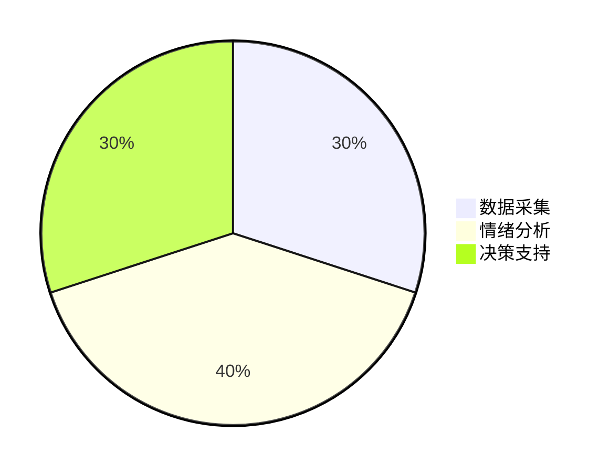
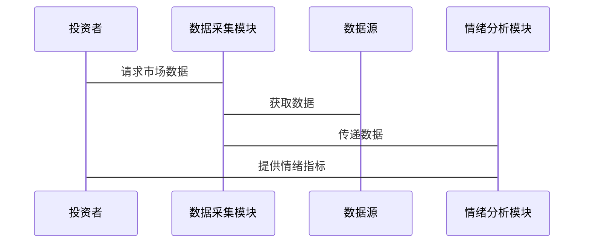

                 


```markdown
# 基于多智能体的自适应市场情绪指标在价值投资中的应用

> 关键词：多智能体，自适应市场情绪指标，价值投资，算法原理，系统架构，项目实战

> 摘要：本文探讨了基于多智能体的自适应市场情绪指标在价值投资中的应用。通过分析市场情绪对投资决策的影响，提出了一种利用多智能体系统构建自适应指标的方法，展示了其在价值投资中的优势和实际应用。

---

## 第1章 多智能体与自适应市场情绪指标概述

### 1.1 多智能体系统的定义与特点
多智能体系统（Multi-Agent System, MAS）是由多个相互作用的智能体组成的系统，每个智能体具备自主性、反应性和协作性。MAS在金融市场中可以用于实时数据分析和决策支持。

### 1.2 自适应市场情绪指标的定义与分类
自适应市场情绪指标能够根据市场变化动态调整，分为情绪强度、情绪方向等类型。

### 1.3 多智能体与市场情绪分析的结合
多智能体系统能够提升市场情绪分析的准确性和动态性，帮助投资者做出更科学的决策。

---

## 第2章 价值投资中的市场情绪问题

### 2.1 价值投资的背景与挑战
传统价值投资面临市场波动和不确定性的挑战，市场情绪对估值影响显著。

### 2.2 市场情绪对投资决策的影响
市场情绪如恐慌性抛售影响投资者决策，需准确评估市场情绪。

### 2.3 多智能体系统的优势与应用前景
多智能体系统在实时数据分析和决策支持方面具有显著优势，为价值投资提供新思路。

---

## 第3章 自适应市场情绪指标的核心概念

### 3.1 自适应指标的核心原理
自适应机制根据市场变化调整指标，动态反映市场情绪。

### 3.2 多智能体与自适应指标的属性特征对比
| 特性 | 多智能体系统 | 自适应指标 |
|------|--------------|-------------|
| 实时性 | 高 | 高 |
| 适应性 | 强 | 强 |

### 3.3 ER实体关系图
```mermaid
erDiagram
    投资者 --> 市场数据源 : 获取数据
    投资者 --> 智能体 : 指标计算
    市场数据源 --> 智能体 : 数据输入
```

---

## 第4章 自适应市场情绪指标的算法原理

### 4.1 算法概述
算法通过多智能体协同分析市场数据，计算自适应市场情绪指标。

### 4.2 算法实现的数学模型
情绪指数计算公式：
$$ E = \sum (\text{情感极性} \times \text{权重}) $$

### 4.3 算法实现的代码示例
```python
import pandas as pd
from sklearn.linear_model import LinearRegression

# 数据预处理
data = pd.read_csv('market_data.csv')
features = data[['price', 'volume', 'sentiment']]
target = data['market_mood']

# 模型训练
model = LinearRegression()
model.fit(features, target)

# 预测市场情绪
predicted_mood = model.predict(features)
```

---

## 第5章 系统分析与架构设计

### 5.1 问题场景介绍
系统需实时监测市场情绪，辅助投资决策。

### 5.2 系统功能设计
主要功能模块包括数据采集、情绪分析、决策支持。

### 5.3 系统架构设计


### 5.4 系统接口设计
API接口设计，提供数据接口和分析接口。

### 5.5 系统交互设计


---

## 第6章 项目实战与应用

### 6.1 项目环境安装
安装所需Python库：pandas、numpy、scikit-learn。

### 6.2 系统核心代码实现
```python
import pandas as pd
from sklearn import linear_model

# 数据处理
data = pd.read_csv('market_data.csv')
X = data[['price', 'volume', 'sentiment']]
y = data['market_mood']

# 模型训练
model = linear_model.LinearRegression()
model.fit(X, y)

# 预测与评估
predicted = model.predict(X)
print('预测情绪指标:', predicted)
```

### 6.3 代码解读与分析
代码实现数据处理、模型训练和预测，展示情绪指标的动态变化。

### 6.4 实际案例分析
使用具体数据集进行分析，展示系统如何生成情绪指标。

### 6.5 项目小结
总结项目成果，指出可能的改进方向。

---

## 第7章 总结与展望

### 7.1 核心内容总结
本文展示了多智能体系统在构建自适应市场情绪指标中的应用，为价值投资提供了新思路。

### 7.2 投资决策中的小结
自适应市场情绪指标在价值投资中具有重要性，需结合其他因素进行综合分析。

### 7.3 使用中的注意事项
提醒投资者在实际应用中考虑基本面分析等其他因素。

### 7.4 拓展阅读
推荐相关书籍和资源，供读者深入学习。

---

作者：AI天才研究院/AI Genius Institute & 禅与计算机程序设计艺术 /Zen And The Art of Computer Programming
```

