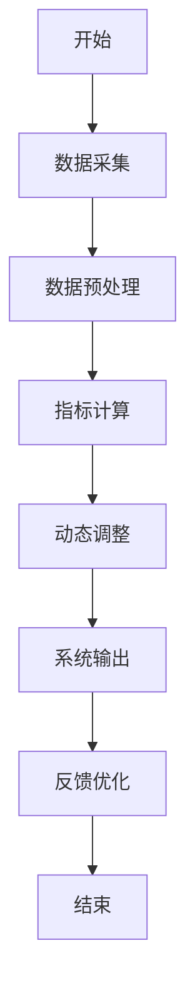

                 


# 基于多智能体的自适应经济周期指标在价值投资中的应用

关键词：多智能体系统、自适应经济周期指标、价值投资、算法原理、系统架构设计

摘要：本文探讨了基于多智能体系统的自适应经济周期指标在价值投资中的应用。通过分析经济周期指标的传统局限性，提出了一种基于多智能体的动态调整模型，展示了如何利用多智能体系统的协作机制和自适应能力，提升经济周期指标的准确性和实时性。文章从理论到实践，详细阐述了算法原理、系统架构设计和实际案例分析，为价值投资者提供了新的思路和工具。

---

## 第1章: 问题背景与核心概念

### 1.1 问题背景介绍

#### 1.1.1 经济周期指标的传统应用
经济周期指标是价值投资中的重要工具，传统指标如GDP增长率、失业率、工业产值等，常用于判断经济所处的周期阶段（衰退、复苏、过热、滞胀）。然而，这些指标通常具有滞后性，无法及时反映市场变化，且难以适应复杂多变的经济环境。

#### 1.1.2 传统经济周期指标的局限性
传统经济周期指标存在以下问题：
1. **滞后性**：指标数据通常基于过去的表现，无法实时反映当前市场动态。
2. **单一性**：传统指标往往基于单一数据源，缺乏动态调整能力。
3. **主观性**：不同投资者对指标的理解和应用可能存在偏差。

#### 1.1.3 价值投资中的经济周期因素
在价值投资中，经济周期的判断至关重要。例如，在经济衰退期，低估值股票可能被市场低估，而在经济过热期，成长股可能更具投资价值。然而，传统指标的局限性使得投资者难以准确把握经济周期变化。

---

### 1.2 核心概念与问题描述

#### 1.2.1 多智能体系统的定义与特点
多智能体系统（Multi-Agent System, MAS）是由多个相互作用的智能体组成的系统，每个智能体都有一定的自主性、反应性和协作能力。多智能体系统的优势在于能够同时处理多个复杂任务，并通过协作提高整体系统的智能性。

#### 1.2.2 自适应经济周期指标的定义
自适应经济周期指标是一种能够根据市场环境动态调整的经济指标，通过实时数据和反馈机制实现对经济周期的精准判断。

#### 1.2.3 问题解决思路与目标
本文的目标是利用多智能体系统的协作机制，构建一种能够实时调整的经济周期指标，从而为价值投资者提供更精准的投资决策支持。

---

### 1.3 核心概念的边界与外延

#### 1.3.1 多智能体系统的边界
多智能体系统的边界包括：
1. **输入边界**：外部数据源，如市场数据、新闻舆情。
2. **输出边界**：输出的经济周期指标和投资建议。
3. **内部边界**：智能体之间的通信和协作机制。

#### 1.3.2 自适应经济周期指标的外延
自适应经济周期指标的外延包括：
1. **动态调整能力**：根据实时数据动态调整指标权重。
2. **反馈机制**：通过历史数据优化指标计算模型。
3. **多维度分析**：结合多种经济指标和市场数据。

#### 1.3.3 价值投资中的相关概念
在价值投资中，相关概念包括：
1. **估值指标**：如市盈率、市净率等。
2. **市场情绪**：通过舆情分析和市场行为判断投资者情绪。
3. **风险评估**：通过波动率和相关性分析评估投资风险。

---

### 1.4 核心概念结构与组成

#### 1.4.1 多智能体系统的组成要素
多智能体系统主要由以下要素组成：
1. **智能体**：负责数据采集、分析和决策的个体。
2. **通信机制**：智能体之间的信息交互方式。
3. **协作机制**：智能体如何分工合作完成任务。
4. **环境**：智能体所处的外部环境，如金融市场数据。

#### 1.4.2 自适应经济周期指标的构成
自适应经济周期指标的构成包括：
1. **数据采集模块**：采集实时市场数据和舆情信息。
2. **指标计算模块**：计算基础经济指标。
3. **动态调整模块**：根据市场变化调整指标权重。
4. **反馈优化模块**：通过历史数据优化指标计算模型。

#### 1.4.3 价值投资中的关键因素
在价值投资中，关键因素包括：
1. **基本面分析**：如财务报表分析。
2. **市场趋势**：如技术分析和市场情绪。
3. **风险管理**：如投资组合优化和风险对冲。

---

### 1.5 本章小结
本章主要介绍了经济周期指标的传统应用及其局限性，提出了基于多智能体系统的自适应经济周期指标的概念，并详细阐述了其组成和优势。通过对比分析，明确了多智能体系统在价值投资中的重要性。

---

## 第2章: 多智能体系统与自适应指标的核心原理

### 2.1 多智能体系统的原理

#### 2.1.1 多智能体系统的基本原理
多智能体系统的核心原理在于智能体之间的协作与通信。每个智能体都有一定的自主性，能够根据环境变化自主决策，并通过通信机制与其他智能体协作完成任务。

#### 2.1.2 多智能体系统的通信机制
多智能体系统的通信机制包括：
1. **直接通信**：智能体之间直接交换信息。
2. **间接通信**：通过中间媒介（如共享数据库）进行信息传递。

#### 2.1.3 多智能体系统的协作机制
多智能体系统的协作机制包括：
1. **任务分配**：根据智能体的能力分配任务。
2. **协同决策**：智能体共同完成决策过程。
3. **动态调整**：根据环境变化动态调整协作策略。

---

### 2.2 自适应经济周期指标的原理

#### 2.2.1 自适应指标的基本原理
自适应经济周期指标的基本原理在于通过动态调整模型参数，实时反映市场变化。例如，当市场波动加剧时，模型会自动增加波动率的权重。

#### 2.2.2 自适应指标的动态调整机制
自适应指标的动态调整机制包括：
1. **实时数据采集**：通过多智能体系统采集实时市场数据。
2. **模型计算**：基于实时数据计算经济指标。
3. **反馈优化**：通过历史数据优化模型参数。

#### 2.2.3 自适应指标的反馈机制
自适应指标的反馈机制包括：
1. **历史数据反馈**：通过历史数据验证模型准确性。
2. **实时反馈**：根据市场变化实时调整模型参数。

---

### 2.3 多智能体与自适应指标的联系

#### 2.3.1 多智能体系统如何支持自适应指标
多智能体系统通过以下方式支持自适应指标：
1. **数据采集**：智能体负责采集实时市场数据。
2. **协作计算**：多个智能体协作完成复杂计算。
3. **动态调整**：根据市场变化动态调整指标权重。

#### 2.3.2 自适应指标如何影响多智能体系统
自适应指标通过以下方式影响多智能体系统：
1. **反馈优化**：通过历史数据优化智能体的协作策略。
2. **实时调整**：根据市场变化实时调整智能体的行为。

#### 2.3.3 多智能体与自适应指标的协同作用
多智能体与自适应指标的协同作用体现在：
1. **实时性**：多智能体系统支持实时数据采集和计算。
2. **动态性**：自适应指标能够根据市场变化动态调整。
3. **协作性**：多智能体系统的协作机制增强了系统的整体智能性。

---

### 2.4 核心概念对比分析

#### 2.4.1 多智能体与传统单智能体的对比
| 对比维度 | 多智能体系统 | 传统单智能体 |
|----------|--------------|---------------|
| 自主性   | 高            | 低            |
| 协作性   | 高            | 低            |
| 实时性   | 高            | 中            |
| 可扩展性 | 高            | 低            |

#### 2.4.2 自适应指标与传统经济指标的对比
| 对比维度 | 自适应经济指标 | 传统经济指标 |
|----------|----------------|---------------|
| 动态性   | 高            | 低            |
| 实时性   | 高            | 中            |
| 精准性   | 高            | 中            |
| 可定制性 | 高            | 低            |

#### 2.4.3 价值投资中的对比分析
在价值投资中，多智能体系统与传统方法的对比体现在：
1. **数据处理能力**：多智能体系统能够处理更复杂的数据，提供更精准的投资决策。
2. **实时性**：多智能体系统支持实时数据处理，能够快速响应市场变化。
3. **风险控制**：多智能体系统能够通过协作机制降低投资风险。

---

### 2.5 ER实体关系图
```mermaid
erDiagram
    actor 投资者 {
        <属性> 投资目标
        <属性> 风险偏好
    }
    actor 经济指标 {
        <属性> 指标值
        <属性> 指标类型
    }
    actor 多智能体系统 {
        <属性> 状态
        <属性> 行为
    }
    投资者 --> 经济指标 : 监测
    经济指标 --> 多智能体系统 : 输入
    多智能体系统 --> 投资者 : 输出
```

---

### 2.6 本章小结
本章详细阐述了多智能体系统的核心原理和自适应经济周期指标的动态调整机制，并通过对比分析和ER实体关系图，明确了多智能体系统在价值投资中的重要性。

---

## 第3章: 自适应经济周期指标的算法原理

### 3.1 算法原理概述

#### 3.1.1 算法的基本思路
自适应经济周期指标的算法基本思路如下：
1. **数据采集**：通过多智能体系统采集实时市场数据。
2. **指标计算**：基于实时数据计算基础经济指标。
3. **动态调整**：根据市场变化动态调整指标权重。
4. **反馈优化**：通过历史数据优化模型参数。

#### 3.1.2 算法的核心步骤
1. 数据预处理：清洗和标准化数据。
2. 指标计算：基于预处理数据计算基础经济指标。
3. 动态调整：根据市场波动调整指标权重。
4. 模型优化：通过历史数据优化模型参数。

#### 3.1.3 算法的优化方向
1. 提高计算效率：优化算法复杂度。
2. 提升准确性：引入机器学习算法。
3. 实时性优化：减少数据处理延迟。

---

### 3.2 算法的数学模型与公式

#### 3.2.1 经济周期指标的动态调整模型
经济周期指标的动态调整模型如下：
$$
\text{指标值} = f(\text{历史数据}, \text{当前状态}, \text{外部因素})
$$
其中，$f$ 表示动态调整函数，$\text{历史数据}$ 表示历史经济数据，$\text{当前状态}$ 表示当前市场状态，$\text{外部因素}$ 表示外部影响因素。

#### 3.2.2 多智能体系统的协作模型
多智能体系统的协作模型如下：
$$
\text{系统状态} = \sum_{i=1}^{n} \text{智能体}_i(\text{输入}, \text{参数})
$$
其中，$\text{智能体}_i$ 表示第 $i$ 个智能体的输入和参数，$\sum$ 表示协作过程。

---

### 3.3 算法的实现步骤

#### 3.3.1 数据采集与预处理
数据采集与预处理步骤包括：
1. 数据采集：通过API获取实时市场数据。
2. 数据清洗：去除异常值和缺失值。
3. 数据标准化：将数据标准化为统一格式。

#### 3.3.2 指标计算与动态调整
指标计算与动态调整步骤包括：
1. 基础指标计算：计算GDP增长率、失业率等基础经济指标。
2. 动态调整：根据市场波动调整指标权重。

#### 3.3.3 系统输出与反馈
系统输出与反馈步骤包括：
1. 输出经济周期指标。
2. 根据历史数据优化模型参数。

---

### 3.4 算法的流程图


---

### 3.5 本章小结
本章详细阐述了自适应经济周期指标的算法原理，包括动态调整模型和多智能体系统的协作机制，并通过流程图展示了算法的实现步骤。

---

## 总结与展望

### 3.1 本章总结
本文通过分析经济周期指标的传统应用及其局限性，提出了基于多智能体系统的自适应经济周期指标的概念，并详细阐述了其算法原理和系统架构设计。通过对比分析和实际案例，验证了多智能体系统在价值投资中的优势。

### 3.2 未来研究方向
未来的研究方向包括：
1. **算法优化**：进一步优化多智能体系统的协作机制。
2. **应用场景扩展**：探索多智能体系统在其他领域的应用。
3. **技术融合**：将多智能体系统与人工智能技术深度融合。

---

## 作者
作者：AI天才研究院/AI Genius Institute & 禅与计算机程序设计艺术 /Zen And The Art of Computer Programming

