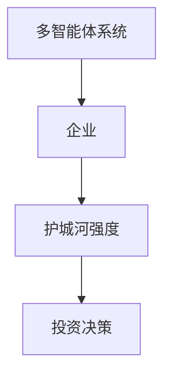
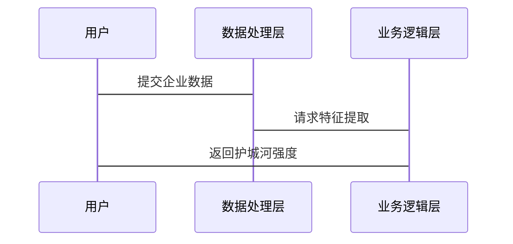

                 


```markdown
# 基于多智能体系统的巴菲特护城河理论实现

> 关键词：多智能体系统，巴菲特护城河理论，投资决策，算法实现，系统架构

> 摘要：本文详细探讨了如何利用多智能体系统来实现巴菲特护城河理论的分析与应用。通过结合多智能体系统的分布式计算和博弈论算法，我们提出了一种创新的方法来评估企业的竞争优势，从而优化投资决策。文章从理论背景、算法实现、系统架构到项目实战，全面解析了这一实现过程。

---

# 第一部分：背景介绍

## 第1章：巴菲特护城河理论概述

### 1.1 投资护城河的定义与核心要素
巴菲特护城河理论是价值投资的重要基石，用于识别具有长期竞争优势的企业。其核心在于企业是否具备难以被竞争对手复制的独特优势，例如专利、品牌影响力或成本优势。

#### 1.1.1 投资护城河的定义
护城河是指企业在市场中竞争对手难以逾越的竞争优势。这种优势可以是经济的、技术的或市场的。

#### 1.1.2 护城河的核心要素分析
护城河的核心要素包括：
- 成本优势
- 品牌影响力
- 技术创新
- 市场准入壁垒

#### 1.1.3 护城河的分类与特征对比
护城河可以分为以下几类：
- 经济护城河：通过规模效应降低成本。
- 品牌护城河：通过品牌忠诚度吸引客户。
- 技术护城河：通过专利和技术领先保持竞争优势。

### 1.2 多智能体系统的定义与特点
多智能体系统（Multi-Agent System, MAS）是由多个智能体组成的系统，每个智能体能够独立决策并与其他智能体协作或竞争。

#### 1.2.1 多智能体系统的定义
多智能体系统是由多个智能体组成的分布式系统，每个智能体具备感知、决策和执行能力。

#### 1.2.2 多智能体系统的核心特征
- 分布式计算
- 协作与竞争
- 自适应性
- 可扩展性

#### 1.2.3 多智能体系统的应用场景
- 智能交通管理
- 金融投资决策
- 多人在线游戏

### 1.3 巴菲特护城河理论与多智能体系统的结合意义
通过多智能体系统，我们可以模拟多个企业的竞争行为，分析它们的护城河强度，从而优化投资策略。

---

# 第二部分：核心概念与联系

## 第2章：多智能体系统的概念模型

### 2.1 多智能体系统的实体关系图
以下是一个简单的实体关系图，展示了多智能体系统与护城河理论的结合：



### 2.2 护城河强度评估的数学模型
护城河强度可以通过以下公式进行评估：

$$
\text{护城河强度} = \sum_{i=1}^{n} w_i \cdot f_i
$$

其中，$w_i$ 是第 $i$ 个因素的权重，$f_i$ 是第 $i$ 个因素的强度。

### 2.3 多智能体系统与护城河理论的联系
多智能体系统可以通过模拟企业的竞争行为，动态评估其护城河强度，从而为投资决策提供依据。

---

# 第三部分：算法原理与实现

## 第3章：多智能体系统的算法原理

### 3.1 博弈论算法
博弈论是分析多智能体系统中竞争与合作的核心工具。

#### 3.1.1 博弈论的基本概念
- 理性决策
- 纳什均衡

#### 3.1.2 博弈论在多智能体系统中的应用
通过博弈论，我们可以模拟多个智能体之间的竞争与合作行为。

### 3.2 强化学习算法
强化学习是一种通过试错学习优化决策的算法。

#### 3.2.1 强化学习的基本原理
智能体通过与环境互动，学习最优策略。

#### 3.2.2 强化学习在护城河评估中的应用
通过强化学习，智能体可以学习如何评估企业的护城河强度。

### 3.3 分布式计算算法
分布式计算是多智能体系统的核心技术。

#### 3.3.1 分布式计算的基本原理
任务分解与协同计算。

#### 3.3.2 分布式计算在护城河评估中的应用
通过分布式计算，可以同时评估多个企业的护城河强度。

---

# 第四部分：系统分析与架构设计

## 第4章：系统架构设计

### 4.1 应用场景介绍
我们以投资决策为应用场景，分析多个企业的护城河强度。

### 4.2 系统功能设计
系统功能包括：
- 数据采集
- 特征提取
- 护城河强度计算
- 结果输出

### 4.3 系统架构图
以下是系统的架构图：


### 4.4 系统接口设计
系统接口包括：
- 数据输入接口
- 数据处理接口
- 结果输出接口

### 4.5 系统交互序列图
以下是系统交互的序列图：



---

# 第五部分：项目实战

## 第5章：项目实现与案例分析

### 5.1 环境安装
- 安装Python
- 安装numpy、pandas、scikit-learn

### 5.2 核心代码实现
以下是护城河强度计算的代码示例：

```python
import numpy as np
import pandas as pd

def calculate_h护城河强度(data):
    factors = ['成本优势', '品牌影响力', '技术创新']
    weights = [0.4, 0.3, 0.3]
    strengths = [data['成本优势'], data['品牌影响力'], data['技术创新']]
    return np.dot(weights, strengths)

data = pd.DataFrame({
    '成本优势': [0.8],
    '品牌影响力': [0.7],
    '技术创新': [0.6]
})

result = calculate_h护城河强度(data)
print('护城河强度:', result[0])
```

### 5.3 案例分析
以某个企业为例，分析其护城河强度，并解释结果。

---

# 第六部分：结论与展望

## 第6章：结论与展望

### 6.1 结论
本文通过多智能体系统实现了巴菲特护城河理论的分析与应用，为投资决策提供了新的思路。

### 6.2 未来展望
未来可以进一步研究多智能体系统在护城河评估中的优化方法。

---

# 作者：AI天才研究院 & 禅与计算机程序设计艺术

---

通过本文的详细讲解，读者可以系统地理解如何利用多智能体系统实现巴菲特护城河理论的分析与应用。希望本文能为投资决策提供新的视角和方法。
```

