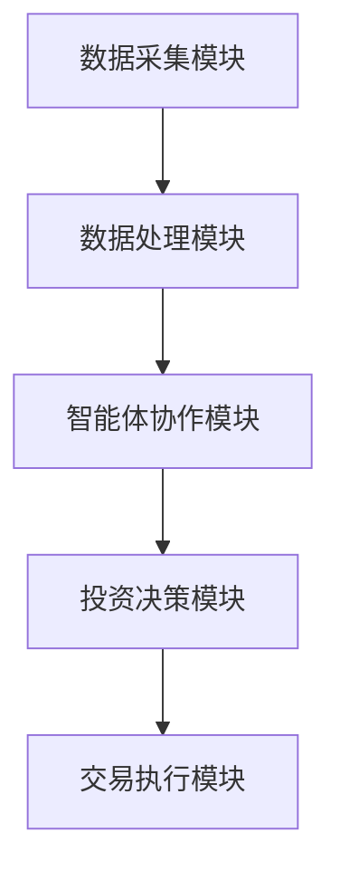
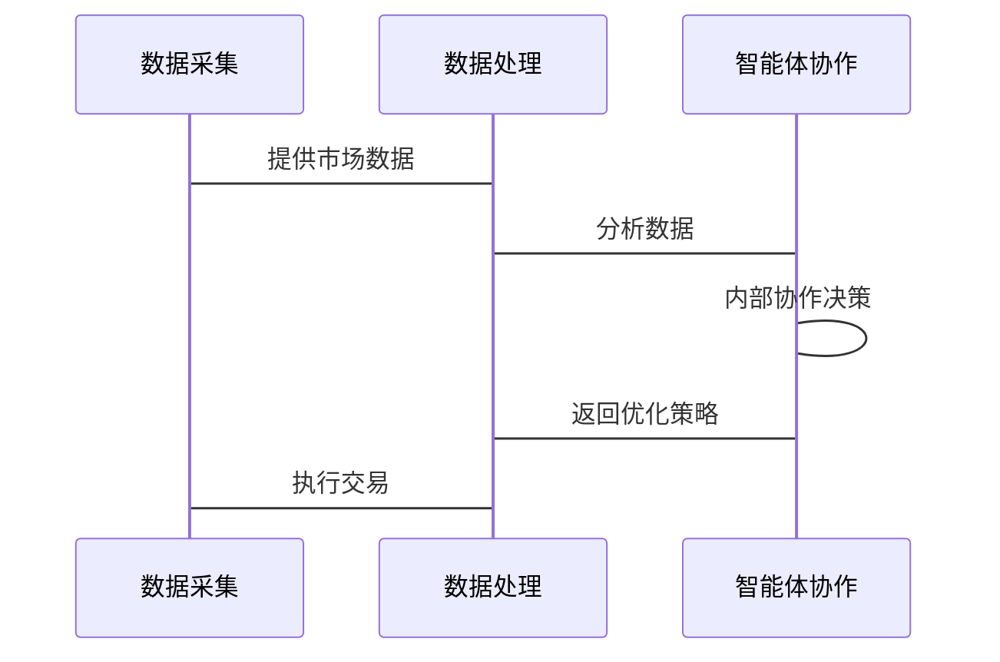

                 


# 基于多智能体系统的自适应价值投资策略

> 关键词：多智能体系统，自适应投资，价值投资，强化学习，系统架构

> 摘要：本文探讨了如何利用多智能体系统实现自适应价值投资策略。通过分析多智能体系统的协作机制和强化学习算法，结合实际案例，展示了如何构建一个动态调整投资组合的系统，以应对金融市场中的不确定性。本文旨在为金融从业者和研究人员提供一种创新的投资策略框架。

---

# 引言

## 1.1 价值投资的基本概念
价值投资是一种通过分析企业基本面，寻找被市场低估的投资标的进行长期投资的策略。传统价值投资依赖于人工分析和经验判断，存在效率低、覆盖面窄等问题。

## 1.2 自适应投资策略的必要性
传统投资策略在面对市场波动和复杂环境时，难以快速调整。引入自适应机制，能够实时优化投资组合，降低风险。

## 1.3 多智能体系统的优势
多智能体系统通过协作和学习，能够高效处理复杂问题。在投资领域，多智能体系统可以模拟市场参与者的互动，优化投资决策。

---

# 第1章 多智能体系统概述

## 1.1 多智能体系统的定义与特点
多智能体系统由多个相互作用的智能体组成，每个智能体能够独立决策并协作完成任务。其特点包括分布式、协作性和自适应性。

## 1.2 多智能体系统的核心要素
- **智能体**：具有感知和决策能力的主体。
- **通信机制**：智能体之间的信息交互方式。
- **协作协议**：定义智能体之间的协作规则。

## 1.3 多智能体系统的协作机制
通过通信和协商，智能体之间可以协同工作，实现整体目标。例如，使用分布式算法进行任务分配。

---

# 第2章 自适应价值投资策略

## 2.1 自适应策略的动态调整机制
根据市场变化实时调整投资组合，通过反馈机制优化决策。

## 2.2 多智能体系统在投资中的应用
- **市场分析**：多个智能体分别分析不同市场数据。
- **风险控制**：智能体协作进行风险评估和规避。

## 2.3 自适应投资与传统投资的对比
| 对比维度 | 传统投资 | 自适应投资 |
|----------|----------|------------|
| 决策速度 | 固定周期 | 实时调整   |
| 灵活性   | 较低     | 高         |

---

# 第3章 强化学习算法

## 3.1 强化学习的基本原理
通过试错机制，智能体在环境中学习最优策略。数学模型：$Q(s, a) = r + \gamma \max Q(s', a')$。

## 3.2 多智能体协作的强化学习
多个智能体通过共享信息和协作，共同优化投资组合。例如，使用分布式Q-learning算法。

## 3.3 算法实现
```python
import numpy as np

class Agent:
    def __init__(self, state_size, action_size):
        self.state_size = state_size
        self.action_size = action_size
        self.Q = np.zeros((state_size, action_size))

    def act(self, state):
        return np.argmax(self.Q[state])

    def update(self, state, action, reward):
        self.Q[state][action] = reward + 0.9 * np.max(self.Q[state])

# 初始化多个智能体
agents = [Agent(10, 5) for _ in range(3)]
```

---

# 第4章 系统架构设计

## 4.1 系统功能设计
- 数据采集：收集市场数据。
- 智能体协作：多个智能体协作决策。
- 投资执行：根据决策执行交易。

## 4.2 系统架构图


## 4.3 系统交互流程


---

# 第5章 项目实战

## 5.1 环境安装
安装必要的库，如TensorFlow、numpy和pandas。

## 5.2 核心实现
编写智能体协作和交易执行的代码。

## 5.3 案例分析
通过实际案例展示系统如何优化投资组合。

---

# 结论

## 6.1 总结
多智能体系统为自适应投资提供了新的思路，通过协作和学习，能够有效应对市场变化。

## 6.2 注意事项
- 数据质量影响系统性能。
- 算法的选择和参数设置需谨慎。

## 6.3 未来展望
探索更高效的协作算法和应用场景。

---

# 作者

作者：AI天才研究院  
地址：https://github.com/AI-Genius-Institute/Zen-Of-Computer-Programming  

---

以上是基于多智能体系统的自适应价值投资策略的完整目录大纲和部分章节内容。希望对您有所帮助！

