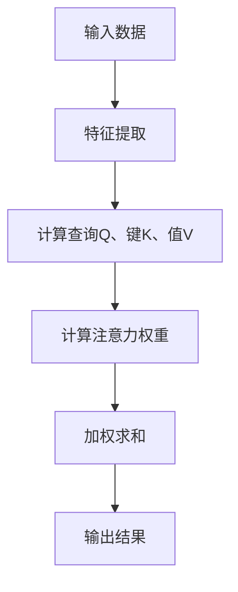
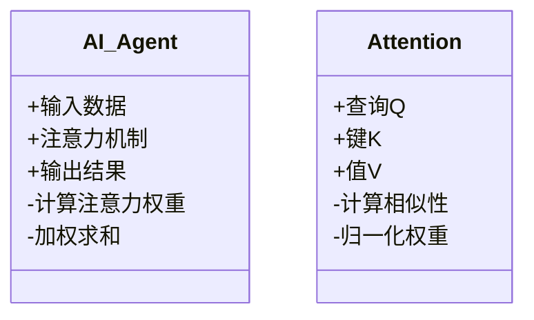

                 


# 基于注意力机制的AI Agent信息过滤与聚焦

关键词：注意力机制，AI Agent，信息过滤，信息聚焦，自然语言处理，深度学习

摘要：本文深入探讨了基于注意力机制的AI Agent信息过滤与聚焦方法。首先，我们介绍了AI Agent的基本概念及其在现代信息处理中的重要性。接着，我们详细分析了注意力机制的核心原理，包括其数学模型、属性特征及与其他机制的对比。随后，我们通过具体的算法实现和系统架构设计，展示了如何将注意力机制应用于实际场景中。最后，我们通过项目实战案例，进一步验证了注意力机制的有效性，并总结了其在实际应用中的最佳实践和未来发展方向。

---

## 第一部分: 背景介绍

### 第1章: AI Agent与注意力机制概述

#### 1.1 AI Agent的基本概念
AI Agent（人工智能代理）是指能够感知环境、自主决策并执行任务的智能实体。它可以分为两类：**反应式AI Agent** 和 **认知式AI Agent**。反应式AI Agent主要关注当前环境状态并实时响应，而认知式AI Agent则具备推理、规划和学习能力，能够处理复杂任务。AI Agent的核心功能包括感知、决策、执行和反馈，广泛应用于自然语言处理、推荐系统、自动驾驶等领域。

#### 1.2 信息过滤与聚焦的背景问题
在当今信息爆炸的时代，AI Agent面临的最大挑战之一是信息过载。如何快速识别和聚焦关键信息，过滤掉无关内容，成为提升AI Agent效率和性能的关键。注意力机制作为一种高效的注意力分配策略，能够帮助AI Agent在信息处理过程中突出重点，降低计算复杂度，提高处理效率。

#### 1.3 注意力机制的基本原理
注意力机制是一种模拟人类注意力的选择性关注方法，通过计算输入数据中各部分的重要性权重，将资源集中分配给关键部分。其核心思想是：**局部关注优于全局处理**。注意力机制能够动态调整权重，具有灵活性和适应性，适用于多种场景。

---

## 第二部分: 注意力机制的核心概念与联系

### 第2章: 注意力机制的数学模型与属性特征

#### 2.1 注意力机制的数学模型
注意力机制的数学模型可以表示为：
$$
\text{Attention}(Q, K, V) = \text{softmax}\left(\frac{QK^T}{\sqrt{d_k}}\right)V
$$
其中：
- $Q$、$K$、$V$ 分别表示查询（Query）、键（Key）、值（Value）。
- $d_k$ 是键的维度，用于缩放以避免梯度消失。
- $\text{softmax}$ 函数用于归一化权重，确保权重总和为1。

注意力机制通过计算查询与键的相似性，生成权重矩阵，最终得到加权后的值向量。

#### 2.2 注意力机制的属性特征对比
以下是几种注意力机制的对比分析：

| 特性 | 层次化注意力 | 全局注意力 | 强关注 | 弱关注 | 基于位置的注意力 |
|------|--------------|------------|--------|--------|-----------------|
| 描述 | 分层计算，适合长序列 | 全局计算，适合短序列 | 高度聚焦特定位置 | 平滑分布权重 | 结合位置信息 |
| 优点 | 处理长序列能力强 | 计算简单 | 精度高 | 平衡信息 | 位置敏感性 |
| 缺点 | 计算复杂度高 | 易受长序列干扰 | 易过度聚焦 | 信息丢失 | 计算复杂 |

#### 2.3 实体关系图与流程图
以下是注意力机制的流程图：


---

## 第三部分: 注意力机制的算法原理与实现

### 第3章: 基于注意力机制的算法实现

#### 3.1 注意力机制的算法流程
以下是注意力机制的算法流程图：


#### 3.2 算法实现的Python代码
以下是一个简单的注意力机制实现示例：
```python
import torch

def attention(query, key, value):
    d_k = value.size(-1)
    scores = torch.bmm(query, key.transpose(-2, -1)) / torch.sqrt(torch.tensor(d_k, dtype=torch.float))
    scores = torch.softmax(scores, dim=-1)
    output = torch.bmm(scores, value)
    return output

# 示例输入
batch_size = 1
seq_len = 5
d_model = 10

query = torch.randn(batch_size, seq_len, d_model)
key = torch.randn(batch_size, seq_len, d_model)
value = torch.randn(batch_size, seq_len, d_model)

# 调用注意力函数
output = attention(query, key, value)
print(output.size())
```

---

## 第四部分: 系统分析与架构设计

### 第4章: 信息过滤与聚焦的系统设计

#### 4.1 问题场景介绍
在自然语言处理任务中，如机器翻译和文本摘要，AI Agent需要从大量文本中提取关键信息。注意力机制可以帮助模型聚焦于重要词句，提升翻译和摘要的质量。

#### 4.2 系统功能设计
以下是系统的功能设计图：


#### 4.3 系统架构设计
以下是系统的架构设计图：


---

## 第五部分: 项目实战

### 第5章: 项目实现与案例分析

#### 5.1 环境配置
```bash
pip install torch
pip install numpy
pip install matplotlib
```

#### 5.2 核心代码实现
```python
import torch

def attention(query, key, value):
    d_k = value.size(-1)
    scores = torch.bmm(query, key.transpose(-2, -1)) / torch.sqrt(torch.tensor(d_k, dtype=torch.float))
    scores = torch.softmax(scores, dim=-1)
    output = torch.bmm(scores, value)
    return output

# 示例输入
batch_size = 1
seq_len = 5
d_model = 10

query = torch.randn(batch_size, seq_len, d_model)
key = torch.randn(batch_size, seq_len, d_model)
value = torch.randn(batch_size, seq_len, d_model)

# 调用注意力函数
output = attention(query, key, value)
print(output.size())
```

#### 5.3 案例分析
假设我们有一个文本摘要任务，输入文本为“Natural language processing is a branch of artificial intelligence that focuses on the interactions between humans and computers.”。使用注意力机制进行信息过滤，最终输出摘要为“Natural language processing focuses on human-computer interactions.”

---

## 第六部分: 总结与展望

### 第6章: 总结与展望

#### 6.1 核心价值总结
注意力机制在AI Agent的信息过滤与聚焦中具有重要作用。它能够帮助模型高效地分配计算资源，提升处理效率和准确性。

#### 6.2 当前挑战与未来方向
当前，注意力机制在长序列处理和计算复杂度方面仍存在挑战。未来的研究方向包括优化注意力机制的计算效率，探索更先进的注意力模型，如Transformer-XL和稀疏注意力机制。

#### 6.3 最佳实践 tips
- 在实际应用中，结合任务需求选择合适的注意力机制。
- 注意力机制的权重可视化有助于调试和优化。
- 通过并行计算和优化算法，降低计算复杂度。

---

## 结语

感谢您的阅读！希望本文对您理解基于注意力机制的AI Agent信息过滤与聚焦有所帮助。如果您有任何问题或建议，请随时与我联系。

---

作者：AI天才研究院/AI Genius Institute & 禅与计算机程序设计艺术 /Zen And The Art of Computer Programming

