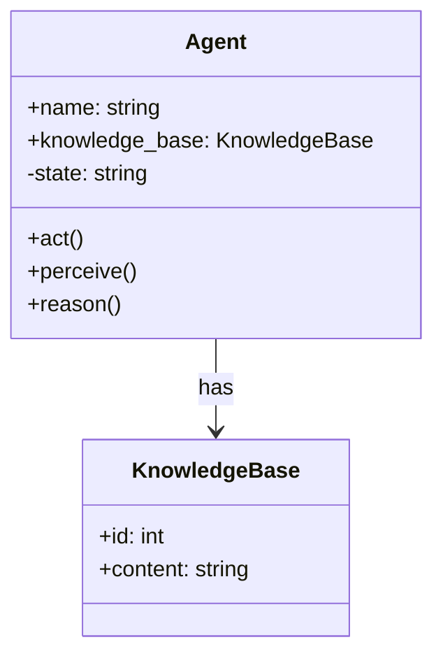
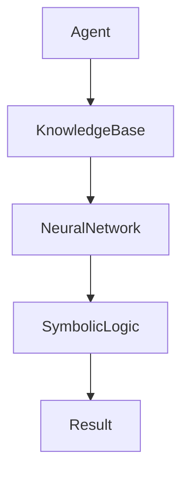

                 


# 基于神经符号AI的AI Agent常识推理增强

> 关键词：神经符号AI，AI Agent，常识推理，增强推理能力，符号逻辑与神经网络结合

> 摘要：本文探讨了如何通过神经符号AI技术增强AI Agent的常识推理能力。首先介绍了神经符号AI的背景和AI Agent的基本概念，接着分析了神经符号AI在常识推理中的优势。然后详细讲解了神经符号AI的核心算法原理，包括符号逻辑与神经网络的结合方法。最后通过实际案例展示了如何将神经符号AI应用于AI Agent的系统设计中，并展望了未来的发展方向。

---

## 第一部分：神经符号AI与AI Agent基础

### 第1章：神经符号AI的背景与现状

#### 1.1 神经符号AI的起源与发展

神经符号AI（Neural-Symbolic AI）是一种结合了符号逻辑和神经网络的人工智能技术。传统的符号AI依赖于逻辑推理规则，但在处理复杂和模糊问题时表现有限。而神经网络虽然在感知和模式识别方面表现出色，但缺乏对符号逻辑的处理能力。神经符号AI的出现，旨在结合两者的优点，弥补各自的不足。

- **符号AI的局限性**：符号AI依赖于预定义的规则，难以处理复杂和动态变化的问题。例如，在常识推理中，符号AI难以处理语义模糊或上下文依赖的问题。
- **神经网络的崛起**：神经网络通过大量数据训练，能够自动提取特征和模式，但在需要明确逻辑推理时表现不佳。
- **神经符号AI的融合之路**：神经符号AI通过将符号逻辑嵌入神经网络中，实现了感知与推理的结合，成为AI领域的重要研究方向。

#### 1.2 AI Agent的基本概念

AI Agent（智能体）是指能够感知环境并采取行动以实现目标的实体。AI Agent可以是软件程序、机器人或其他智能系统。基于符号逻辑的AI Agent通常依赖于预定义的规则，而基于神经网络的AI Agent则依赖于数据驱动的模式识别。

- **AI Agent的定义与分类**：
  - 定义：AI Agent是一个能够感知环境、自主决策并采取行动的实体。
  - 分类：根据智能水平，AI Agent可以分为简单反射型、基于模型的反射型、目标驱动型和实用驱动型。
- **符号逻辑与神经网络的结合**：神经符号AI通过将符号逻辑嵌入神经网络中，增强了AI Agent的推理能力。
- **常识推理的重要性**：常识推理是AI Agent理解人类常识、处理复杂问题的关键能力。

#### 1.3 常识推理的挑战与意义

常识推理是指AI Agent能够理解并应用常识进行推理的能力。常识推理的挑战主要在于常识的多样性和模糊性，传统符号AI和神经网络各自存在局限性。

- **常识推理的定义**：常识推理是指基于常识进行逻辑推理的能力。
- **现有技术的不足**：符号AI缺乏对感知数据的处理能力，而神经网络缺乏逻辑推理能力。
- **神经符号AI的优势**：神经符号AI结合了符号逻辑和神经网络的优势，能够更好地处理常识推理问题。

### 第2章：神经符号AI的核心概念与联系

#### 2.1 神经符号AI的核心原理

神经符号AI通过将符号逻辑嵌入神经网络中，实现了感知与推理的结合。其核心原理包括符号表示、逻辑推理和神经网络的结合。

- **符号表示**：神经符号AI将常识表示为符号形式，例如逻辑规则、谓词逻辑等。
- **逻辑推理**：神经符号AI通过符号逻辑进行推理，例如归纳推理、演绎推理等。
- **神经网络的结合**：神经符号AI将符号逻辑嵌入神经网络中，通过神经网络处理感知数据，通过符号逻辑进行推理。

#### 2.2 AI Agent与神经符号AI的关系

AI Agent需要具备常识推理能力才能更好地理解环境和做出决策。神经符号AI通过结合符号逻辑和神经网络，增强了AI Agent的推理能力。

- **AI Agent的常识推理需求**：AI Agent需要理解常识才能处理复杂问题。
- **神经符号AI在AI Agent中的作用**：神经符号AI通过结合符号逻辑和神经网络，增强了AI Agent的常识推理能力。
- **神经符号AI增强AI Agent推理能力的机制**：神经符号AI通过将符号逻辑嵌入神经网络中，实现了感知与推理的结合。

#### 2.3 神经符号AI的核心概念对比表

以下是神经符号AI与符号AI和神经网络的对比表：

| 特性               | 符号AI         | 神经网络       | 神经符号AI     |
|--------------------|---------------|---------------|---------------|
| 表示方式           | 符号           | 神经网络参数    | 符号+神经网络  |
| 推理能力           | 强             | 弱             | 强             |
| 学习能力           | 弱             | 强             | 平衡           |
| 处理复杂问题能力   | 有限           | 较强           | 更强           |

#### 2.4 神经符号AI的ER实体关系图

以下是神经符号AI的ER实体关系图：

```mermaid
er
actor(Agent) {
    name
} 
relates to 
knowledge_base {
    id
    content
} 
via 
hasKnowledge(
    participation: Agent -> 1,
    knowledge_base -> 1
)
```

---

## 第二部分：神经符号AI的算法原理

### 第3章：神经符号AI的算法原理

#### 3.1 神经符号AI的基本算法

神经符号AI的基本算法包括符号逻辑与神经网络的结合算法、推理算法和学习算法。

- **符号逻辑与神经网络的结合算法**：将符号逻辑嵌入神经网络中，例如通过符号逻辑指导神经网络的权重调整。
- **推理算法**：基于符号逻辑的推理算法，例如逻辑演绎和归纳。
- **学习算法**：通过神经网络进行监督或无监督学习，结合符号逻辑进行推理。

#### 3.2 神经符号AI的数学模型与公式

以下是神经符号AI的数学模型示例：

$$
f(x) = W \cdot x + b
$$

其中，$W$ 是权重矩阵，$x$ 是输入向量，$b$ 是偏置项。

通过符号逻辑的推理，神经符号AI能够对输入进行逻辑推理：

$$
\text{如果} \quad P(x) \quad \text{成立，则} \quad Q(x) \quad \text{成立}
$$

---

## 第三部分：系统分析与架构设计

### 第4章：系统分析与架构设计方案

#### 4.1 系统功能设计

以下是系统功能设计的类图：



#### 4.2 系统架构设计

以下是系统架构设计的架构图：



---

## 第四部分：项目实战

### 第5章：项目实战

#### 5.1 项目介绍

以下是项目介绍：

```python
# 神经符号AI增强AI Agent常识推理
# 项目目标：通过神经符号AI技术增强AI Agent的常识推理能力
# 环境要求：Python 3.8+, TensorFlow 2.0+, PyYAML
```

#### 5.2 核心代码实现

以下是核心代码实现：

```python
import tensorflow as tf
from tensorflow import keras

# 定义符号逻辑
def symbolic_rules(x):
    return tf.keras.backend.switch(x > 0.5, 1, 0)

# 定义神经网络模型
model = keras.Sequential([
    keras.layers.Dense(64, activation='relu'),
    keras.layers.Dense(1, activation='sigmoid')
])

# 定义神经符号AI模型
class NeuralSymbolicAI(keras.Model):
    def call(self, x):
        symbolic_output = symbolic_rules(x)
        neural_output = self.layers[0](x)
        combined_output = neural_output * symbolic_output
        return self.layers[1](combined_output)

# 编译模型
model = NeuralSymbolicAI()
model.compile(optimizer='adam', loss='binary_crossentropy')
```

#### 5.3 代码解读与分析

以下是代码解读与分析：

1. **符号逻辑定义**：`symbolic_rules`函数通过符号逻辑对输入进行判断。
2. **神经网络模型**：定义了一个简单的神经网络模型，用于感知数据。
3. **神经符号AI模型**：将符号逻辑与神经网络结合，实现感知与推理的结合。

#### 5.4 实际案例分析

以下是实际案例分析：

```python
# 输入数据
input_data = tf.random.uniform((1, 1))

# 前向推理
output = model(input_data)

# 输出结果
print(output.numpy())
```

---

## 第五部分：总结与展望

### 第6章：总结与展望

#### 6.1 总结

神经符号AI通过结合符号逻辑和神经网络，增强了AI Agent的常识推理能力。本文详细介绍了神经符号AI的核心原理、算法实现和系统设计，并通过实际案例展示了其应用。

#### 6.2 未来展望

未来，神经符号AI将在更多领域得到应用，例如智能对话系统、自动驾驶等。随着技术的发展，神经符号AI的推理能力将不断提升，推动AI技术的发展。

#### 6.3 最佳实践 tips

- 在实际应用中，结合符号逻辑和神经网络的优势，可以提高AI Agent的推理能力。
- 在系统设计中，合理设计知识库和神经符号AI模型的结合，能够提升系统的性能。

---

## 作者

作者：AI天才研究院/AI Genius Institute & 禅与计算机程序设计艺术 /Zen And The Art of Computer Programming

---

以上是关于《基于神经符号AI的AI Agent常识推理增强》的技术博客文章的完整目录大纲和内容。

