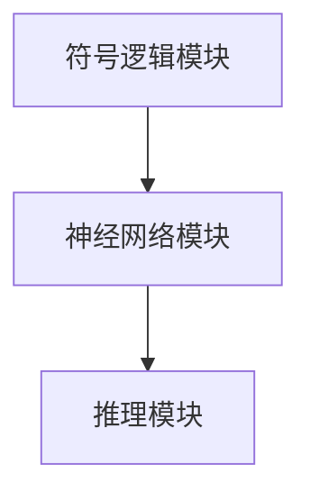

                 


# 基于神经符号AI的AI Agent逻辑推理增强

> 关键词：神经符号AI，AI Agent，逻辑推理，数学模型，系统架构

> 摘要：本文详细探讨了基于神经符号AI的AI Agent逻辑推理增强方法，从理论到实践，系统地介绍了神经符号AI的核心概念、算法原理、系统架构设计及项目实战。通过结合符号逻辑与神经网络，本文展示了如何提升AI Agent的逻辑推理能力，并在实际案例中进行了详细分析和实现。

---

## 第一部分: 基于神经符号AI的AI Agent背景介绍

### 第1章: 神经符号AI与AI Agent概述

#### 1.1 神经符号AI的定义与特点
神经符号AI（Neural-Symbolic AI）是一种结合了符号逻辑和神经网络的人工智能方法。它将符号逻辑的可解释性和灵活性与神经网络的强大的特征学习能力相结合，能够处理复杂的逻辑推理问题。

##### 1.1.1 神经符号AI的定义
神经符号AI通过将符号逻辑嵌入到神经网络中，实现了对符号逻辑的自动学习和推理。其核心在于将符号逻辑规则与神经网络的非线性表达能力相结合，从而在复杂任务中表现出色。

##### 1.1.2 神经符号AI的核心特点
1. **可解释性**：符号逻辑部分提供了明确的推理规则，使模型的决策过程更具透明性。
2. **自适应性**：神经网络能够从数据中学习复杂的模式，使模型具备自适应能力。
3. **跨领域应用**：神经符号AI能够应用于自然语言处理、机器人控制、自动驾驶等多个领域。

##### 1.1.3 神经符号AI与传统符号AI的区别
| 特性 | 神经符号AI | 传统符号AI |
|------|------------|------------|
| 可学习性 | 高 | 低 |
| 灵活性 | 高 | 低 |
| 解释性 | 高 | 高 |
| 数据需求 | 中 | 高 |

#### 1.2 AI Agent的基本概念与分类
AI Agent（智能体）是一种能够感知环境、自主决策并执行任务的智能系统。它广泛应用于自动驾驶、智能助手、机器人等领域。

##### 1.2.1 AI Agent的定义
AI Agent是具有感知、推理、规划和执行能力的智能实体，能够根据环境信息做出决策并执行任务。

##### 1.2.2 AI Agent的分类
1. **反应式AI Agent**：基于当前感知做出反应，不依赖于长期记忆。
2. **认知式AI Agent**：具备复杂推理和规划能力，能够根据目标和环境信息进行决策。
3. **混合式AI Agent**：结合反应式和认知式的特点，适用于复杂任务。

##### 1.2.3 AI Agent的应用场景
- 自动驾驶：路径规划、障碍物识别。
- 智能助手：自然语言理解、任务执行。
- 机器人控制：复杂环境中的自主决策。

#### 1.3 神经符号AI在AI Agent中的作用
神经符号AI能够增强AI Agent的逻辑推理能力，使其在复杂环境中做出更智能的决策。

##### 1.3.1 神经符号AI的优势
1. **强大的推理能力**：结合符号逻辑和神经网络，能够处理复杂的逻辑推理问题。
2. **自适应性**：能够从经验中学习，适应新的环境和任务。
3. **可解释性**：符号逻辑部分提供了明确的推理规则，使决策过程更具透明性。

##### 1.3.2 神经符号AI在逻辑推理中的应用
神经符号AI通过将逻辑规则嵌入到神经网络中，能够实现以下推理任务：
1. **知识图谱推理**：基于知识图谱进行复杂关系推理。
2. **逻辑规则学习**：从数据中学习逻辑规则，并用于推理。
3. **动态环境推理**：在动态环境中实时推理和调整决策。

##### 1.3.3 神经符号AI与AI Agent的结合
神经符号AI为AI Agent提供了强大的推理能力，使其能够在复杂环境中做出更智能的决策。通过将符号逻辑嵌入到神经网络中，AI Agent能够结合感知信息和符号逻辑进行推理，从而实现更复杂的任务。

---

## 第2章: 神经符号AI的核心概念与联系

### 2.1 神经符号AI的核心原理
神经符号AI通过将符号逻辑嵌入到神经网络中，实现了对符号逻辑的自动学习和推理。

#### 2.1.1 符号逻辑与神经网络的结合
符号逻辑提供了明确的推理规则，而神经网络能够从数据中学习复杂的模式。通过将符号逻辑嵌入到神经网络中，神经符号AI能够结合两者的优点。

#### 2.1.2 神经符号AI的基本架构
神经符号AI的基本架构包括符号逻辑模块和神经网络模块。符号逻辑模块负责提供推理规则，神经网络模块负责处理感知信息并生成决策。

#### 2.1.3 神经符号AI的数学模型
神经符号AI的数学模型结合了符号逻辑和神经网络的表达能力。通过符号逻辑的规则约束，神经网络能够学习到符合逻辑的推理路径。

### 2.2 神经符号AI与传统符号逻辑的对比
神经符号AI与传统符号逻辑相比，具有更强的自适应性和灵活性。

#### 2.2.1 符号逻辑的优缺点
符号逻辑的优点是可解释性和确定性，缺点是缺乏灵活性和自适应性。

#### 2.2.2 神经符号AI的优势
神经符号AI结合了符号逻辑的可解释性和神经网络的自适应性，能够处理更复杂的问题。

#### 2.2.3 神经符号AI与符号逻辑的结合
神经符号AI通过将符号逻辑嵌入到神经网络中，实现了对符号逻辑的自动学习和推理。

### 2.3 神经符号AI的ER实体关系图
以下是神经符号AI的ER实体关系图：

```mermaid
er
actor(Agent, $主体$)
actor(State, $状态$)
actor(Action, $动作$)
actor(Rule, $规则$)
```

---

## 第3章: 神经符号AI的算法原理

### 3.1 神经符号AI的基本算法
神经符号AI的基本算法包括符号逻辑的表示、神经网络的训练和推理过程。

#### 3.1.1 神经符号AI的基本流程
1. **符号逻辑的表示**：将符号逻辑规则表示为数学形式。
2. **神经网络的训练**：通过数据训练神经网络，使其能够学习符号逻辑规则。
3. **推理过程**：结合感知信息和符号逻辑规则，进行推理并生成决策。

#### 3.1.2 神经符号AI的训练过程
神经符号AI的训练过程包括符号逻辑规则的嵌入、数据的输入和神经网络的训练。

#### 3.1.3 神经符号AI的推理过程
推理过程结合了感知信息和符号逻辑规则，通过神经网络进行推理并生成决策。

### 3.2 神经符号AI的数学模型
神经符号AI的数学模型结合了符号逻辑和神经网络的表达能力。

#### 3.2.1 符号逻辑的数学表示
符号逻辑的数学表示包括命题逻辑公式和谓词逻辑公式。

#### 3.2.2 神经网络的数学表示
神经网络的数学表示包括输入层、隐藏层和输出层的权重和激活函数。

#### 3.2.3 神经符号AI的数学模型
神经符号AI的数学模型结合了符号逻辑的规则和神经网络的表达能力，通过符号逻辑的约束实现推理。

### 3.3 神经符号AI的算法实现
神经符号AI的算法实现包括符号逻辑的嵌入、神经网络的训练和推理过程。

#### 3.3.1 神经符号AI的训练算法
神经符号AI的训练算法包括符号逻辑规则的嵌入、数据的输入和神经网络的训练。

#### 3.3.2 神经符号AI的推理算法
推理算法结合了感知信息和符号逻辑规则，通过神经网络进行推理并生成决策。

#### 3.3.3 神经符号AI的优化算法
优化算法包括符号逻辑规则的优化、神经网络结构的优化和训练参数的优化。

---

## 第4章: 神经符号AI的系统架构设计

### 4.1 系统功能设计
神经符号AI的系统功能设计包括符号逻辑的表示、神经网络的训练和推理过程。

#### 4.1.1 系统功能模块
系统功能模块包括符号逻辑模块、神经网络模块和推理模块。

#### 4.1.2 系统功能流程
系统功能流程包括符号逻辑的表示、神经网络的训练和推理过程。

#### 4.1.3 系统功能设计
系统功能设计包括符号逻辑模块、神经网络模块和推理模块的具体实现。

### 4.2 系统架构设计
神经符号AI的系统架构设计包括符号逻辑模块、神经网络模块和推理模块。

#### 4.2.1 系统架构图
以下是神经符号AI的系统架构图：



#### 4.2.2 系统交互流程
系统交互流程包括符号逻辑的表示、神经网络的训练和推理过程。

---

## 第5章: 神经符号AI的项目实战

### 5.1 环境安装
神经符号AI的项目实战需要安装Python、TensorFlow和符号逻辑库。

#### 5.1.1 环境需求
- Python 3.7+
- TensorFlow 2.0+
- 符号逻辑库

#### 5.1.2 安装步骤
```bash
pip install numpy
pip install tensorflow
pip install sympy
```

### 5.2 系统核心实现源代码
以下是神经符号AI的实现源代码：

```python
import numpy as np
import tensorflow as tf
from sympy import symbols, And, Or, Not

# 符号逻辑部分
x, y = symbols('x y')
rule = Or(x, y)

# 神经网络部分
model = tf.keras.Sequential([
    tf.keras.layers.Dense(8, activation='relu'),
    tf.keras.layers.Dense(1, activation='sigmoid')
])

model.compile(optimizer='adam', loss='binary_crossentropy', metrics=['accuracy'])
```

### 5.3 代码应用解读与分析
代码应用解读与分析包括符号逻辑部分和神经网络部分的具体实现。

#### 5.3.1 符号逻辑部分
符号逻辑部分使用了SymPy库，定义了逻辑规则并将其嵌入到神经网络中。

#### 5.3.2 神经网络部分
神经网络部分使用了TensorFlow库，定义了模型结构并进行了训练。

### 5.4 实际案例分析和详细讲解剖析
实际案例分析包括符号逻辑规则的表示、神经网络的训练和推理过程。

#### 5.4.1 实际案例分析
通过具体案例展示了神经符号AI的应用场景和实现过程。

### 5.5 项目小结
项目小结总结了神经符号AI的应用前景和未来研究方向。

---

## 第六部分: 总结与展望

### 6.1 总结
本文详细探讨了基于神经符号AI的AI Agent逻辑推理增强方法，从理论到实践，系统地介绍了神经符号AI的核心概念、算法原理、系统架构设计及项目实战。

### 6.2 未来研究方向
未来研究方向包括神经符号AI的优化算法、符号逻辑规则的自动生成和神经符号AI在复杂任务中的应用。

### 6.3 最佳实践 tips
- 在符号逻辑嵌入时，应充分考虑规则的复杂性和数据的多样性。
- 神经符号AI的训练需要大量的数据和计算资源，应合理优化模型结构和训练参数。

---

## 作者：AI天才研究院/AI Genius Institute & 禅与计算机程序设计艺术 /Zen And The Art of Computer Programming

---

**文章关键词**：神经符号AI，AI Agent，逻辑推理，数学模型，系统架构

**文章摘要**：本文详细探讨了基于神经符号AI的AI Agent逻辑推理增强方法，从理论到实践，系统地介绍了神经符号AI的核心概念、算法原理、系统架构设计及项目实战。通过结合符号逻辑与神经网络，本文展示了如何提升AI Agent的逻辑推理能力，并在实际案例中进行了详细分析和实现。

