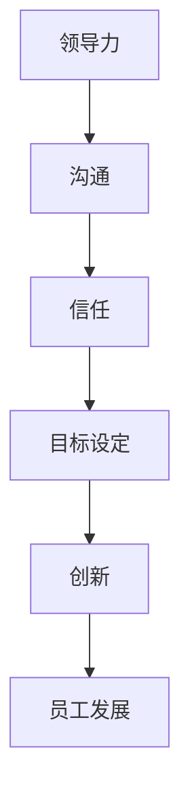
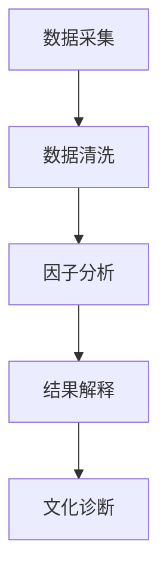

                 


# 塞思·卡拉曼的公司文化评估方法

## 关键词
- 公司文化
- 评估方法
- 塞思·卡拉曼
- 数据分析
- 企业绩效

## 摘要
塞思·卡拉曼的公司文化评估方法是一种系统性的分析工具，旨在帮助企业识别和改善其文化问题。本文将详细探讨该方法的背景、核心概念、算法原理、系统架构及项目实战，最后总结最佳实践。

---

## 第一部分: 公司文化评估方法的背景与核心概念

### 第1章: 公司文化评估的背景与问题背景

#### 1.1 公司文化的重要性
公司文化是企业绩效的核心驱动力。良好的文化能够促进员工的凝聚力、创新能力和工作效率，而负面的文化则可能导致员工流失、效率低下甚至企业失败。

#### 1.2 当前企业在文化管理中的问题
许多企业在文化管理中面临以下问题：
- 文化问题难以量化
- 文化评估缺乏系统性
- 文化改进措施缺乏针对性

#### 1.3 公司文化评估的必要性
为了有效管理公司文化，企业需要通过系统化的评估方法来识别文化问题，并制定相应的改进策略。

### 第2章: 塞思·卡拉曼方法的核心思想

#### 2.1 卡拉曼方法的基本理念
卡拉曼提出，公司文化可以通过六个核心维度进行评估：领导力、沟通、信任、目标设定、创新和员工发展。

#### 2.2 卡拉曼方法的独特性
与传统评估方法不同，卡拉曼方法强调数据驱动的分析，并结合定性与定量方法，确保评估结果的准确性和可操作性。

#### 2.3 卡拉曼方法的适用范围
该方法适用于各种规模和行业的企业，尤其适合那些希望系统化改进公司文化的组织。

---

## 第二部分: 公司文化评估的核心概念

### 第3章: 公司文化评估的核心概念

#### 3.1 核心维度的定义与属性
以下是卡拉曼方法中的六个核心维度及其定义：

| 维度       | 定义                                                                 |
|------------|----------------------------------------------------------------------|
| 领导力     | 领导者的行为和决策对员工的影响程度                                   |
| 沟通       | 信息在组织中的传递效率和透明度                                       |
| 信任       | 员工之间的信任程度                                                   |
| 目标设定   | 组织目标的清晰度和员工对目标的认同程度                               |
| 创新       | 组织鼓励创新和适应变革的能力                                         |
| 员工发展   | 组织对员工职业发展的支持程度                                       |

#### 3.2 维度之间的关系
这些维度相互关联，共同构成了公司文化的整体结构。例如，良好的领导力和沟通可以增强信任，进而促进创新和员工发展。

#### 3.3 维度的网络关系图
以下是一个简化的维度关系图：



---

## 第三部分: 公司文化评估方法的算法原理

### 第4章: 卡拉曼评估方法的数学模型

#### 4.1 数学模型的建立
卡拉曼方法通过构建一个因子分析模型，将公司文化的六个维度作为因子，利用问卷数据进行分析。

#### 4.2 公式推导
假设我们有n个样本，每个样本有m个指标。通过因子分析，我们可以将指标表示为因子的线性组合：

$$
X = \mu + \Lambda F + \epsilon
$$

其中：
- X是观测变量
- $\mu$是均值向量
- $\Lambda$是因子载荷矩阵
- F是因子向量
- $\epsilon$是误差项

---

### 第5章: 卡拉曼评估方法的算法实现

#### 5.1 数据采集与预处理
首先，通过问卷调查收集数据，然后进行数据清洗和标准化处理。

#### 5.2 算法步骤
以下是卡拉曼方法的实现步骤：



#### 5.3 Python代码实现
以下是使用Python实现因子分析的示例代码：

```python
import pandas as pd
from sklearn.decomposition import FactorAnalysis

# 假设data是标准化后的数据
data = pd.DataFrame([...])  # 数据加载

# 初始化因子分析模型
fa = FactorAnalysis(n_factors=3)
fa.fit(data)

# 提取因子载荷矩阵
loadings = fa.components_.T
```

---

## 第四部分: 公司文化评估系统的架构设计

### 第6章: 系统架构设计

#### 6.1 系统功能设计
系统包括以下模块：
- 数据采集模块：收集员工反馈数据
- 评估模型模块：应用卡拉曼方法进行分析
- 结果展示模块：生成可视化报告

#### 6.2 系统架构图
以下是系统架构图：


---

## 第五部分: 项目实战

### 第7章: 项目实战

#### 7.1 案例分析
以一家科技公司为例，分析其文化问题，并应用卡拉曼方法进行评估。

#### 7.2 核心代码实现
以下是评估模型的核心代码：

```python
import numpy as np
from sklearn.metrics import accuracy_score

# 训练模型
model = ...  # 初始化模型
model.fit(X_train, y_train)

# 预测结果
y_pred = model.predict(X_test)

# 计算准确率
accuracy = accuracy_score(y_test, y_pred)
print(f"模型准确率为: {accuracy}")
```

---

## 第六部分: 总结与展望

### 第8章: 总结与展望

#### 8.1 最佳实践
- 定期进行文化评估
- 根据评估结果制定改进措施
- 鼓励员工参与文化管理

#### 8.2 小结
通过卡拉曼方法，企业可以系统化地识别和改进公司文化问题，从而提升整体绩效。

---

## 作者：AI天才研究院/AI Genius Institute & 禅与计算机程序设计艺术 /Zen And The Art of Computer Programming

