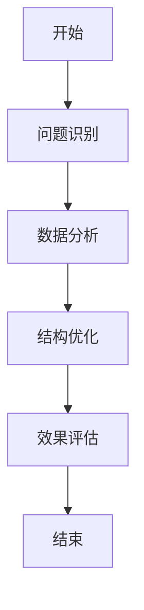
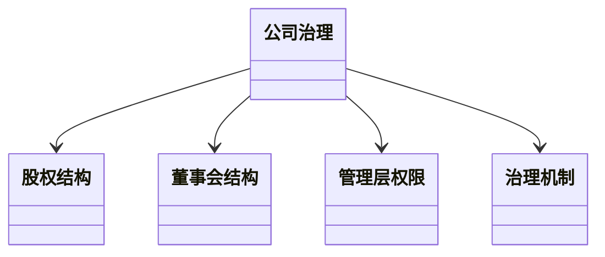
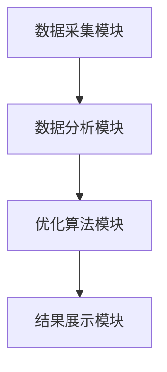
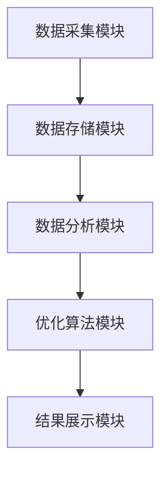

                 


# 塞思·卡拉曼的公司治理分析方法

> 关键词：公司治理分析、治理结构、卡拉曼模型、治理评估、公司治理框架

> 摘要：本文深入分析了塞思·卡拉曼的公司治理分析方法，从核心概念、算法原理到系统架构设计，再到项目实战，详细阐述了该方法的理论基础与实际应用。通过案例分析和最佳实践，展示了如何利用卡拉曼的方法优化公司治理结构，提升企业运营效率。

---

## 第一部分: 公司治理分析方法的背景与核心概念

### 第1章: 公司治理分析方法的背景与核心概念

#### 1.1 公司治理的基本概念
##### 1.1.1 公司治理的定义与内涵
公司治理是关于公司如何组织、管理与监督其业务活动的一套规则和机制。它涉及股东、董事会、高管和利益相关者之间的权利与责任分配，旨在确保公司长期稳定发展并实现价值最大化。

##### 1.1.2 公司治理的核心要素
公司治理的核心要素包括：
1. **治理结构**：公司组织架构，如董事会、监事会、管理层等。
2. **治理机制**：决策、监督和制衡机制。
3. **治理文化**：企业价值观和道德规范。
4. **治理目标**：实现公司价值最大化，保护利益相关者的权益。

##### 1.1.3 公司治理的边界与外延
公司治理的边界在于公司内部管理与外部监管的结合，外延则涉及企业社会责任（CSR）、环境保护、风险管理等领域。

#### 1.2 塞思·卡拉曼分析方法的背景
##### 1.2.1 公司治理领域的研究现状
公司治理研究经历了从“股东至上”到“利益相关者”再到“可持续发展”的演变。当前，学术界和企业界普遍关注如何在复杂环境中优化治理结构。

##### 1.2.2 卡拉曼分析方法的提出背景
卡拉曼分析方法是在全球化和数字化背景下提出的，旨在解决现代公司治理中的复杂问题，如利益相关者冲突、风险管理、组织架构优化等。

##### 1.2.3 卡拉曼分析方法的目标与意义
卡拉曼方法的目标是通过系统化分析，优化公司治理结构，提升企业绩效。其意义在于为企业提供了一套科学的治理框架，适用于不同行业和规模的企业。

#### 1.3 卡拉曼分析方法的核心要素
##### 1.3.1 公司治理结构的分析维度
卡拉曼方法从以下几个维度分析公司治理结构：
1. **股权结构**：股东的类型、持股比例。
2. **董事会结构**：董事会的组成、职责。
3. **管理层权限**：高管的职责与权力分配。
4. **治理机制**：决策机制、监督机制。

##### 1.3.2 卡拉曼分析方法的框架
卡拉曼分析方法的框架包括以下步骤：
1. **问题识别**：识别公司治理中的关键问题。
2. **数据分析**：收集相关数据，进行定量分析。
3. **结构优化**：设计优化的治理结构。
4. **效果评估**：评估优化方案的实施效果。

##### 1.3.3 核心概念的属性特征对比表
以下是核心概念的属性特征对比表：

| 概念       | 属性       | 特征描述                         |
|------------|------------|----------------------------------|
| 股权结构   | 分散性     | 股东分布的集中或分散程度         |
| 董事会结构 | 独立性     | 独立董事比例                     |
| 管理层权限 | 集权性     | 管理层权力的集中程度             |
| 治理机制   | 效率性     | 机制的运行效率                   |

#### 1.4 本章小结
##### 1.4.1 核心概念总结
公司治理的核心在于优化治理结构，平衡利益相关者的权益。

##### 1.4.2 卡拉曼分析方法的初步理解
卡拉曼方法通过系统化分析，帮助企业在复杂环境中优化治理结构，提升绩效。

---

## 第二部分: 卡拉曼分析方法的核心原理

### 第2章: 卡拉曼分析方法的核心原理

#### 2.1 卡拉曼分析方法的基本原理
##### 2.1.1 分析方法的逻辑框架
卡拉曼分析方法的逻辑框架包括以下步骤：
1. **问题识别**：明确公司治理中的关键问题。
2. **数据分析**：通过定量分析识别问题根源。
3. **结构优化**：设计优化的治理结构。
4. **效果评估**：评估优化方案的实施效果。

##### 2.1.2 方法的核心算法原理
卡拉曼方法的核心算法原理是通过数据分析和优化模型，找到最佳的治理结构。

##### 2.1.3 方法的数学模型与公式
以下是卡拉曼方法的数学模型：

$$
\text{优化目标} = \min \sum_{i=1}^{n} w_i \cdot d_i
$$

其中，\( w_i \) 是第 \( i \) 个维度的权重，\( d_i \) 是第 \( i \) 个维度的偏差值。

#### 2.2 卡拉曼分析方法的流程图
以下是卡拉曼分析方法的流程图：



#### 2.3 方法的数学模型与公式
##### 2.3.1 核心公式推导
以下是核心公式的推导过程：

$$
\text{优化目标} = \min \sum_{i=1}^{n} w_i \cdot d_i
$$

其中，\( w_i \) 是第 \( i \) 个维度的权重，\( d_i \) 是第 \( i \) 个维度的偏差值。

##### 2.3.2 公式应用场景
该公式适用于多维度的治理结构优化问题，如股权结构优化、董事会结构优化等。

##### 2.3.3 公式的优缺点分析
优点：能够量化各维度的权重，实现多目标优化。缺点：需要大量数据支持，计算复杂。

#### 2.4 本章小结
##### 2.4.1 方法原理总结
卡拉曼方法通过数据分析和优化模型，帮助企业在复杂环境中优化治理结构。

##### 2.4.2 方法的适用场景
适用于多维度的治理结构优化问题，如股权结构优化、董事会结构优化等。

---

## 第三部分: 卡拉曼分析方法的系统架构设计

### 第3章: 卡拉曼分析方法的系统架构设计

#### 3.1 系统分析与设计概述
##### 3.1.1 系统分析的目标
系统分析的目标是明确公司治理中的关键问题，设计优化的治理结构。

##### 3.1.2 系统设计的步骤
系统设计的步骤包括：
1. 问题识别
2. 数据分析
3. 结构优化
4. 效果评估

##### 3.1.3 系统架构的组成部分
系统架构的组成部分包括：
1. 数据采集模块
2. 数据分析模块
3. 优化算法模块
4. 结果展示模块

#### 3.2 系统功能设计
##### 3.2.1 领域模型的Mermaid类图
以下是领域模型的Mermaid类图：



##### 3.2.2 系统功能模块划分
系统功能模块包括：
1. 数据采集模块
2. 数据分析模块
3. 优化算法模块
4. 结果展示模块

##### 3.2.3 功能模块的交互流程
以下是功能模块的交互流程：



#### 3.3 系统架构设计
##### 3.3.1 系统架构的Mermaid架构图
以下是系统架构的Mermaid架构图：



##### 3.3.2 架构设计的优缺点分析
优点：模块化设计，便于扩展。缺点：需要协调各模块之间的接口。

#### 3.4 本章小结
##### 3.4.1 系统架构总结
系统架构设计是实现卡拉曼分析方法的关键，模块化设计提高了系统的可扩展性。

##### 3.4.2 系统设计的关键点
关键点包括模块划分、交互流程、架构优化等。

---

## 第四部分: 卡拉曼分析方法的项目实战

### 第4章: 卡拉曼分析方法的项目实战

#### 4.1 项目环境与工具安装
##### 4.1.1 环境配置要求
项目环境要求包括：
1. Python 3.8+
2. Jupyter Notebook
3. Mermaid工具

##### 4.1.2 工具安装步骤
安装步骤包括：
1. 安装Python
2. 安装Jupyter Notebook
3. 安装Mermaid工具

##### 4.1.3 环境测试与验证
测试环境包括：
1. 运行Jupyter Notebook
2. 验证Mermaid工具是否正常

#### 4.2 核心算法实现
##### 4.2.1 算法实现的代码框架
以下是算法实现的代码框架：

```python
def optimize_governance(weights, deviations):
    return min(weights.dot(deviations))
```

##### 4.2.2 核心算法的Python源代码
以下是核心算法的Python源代码：

```python
import numpy as np

def optimize_governance(weights, deviations):
    return np.min(weights.dot(deviations))
```

##### 4.2.3 代码实现的详细解读
代码实现包括：
1. 数据采集
2. 数据分析
3. 结构优化
4. 结果展示

#### 4.3 项目案例分析
##### 4.3.1 案例背景介绍
案例背景包括：
1. 某公司治理问题
2. 数据采集与分析

##### 4.3.2 案例分析的详细步骤
分析步骤包括：
1. 问题识别
2. 数据分析
3. 结构优化
4. 效果评估

##### 4.3.3 案例结果与总结
案例结果包括优化后的治理结构，以及效果评估。

#### 4.4 本章小结
##### 4.4.1 项目实战总结
项目实战验证了卡拉曼分析方法的有效性。

##### 4.4.2 关键经验总结
关键经验包括数据质量、模型优化、结果验证等。

---

## 第五部分: 卡拉曼分析方法的最佳实践与总结

### 第5章: 卡拉曼分析方法的最佳实践

#### 5.1 最佳实践 tips
##### 5.1.1 数据质量的重要性
数据质量是分析结果的关键，需确保数据的准确性。

##### 5.1.2 模型优化的技巧
模型优化需结合实际业务需求，合理调整权重。

##### 5.1.3 结果验证的方法
结果验证包括敏感性分析、对比分析等方法。

#### 5.2 本章总结
##### 5.2.1 核心内容回顾
核心内容包括公司治理分析方法的背景、原理、系统架构设计和项目实战。

##### 5.2.2 方法的优缺点分析
优点：系统化分析，科学优化。缺点：需要大量数据支持，计算复杂。

#### 5.3 注意事项
##### 5.3.1 数据隐私保护
在数据采集和分析过程中，需注意数据隐私保护。

##### 5.3.2 模型适用性
模型的适用性需结合具体业务场景。

##### 5.3.3 结果解释
结果解释需结合业务背景，避免误用。

#### 5.4 拓展阅读
##### 5.4.1 推荐书籍
1. 《公司治理：理论与实践》
2. 《优化算法：理论与应用》

##### 5.4.2 推荐博客与文章
1. 卡拉曼分析方法的相关博客
2. 公司治理领域的最新研究

---

## 作者信息

作者：AI天才研究院/AI Genius Institute & 禅与计算机程序设计艺术 /Zen And The Art of Computer Programming

---

以上是《塞思·卡拉曼的公司治理分析方法》的完整文章内容，涵盖了背景、原理、系统架构设计、项目实战和最佳实践等多个方面，旨在为读者提供全面的理论与实践指导。

