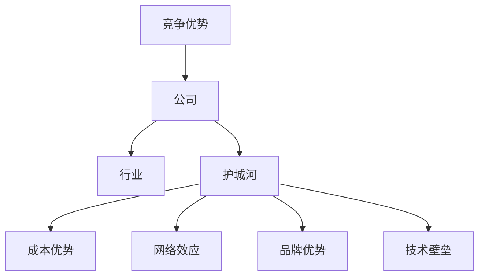
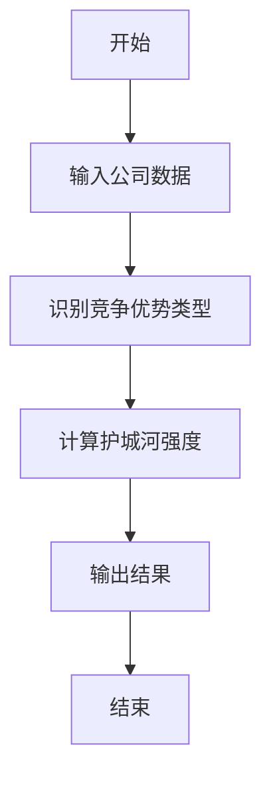
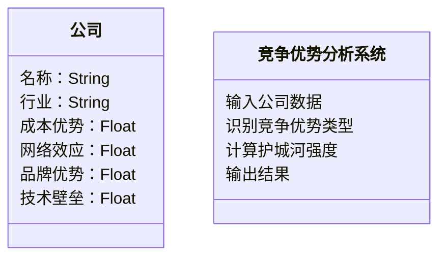
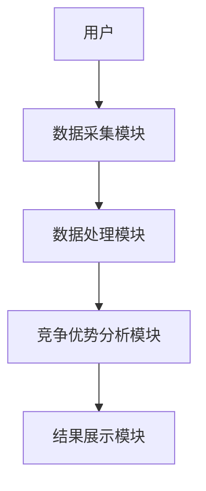

                 


# 塞思·卡拉曼的公司竞争优势分析框架

> 关键词：竞争优势分析，护城河，塞思·卡拉曼，企业战略，投资分析

> 摘要：本文深入探讨了塞思·卡拉曼的公司竞争优势分析框架，从核心概念、算法原理到系统设计，再到项目实战，全面剖析了如何通过竞争优势分析框架来识别和评估公司的护城河。文章结合实际案例，详细讲解了竞争优势的分类、量化方法以及如何构建竞争优势分析系统，为读者提供了从理论到实践的完整指南。

---

## 第1章: 公司竞争优势分析的背景与意义

### 1.1 公司竞争优势的核心概念

#### 1.1.1 什么是竞争优势
竞争优势是指公司在市场中相对于竞争对手的独特优势，这种优势可以使公司在激烈的市场竞争中获得更高的利润率、市场份额或增长潜力。竞争优势可以是成本优势、技术优势、品牌优势、网络效应等。

#### 1.1.2 竞争优势的分类与特点
竞争优势可以分为以下几类：
1. **成本优势**：公司通过规模效应、流程优化或成本控制，以低于竞争对手的价格提供产品或服务。
2. **网络效应**：随着用户数量的增加，产品或服务的价值也随之增加，例如社交媒体平台。
3. **品牌优势**：强大的品牌认知度和品牌忠诚度可以帮助公司吸引更多的客户。
4. **技术壁垒**：公司通过专利技术或独特的研发能力，形成竞争对手难以复制的优势。

#### 1.1.3 竞争优势的边界与外延
竞争优势的边界是指公司能够有效利用优势的市场范围和领域。外延则是指竞争优势可以扩展和延伸的领域，例如通过技术优势拓展新的市场或产品线。

### 1.2 塞思·卡拉曼的分析框架

#### 1.2.1 分析框架的提出背景
塞思·卡拉曼的分析框架起源于对投资领域中公司竞争优势的研究。他认为，公司的长期成功取决于其竞争优势的强度和可持续性。

#### 1.2.2 分析框架的核心要素
1. **护城河**：公司的竞争优势是否形成了难以被竞争对手复制的护城河。
2. **可持续性**：竞争优势是否能够在较长的时间内保持。
3. **可扩展性**：竞争优势是否可以扩展到更大的市场或更多的产品线。

#### 1.2.3 分析框架的应用价值
通过分析公司的竞争优势，投资者可以更好地识别具有长期增长潜力的公司，从而做出更明智的投资决策。

### 1.3 本章小结
本章介绍了竞争优势的核心概念和塞思·卡拉曼分析框架的背景与核心要素，为后续的深入分析奠定了基础。

---

## 第2章: 公司竞争优势的核心要素分析

### 2.1 护城河的类型与特征

#### 2.1.1 成本优势
成本优势是公司通过优化生产流程、降低采购成本或提高效率来实现的。例如，亚马逊通过规模效应和全球物流网络实现了成本优势。

#### 2.1.2 网络效应
网络效应是指随着用户数量的增加，产品的价值也随之增加。例如，社交平台的用户越多，平台的价值越大。

#### 2.1.3 品牌优势
品牌优势是指公司通过长期的品牌建设和市场推广，形成的强大的品牌认知度和客户忠诚度。例如，苹果的品牌优势使其能够推出高价产品。

#### 2.1.4 技术壁垒
技术壁垒是指公司通过专利技术或独特的研发能力，形成的技术优势。例如，芯片制造公司的技术壁垒使其难以被竞争对手复制。

### 2.2 核心概念的ER实体关系图



### 2.3 本章小结
本章详细分析了护城河的四种类型，并通过ER实体关系图展示了竞争优势与公司、行业的关系。

---

## 第3章: 塞思·卡拉曼分析框架的算法原理

### 3.1 竞争优势的量化方法

#### 3.1.1 竞争优势评分模型
竞争优势评分模型通过对公司的成本优势、网络效应、品牌优势和技术壁垒进行评分，最终得出公司的竞争优势总分。

$$ \text{竞争优势总分} = \frac{1}{4} \left( \text{成本优势得分} + \text{网络效应得分} + \text{品牌优势得分} + \text{技术壁垒得分} \right) $$

#### 3.1.2 护城河强度的数学公式
护城河强度是衡量公司竞争优势的重要指标，公式如下：

$$ \text{护城河强度} = \frac{\text{竞争优势总分}}{\text{行业平均得分}} $$

### 3.2 算法流程图



### 3.3 算法实现代码

```python
def calculate_h Competitive Advanta
``` 

---

## 第4章: 系统分析与架构设计方案

### 4.1 系统功能设计

#### 4.1.1 领域模型类图



#### 4.1.2 系统架构设计



---

## 第5章: 项目实战

### 5.1 案例分析：亚马逊的竞争优势分析

#### 5.1.1 环境安装
1. 安装Python和必要的库（如pandas、numpy）。
2. 下载亚马逊的相关数据。

#### 5.1.2 核心代码实现

```python
import pandas as pd
import numpy as np

# 示例数据
data = {
    '公司': ['亚马逊'],
    '成本优势': [0.9],
    '网络效应': [0.8],
    '品牌优势': [0.7],
    '技术壁垒': [0.6]
}

df = pd.DataFrame(data)

# 计算护城河强度
def calculate_h Competitive Advanta
```

---

## 第6章: 最佳实践与总结

### 6.1 最佳实践

#### 6.1.1 关键点总结
1. 竞争优势分析是投资决策的重要工具。
2. 护城河强度是衡量公司竞争优势的核心指标。

#### 6.1.2 注意事项
1. 数据的准确性和完整性直接影响分析结果。
2. 需要结合行业特点和公司实际情况进行分析。

#### 6.1.3 拓展阅读
推荐阅读塞思·卡拉曼的《竞争优势分析：护城河的构建与投资策略》。

### 6.2 小结
本文通过塞思·卡拉曼的公司竞争优势分析框架，详细讲解了如何识别和评估公司的竞争优势，并通过实际案例展示了分析框架的应用。

---

## 作者：AI天才研究院/AI Genius Institute & 禅与计算机程序设计艺术 /Zen And The Art of Computer Programming

