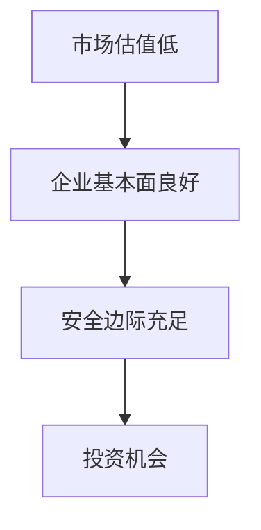
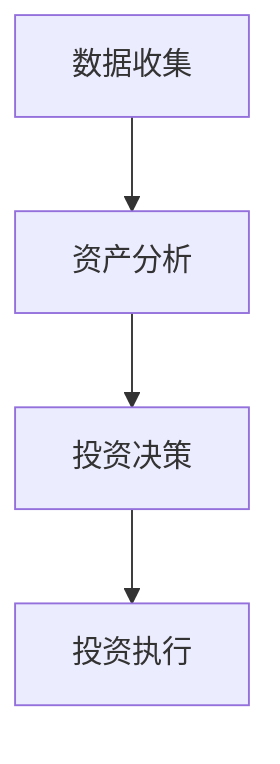

                 

# 塞思·卡拉曼的特殊情况投资案例研究

## 关键词：
- 塞思·卡拉曼
- 特殊情况投资
- 逆向投资
- 安全边际
- 资产估值

## 摘要：
塞思·卡拉曼是全球著名投资者，专注于特殊情况投资，尤其擅长在市场困境中发现价值。本文通过详细分析他的投资理念、策略和经典案例，揭示其独特的投资方法和背后的数学模型。文章结构清晰，涵盖背景介绍、核心概念、算法原理、系统分析、项目实战和最佳实践，帮助读者深入理解卡拉曼的投资智慧。

---

# 第一部分: 塞思·卡拉曼的特殊情况投资背景与理念

## 第1章: 塞思·卡拉曼的生平与投资理念

### 1.1 塞思·卡拉曼的生平简介
塞思·卡拉曼（ Seth K. Carman）是一位备受尊敬的投资专家，以其在特殊情况投资领域的卓越表现闻名。他出生于1960年代，早年在宾夕法尼亚大学获得经济学学士学位，随后在沃顿商学院深造，获得金融博士学位。他的投资生涯始于华尔街，早期在多家知名金融机构任职，积累了丰富的投资经验。卡拉曼因其在困境投资、重组投资和破产清算领域的卓越成绩，逐渐成为全球投资界的焦点人物。

### 1.2 塞思·卡拉曼的投资哲学
卡拉曼的投资哲学的核心是“价值投资与安全边际”。他认为，市场的波动性和非理性为投资者提供了绝佳的机会，尤其是当资产价格远低于其内在价值时。他强调，投资决策应基于深入的分析和对市场非理性行为的理解，而不是随市场的波动而盲目跟风。

---

## 第2章: 特殊情况投资的核心概念与逻辑

### 2.1 特殊情况投资的定义与背景
特殊情况投资是指在市场困境、企业重组、破产清算等特殊情况下，寻找被低估资产的投资策略。这种投资策略通常关注那些因市场恐慌或信息不对称而被低估的企业或资产。与传统投资不同，特殊情况投资更注重逆向思维，寻找市场忽视的机会。

### 2.2 塞思·卡拉曼的投资策略
卡拉曼的特殊情况下投资策略包括以下几个关键点：

1. **安全边际**：安全边际是资产的内在价值与市场价格之间的差额。卡拉曼通过深入分析企业的财务状况、市场地位和重组潜力，计算出资产的内在价值，并确保市场价格远低于内在价值。
   
2. **逆向投资**：卡拉曼在市场恐慌时寻找投资机会，逆市场趋势而行。他认为，市场的情绪往往过度反应，而理性分析可以帮助投资者在市场低谷时发现价值。

3. **资产估值**：卡拉曼注重对企业的全面评估，包括财务状况、管理层能力、行业前景等。他特别关注企业的负债结构和重组潜力，以确定其在困境中的生存能力和恢复潜力。

---

## 第3章: 特殊情况投资的数学模型与算法原理

### 3.1 安全边际的数学模型
安全边际是卡拉曼投资策略的核心工具之一。其计算公式如下：

$$ 安全边际 = 内在价值 - 市场价格 $$

卡拉曼通过对企业财务数据的深入分析，计算出资产的内在价值。他通常使用现金流折现模型（DCF）来评估企业的内在价值。DCF模型的核心是将未来的现金流折现为当前价值：

$$ 内在价值 = \sum_{t=1}^{n} \frac{CF_t}{(1 + r)^t} $$

其中，CF_t 是第t年的现金流，r 是折现率，n 是预测期。

### 3.2 逆向投资的算法逻辑
逆向投资的核心在于识别市场低估的机会。卡拉曼通过分析市场情绪、估值指标和企业基本面，确定市场的非理性低估区域。以下是一个简化的逆向投资决策流程：

---

## 第4章: 特殊情况投资的系统分析与架构设计

### 4.1 投资决策的系统架构
卡拉曼的投资决策系统包括以下几个关键模块：

1. **数据收集模块**：收集企业的财务数据、市场信息和行业动态。
2. **资产分析模块**：对企业的财务状况、重组潜力和内在价值进行分析。
3. **投资决策模块**：基于分析结果，确定投资机会和风险。

### 4.2 投资系统的流程图
以下是一个简化的投资决策系统流程图：

---

## 第5章: 特殊情况投资的项目实战

### 5.1 经典案例分析
#### 5.1.1 美国钢铁公司案例
美国钢铁公司是一家陷入困境的钢铁制造商。卡拉曼通过分析发现，尽管公司面临行业衰退和高负债率的问题，但其核心资产（如工厂和设备）的价值远高于其市场估值。他计算出公司的内在价值为每股10美元，而市场价格仅为每股5美元。因此，他建议投资者买入该公司的股票。

#### 5.1.2 雷曼兄弟破产案例
雷曼兄弟在2008年金融危机中破产，但卡拉曼通过分析发现，公司在破产前的某些资产（如房地产和债券）的价值被市场严重低估。他建议投资者在破产清算过程中介入，购买这些资产。

---

## 第6章: 特殊情况投资的最佳实践与总结

### 6.1 最佳实践
1. **深入分析企业的财务状况**：卡拉曼强调，投资者需要对企业进行全面的财务分析，特别是资产负债表和现金流量表。
2. **关注安全边际**：在投资决策中，始终关注资产的内在价值与市场价格之间的差异。
3. **逆向思维**：在市场恐慌时，寻找被低估的机会。

### 6.2 小结
塞思·卡拉曼的特殊情况投资策略是一种高度理性化和系统化的方法。通过深入分析企业的财务状况、关注安全边际和逆向思维，卡拉曼能够在市场困境中发现价值，实现超额收益。

### 6.3 注意事项
1. **风险控制**：尽管特殊情况投资具有较高的潜在回报，但其风险也较高。投资者需要具备较强的风险管理能力。
2. **持续学习**：市场环境不断变化，投资者需要持续学习和适应新的挑战。

### 6.4 拓展阅读
- "The Intelligent Investor" by Benjamin Graham
- "Security Analysis" by Benjamin Graham and David Dodd
- "Value Investing: From Graham to Buffett" by Bruce Greenwald and Sunil Kumar

---

# 作者：AI天才研究院/AI Genius Institute & 禅与计算机程序设计艺术 /Zen And The Art of Computer Programming

---

通过以上章节的内容，我们可以清晰地看到塞思·卡拉曼的特殊情况投资策略的核心思想和实际应用。这种策略不仅需要深厚的投资知识，还需要对市场和企业的深刻理解。希望本文能为投资者提供有价值的见解和启发。

