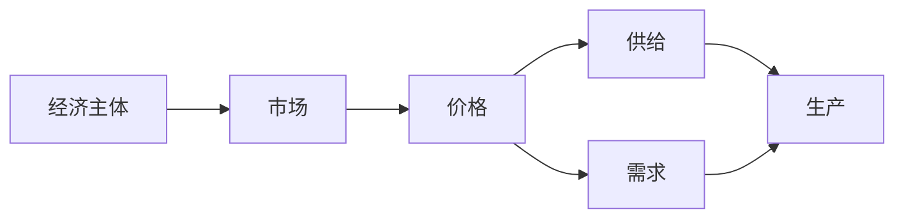

                 

# 塞思卡拉曼的宏观经济分析

## 关键词：宏观经济分析、塞思卡拉曼、GDP、通货膨胀、失业率、IS-LM模型、经济周期

## 摘要：  
本文深入探讨了塞思·卡拉曼的宏观经济分析方法，从基本概念到数学模型，再到实际应用，系统地阐述了宏观经济分析的核心思想和实践技巧。通过详细的理论分析和案例解读，本文为读者提供了一套完整的宏观经济分析框架，帮助读者更好地理解宏观经济现象，掌握宏观经济分析的基本方法。

---

# 第一部分：宏观经济分析概述

## 第1章：宏观经济分析概述

### 1.1 宏观经济分析的基本概念

#### 1.1.1 宏观经济分析的定义  
宏观经济分析是指对整个经济体系的运行状况进行研究，关注的是经济整体表现，包括GDP、通货膨胀、失业率等核心指标。它通过分析这些指标之间的关系，揭示经济运行的内在规律。

#### 1.1.2 宏观经济分析的核心要素  
- **GDP**：国内生产总值，衡量一个国家或地区的经济规模。  
- **通货膨胀**：物价总水平的上涨速度。  
- **失业率**：劳动力市场中失业人口占总劳动力人口的比例。  
- **货币政策**：中央银行通过调整利率和货币供应量来影响经济活动的政策工具。  

#### 1.1.3 宏观经济分析的边界与外延  
宏观经济分析不仅关注整体经济表现，还包括对经济政策、市场结构和国际经济关系的研究。其外延涉及微观经济行为对宏观经济的影响，以及全球经济一体化背景下的跨国经济分析。

---

### 1.2 宏观经济分析的背景与重要性

#### 1.2.1 当前全球经济面临的挑战  
当前全球经济面临通货膨胀、经济衰退、气候变化等多重挑战，宏观经济分析在应对这些问题中扮演着关键角色。

#### 1.2.2 宏观经济分析在政策制定中的作用  
政府通过宏观经济分析制定货币政策和财政政策，以实现经济增长、物价稳定和就业充分的目标。

#### 1.2.3 宏观经济分析对企业决策的影响  
企业通过宏观经济分析预测市场趋势，优化资源配置，制定发展战略。

---

## 第2章：宏观经济核心概念与联系

### 2.1 宏观经济核心概念原理

#### 2.1.1 GDP与GDP平减指数  
GDP衡量一个国家的经济总量，而GDP平减指数用于衡量物价总水平的变化，帮助区分经济增长和价格变化。

#### 2.1.2 失业率与劳动力市场  
失业率反映了劳动力市场的健康状况，高失业率意味着经济活力不足，低失业率则可能引发通货膨胀压力。

#### 2.1.3 通货膨胀与货币政策  
通货膨胀是宏观经济中的重要指标，货币政策通过调整利率和货币供应量来影响经济活动。

---

### 2.2 宏观经济核心概念对比分析

#### 2.2.1 不同经济指标的属性特征对比  
| 经济指标   | 定义                          | 主要影响因素       |
|------------|-------------------------------|-------------------|
| GDP        | 国内生产总值                 | 生产、消费、投资   |
| 通货膨胀   | 物价总水平上涨速度            | 货币供应、需求     |
| 失业率      | 失业人口占劳动力人口比例       | 经济活动、劳动力市场 |

#### 2.2.2 经济指标的相互关系与影响  
通货膨胀和失业率之间存在反向关系，即高通货膨胀可能伴随低失业率，反之亦然。

---

### 2.3 宏观经济核心概念的ER实体关系图

---

## 第3章：宏观经济分析的数学模型与公式

### 3.1 宏观经济分析的数学模型

#### 3.1.1 IS-LM模型  
IS-LM模型是宏观经济分析的核心工具之一，用于分析产品市场和货币市场的均衡。

##### 3.1.1.1 IS曲线  
IS曲线表示产品市场均衡时收入与利率的关系。  
$$ Y = Y_e - h(r) $$  

##### 3.1.1.2 LM曲线  
LM曲线表示货币市场均衡时收入与利率的关系。  
$$ M = L(i, Y) $$  

##### 3.1.1.3 均衡点  
IS和LM曲线的交点即为均衡利率和收入。

#### 3.1.2 消费函数  
消费函数描述消费支出与可支配收入之间的关系。  
$$ C = C_0 + c(Y - T) $$  

#### 3.1.3 投资函数  
投资函数描述投资支出与利率之间的关系。  
$$ I = I_0 - h(r) $$  

---

### 3.2 经济指标的数学表达

#### 3.2.1 GDP计算公式  
$$ GDP = C + I + G + (X - M) $$  

#### 3.2.2 失业率计算公式  
$$ 失业率 = \frac{失业人口}{劳动力人口} \times 100\% $$  

---

## 第4章：宏观经济分析的系统架构设计

### 4.1 宏观经济分析系统功能设计

#### 4.1.1 数据采集模块  
数据采集模块负责收集宏观经济数据，包括GDP、通货膨胀率、失业率等。

#### 4.1.2 指标计算模块  
指标计算模块对采集的数据进行处理，计算关键经济指标。

#### 4.1.3 模型分析模块  
模型分析模块基于IS-LM模型等数学模型，对经济指标进行分析和预测。

---

### 4.2 宏观经济分析系统的架构图

---

## 第5章：宏观经济分析的项目实战

### 5.1 项目环境安装

#### 5.1.1 数据采集工具安装  
使用Python的`pandas`库进行数据采集。

#### 5.1.2 数据分析工具安装  
安装`numpy`和`scipy`用于数据分析。

#### 5.1.3 模型构建工具安装  
安装`statsmodels`用于经济模型的构建。

---

### 5.2 项目核心实现

#### 5.2.1 数据采集与预处理  
从公开数据源（如世界银行）获取宏观经济数据，并进行清洗和整理。

#### 5.2.2 指标计算与分析  
计算GDP增长率、通货膨胀率等指标，并进行对比分析。

#### 5.2.3 模型构建与验证  
基于IS-LM模型，构建宏观经济预测模型，并进行验证和优化。

---

## 第6章：宏观经济分析的最佳实践与小结

### 6.1 最佳实践 tips

#### 6.1.1 数据来源的可靠性  
确保数据来源可靠，避免使用过时或不准确的数据。

#### 6.1.2 模型选择的合理性  
根据具体问题选择合适的模型，避免过度复杂化。

#### 6.1.3 结果解读的准确性  
在解读分析结果时，需结合实际情况，避免片面解读。

---

### 6.2 小结  
本文系统地介绍了塞思·卡拉曼的宏观经济分析方法，从理论到实践，为读者提供了一套完整的分析框架。通过实际案例的分析，帮助读者更好地理解宏观经济分析的核心思想和应用技巧。

---

作者：AI天才研究院/AI Genius Institute & 禅与计算机程序设计艺术 /Zen And The Art of Computer Programming

