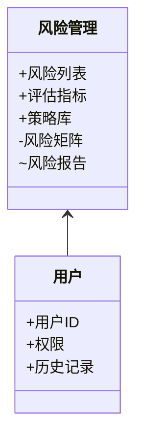

                 


# 塞思卡拉曼的风险规避策略

## 关键词
风险规避，塞思卡拉曼，策略，系统架构，项目实战，数学模型

## 摘要
本文深入探讨了塞思·卡拉曼的风险规避策略，从背景介绍、核心概念、算法原理到系统架构、项目实战，再到最佳实践，全面解析如何有效识别、评估和规避风险。通过理论与实践相结合，为读者提供系统化的风险规避解决方案。

---

# 第一部分: 塞思卡拉曼的风险规避策略背景介绍

## 第1章: 风险规避的核心概念

### 1.1 问题背景与描述

#### 1.1.1 风险规避的基本概念
风险规避是指通过识别潜在风险并采取措施避免或减少其影响的过程。在商业和项目管理中，风险规避是确保目标顺利实现的关键策略。

#### 1.1.2 塞思·卡拉曼风险规避方法的提出背景
塞思·卡拉曼基于其丰富的经验，提出了系统化的风险规避策略，旨在帮助组织在复杂环境中降低风险敞口。

#### 1.1.3 现代商业环境中的风险规避需求
在快速变化的商业环境中，企业需要高效的风险管理方法，以应对市场波动、技术变革等挑战。

### 1.2 问题解决与边界

#### 1.2.1 风险规避的目标与原则
目标：确保项目或业务按计划进行，避免重大损失。
原则：预防优先，动态调整，成本效益。

#### 1.2.2 塞思·卡拉曼策略的核心思想
通过系统分析和持续监控，提前识别潜在风险，并制定应对措施。

#### 1.2.3 风险规避的边界与适用范围
适用于项目管理、投资决策等领域，但需注意不可过度规避，以免错失机会。

### 1.3 概念结构与核心要素

#### 1.3.1 风险规避的系统模型
系统模型包括风险识别、评估、控制和监控四个阶段。

#### 1.3.2 核心要素的构成与关系
- **风险源**：可能引发风险的事件或因素。
- **风险影响**：风险对目标的影响程度。
- **规避措施**：采取的预防或减轻措施。

#### 1.3.3 塞思·卡拉曼策略的框架体系
框架包括风险识别矩阵、优先级排序和行动计划。

## 第2章: 核心概念与联系

### 2.1 风险规避的原理

#### 2.1.1 风险识别的机制
通过数据收集和分析，识别潜在风险。

#### 2.1.2 风险评估的方法
采用定量和定性分析，评估风险的影响和发生概率。

#### 2.1.3 风险控制的策略
制定应对措施，如规避、转移、减轻或接受。

### 2.2 核心概念的属性特征对比

| 概念 | 属性 | 描述 |
|------|------|------|
| 风险识别 | 数据源 | 历史数据、市场分析 |
| 风险评估 | 方法 | SWOT分析、概率-影响矩阵 |
| 风险控制 | 措施 | 风险规避、分散、转移 |

### 2.3 ER实体关系图
```mermaid
er
  actor: 用户
  strategy: 风险规避策略
  risk: 风险
  action: 行动方案
  actor --> strategy: 选择
  strategy --> risk: 识别
  risk --> action: 制定
```

---

# 第二部分: 算法原理讲解

## 第3章: 算法原理讲解

### 3.1 风险识别算法

#### 3.1.1 数据收集与预处理
收集历史数据，清洗和转换为可分析格式。

#### 3.1.2 风险识别流程
1. 数据分析：识别异常值和趋势。
2. 模型训练：使用机器学习算法预测潜在风险。

#### 3.1.3 识别结果输出
生成风险列表，按优先级排序。

### 3.2 风险评估算法

#### 3.2.1 评估指标
- 影响度（I）
- 发生概率（P）

#### 3.2.2 评估公式
风险值（R）= I * P

### 3.3 风险规避策略算法

#### 3.3.1 策略选择
根据风险值，选择最优的规避措施。

#### 3.3.2 执行计划
制定详细计划，分配资源，监控执行。

### 3.4 实现代码示例

```python
def risk_assessment(risks):
    assessed_risks = []
    for risk in risks:
        impact = get_impact(risk)
        probability = get_probability(risk)
        risk_value = impact * probability
        assessed_risks.append({'risk': risk, 'value': risk_value})
    return assessed_risks

def risk_management(risks):
    assessed = risk_assessment(risks)
    assessed.sort(key=lambda x: x['value'], reverse=True)
    strategies = []
    for risk in assessed:
        strategies.append({'risk': risk['risk'], 'strategy': choose_strategy(risk)})
    return strategies

def choose_strategy(risk):
    # 示例策略选择方法
    if risk['value'] > 0.8:
        return 'Avoid'
    elif risk['value'] > 0.5:
        return 'Mitigate'
    else:
        return 'Accept'
```

---

## 第4章: 数学模型和公式

### 4.1 风险评估模型
$$ R = I \times P $$

### 4.2 风险排序公式
$$ S = \sum (R_i \times W_i) $$

### 4.3 风险规避的优化模型
$$ \min_{x} \sum R_i x_i $$

---

# 第三部分: 系统分析与架构设计方案

## 第5章: 系统分析与架构设计

### 5.1 问题场景介绍

#### 5.1.1 需求分析
系统需支持风险识别、评估和制定规避策略。

### 5.2 系统功能设计

#### 5.2.1 领域模型


#### 5.2.2 系统架构设计


### 5.3 系统接口设计

#### 5.3.1 接口描述
- `/api/risk/identify`: 识别风险
- `/api/risk/assess`: 评估风险
- `/api/risk/strategy`: 获取规避策略

### 5.4 系统交互设计

```mermaid
sequenceDiagram
    用户->>API Gateway: 请求风险识别
    API Gateway->>风险管理服务器: 请求处理
    风险管理服务器->>数据库: 查询历史数据
    风险管理服务器->>返回结果
    用户->>API Gateway: 请求评估
    ...
```

---

## 第6章: 项目实战

### 6.1 环境安装

```bash
pip install risk-assessment
npm install -g risk-management-ui
```

### 6.2 系统核心实现源代码

```python
def main():
    import risk_assessment as ra
    risks = ra.get_risks()
    strategies = ra.risk_management(risks)
    ra.generate_report(strategies)
```

### 6.3 案例分析

#### 6.3.1 案例背景
某公司面临市场波动风险，需制定规避策略。

#### 6.3.2 实施步骤
1. 数据收集与分析。
2. 风险识别与评估。
3. 制定规避措施。
4. 实施与监控。

---

## 第7章: 最佳实践

### 7.1 小结
塞思·卡拉曼的风险规避策略提供了系统化的方法，帮助企业有效管理风险。

### 7.2 注意事项
- 定期更新策略。
- 综合考虑成本和收益。
- 培训相关人员。

### 7.3 拓展阅读
推荐书籍和资源，深入学习风险管理知识。

---

# 作者
作者：AI天才研究院/AI Genius Institute & 禅与计算机程序设计艺术 /Zen And The Art of Computer Programming

