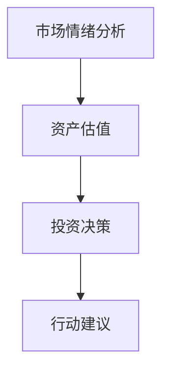

                 

# 塞斯·卡拉曼的特殊情况投资技巧

---

## 关键词：
塞斯·卡拉曼，投资技巧，安全边际，逆向投资，价值投资，内在价值，数学模型，市场恐慌

---

## 摘要：
塞斯·卡拉曼是投资界的一位传奇人物，以其独特的“特殊情况投资技巧”闻名。本文将详细解析卡拉曼的投资哲学、安全边际概念、逆向投资策略以及内在价值评估方法。通过数学模型和实际案例分析，揭示卡拉曼如何在市场恐慌时捕捉优质资产，实现超额收益。文章还探讨了卡拉曼的投资理念对现代投资的深远影响，并总结了投资者在实际操作中可以借鉴的最佳实践。

---

## 第一部分：背景介绍

### 第1章：塞斯·卡拉曼的投资理念概述

#### 1.1 塞斯·卡拉曼的生平与成就
塞斯·卡拉曼（Seth K. Carman）是投资界的一位传奇人物，被誉为“恐慌市场中的猎手”。他从20世纪70年代开始在巴菲特的伯克希尔哈撒韦公司工作，逐渐发展出一套独特的投资策略。卡拉曼以在市场恐慌时买入优质资产而闻名，尤其擅长识别市场非理性行为带来的投资机会。

#### 1.2 卡拉曼的投资哲学
卡拉曼的投资哲学基于价值投资理念，强调安全边际和逆向投资。他认为，市场恐慌时，投资者的非理性行为会导致资产价格偏离其内在价值，而这种偏离正是投资机会的来源。

#### 1.3 卡拉曼与现代投资理论的联系
卡拉曼的投资理念与现代投资组合理论（MPT）有所不同。他更倾向于通过基本面分析和安全边际来选择投资标的，而不是单纯依赖统计学模型。

---

## 第2章：特殊情况的定义与分类

### 2.1 特殊情况的定义
特殊情况是指市场中出现的非理性定价现象，通常发生在市场恐慌、经济危机或投资者情绪低落时。这些情况下，优质资产的价格往往被低估，为投资者提供了买入的机会。

### 2.2 特殊情况的分类
- **市场恐慌型**：由于市场恐慌导致资产价格大幅下跌。
- **基本面突变型**：公司基本面突然恶化，但其内在价值并未完全消失。
- **投资者情绪型**：投资者情绪过度悲观，导致资产价格偏离内在价值。

### 2.3 特殊情况与非特殊情况的对比
| 对比维度         | 特殊情况       | 非特殊情况     |
|------------------|----------------|----------------|
| 市场情绪         | 非常悲观       | 中性或乐观       |
| 资产价格         | 远低于内在价值 | 接近或高于内在价值 |
| 投资机会         | 高             | 低或中         |
| 风险             | 高             | 中或低         |

---

## 第3章：卡拉曼的安全边际概念

### 3.1 安全边际的定义
安全边际是指资产的市场价格低于其内在价值的部分。卡拉曼认为，安全边际的存在可以保护投资者免受市场波动的影响。

### 3.2 安全边际的数学模型
$$ 安全边际 = \frac{内在价值 - 市场价格}{市场价格} $$

### 3.3 安全边际的应用
卡拉曼通过计算安全边际来筛选投资标的。当安全边际较高时，他认为这是买入的良机。

---

## 第4章：逆向投资的逻辑框架

### 4.1 逆向投资的定义
逆向投资是指在市场恐慌时买入，在市场狂热时卖出的投资策略。

### 4.2 逆向投资的逻辑
- **市场情绪分析**：识别市场恐慌和非理性行为。
- **资产估值**：计算内在价值，寻找低估资产。
- **投资决策**：在市场恐慌时买入，市场狂热时卖出。

### 4.3 逆向投资的风险控制
卡拉曼强调，逆向投资需要严格的风险控制，避免在市场底部被过度恐慌的情绪影响。

---

## 第5章：内在价值评估方法

### 5.1 内在价值的定义
内在价值是指资产在长期稳定状态下的合理价格，通常通过现金流折现法（DCF）计算。

### 5.2 现金流折现模型
$$ 内在价值 = \sum_{t=1}^{\infty} \frac{CF_t}{(1 + r)^t} $$
其中，CF_t为第t年的现金流，r为折现率。

### 5.3 内在价值的应用
卡拉曼通过内在价值评估来判断资产的合理价格，并结合安全边际进行投资决策。

---

## 第6章：卡拉曼的数学模型与算法

### 6.1 安全边际计算的算法
卡拉曼的安全边际计算公式可以转化为以下步骤：
1. 计算资产的内在价值。
2. 比较内在价值与市场价格。
3. 计算安全边际。

### 6.2 内在价值计算的流程
1. 识别资产的基本面数据。
2. 预测未来现金流。
3. 计算现金流的现值。
4. 确定合理的折现率。
5. 计算内在价值。

### 6.3 算法的优化与改进
卡拉曼的算法强调对市场情绪的分析，结合安全边际和内在价值评估，形成一个完整的投资决策系统。

---

## 第7章：系统分析与架构设计

### 7.1 投资系统架构
卡拉曼的投资系统包括以下几个模块：
- **市场情绪分析模块**：识别市场恐慌。
- **资产估值模块**：计算内在价值。
- **投资决策模块**：基于安全边际做出买入或卖出决策。

### 7.2 系统架构图

---

## 第8章：项目实战

### 8.1 经典案例分析
#### 8.1.1 卡拉曼对华盛顿邮报的投资
卡拉曼在市场恐慌时买入华盛顿邮报，利用其低估的内在价值和较高的安全边际，最终获得超额收益。

#### 8.1.2 其他经典案例
包括卡拉曼对可口可乐等公司的投资，分析其决策过程和背后的逻辑。

### 8.2 投资决策的数学模型
通过现金流折现模型和安全边际计算，展示卡拉曼如何在实际投资中应用这些模型。

---

## 第9章：总结与展望

### 9.1 卡拉曼投资哲学的总结
卡拉曼的投资哲学强调安全边际和逆向投资，通过基本面分析和市场情绪分析，寻找低估资产。

### 9.2 对现代投资的影响
卡拉曼的思路对现代投资组合理论和风险管理有重要启示，尤其是在市场波动加剧的情况下。

### 9.3 对未来投资者的建议
1. 保持独立思考，避免随波逐流。
2. 严格控制风险，注重安全边际。
3. 长期投资，耐心持有优质资产。

---

## 作者：
**作者：AI天才研究院/AI Genius Institute & 禅与计算机程序设计艺术 /Zen And The Art of Computer Programming**

