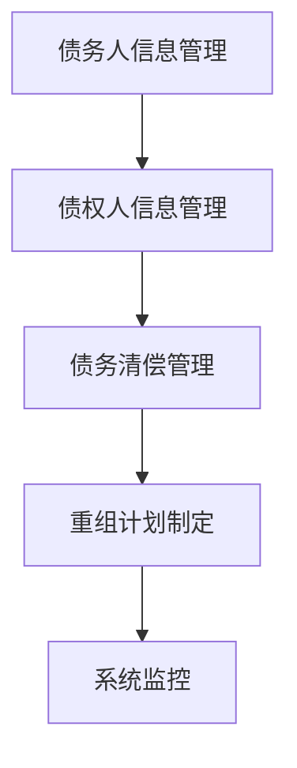

                 


```markdown
# 塞斯·卡拉曼的破产重组投资策略

> 关键词：破产重组，投资策略，塞斯·卡拉曼，风险管理，系统架构，数学模型

> 摘要：本文深入分析了塞斯·卡拉曼的破产重组投资策略，探讨了其背后的数学模型、系统架构和实际案例。通过详细讲解破产重组的核心概念、策略实施步骤和风险控制方法，为读者提供了一套系统化的投资框架。

---

## 第1章 破产重组的定义与背景

### 1.1 破产重组的概念与法律框架

#### 1.1.1 破产重组的定义
破产重组是指在企业无法偿还债务的情况下，通过法律程序重新调整资产、负债和业务结构，以实现债务清偿和企业重生的过程。

#### 1.1.2 破产重组的法律依据
- 美国《破产法》第11章是破产重组的主要法律依据。
- 破产重组程序包括债权人会议、债务人财产管理、重组计划制定与执行等环节。

#### 1.1.3 破产重组的经济意义
- 破产重组有助于避免企业直接破产，保护债权人和股东的利益。
- 破产重组可以优化资源配置，促进经济的稳定发展。

### 1.2 破产重组的核心要素

#### 1.2.1 债务人与债权人的关系
- 债务人：企业或个人，无法偿还债务。
- 债权人：向债务人提供贷款或赊销的金融机构或其他债权人。
- 破产重组的核心是平衡债权人和债务人的利益。

#### 1.2.2 破产财产的分配原则
- 破产财产包括债务人所有的资产，用于清偿债务。
- 破产财产的分配顺序由法律明确规定，优先保护有担保债权人。

#### 1.2.3 破产重组的程序与流程
1. 提出破产申请
2. 破产受理与财产接管
3. 债权人会议与重组计划制定
4. 重组计划执行与债务清偿

---

## 第2章 投资策略的基本原理

### 2.1 投资策略的定义

#### 2.1.1 投资策略的概念
- 投资策略是投资者为实现特定目标而采取的一系列行动和决策。
- 破产重组投资策略关注于在企业破产过程中寻找投资机会。

#### 2.1.2 投资策略的分类
- 长期投资：投资于企业重组后的长期收益。
- 短期投资：通过债务重组快速获利。

#### 2.1.3 投资策略与风险管理
- 投资者需要评估重组成功的概率和潜在风险。
- 风险管理是投资策略的核心，包括风险识别、评估和控制。

### 2.2 破产重组中的投资机会

#### 2.2.1 破产企业重整的投资价值
- 破产企业可能拥有有价值的资产，如土地、设备或知识产权。
- 重组后的企业可能扭亏为盈，带来高额回报。

#### 2.2.2 破产重组中的风险与收益分析
- 风险：重组失败、资产贬值、法律纠纷。
- 收益：债务减免、资产升值、市场机会。

#### 2.2.3 投资者在破产重组中的角色
- 投资者可以作为债权人参与重组计划，或作为新股东投资于重组后的企业。

---

## 第3章 塞斯·卡拉曼的投资策略概述

### 3.1 塞斯·卡拉曼的简介

#### 3.1.1 塞斯·卡拉曼的生平
- 美国著名投资家，专注于破产重组投资。
- 成功案例包括多个企业的重整与上市。

#### 3.1.2 塞斯·卡拉曼的投资理念
- 价值投资：寻找被市场低估的企业。
- 风险控制：通过法律手段保护投资者利益。

#### 3.1.3 塞斯·卡拉曼的代表作与理论贡献
- 著名书籍《破产投资的艺术》。
- 提出“破产重组三步法”：识别、评估、投资。

### 3.2 塞斯·卡拉曼破产重组策略的核心思想

#### 3.2.1 破产重组中的价值发现
- 寻找具有潜在价值的企业，而非单纯追求低价。
- 评估企业的核心资产和市场地位。

#### 3.2.2 破产重组中的风险控制
- 通过法律手段确保投资安全。
- 分散投资以降低风险。

#### 3.2.3 破产重组中的利益平衡
- 协调债权人、债务人和投资者的利益。
- 确保重组计划的可行性与公平性。

---

## 第4章 破产重组中的核心概念与联系

### 4.1 破产重组的核心概念

#### 4.1.1 破产财产
- 破产财产是债务人所有的全部财产。
- 包括动产和不动产，用于清偿债务。

#### 4.1.2 破产债权
- 债权人对债务人的债权。
- 破产债权的优先顺序由法律规定。

#### 4.1.3 破产管理人
- 由法院指定的管理破产财产的专业机构。
- 负责财产管理、债务清偿和重组计划的执行。

### 4.2 破产重组中的关键关系

#### 4.2.1 债权人与债务人的关系
- 债权人：要求债务人偿还债务。
- 债务人：通过重组减轻债务负担。

#### 4.2.2 投资者与管理人的关系
- 投资者：提供资金支持重组计划。
- 管理人：负责投资的使用和管理。

#### 4.2.3 破产重组中的利益相关者分析
- 利益相关者包括债权人、股东、员工、客户等。
- 协调各方利益是重组成功的关键。

---

## 第5章 破产重组中的数学模型与公式

### 5.1 研判企业偿债能力的数学模型

#### 5.1.1 财务比率分析
- 流动比率：$$\text{流动比率} = \frac{\text{流动资产}}{\text{流动负债}}$$
- 速动比率：$$\text{速动比率} = \frac{\text{速动资产}}{\text{流动负债}}$$
- 债务偿还期：$$\text{债务偿还期} = \frac{\text{总债务}}{\text{年现金流}}$$

#### 5.1.2 资产负债表分析
- 资产负债率：$$\text{资产负债率} = \frac{\text{总负债}}{\text{总资产}} \times 100\%$$
- 负债与所有者权益比率：$$\text{负债与所有者权益比率} = \frac{\text{总负债}}{\text{所有者权益}}$$

### 5.2 投资回报率分析

#### 5.2.1 投资回报率（ROI）
$$\text{ROI} = \frac{\text{净利润}}{\text{初始投资}} \times 100\%$$

#### 5.2.2 净现值（NPV）
$$\text{NPV} = \sum_{t=0}^{n} \frac{\text{现金流}_t}{(1 + r)^t}$$
其中，$$r$$为折现率。

---

## 第6章 破产重组中的系统分析与架构设计

### 6.1 破产重组的系统分析

#### 6.1.1 系统目标
- 实现破产重组过程的信息化管理。
- 提供债务人、债权人和投资者的协同平台。

#### 6.1.2 系统范围
- 包括债务人信息管理、债权债务管理、重组计划制定与执行。

#### 6.1.3 系统功能
- 债务人信息录入与管理。
- 债权人信息管理与债权确认。
- 重组计划制定与模拟。

### 6.2 破产重组的系统架构设计

#### 6.2.1 系统架构图


#### 6.2.2 系统功能模块划分
- 用户模块：债权人、债务人、投资者登录与信息管理。
- 信息模块：债务人信息、债权人信息、重组计划。
- 管理模块：系统管理员对用户和数据的管理。

#### 6.2.3 系统接口设计
- API接口：用于与其他系统的数据交互，如银行、法院等。

---

## 第7章 破产重组中的项目实战

### 7.1 破产重组项目环境安装

#### 7.1.1 系统环境要求
- 操作系统：Windows 10或更高版本，Linux发行版。
- 开发工具：Python 3.8+，Jupyter Notebook，Visual Studio Code。
- 数据库：MySQL或PostgreSQL。

#### 7.1.2 数据收集与处理
- 数据来源：企业财务报表、债权人信息、法院文件。
- 数据清洗：处理缺失值、异常值。

#### 7.1.3 系统安装与配置
- 安装Python依赖库：pandas, numpy, matplotlib。
- 配置数据库连接。

### 7.2 破产重组项目核心实现

#### 7.2.1 研判企业偿债能力的Python代码
```python
import pandas as pd

# 假设df为企业的财务数据
def calculate_ratios(df):
    df['流动比率'] = df['流动资产'] / df['流动负债']
    df['速动比率'] = df['速动资产'] / df['流动负债']
    df['资产负债率'] = df['总负债'] / df['总资产']
    return df

financial_data = pd.read_csv('financial.csv')
result = calculate_ratios(financial_data)
print(result.head())
```

#### 7.2.2 投资回报率分析
```python
def calculate_roi(profits, investment):
    return (profits / investment) * 100

roi = calculate_roi(1000000, 5000000)
print(f"ROI: {roi}%")
```

#### 7.2.3 破产重组方案优化
```python
import numpy as np

def optimize_restructuring方案(assets, liabilities):
    # 假设资产和负债的数组
    # 优化目标是最小化负债与资产的比率
    pass

assets = [1000000, 800000, 600000]
liabilities = [500000, 400000, 300000]
optimize_restructuring方案(assets, liabilities)
```

### 7.3 研判企业偿债能力的系统实现

#### 7.3.1 系统功能实现
- 财务数据录入与分析。
- 偿债能力指标的自动计算与可视化。

#### 7.3.2 系统实现的注意事项
- 数据准确性是关键。
- 系统需要具备良好的扩展性。

---

## 第8章 破产重组中的最佳实践与小结

### 8.1 破产重组中的注意事项

#### 8.1.1 投资者的风险管理
- 严格评估企业的基本面。
- 设立止损机制。

#### 8.1.2 管理人的职责与义务
- 管理人需具备专业能力。
- 严格遵守法律法规。

#### 8.1.3 利益相关者的协调与沟通
- 及时披露信息。
- 建立有效的沟通机制。

### 8.2 破产重组中的拓展阅读

#### 8.2.1 破产法的最新发展
- 研究破产法的最新修订。
- 关注司法实践中的新案例。

#### 8.2.2 破产重组中的技术创新
- 人工智能在破产重组中的应用。
- 区块链技术在债务清偿中的潜在应用。

---

## 作者：AI天才研究院/AI Genius Institute & 禅与计算机程序设计艺术 /Zen And The Art of Computer Programming
```

