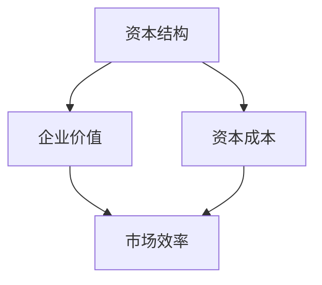
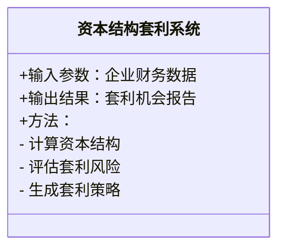
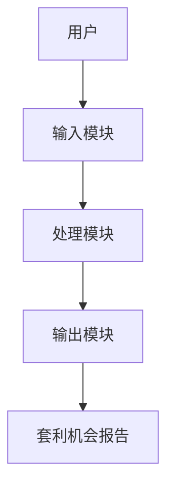
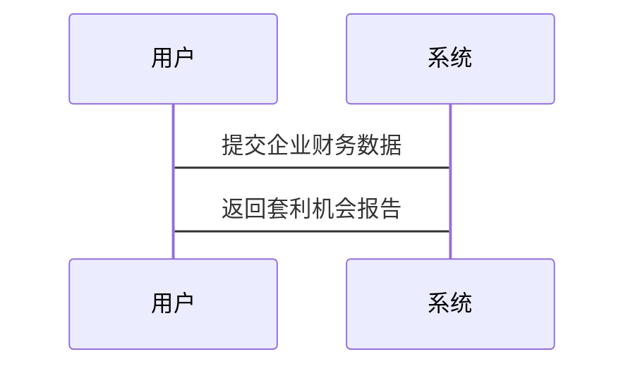

                 


# 塞斯·卡拉曼的资本结构套利策略

## 关键词：
资本结构套利, 投资策略, 股权与债务, 市场套利, 风险评估

## 摘要：
资本结构套利是一种利用企业资本结构差异进行投资的策略，通过分析企业股权与债务的合理比例，寻找市场定价偏差，从而实现套利收益。本文深入探讨了塞斯·卡拉曼的资本结构套利策略，从理论基础、数学模型、算法实现到实际案例分析，系统地解析了这一策略的实施过程和关键点，帮助读者全面理解并掌握资本结构套利的核心方法。

---

# 第一部分: 资本结构套利的背景与基础

## 第1章: 资本结构套利的概述

### 1.1 资本结构套利的定义与核心概念

#### 1.1.1 资本结构套利的定义
资本结构套利是一种基于企业资本结构（股权与债务的比例）差异的投资策略。通过分析市场中企业资本结构的不均衡，投资者可以利用市场定价偏差，进行套利操作以获取无风险或低风险的超额收益。

#### 1.1.2 资本结构套利的核心要素
- **资本结构**：企业债务与股权的比例。
- **市场效率**：市场是否充分反映企业的真实价值。
- **套利机会**：市场定价与理论价值之间的差异。
- **风险与收益**：套利行为的风险程度及其预期收益。

#### 1.1.3 资本结构套利与传统投资策略的区别
| 资本结构套利 | 传统投资策略 |
|--------------|---------------|
| 基于市场定价偏差 | 基于资产基本面 |
| 低风险或无风险 | 高风险 |
| 短期机会 | 长期趋势 |

### 1.2 资本结构套利的理论基础

#### 1.2.1 Modigliani-Miller定理
Modigliani-Miller定理是资本结构套利的理论基础之一，它指出在完全市场中，企业的价值仅由其实质资产决定，而与资本结构无关。然而，考虑到税收等因素，资本结构会影响企业价值。

公式：
$$ V = V_u + D \times (1 - T_c) $$

其中：
- $V$：企业总价值
- $V_u$：无杠杆价值
- $D$：债务
- $T_c$：企业所得税率

#### 1.2.2 杠杆对资本成本的影响
杠杆（债务）会降低股权资本的成本，但增加债务资本的成本。资本结构中杠杆比例过高会增加企业违约风险，进而提高债务成本。

公式：
$$ R_e = R_a + \beta \times (R_m - R_f) \times (1 - T_c) $$

其中：
- $R_e$：股权资本成本
- $R_a$：无风险利率
- $\beta$：贝塔系数
- $R_m$：市场平均回报率
- $R_f$：无风险利率
- $T_c$：企业所得税率

#### 1.2.3 资本结构与企业价值的关系
资本结构与企业价值的关系可以通过以下公式表示：

$$ \frac{D}{E} = \frac{T_c}{T_c - T_d} $$

其中：
- $\frac{D}{E}$：债务与股权的比例
- $T_c$：企业所得税率
- $T_d$：债务税盾的价值

### 1.3 资本结构套利的市场环境

#### 1.3.1 资本市场效率与套利机会
市场效率影响套利机会的存在性。在低效率市场中，套利机会更易出现。

#### 1.3.2 市场不完全性与套利空间
市场不完全性（如信息不对称、交易成本）为套利提供了空间。

#### 1.3.3 不同市场环境下的套利策略
- **成熟市场**：套利机会较少，策略需谨慎选择。
- **新兴市场**：套利机会较多，但风险较高。

---

## 第2章: 资本结构套利的核心概念与联系

### 2.1 资本结构套利的理论模型

#### 2.1.1 MM定理的扩展
MM定理扩展考虑了税收影响，指出适度杠杆可以增加企业价值。

公式：
$$ V = V_u + D \times (1 - T_c) $$

#### 2.1.2 带杠杆的CAPM模型
杠杆会降低股权资本成本，同时增加债务资本成本。

公式：
$$ R_e = R_a + \beta \times (R_m - R_f) \times (1 - T_c) $$

#### 2.1.3 资本结构与企业价值的数学关系
资本结构影响企业价值，可以通过以下公式优化资本结构：

$$ \frac{D}{E} = \frac{T_c}{T_c - T_d} $$

### 2.2 资本结构套利的核心要素对比

#### 2.2.1 股权与债务的对比分析
| 股权 | 债务 |
|------|------|
| 风险高，回报高 | 风险低，回报稳定 |

#### 2.2.2 不同资本结构下的风险与收益对比
| 高杠杆 | 低杠杆 |
|--------|--------|
| 高风险，高预期收益 | 低风险，低预期收益 |

#### 2.2.3 资本成本与企业价值的对比分析
- 高杠杆：资本成本降低，但风险增加。
- 低杠杆：资本成本增加，但风险降低。

### 2.3 资本结构套利的ER实体关系图



---

## 第3章: 资本结构套利的数学模型

### 3.1 资本结构套利的基本公式

#### 3.1.1 MM定理的数学表达
$$ V = V_u + D \times (1 - T_c) $$

其中：
- $V$：企业总价值
- $V_u$：无杠杆价值
- $D$：债务
- $T_c$：企业所得税率

#### 3.1.2 杠杆对资本成本的影响
$$ R_e = R_a + \beta \times (R_m - R_f) \times (1 - T_c) $$

其中：
- $R_e$：股权资本成本
- $R_a$：无风险利率
- $\beta$：贝塔系数
- $R_m$：市场平均回报率
- $R_f$：无风险利率
- $T_c$：企业所得税率

### 3.2 资本结构套利的优化模型

#### 3.2.1 最优资本结构的数学求解
$$ \frac{D}{E} = \frac{T_c}{T_c - T_d} $$

其中：
- $\frac{D}{E}$：债务与股权的比例
- $T_c$：企业所得税率
- $T_d$：债务税盾的价值

---

## 第4章: 资本结构套利的系统分析与架构设计

### 4.1 问题场景介绍

#### 4.1.1 资本结构套利系统的应用场景
- 企业价值评估
- 投资组合优化
- 市场套利机会识别

#### 4.1.2 系统目标
- 自动化识别套利机会
- 计算最优资本结构
- 评估套利风险

### 4.2 系统功能设计

#### 4.2.1 领域模型


#### 4.2.2 系统架构


#### 4.2.3 接口设计
- 输入接口：企业财务数据接口
- 输出接口：套利机会报告接口

#### 4.2.4 交互流程


---

## 第5章: 资本结构套利的项目实战

### 5.1 环境安装

#### 5.1.1 系统需求
- Python 3.8+
- NumPy, Pandas, Matplotlib

#### 5.1.2 安装依赖
```bash
pip install numpy pandas matplotlib
```

### 5.2 系统核心实现

#### 5.2.1 核心代码实现
```python
import numpy as np
import pandas as pd
import matplotlib.pyplot as plt

def calculate_optimal_capital_structure(tax_rate, debt_tax_shield):
    return tax_rate / (tax_rate - debt_tax_shield)

def plot_capital_structure(debt, equity, tax_rate):
    plt.bar(['Debt', 'Equity'], [debt, equity])
    plt.title(f'Capital Structure with Tax Rate = {tax_rate}')
    plt.ylabel('Value')
    plt.show()

# 示例数据
tax_rate = 0.3
debt = 100
equity = 200

optimal_ratio = calculate_optimal_capital_structure(tax_rate, 0.1)
print(f'最优资本结构比例：{optimal_ratio}')

plot_capital_structure(debt, equity, tax_rate)
```

### 5.3 案例分析与解读

#### 5.3.1 案例背景
假设一家企业税率为30%，债务税盾价值为10%。

#### 5.3.2 案例实现
```python
tax_rate = 0.3
debt_tax_shield = 0.1
optimal_ratio = calculate_optimal_capital_structure(tax_rate, debt_tax_shield)
print(f'最优债务与股权比例：{optimal_ratio}')
```

#### 5.3.3 案例分析
- 最优债务与股权比例为 0.3 / (0.3 - 0.1) = 1.5。

---

## 第6章: 资本结构套利的最佳实践

### 6.1 总结与反思

#### 6.1.1 核心总结
资本结构套利是一种基于市场定价偏差的投资策略，通过优化资本结构实现套利收益。

#### 6.1.2 经验总结
- 确保市场效率低下时进行套利。
- 严格控制风险。

### 6.2 注意事项

#### 6.2.1 市场风险
套利机会可能因市场变化而消失。

#### 6.2.2 交易成本
交易成本可能侵蚀套利收益。

### 6.3 拓展阅读

#### 6.3.1 推荐书籍
- 《资本结构与企业价值》
- 《套利与市场效率》

#### 6.3.2 推荐博客
- [资本结构套利深度解析](#)

---

# 作者：AI天才研究院/AI Genius Institute & 禅与计算机程序设计艺术/Zen And The Art of Computer Programming

---

**本文通过系统地分析塞斯·卡拉曼的资本结构套利策略，从理论基础到实际应用，全面解析了该策略的核心思想和实现方法，为投资者提供了深刻的见解和实用的指导。**

