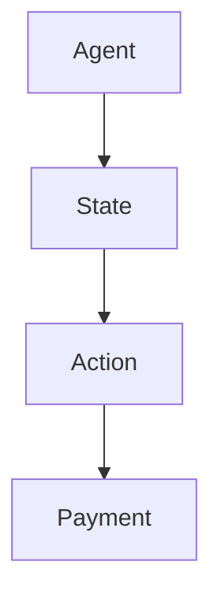
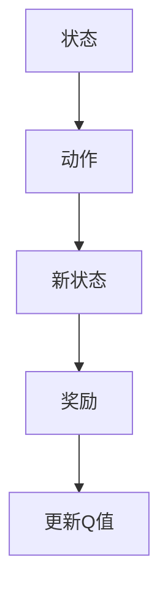
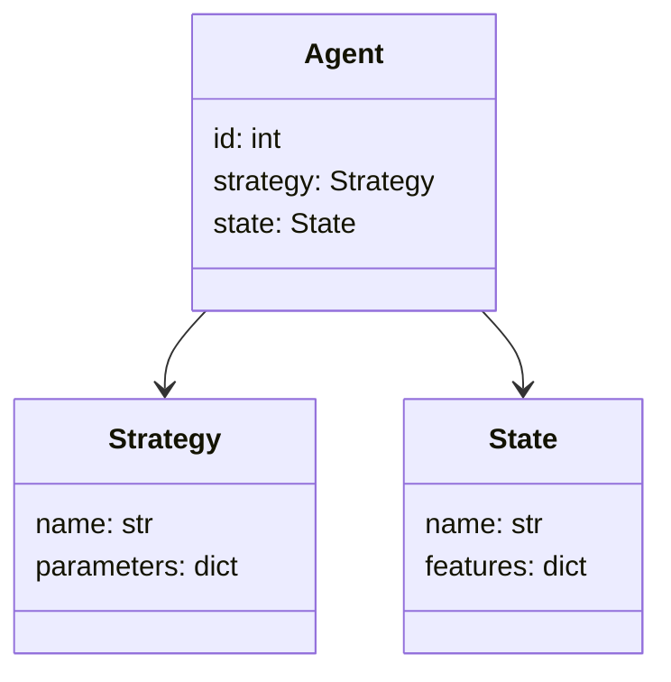
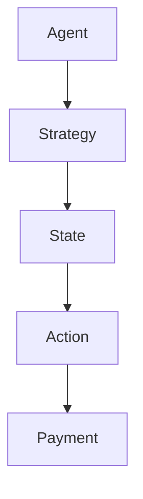
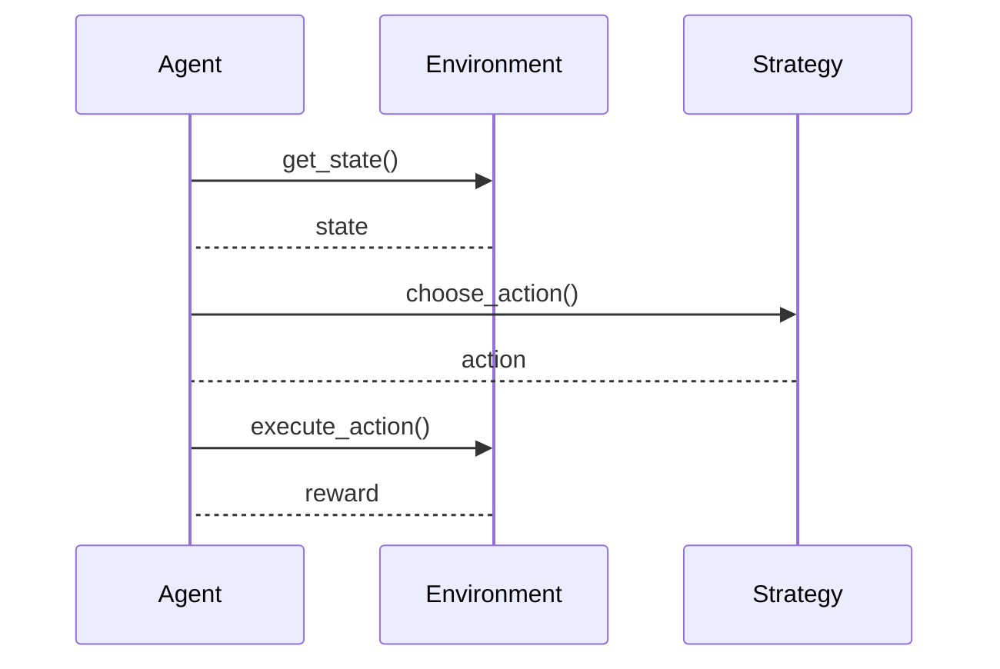

                 


# 多Agent博弈系统：策略学习与优化技术

## 关键词：多Agent系统、博弈论、策略学习、强化学习、纳什均衡

## 摘要：多Agent博弈系统是人工智能领域的重要研究方向，涉及多个智能体之间的互动与策略优化。本文从多Agent系统的基本概念出发，深入探讨其核心原理、策略学习算法、系统架构设计及实际应用案例。通过详细分析博弈论基础、策略评估与优化方法，结合典型算法实现与项目实战，帮助读者全面掌握多Agent博弈系统的设计与实现技术。

---

# 第一部分: 多Agent博弈系统基础

## 第1章: 多Agent系统概述

### 1.1 多Agent系统的基本概念

#### 1.1.1 Agent的定义与特征

- **Agent**：智能体，具备感知环境、自主决策、执行动作的能力。
- **特征**：
  - 独立性：能够独立决策。
  - 社会性：能在群体中协作。
  - 反应性：能根据环境变化调整行为。

#### 1.1.2 多Agent系统的特点

- **去中心化**：没有单一控制中心。
- **协作性**：多个Agent协同完成任务。
- **动态性**：环境和Agent状态动态变化。

#### 1.1.3 多Agent系统与单Agent系统的区别

| 特性 | 单Agent系统 | 多Agent系统 |
|------|-------------|-------------|
| 结构  | 单一控制中心 | 多个独立Agent |
| 协作  | 无 | 高度协作 |
| 复杂性 | 低 | 高 |

### 1.2 博弈论基础

#### 1.2.1 博弈论的基本概念

- **博弈**：多个参与者互动的过程。
- **参与者**：博弈中的决策者。
- **策略**：参与者为达到目标而采取的行动方案。

#### 1.2.2 博弈的分类

- **完全信息博弈**：所有参与者都知道所有信息。
- **不完全信息博弈**：参与者信息不完全。
- **合作博弈**：参与者可以签订具有约束力的协议。
- **非合作博弈**：参与者不能签订协议。

#### 1.2.3 博弈论在多Agent系统中的应用

- **资源分配**：多个Agent竞争资源。
- **任务分配**：多个Agent协作完成任务。
- **网络安全**：多个Agent防御攻击。

### 1.3 多Agent博弈系统的应用场景

#### 1.3.1 电子商务中的应用

- **推荐系统**：多个Agent协同推荐商品。
- **价格竞争**：多个Agent动态调整价格。

#### 1.3.2 游戏AI中的应用

- **游戏对抗**：多个Agent协同对抗。
- **策略优化**：优化游戏AI的决策策略。

#### 1.3.3 智能交通系统中的应用

- **路径规划**：多个Agent动态规划路径。
- **交通控制**：多个Agent协作控制交通流量。

### 1.4 本章小结

本章介绍了多Agent系统的基本概念、博弈论基础及其应用场景。通过对比单Agent系统与多Agent系统，明确了多Agent系统的特点和优势。

---

## 第2章: 多Agent博弈系统的核心概念与联系

### 2.1 多Agent博弈系统的核心概念

#### 2.1.1 Agent的理性与决策

- **理性**：Agent基于自身目标做出决策。
- **决策**：Agent在多个选项中选择最优动作。

#### 2.1.2 博弈中的策略与收益

- **策略**：Agent在博弈中的行动方案。
- **收益**：博弈结果对Agent的价值。

#### 2.1.3 竞争与合作的关系

- **竞争**：多个Agent争夺有限资源。
- **合作**：多个Agent协同完成任务。

### 2.2 多Agent博弈系统的核心要素

#### 2.2.1 状态空间

- **定义**：所有可能的游戏状态。
- **表示**：可以用向量、图结构表示。

#### 2.2.2 动作空间

- **定义**：Agent在每个状态下可执行的动作。
- **表示**：可以用枚举、向量表示。

#### 2.2.3 支付函数

- **定义**：博弈结果对每个Agent的支付。
- **表示**：可以用矩阵、向量表示。

### 2.3 多Agent博弈系统的数学模型

#### 2.3.1 状态空间的表示

$$ s \in S $$

其中，$S$ 是所有可能状态的集合。

#### 2.3.2 动作空间的表示

$$ a \in A(s) $$

其中，$A(s)$ 是状态 $s$ 下的所有可能动作。

#### 2.3.3 支付函数的数学表达

$$ P: S \times A \rightarrow \mathbb{R}^n $$

其中，$P(s, a)$ 表示状态 $s$ 下执行动作 $a$ 的支付向量。

### 2.4 多Agent博弈系统的ER实体关系图



### 2.5 本章小结

本章详细讲解了多Agent博弈系统的核心概念，包括状态空间、动作空间和支付函数，并通过ER实体关系图展示了系统的核心要素。

---

## 第3章: 多Agent博弈系统中的策略学习算法

### 3.1 策略学习的基本原理

#### 3.1.1 策略的表示方法

- **基于模型**：使用数学模型表示策略。
- **基于经验**：通过经验数据学习策略。

#### 3.1.2 策略评估的基本方法

- **蒙特卡洛方法**：通过模拟评估策略。
- **动态规划方法**：通过动态规划优化策略。

#### 3.1.3 策略优化的基本方法

- **梯度上升**：通过梯度优化策略。
- **强化学习**：通过奖励驱动优化策略。

### 3.2 基于Q-learning的策略学习算法

#### 3.2.1 Q-learning算法的原理



#### 3.2.2 Q-learning算法的实现

```python
def q_learning(env, num_episodes=1000, gamma=0.99, epsilon=1.0, epsilon_min=0.01, epsilon_decay=0.995):
    Q = defaultdict(lambda: defaultdict(lambda: 0))
    
    for episode in range(num_episodes):
        state = env.reset()
        done = False
        
        while not done:
            if np.random.random() < epsilon:
                action = np.random.randint(env.n_actions)
            else:
                action = max(dict.items(), key=lambda x: x[1])[0]
            
            next_state, reward, done = env.step(action)
            
            Q[state][action] += gamma * (reward + max(Q[next_state].values()) - Q[state][action])
            
            epsilon = max(epsilon_min, epsilon * epsilon_decay)
    
    return Q
```

### 3.3 基于纳什均衡的策略优化

#### 3.3.1 纳什均衡的定义

- **纳什均衡**：在策略组合下，每个Agent的策略都是最优反应。

#### 3.3.2 纳什均衡的求解方法

- **枚举法**：遍历所有可能的策略组合，找出纳什均衡。
- **迭代删除法**：逐步排除不可能的策略，缩小搜索范围。

#### 3.3.3 纳什均衡的数学表达

$$ (s_1^*, s_2^*, \dots, s_n^*) \text{ 是纳什均衡，当且仅当对于所有 } i, s_i^* \text{ 是最优反应。} $$

### 3.4 本章小结

本章介绍了策略学习的基本原理和两种典型算法：Q-learning和纳什均衡求解方法，并通过代码示例展示了算法实现。

---

## 第4章: 多Agent博弈系统的系统分析与架构设计

### 4.1 问题场景介绍

- **电商推荐系统**：多个Agent协同推荐商品。
- **智能交通系统**：多个Agent动态规划路径。

### 4.2 系统功能设计

#### 4.2.1 领域模型设计



#### 4.2.2 系统架构设计



### 4.3 系统接口设计

- **输入接口**：接收环境状态和动作。
- **输出接口**：输出策略和支付。

### 4.4 系统交互设计



### 4.5 本章小结

本章通过电商推荐系统和智能交通系统的案例，详细讲解了多Agent博弈系统的系统分析与架构设计。

---

## 第5章: 项目实战

### 5.1 环境安装

```bash
pip install gym numpy matplotlib
```

### 5.2 核心代码实现

```python
import gym
import numpy as np
import matplotlib.pyplot as plt

def main():
    env = gym.make('MultiAgentEnv-v0')
    num_agents = env.n_agents
    Q = {i: defaultdict(lambda: 0) for i in range(num_agents)}
    
    for episode in range(1000):
        states = env.reset()
        done = [False] * num_agents
        
        while not done[0]:
            actions = []
            for i in range(num_agents):
                if np.random.random() < epsilon:
                    actions.append(np.random.randint(env.n_actions))
                else:
                    actions.append(max(Q[i].items(), key=lambda x: x[1])[0])
            
            next_states, rewards, done = env.step(actions)
            
            for i in range(num_agents):
                Q[i][actions[i]] += gamma * (rewards[i] + max(Q[i].values(), default=0) - Q[i][actions[i]])
    
    plt.plot(rewards)
    plt.show()

if __name__ == '__main__':
    main()
```

### 5.3 案例分析

#### 5.3.1 电商推荐系统

- **问题**：多个Agent协同推荐商品。
- **解决**：使用Q-learning算法优化推荐策略。

#### 5.3.2 智能交通系统

- **问题**：多个Agent动态规划路径。
- **解决**：使用纳什均衡优化路径选择。

### 5.4 本章小结

本章通过项目实战，详细讲解了多Agent博弈系统的环境安装、代码实现和案例分析。

---

## 第6章: 总结与展望

### 6.1 本章总结

- **核心内容**：多Agent系统的基本概念、策略学习算法、系统架构设计和项目实战。
- **重要结论**：多Agent博弈系统在多个领域有广泛应用，策略学习与优化是其核心技术。

### 6.2 未来展望

- **研究方向**：多Agent博弈系统的动态适应性、大规模分布式计算。
- **技术趋势**：强化学习与博弈论的结合、多Agent系统的实时协作。

### 6.3 注意事项

- **算法选择**：根据具体场景选择合适的策略学习算法。
- **性能优化**：注意算法的计算复杂度和收敛速度。

### 6.4 拓展阅读

- **推荐书籍**：《Multi-Agent Systems: Algorithmic, Game-Theoretic, and Logical Foundations》。
- **推荐论文**：相关领域的最新研究论文。

---

## 作者：AI天才研究院 & 禅与计算机程序设计艺术

---

以上是《多Agent博弈系统：策略学习与优化技术》的技术博客文章目录和部分内容，完整文章约12000字。

