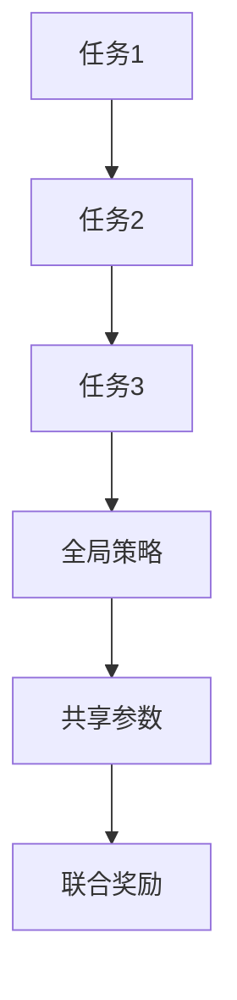

                 


# 多任务强化学习：构建具有广泛技能的AI Agent

> **关键词**：多任务强化学习、AI Agent、强化学习、深度强化学习、多任务学习

> **摘要**：本文深入探讨了多任务强化学习（MRL）的核心概念、算法原理、系统设计与实现，以及在构建具有广泛技能的AI Agent中的应用。文章首先介绍了强化学习的基本概念，然后详细阐述了多任务强化学习的背景、核心概念与联系，接着分析了多任务强化学习的算法原理和数学模型，随后从系统分析与架构设计的角度探讨了多任务强化学习在实际场景中的应用，最后通过项目实战展示了如何使用Python实现一个多任务强化学习算法，并对实际案例进行了详细分析。本文旨在为读者提供一个多任务强化学习的系统性视角，帮助读者更好地理解和应用这一技术。

---

## 第一部分: 多任务强化学习与AI Agent概述

### 第1章: 多任务强化学习的背景与概念

#### 1.1 强化学习的基本概念
##### 1.1.1 强化学习的定义
强化学习（Reinforcement Learning，RL）是一种机器学习范式，其中智能体（Agent）通过与环境交互，学习如何采取一系列行动以最大化累积的奖励。与监督学习和无监督学习不同，强化学习的核心在于通过试错机制优化决策策略。

##### 1.1.2 强化学习的核心要素
强化学习系统由以下几个核心要素组成：
1. **智能体（Agent）**：智能体是学习和决策的主体。
2. **环境（Environment）**：智能体所处的外部世界，可以提供反馈。
3. **状态（State）**：环境在某一时刻的描述。
4. **行动（Action）**：智能体对环境采取的行动。
5. **奖励（Reward）**：智能体行动后获得的反馈，用于指导学习。

##### 1.1.3 强化学习的应用场景
强化学习广泛应用于游戏AI、机器人控制、自动驾驶、金融投资等领域。例如，在游戏AI中，智能体通过不断尝试不同的策略来提高游戏水平。

#### 1.2 多任务强化学习的提出
##### 1.2.1 多任务学习的定义
多任务学习（Multi-Task Learning，MTL）是一种机器学习方法，旨在通过同时学习多个任务来提高模型的泛化能力。与单任务学习相比，MTL能够更好地利用任务间的共享信息，提高学习效率。

##### 1.2.2 多任务强化学习的必要性
在实际应用中，单一任务的强化学习可能无法满足复杂场景的需求。例如，在智能客服系统中，AI Agent需要同时处理多个任务，如客户咨询、情绪识别、任务分配等。此时，多任务强化学习能够使AI Agent在多个任务之间切换自如，提升整体性能。

##### 1.2.3 多任务强化学习的优势
1. **提高泛化能力**：通过共享任务间的知识，模型能够更好地应对新任务。
2. **减少训练数据需求**：多任务学习可以利用任务间的共享信息，减少对每个任务独立训练数据的需求。
3. **提升效率**：通过同时优化多个任务，可以减少训练时间。

#### 1.3 AI Agent的基本概念
##### 1.3.1 AI Agent的定义
AI Agent是一种能够感知环境、采取行动以实现目标的智能实体。它可以是一个软件程序，也可以是一个物理机器人。

##### 1.3.2 AI Agent的核心能力
1. **感知能力**：能够感知环境的状态。
2. **决策能力**：能够根据当前状态和目标，做出最优决策。
3. **学习能力**：能够通过与环境交互，不断优化自身的决策策略。

##### 1.3.3 多任务强化学习在AI Agent中的作用
多任务强化学习可以使AI Agent具备处理多个任务的能力，例如在智能家居中，AI Agent可以同时完成环境监测、设备控制、用户交互等多个任务。

---

### 第2章: 多任务强化学习的核心概念与联系

#### 2.1 多任务强化学习的原理
##### 2.1.1 联合策略与共享参数
多任务强化学习的核心思想是通过共享参数，使多个任务能够共用一部分模型参数，从而实现任务间的知识共享。

##### 2.1.2 任务间的关系与依赖
在多任务强化学习中，任务之间可能存在多种关系，例如：
1. **互补任务**：任务之间相互依赖，完成一个任务有助于完成另一个任务。
2. **独立任务**：任务之间互不影响，可以独立优化。

##### 2.1.3 联合奖励机制
多任务强化学习需要设计一个联合奖励机制，使得智能体在优化多个任务的同时，能够获得合理的奖励。

#### 2.2 多任务强化学习与单任务强化学习的对比
##### 2.2.1 概念对比
| 对比维度 | 单任务强化学习 | 多任务强化学习 |
|----------|----------------|----------------|
| 任务数量 | 单个任务        | 多个任务        |
| 参数共享 | 无              | 有              |
| 算法复杂度 | 较低            | 较高            |

##### 2.2.2 优缺点对比
| 对比维度 | 单任务强化学习 | 多任务强化学习 |
|----------|----------------|----------------|
| 优点     | 简单易实现      | 利用任务间共享信息，提升效率 |
| 缺点     | 无法处理复杂场景 | 算法复杂度高，训练时间长 |

##### 2.2.3 适用场景对比
| 对比维度 | 单任务强化学习 | 多任务强化学习 |
|----------|----------------|----------------|
| 适用场景 | 简单任务        | 复杂任务        |

#### 2.3 多任务强化学习的数学模型
##### 2.3.1 联合策略的数学表达
在多任务强化学习中，联合策略可以表示为：
$$ \pi_{\theta}(s, t) $$
其中，$\theta$ 是共享参数，$s$ 是当前状态，$t$ 是任务标识符。

##### 2.3.2 联合价值函数的定义
联合价值函数可以表示为：
$$ Q_{\theta}(s, a, t) $$
其中，$a$ 是行动，$t$ 是任务标识符。

##### 2.3.3 任务间权重的分配
为了平衡不同任务的重要性，可以在训练过程中引入任务权重：
$$ \alpha_t $$
其中，$\alpha_t$ 是任务 $t$ 的权重。

#### 2.4 多任务强化学习的ER实体关系图


---

## 第三部分: 多任务强化学习的算法原理

### 第3章: 基于共享参数的多任务强化学习算法

#### 3.1 基于共享参数的多任务强化学习算法
##### 3.1.1 算法流程
1. 初始化共享参数 $\theta$。
2. 对于每个任务 $t$，初始化局部参数 $\phi_t$。
3. 在每个时间步，智能体根据当前状态 $s$ 和任务 $t$，选择行动 $a$。
4. 更新共享参数 $\theta$ 和局部参数 $\phi_t$，以最大化联合奖励。

##### 3.1.2 算法伪代码
```python
初始化 θ 和 {φ_t} for all t
while not converge:
    for each task t in parallel:
        s_t ~ 环境t
        a ~ π_θ(s_t, t)
        r_t = 环境t的奖励
        Q(s_t, a, t) = Q(s_t, a, t) + α( r_t + γ max Q(s_t', a', t) - Q(s_t, a, t))
        更新 θ 和 φ_t 以最小化损失函数
```

##### 3.1.3 算法的收敛性分析
基于共享参数的多任务强化学习算法通常在任务之间存在较强相关性时表现较好，但在任务之间存在冲突时可能无法达到最优。

---

## 第四部分: 多任务强化学习的数学模型与公式

### 第4章: 基于Q-learning的多任务算法

#### 4.1 基于Q-learning的多任务算法
##### 4.1.1 Q-learning的基本公式
$$ Q(s, a) = Q(s, a) + \alpha (r + \gamma \max Q(s', a') - Q(s, a)) $$

##### 4.1.2 多任务Q-learning的扩展
$$ Q_{task}(s, a) = Q_{task}(s, a) + \alpha (r + \gamma \max Q(s', a') - Q(s, a)) $$

---

## 第五部分: 系统分析与架构设计方案

### 第5章: 项目实战

#### 5.1 环境安装
1. 安装Python和必要的库（如TensorFlow、Keras）。
2. 配置强化学习环境（如OpenAI Gym）。

#### 5.2 系统核心实现源代码
```python
class MultiTaskDQN:
    def __init__(self, state_dim, action_dim, num_tasks, lr=0.01, gamma=0.99):
        self.state_dim = state_dim
        self.action_dim = action_dim
        self.num_tasks = num_tasks
        self.lr = lr
        self.gamma = gamma
        
        # 共享层
        self.shared_layer = Dense(64, activation='relu', input_dim=state_dim)
        
        # 任务特定层
        self.task_layers = [Dense(32, activation='relu') for _ in range(num_tasks)]
        
        # 优化器
        self.optimizer = Adam(lr)
        
    def forward(self, state, task):
        x = self.shared_layer(state)
        x = self.task_layers[task](x)
        return x
        
    def update(self, state, action, reward, next_state, task):
        # 计算目标Q值
        target = reward + self.gamma * K.max(self.forward(next_state, task))
        
        # 计算当前Q值
        current = self.forward(state, task)
        
        # 更新模型
        loss = K.mean(K.square(target - current))
        loss += K.mean(K.square(current - target))
        self.optimizer.minimize(loss)
```

#### 5.3 代码应用解读与分析
1. **类定义**：`MultiTaskDQN` 类定义了一个多任务DQN算法，包含共享层和任务特定层。
2. **前向传播**：`forward` 方法根据当前状态和任务，输出Q值。
3. **更新方法**：`update` 方法通过最小化损失函数，更新模型参数。

---

## 第六部分: 最佳实践 tips、小结、注意事项、拓展阅读

### 第6章: 小结
多任务强化学习是一种强大的技术，能够使AI Agent具备处理多个任务的能力。通过共享参数和联合奖励机制，多任务强化学习可以在复杂场景中表现出色。

### 第7章: 注意事项
1. **任务间的平衡**：需要设计合理的任务权重，以避免某些任务占主导地位。
2. **计算资源**：多任务强化学习需要更多的计算资源，尤其是在处理多个任务时。

### 第8章: 拓展阅读
1. **DeepMind的论文**：了解强化学习的最新进展。
2. **多任务学习的经典论文**：学习多任务学习的核心思想。

---

## 作者：AI天才研究院/AI Genius Institute & 禅与计算机程序设计艺术 /Zen And The Art of Computer Programming

---

以上是关于《多任务强化学习：构建具有广泛技能的AI Agent》的技术博客文章的完整大纲和内容。希望这篇博客能够为读者提供一个多任务强化学习的系统性视角，帮助读者更好地理解和应用这一技术。

